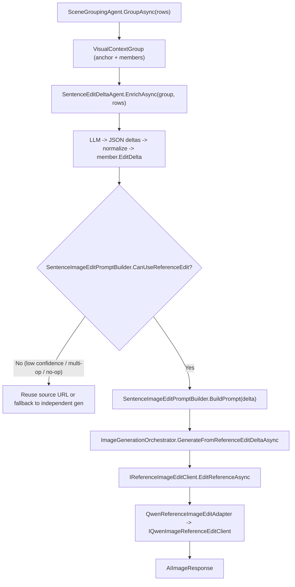

# Sentence Image Reference Edit Delta Design

## Background

Sentence image generation has two goals:

1. Within a group, keep scene, characters, camera, and art style consistent.
2. Each sentence must only express the current sentence's change, not merge elements from sibling sentences.

**2026-07-10 Update**: Reference image editing has been migrated from the old "text-parsed IMAGE EDIT DELTA" approach to the **structured `SentenceImageEditDelta`** approach. Old APIs (`GenerateReferenceEditPromptsAsync`, `GenerateReferenceEditNegativePrompt`, `BuildImageEditContext`) have been completely removed.

## Why not add a read-image agent by default

We could send the reference image URL to a vision LLM, identify what's in it, compare with the current sentence, and assemble the edit prompt. This is viable as a "verification/fallback agent" but not as the default main path:

1. Reference images are generated by us, not unknown external images.
2. When generating the reference image, we already know its sentence, visual focus, visual action, and variable elements.
3. For teaching images like "box -> apple", what's needed is a semantic replacement instruction, not pixel-level diff.
4. An extra vision agent adds cost, latency, and uncertainty.

The current approach: **provenance-based semantic delta, not re-read visual diff**.

## Current Pipeline (Structured EditDelta)



Key changes:
- No longer injects edit instructions via bracket text `MeaningHint`
- No longer relies on LLM text parsing to extract edit operations
- Edit delta is structured JSON, directly auditable and debuggable
- `SentenceImageEditPromptBuilder.BuildPrompt()` produces a deterministic minimal prompt (e.g. "Only edit: box -> apple.")
- Negative prompt returned by a fixed helper, not dynamically generated via pipeline

## ShouldUseReferenceEdit — Group Decision

Not all sentence groups are suitable for reference editing. `SentenceImageReferenceEditPolicy.ShouldUseReferenceEdit` makes this decision.

### Decision Tree

```
ShouldUseReferenceEdit(group)
    |- group == null or RowIds.Count <= 1 -> false
    |- groupType in blacklist -> false
    |- groupType in whitelist -> true
    |- group.Confidence < 0.8 -> false
    |- Three conditions: Characters.Count > 0 AND SceneSetting non-empty AND ContinuityPolicy has keywords -> true/false
```

### Whitelist (EligibleGroupTypes)

| GroupType | Why suitable |
|-----------|-------------|
| `object_drill` | Scene unchanged, only object replacement |
| `dialogue` | Same scene, only mouth/gesture changes |
| `greeting` | Same scene, quick greetings |
| `self_introduction` | Same scene, sequential introductions |
| `location_tour` | Sequential location tour, consistent art style |
| `pre_assigned` | Human-verified groups |

### Blacklist (IneligibleGroupTypes)

| GroupType | Why unsuitable |
|-----------|---------------|
| `safety_rules` / `safety_sequence` | Each needs different danger scene and safety behavior |
| `instructional_sequence` | Each step is a different action and body pose |
| `action_sequence` / `exercise_sequence` | Sequential actions are independent |
| `sports_safety` / `play_safety` | Each corresponds to different scene/behavior |
| `single_sentence` | No "previous image" to reference |
| `uncertain` | Grouping itself is unreliable |

## Key Code (Structured EditDelta)

### 1. `SentenceImageEditDelta` — Structured Edit Delta

File: `src/MS.Microservice.AI.Core/Images/Models/SentenceImageEditDelta.cs`

```csharp
public sealed class SentenceImageEditDelta
{
    public long RowId { get; set; }
    public long ReferenceRowId { get; set; }
    public List<SentenceImageEditOperation> Operations { get; set; } = [];
    public double Confidence { get; set; }
}

public sealed class SentenceImageEditOperation
{
    public string Operation { get; set; } = "replace";  // replace | update | add | remove
    public string? Target { get; set; }
    public string? From { get; set; }
    public string? To { get; set; }
}
```

Example:
```json
{
  "rowId": 2, "referenceRowId": 1, "confidence": 0.95,
  "operations": [{ "operation": "replace", "from": "box", "to": "apple" }]
}
```

### 2. `SentenceEditDeltaAgent` — LLM-Driven Delta Generation

File: `src/MS.Microservice.AI.Core/Images/SentenceEditDeltaAgent.cs`

Uses the first row in the group as the anchor reference row, sends group context to LLM, receives JSON deltas, normalizes:
- Exactly 1 concrete operation -> keep
- Multiple ops / no ops / referenceRowId != anchor -> no-edit delta (Confidence=0)
- First row always no-edit delta
- LLM exception -> all members stay safe (no-edit)

Depends on: `IPlanGeneratorClient`, `MS.Microservice.Core.Serialization.DefaultSerializeSetting`

### 3. `SentenceImageEditPromptBuilder` — Delta -> Edit Prompt

File: `src/MS.Microservice.AI.Core/Images/Building/SentenceImageEditPromptBuilder.cs`

```csharp
public static bool CanUseReferenceEdit(SentenceImageEditDelta? delta)
    => delta is { Confidence: >= 0.6 } && GetConcreteOperations(delta.Operations).Count == 1;

public static string BuildPrompt(SentenceImageEditDelta delta)  // e.g. "Only edit: box -> apple."
```

**Operation mapping**:
| Operation | Input | Output Prompt |
|-----------|------|-------------|
| replace | from="box", to="apple" | `Only edit: box -> apple.` |
| update | target="shirt color", to="red" | `Only edit: shirt color -> red.` |
| add | to="red hat" | `Only add: red hat.` |
| remove | from="red ball" | `Only remove: red ball.` |

Transport normalization: `going by bus` / `taking a bus` / `by bus` -> `bus`

### 4. `ImageGenerationOrchestrator.GenerateFromReferenceEditDeltaAsync`

File: `src/MS.Microservice.AI.Core/Images/ImageGenerationOrchestrator.cs`

- `CanUseReferenceEdit` == false -> reuse source URL
- No `IReferenceImageEditClient` registered -> throw `InvalidOperationException`
- Edit failure -> reuse source (no fallback to independent generation)
- Negative prompt from fixed helper
- Constructor accepts `IEnumerable<IReferenceImageEditClient>`, takes `FirstOrDefault()`

### 5. `SentenceImageBatchOrchestrator` — Batch Orchestrator

File: `src/MS.Microservice.AI.Core/Images/SentenceImageBatchOrchestrator.cs`

For eligible groups, subsequent rows: read `member.EditDelta` -> `CanUseReferenceEdit` -> `GenerateFromReferenceEditDeltaAsync`. Ineligible -> fallback to independent generation. Only uses `AIImageResponse.Images[].Url` as reference URL.

### 6. DI Registration

```csharp
services.TryAddTransient<SentenceEditDeltaAgent>();
```

### 7. Host Project Migration

```csharp
builder.Services.AddMicroserviceAI(config).AddOpenAI().AddQwen().Services.AddImagePromptPipeline();

// Normal generation
await orchestrator.GenerateFromTextAsync("Be careful!");

// Reference edit
await orchestrator.GenerateFromReferenceEditDeltaAsync(member.EditDelta!, referenceImageUrl);

// Batch flow
var grouping = await groupingAgent.GroupAsync(rows);
foreach (var g in grouping.Groups) await deltaAgent.EnrichAsync(g, rows);
// Save group/member/editDelta to DB here
var results = await batchOrchestrator.GenerateBatchAsync(rows);
```

> **Responsibility boundary**: AI module only returns `AIImageResponse`, prompt, whether source was reused, whether reference edit was used. DB queries, OSS/CDN upload, resize, status code updates stay in the host project.

## Old vs New Comparison

| Dimension | Old (Removed) | New |
|---|---|---|
| Entry point | `GenerateFromTextWithReferenceAsync` | `GenerateFromReferenceEditDeltaAsync` |
| Prompt source | `GenerateReferenceEditPromptsAsync` -> LLM text parsing | `BuildPrompt(delta)` -> deterministic prompt |
| Negative prompt | `GenerateReferenceEditNegativePrompt` | Fixed helper |
| Context injection | `BuildImageEditContext` -> bracket text -> `MeaningHint` | JSON delta -> `member.EditDelta` |
| Edit decision | `SafePrompt == ""` | `CanUseReferenceEdit(delta)` |
| Fallback | None | Edit failure/ineligible -> reuse source |
| Auditability | Text prompt hard to analyze structurally | JSON delta fully traceable |

## Relationship with Vision Agent Diff

The current solution addresses the main path determinism: "I know what sentence this reference image was generated from, so I know what it should represent."

A vision agent addresses a different problem: "I suspect this reference image was generated incorrectly, so I need to check its actual content."

The two are complementary layers. Recommended long-term architecture:
1. Default: use the current semantic delta approach (low cost, fast, controllable).
2. If image quality review fails or high-risk scenario detected, trigger vision agent.
3. Vision agent returns "actual image content summary" and "deviations".
4. Merge vision agent results into the next edit prompt.

## Current Limitations

The current approach cannot guarantee recognition of actual pixel content in the reference image. If the first reference image was severely off (extra blackboard, character identity changed, Chinese text appeared, actual subject doesn't match prompt), `SentenceImageEditDelta` won't automatically know these deviations — it records "generation intent", not "visual recognition results."

It addresses: subsequent edits don't know what the previous image represents, so can't do semantic replacement.

It does NOT address: the previous image itself failed and needs read-image discovery. That should be handled by a vision audit agent or image quality detection pipeline.

## Test Coverage

New/updated test files:

| Test File | Coverage |
|-----------|----------|
| `SentenceImageEditPromptBuilderTests.cs` | confidence < 0.6, multi-op rejection, replace/update/add/remove prompt generation, transport normalization |
| `SentenceEditDeltaAgentTests.cs` | valid delta writes to member.EditDelta, first row no-edit, invalid referenceRowId, multi-op/no-op normalization, exception safety |
| `SentenceImageBatchOrchestratorTests.cs` | eligible group + valid delta -> IReferenceImageEditClient, no-edit delta -> fallback, first row no URL -> all independent, edit failure -> reuse source |
| `DependencyInjectionTests.cs` | SentenceEditDeltaAgent resolvable and Transient |
| `QwenMediaProviderTests.cs` | QwenReferenceImageEditAdapter request mapping |

Verification commands:
```powershell
dotnet build MS.Microservice.AI/src/MS.Microservice.AI.Core/MS.Microservice.AI.Core.csproj --no-restore
dotnet build MS.Microservice.AI/src/MS.Microservice.AI.Qwen/MS.Microservice.AI.Qwen.csproj --no-restore
dotnet test MS.Microservice.AI/test/MS.Microservice.AI.Core.Tests/MS.Microservice.AI.Core.Tests.csproj --no-restore
dotnet test MS.Microservice.AI/test/MS.Microservice.AI.Qwen.Tests/MS.Microservice.AI.Qwen.Tests.csproj --no-restore
```

Results (2026-07-10):
- Core build: 0 errors, 0 warnings
- Qwen build: 0 errors, 0 warnings
- Core tests: 333/334 passed (1 pre-existing QwenSafePromptBuilder failure unrelated)
- Qwen tests: 13/13 passed

## Summary

Replaced the old text-parsed IMAGE EDIT DELTA with structured JSON delta (`SentenceImageEditDelta`), through the complete pipeline: `SentenceEditDeltaAgent` (LLM) -> `SentenceImageEditPromptBuilder` (deterministic prompt) -> `IReferenceImageEditClient` (Qwen adapter), achieving an auditable, debuggable, controllable reference image editing pipeline.
# Sentence Image Reference Edit Delta Design

## 背景

句子图片生成现在有两类目标：

1. 同一组句子需要保持场景、人物、镜头、画风一致。
2. 每一句又必须只表达当前句子的变化，不能把同组其它句子的物品或动作合并进同一张图。

你指出的关键问题是正确的：如果只把 `referenceImageUrl` 和一个泛化 prompt 交给图片编辑模型，模型并不知道"参考图里上一句具体是什么、当前句子要把哪一部分替换掉"。这样很容易退化成重新文生图，导致人物、场景、布局变化，或者把上一句和当前句子的元素混在一起。

**本次改造（2026-07-10）**：从旧的"文本解析式 IMAGE EDIT DELTA"迁移到**结构化 `SentenceImageEditDelta`**（JSON delta -> 确定性 prompt builder）。

## 为什么不默认再加一个读图 agent

直觉上可以这样做：

1. 把参考图 URL 发给一个视觉 LLM。
2. 让它识别图片里有什么。
3. 再把识别结果和当前句子对比。
4. 组装最终图片编辑 prompt。

这个方案是可行的，但它更适合作为"校验/兜底 agent"，不是默认主链路。原因是：

1. 参考图是我们自己生成的，不是外部未知图片。
2. **生成参考图时，我们已经知道它对应的句子、visual focus、visual action、variable elements。**
3. **对于"上一句是 box，当前句是 apple"这种教学图片，真正需要的不是像素级 diff，而是语义级替换指令。**
