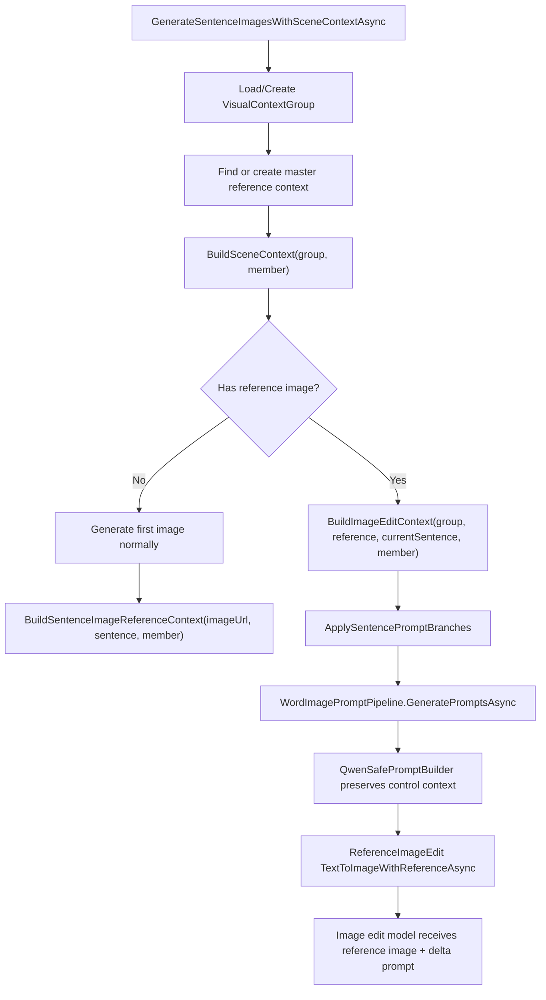

# Sentence Image Reference Edit Delta Design

## 背景

句子图片生成现在有两类目标：

1. 同一组句子需要保持场景、人物、镜头、画风一致。
2. 每一句又必须只表达当前句子的变化，不能把同组其它句子的物品或动作合并进同一张图。

你指出的关键问题是正确的：如果只把 `referenceImageUrl` 和一个泛化 prompt 交给图片编辑模型，模型并不知道“参考图里上一句具体是什么、当前句子要把哪一部分替换掉”。这样很容易退化成重新文生图，导致人物、场景、布局变化，或者把上一句和当前句子的元素混在一起。

本次改造的核心不是单纯加 prompt，而是让代码在触发 image edit 时携带“参考图语义上下文”，再生成明确的 reference-to-current delta prompt。

## 为什么不默认再加一个读图 agent

直觉上可以这样做：

1. 把参考图 URL 发给一个视觉 LLM。
2. 让它识别图片里有什么。
3. 再把识别结果和当前句子对比。
4. 组装最终图片编辑 prompt。

这个方案是可行的，但它更适合作为“校验/兜底 agent”，不是默认主链路。原因是：

1. 参考图是我们自己生成的，不是外部未知图片。
2. **生成参考图时，我们已经知道它对应的句子、visual focus、visual action、variable elements。**
3. **对于“上一句是 box，当前句是 apple”这种教学图片，真正需要的不是像素级 diff，而是语义级替换指令：把上一句的变量元素替换成当前句的变量元素，同时冻结稳定场景和人物。**
4. 额外视觉 agent 会增加成本、延迟和不确定性；它也可能误读图片，把模型生成的噪声当成必要元素。

所以当前实现采用的是：

> 生成来源可追溯的语义 delta，而不是重新读图做视觉 diff。

也就是说，我们不问“图片里真实像素有什么”，而是利用系统已经掌握的生成来源回答：“这张参考图本来应该表达哪一句；那一句的可变元素是什么；当前句子要替换成什么。”

图片编辑模型本身已经能看到参考图像素。我们的文本 prompt 主要负责告诉它：

1. 哪些东西必须冻结。
2. 参考图当前表达的句子是什么。
3. 当前目标句子是什么。
4. 哪些上一句变量元素要替换成当前句变量元素。

## 当前链路总览


## `ShouldUseReferenceEdit` 分组决策详解

不是所有句子组都适合用参考图编辑。`SentenceImageReferenceEditPolicy.ShouldUseReferenceEdit` 承担了"这个组该走参考编辑还是独立生图"的决策。

### 决策树

```
ShouldUseReferenceEdit(group)
    │
    ├─ group == null 或 RowIds.Count <= 1
    │   → false   (单行不需要参考编辑)
    │
    ├─ groupType 在黑名单中？
    │   → false   (立刻否决，不走后续检查)
    │
    ├─ groupType 在白名单中？
    │   → true    (立刻通过，不走后续检查)
    │
    ├─ group.Confidence < 0.8？
    │   → false   (LLM 分组质量不够高，宁可不编辑)
    │
    └─ 三项条件同时满足？
        ├─ Characters.Count > 0   (组内有稳定角色)
        ├─ SceneSetting 非空       (有稳定场景)
        └─ ContinuityPolicy 含连续性关键词
            ("same character"|"same person"|"same setting"|"same scene"|"consistent clothing")
        → true / false
```

### 白名单（EligibleGroupTypes）— 为什么这些适合参考编辑

| GroupType | 典型句子 | 为什么适合参考编辑 |
|-----------|----------|-------------------|
| `object_drill` | "This is a box." / "This is an apple." | 场景完全不变（同一张桌子），只有物品替换。编辑只需把 box 换成 apple，冻结背景 |
| `dialogue` | "Hello." / "Hi. I'm Tom." | 同一场景的连续对话，人物位置和背景不变，只改变口型、手势或表情 |
| `greeting` | "Good morning." / "Good morning, teacher." | 同场景快速问候，人物站位一致，只有轻微表情/手势差异 |
| `self_introduction` | "I am Tom." / "My name is Amy." | 同场景自我介绍的连续切换，角色逐个出场但场景固定 |
| `location_tour` | "It's our classroom." / "It's the library." | 连续地点参观，虽换场景但每个地点内部场景稳定；参考编辑能保持画风和人物一致 |
| `pre_assigned` | (Excel 中手动指定的组) | 人工确认过的组，信任度高，允许使用参考编辑 |

### 黑名单（IneligibleGroupTypes）— 为什么这些不能用参考编辑

| GroupType | 典型句子 | 为什么不适合参考编辑 |
|-----------|----------|-------------------|
| `safety_rules` / `safety_rule` / `safety_sequence` | "Be careful." / "Don't skate on the road." | 安全规则彼此独立，每条需要**不同的危险场景**和**不同的安全行为**。参考编辑会把"马路滑冰"场景带到"小心热水"中 |
| `instructional_sequence` / `instruction_sequence` | "Warm up." / "Do some running." / "Take a rest." | 运动指令序列每一步是**完全不同的动作和身体姿态**，参考图的上一个动作姿势会成为当前动作的视觉干扰 |
| `action_sequence` / `activity_sequence` / `exercise_sequence` | 同上 | 连续动作各自独立，不应共享同一帧画面 |
| `sports_safety` / `play_safety` | "Don't push." / "Wait your turn." | 每条安全提示对应不同场景和行为，强行编辑会导致场景语义错乱 |
| `single_sentence` | 任意单独的句子 | 没有"上一张图"可以参考 |
| `uncertain` | LLM 不确定的分组结果 | 分组本身不可靠，冒险编辑会放大错误 |

### 带置信度的模糊地带

当 `groupType` 既不在白名单也不在黑名单时（LLM 可能返回新的类型），进入"灰名单"判定：

```csharp
if (group.Confidence < 0.8)
    return false;

return group.Characters.Count > 0 &&
    !string.IsNullOrWhiteSpace(group.SceneSetting) &&
    HasStrongContinuityPolicy(group.ContinuityPolicy);
```

三项缺一不可：
- **有角色**：参考编辑需要知道"画面上有哪些人"，否则无法冻结人物外观
- **有场景**：需要知道"画面上是什么环境"，否则编辑模型会自由发挥背景
- **有连续性策略**：LLM 必须在返回的 `continuityPolicy` 中明确写了 "same character" / "same setting" / "same scene" / "consistent clothing" 等关键词，表明它认为这组确实应该保持一致

### 反例：为什么 "Warm up → Do some running → Take a rest" 不能用参考编辑

假设用参考编辑处理这三句：

1. 第一句 "Warm up" 生成了一个拉伸动作的图
2. 第二句 "Do some running" 以拉伸图为参考编辑 — 编辑模型会在拉伸动作的基础上"改"成跑步，结果是一个**扭曲的半拉伸半跑步的姿态**
3. 第三句 "Take a rest" 以跑步图为参考编辑 — 模型会把跑步姿势改成休息姿势，结果是一个**不自然的坐姿**

正确的做法是每句独立生成，各自拥有正确的身体姿态和场景。
## 关键代码说明

### 1. `SentenceImageReferenceContext`


这个模型描述“参考图对应的句子语义”：

```csharp
public sealed record SentenceImageReferenceContext(
    string ImageUrl,
    string SentenceText,
    string? VisualFocus,
    string? VisualAction,
    IReadOnlyList<string> VariableElements);
```

它不是识别图片后得到的内容，而是参考图生成时的来源信息。例如：

```text
ImageUrl: https://...
SentenceText: What a cloudy day!
VisualFocus: a cloudy day
VisualAction: Show a cloudy outdoor scene.
VariableElements: clouds, muted sky
```

当前句子可能是：

```text
SentenceText: What a nice sunny day!
VisualFocus: a nice sunny day
VisualAction: Show a bright, pleasant sunny outdoor scene.
VariableElements: sky brightness, sunny light, foreground landscape
```

这两组结构化信息足够拼出一个明确的语义 delta。

### 2. 批量句子图片服务持有 reference context

> 这部分逻辑位于应用层编排服务中（非 Core 类库），负责协调 prompt pipeline 与图片生成 API 的调用流程，管理组内参考图状态。

之前主流程只保存：

```csharp
string? masterImageUrl
```

这只能告诉后续流程“参考图在哪里”，不能告诉后续流程“参考图表达什么”。

现在改为：

```csharp
SentenceImageReferenceContext? masterReference
```

当组内已经有历史图片时：

```csharp
FindExistingGroupReferenceContext(group, allSentencesById)
```

会从已有 `PictureUrl` 所属句子和 `VisualContextMember` 还原 reference context。

当本轮生成第一张图后：

```csharp
BuildSentenceImageReferenceContext(imageUrl, sentence, member)
```

会把第一张图的 URL、句子、focus、action、variable elements 保存为后续图片编辑的 master reference。

这样后续句子进入 image edit 时，拿到的不再只是 URL，而是：

```text
reference image URL
reference sentence
reference visual focus
reference visual action
reference variable elements
current sentence
current visual focus
current visual action
current variable elements
```

### 2.5 `BuildSceneContext` 与场景上下文构造机制

这是理解"场景上下文如何流入生图管线"的关键。`BuildSceneContext` 和 `BuildImageEditContext` 的输出都是**括号包装的文本块**，它们作为 `MeaningHint` 被管线解析利用。

#### 上下文如何注入

`GenerateSentenceImagesWithSceneContextAsync`（应用层编排方法）的核心逻辑：

```csharp
// 对组内每一行，构造输入文本：
var member = group.FindMember(row.RowId);
var sceneContext = SentenceImageContinuityPromptBuilder.BuildSceneContext(group, member);

// 关键：场景上下文以括号形式拼接到句末
var inputText = $"{row.English} {sceneContext}";
// 结果例如：
// "This is a box. (Current sentence image only; do not combine objects or actions
//  from other sentences in the same group. Shared context type: object drill.
//  Stable scene: classroom table. Current sentence visual focus: a box.
//  Current sentence visual action: Illustrate this row only.
//  Sentence-specific variable elements: a box. Keep the stable scene and
//  characters consistent; only the current sentence focus may change.)"
```

#### 括号提示的管线解析路径

这个 `inputText` 随后进入 `WordImagePromptPipeline.GeneratePromptsAsync()`：

```
inputText = "This is a box. (Current sentence image only. Shared context type: object drill. Stable scene: classroom table. ...)"
                │
                ▼
        WordImagePromptPipeline.Parse(inputText)
                │
        ┌───────┴───────┐
        │ LastIndexOf('(') = 17
        │ normalized.EndsWith(')') = true
        │
        ▼
        targetText  = "This is a box."           ← 作为生图的主体句子
        meaningHint = "Current sentence image     ← 作为语义提示，流入 LLM 计划生成
                       only. Shared context type:
                       object drill. Stable scene:
                       classroom table. ..."
                │
                ▼
        WordImageInput(RawInput, TargetText, MeaningHint, ContentType)
                │
                ▼
        PlanGeneratorClient.GenerateVisualPlanAsync()
            → LLM 同时看到 TargetText 和 MeaningHint
            → 输出的 VisualPlan 会受场景上下文约束
                │
                ▼
        QwenSafePromptBuilder.Build()
            → AppendSentenceImageControlContext()
            → 识别 MeaningHint 中的控制标记
            → 将关键控制句透传到最终 Safe Prompt
```

#### `BuildSceneContext` 输出的结构

`BuildSceneContext` 返回的括号文本包含以下层次：

```
(                                                                   ← 括号包装
  Current sentence image only;                                       ← 层级 0: 隔离指令
  do not combine objects or actions from other sentences             ← 防止跨句污染
  
  Shared context type: object drill                                  ← 层级 1: 组类型标识
                                                                       (被 QwenSafePromptBuilder 识别为控制标记)
  
  Stable scene: classroom table                                      ← 层级 2: 稳定场景锚点
  
  Stable characters: Tom: Chinese schoolboy, short black hair...     ← 层级 3: 角色描述
                                                                       (可选，仅当组内有角色时)
  
  Current speaker: Tom                                               ← 层级 4: 当前行特定信息
  Current sentence visual focus: a box
  Current sentence visual action: Illustrate this row only
  Sentence-specific variable elements: a box
  Row illustration hint: (来自 Excel 的 SceneHint)
  
  Keep the stable scene and characters consistent;                   ← 层级 5: 收尾约束
  only the current sentence focus may change
.)
```

#### 为什么用括号而不是 API 参数

括号机制利用了管线已有的 `Parse` 逻辑——`Parse` 本来就是为 `"apple (fruit)"` 这种用户输入设计的。场景上下文复用同一条解析路径，不需要修改管线接口：

- ✅ 不需要新增参数或 DTO 字段
- ✅ LLM 天然理解括号中的补充说明
- ✅ `QwenSafePromptBuilder` 通过标记词识别控制子句，自动决定哪些透传、哪些过滤
- ✅ 对独立生图流程（非批量），`MeaningHint` 为空时管线行为完全不变

#### `BuildSceneContext` vs `BuildImageEditContext`

| | BuildSceneContext | BuildImageEditContext |
|---|---|---|
| **使用场景** | 独立生图（组内第一行，或不适用参考编辑的组） | 参考编辑（组内第二行起） |
| **核心指令** | "Current sentence image only" | "IMAGE EDIT DELTA" |
| **是否描述参考图** | 否 | 是（描述 reference 的 sentence/focus/action/elements） |
| **替换关系** | 无 | 有（"Replace previous X into current Y"） |
| **流向** | 括号→Parse→MeaningHint→LLM Plan→Safe Prompt | 括号→Parse→MeaningHint→BuildReferenceEditPrompt→ChangeWhitelist |

### 3. `BuildImageEditContext` 输出 delta，不再只 freeze

文件：`src/MS.Microservice.AI.Core/Images/Building/SentenceImageContinuityPromptBuilder.cs`

之前 prompt 的核心是：

```text
IMAGE EDIT FREEZE
Use the reference image as the master scene.
Only update the current sentence target...
Allowed changing elements...
```

这仍然太抽象，因为它没有说明“参考图当前是什么”。

现在变为：

```text
IMAGE EDIT DELTA: edit the provided reference image instead of generating a new composition.
Reference image currently illustrates: "What a cloudy day!"
Reference row visual focus: a cloudy day.
Reference row variable elements: clouds, muted sky.
Current target sentence: "What a nice sunny day!"
Current target visual focus: a nice sunny day.
Current row variable elements allowed to change: sky brightness, sunny light, foreground landscape.
Replace or revise only the previous row-specific elements (clouds, muted sky) into the current row-specific elements (sky brightness, sunny light, foreground landscape).
```

这条指令的本质是：

```text
冻结稳定部分 + 说明参考图状态 + 说明当前目标 + 给出变量元素替换关系
```

这比“保持一致，只改当前目标”更接近图片编辑模型需要的操作指令。

### 4. 移除场景污染源

之前 edit prompt 里有一句硬编码：

```text
Do not redesign the classroom...
```

这个在户外、操场、乡村场景里会污染模型注意力，很容易把 classroom、board、blackboard 重新带入画面。

现在改成场景无关的稳定表达：

```text
Do not redesign the stable scene...
```

并且在 `QwenSafePromptBuilder` 透传控制上下文时，会过滤掉 board 相关控制句，避免前面反复出现的黑板问题继续被 prompt 激活。

### 5. `QwenSafePromptBuilder` 保证控制上下文不丢

文件：`src/MS.Microservice.AI.Core/Images/Building/QwenSafePromptBuilder.cs`

这是本次发现的更深一层问题：`imageInput` 不是直接发给图片模型，它会先进入 `WordImagePromptPipeline`，最后由 `QwenSafePromptBuilder` 生成真正发给 Qwen 的 safe prompt。

如果 `QwenSafePromptBuilder` 不保留这些控制信息，那么前面拼好的 `IMAGE EDIT DELTA` 会在中间被重写掉，最后仍然变成泛化文生图 prompt。

所以新增了控制上下文透传：

```text
Sentence image control context: ...
```

它只保留关键控制句，例如：

```text
IMAGE EDIT DELTA
Reference image currently illustrates...
Current target sentence...
Reference row variable elements...
Current row variable elements...
Replace or revise only...
Prompt branch target-object-focus...
red arrow pointer...
Sparse-scene composition...
```

同时会过滤掉明显容易污染画面的负向语言和 board 相关句子。

### 6. 参考图编辑服务使用 image edit 模式

> 这部分逻辑位于应用层编排服务中（非 Core 类库），封装了对第三方图片编辑 API 的调用。

`TextToImageWithReferenceAsync` 会把参考图和文本一起发给多模态生成接口：

```csharp
new MultimodalMessageContent(Image: referenceImageUrl),
new MultimodalMessageContent(Text: editPrompt)
```

并且 wrapper prompt 明确告诉模型：

```text
Treat any IMAGE EDIT DELTA section as the authoritative reference-to-current change list.
```

也就是：最终不是让模型自由重绘，而是让它参考图片，并按 delta 执行局部变化。

## 和“单独视觉 agent 做 diff”的关系

当前方案解决的是主链路的确定性问题：

```text
我知道这张参考图是用哪一句生成的，所以我知道它应该代表什么。
```

视觉 agent 解决的是另一类问题：

```text
我怀疑这张参考图实际生成歪了，所以我要检查图片真实内容。
```

两者不是互斥关系，而是分层关系。

建议的长期架构是：

1. 默认使用当前语义 delta 方案，成本低、速度快、可控性好。
2. 如果图片质量审核失败，或者检测到高风险场景，再触发视觉 agent。
3. 视觉 agent 返回“实际图片内容摘要”和“偏离项”。
4. 再把视觉 agent 的结果合并进下一轮 edit prompt。

例如：

```text
Reference provenance says: sunny playground with one child.
Vision audit says: image also contains blackboard and two extra toys.
Correction delta: remove visual emphasis from board/toys, keep only slide as the environmental anchor.
```

这样视觉 agent 是质量闭环的一部分，而不是每张图的默认成本。

## 当前方案的边界

当前方案不能保证识别参考图真实像素内容。

如果模型生成第一张参考图时已经严重跑偏，例如：

1. 多了黑板。
2. 人物身份已经变了。
3. 画面出现中文。
4. 实际主体不是 prompt 里的主体。

那么 `SentenceImageReferenceContext` 不会自动知道这些偏差，因为它记录的是“生成意图”，不是“视觉识别结果”。

所以它适合解决：

```text
后续 edit 不知道上一张图代表哪一句，因此无法做语义替换。
```

它不完全解决：

```text
上一张图自身已经生成失败，需要读图发现失败点。
```

后一类问题应该由视觉审核 agent 或图片质量检测流程补上。

## 测试覆盖

新增/调整的测试集中在：

文件：`test/MS.Microservice.AI.Core.Tests/Images/QwenSafePromptBuilderTests.cs`

覆盖点：

1. image edit prompt 会包含 reference sentence、current sentence、previous variable elements、current variable elements。
2. 户外场景不会再注入 classroom。
3. `IMAGE EDIT DELTA` 会穿透到最终 Qwen safe prompt。
4. `target-object-focus` 和 `red arrow pointer` 分支会穿透到最终 Qwen safe prompt。

验证命令：

```powershell
dotnet test test/MS.Microservice.AI.Core.Tests/MS.Microservice.AI.Core.Tests.csproj
dotnet build src/MS.Microservice.AI.Core/MS.Microservice.AI.Core.csproj
```

当前验证结果：

1. 单元测试通过：34/34。
2. Web 项目 build 通过。
3. build 仍有原有 `Microsoft.OpenApi` NU1903 包漏洞 warning，不是本次改造引入。

## 一句话总结

这次改造的原理是：利用我们已经拥有的句子分组和生成来源信息，把 image edit 从“参考图 + 泛化 prompt”改成“参考图 + 明确语义 delta”。它不是视觉读图 diff，而是 provenance-based semantic diff；视觉 agent 可以作为后续审核和兜底层加入。
