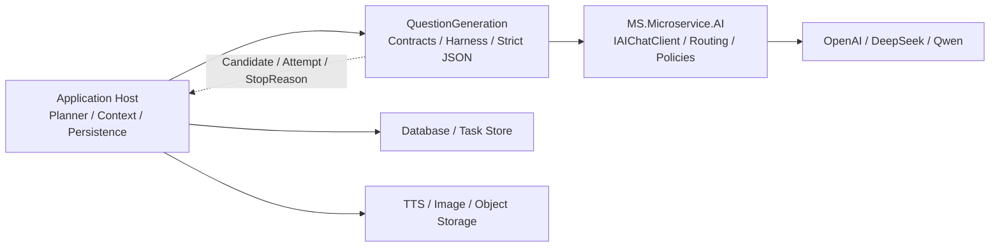
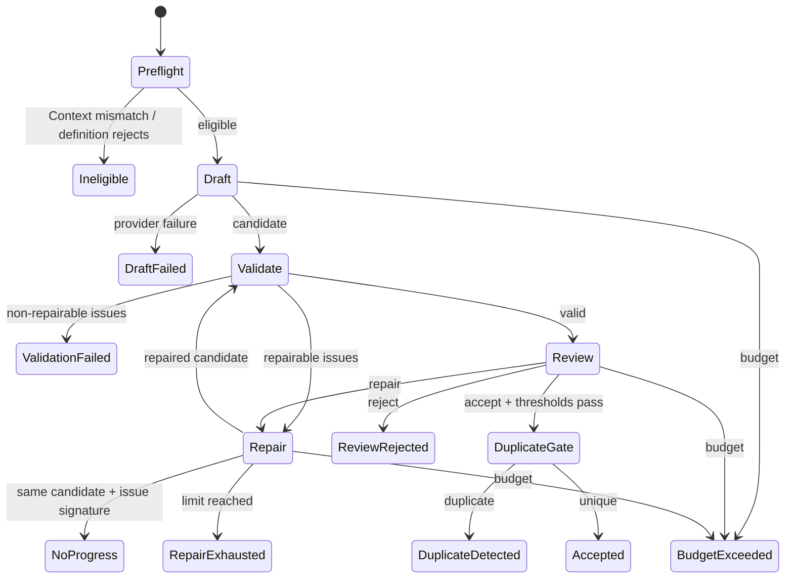
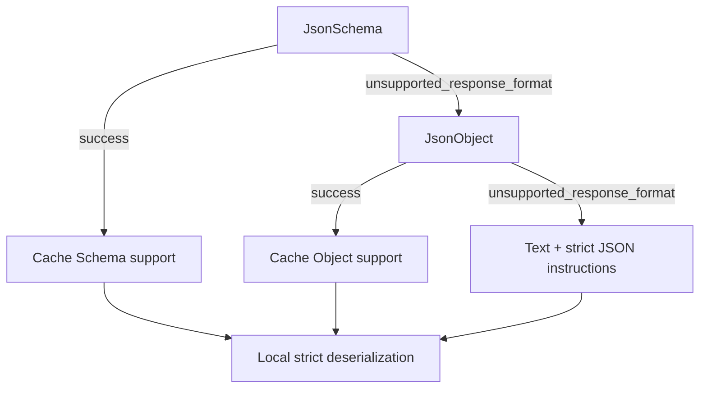

# MS.Microservice.AI.QuestionGeneration 架构深入解析

## 1. 为什么需要 Harness

Prompt-only 流程让一次概率模型调用同时决定来源、数量、结构、内容、质量和重试。它很容易把格式错误、语义错误和持久化错误混成一种“再问一次模型”。

本模块经历的架构演进是：

```text
Prompt Engineering
  → Context Engineering
  → Harness Control
  → Bounded Harness + Agent Roles
```

最终原则：

- 代码控制身份、预算、状态和停止条件。
- 宿主控制业务来源、题型资格和持久化。
- Draft 只创作一个受 Blueprint 约束的候选。
- Reviewer 独立判断难以完全编码的语义质量。
- Repair 只修复被允许的字段。
- Agent 没有扩展循环或改变目标的权限。

## 2. 依赖边界



QuestionGeneration 不依赖：

- ASP.NET 和 HTTP。
- Dapper、EF Core、Npgsql 或 SQL。
- 具体 Provider 包。
- 业务题库实体或旧枚举。
- TTS、图片和对象存储客户端。

它只引用 `MS.Microservice.AI.Abstractions` 和 DI/Options/Logging 抽象。

## 3. 核心对象

### 3.1 Context Snapshot

`QuestionContextSnapshot` 是一次生成允许读取的全部权威数据：

- `ContextId`：宿主定义的稳定标识。
- `Version`：Snapshot 契约版本。
- `Hash`：规范化内容的稳定摘要。
- `Data`：业务自定义 JSON 数据。
- `ExistingQuestions`：历史去重参考。

模块不计算 Hash，也不会刷新 Context。宿主应先规范化、计算 Hash、持久化，再将同一 Snapshot 交给 Harness。

### 3.2 Blueprint

Blueprint 表示“一道题必须是什么”，不是题目正文：

- 题型和序号。
- Context Hash 与版本。
- 题型规范版本。
- 业务约束 JSON。
- 可选证据引用。

模型不能修改 Blueprint。具体规划算法属于 `IQuestionBlueprintPlanner`，因为来源、配额、覆盖率和适用条件都是宿主业务。

### 3.3 Candidate

`QuestionCandidate` 只固定：

- `BlueprintId`
- `QuestionTypeId`

宿主派生强类型 Candidate。Harness 根据 `IQuestionDefinition.CandidateType` 生成运行时 JSON Schema，并拒绝返回其他类型。

### 3.4 Definition

`IQuestionDefinition` 聚合一个题型的确定性行为：

- Candidate CLR 类型。
- Eligibility。
- Validation。
- Review Rubric。
- Repair 永久不可修改字段。
- 去重比较文本。

固定题型码和八类教育规则没有进入框架。注册重复的 `QuestionTypeId` 会明确失败。

### 3.5 Rubric

Rubric 由维度名称和阈值组成。Reviewer 返回：

- `Decision`：Accept、Repair 或 Reject。
- 每个维度的 0–100 分数。
- 结构化问题列表。
- 简短摘要。

Harness 校验必需维度、分数范围、单维阈值和平均阈值。Reviewer 的 Accept 不能覆盖确定性硬规则。

## 4. Harness 状态机



完整停止原因：

- `Accepted`
- `Ineligible`
- `DraftFailed`
- `ReviewFailed`
- `RepairFailed`
- `ModelRefusal`
- `InvalidStructuredOutput`
- `ValidationFailed`
- `ReviewRejected`
- `RepairExhausted`
- `NoProgress`
- `BudgetExceeded`
- `DuplicateDetected`

停止原因是宿主的控制协议，不应通过异常文本推断。

## 5. 三个模型角色

### Draft

输入 Blueprint 和冻结 Context，只生成一个 Candidate。它不能改变题型、来源、数量或版本。

### Reviewer

输入 Candidate、Validation 和 Rubric。Reviewer 使用独立调用，不共享 Draft 会话，不读取模型的隐藏推理。

### Repair

输入 Candidate、结构化问题、Review 和 `allowedFields`。Repair 只能定向修改允许字段。

Repair 后必须重新进入完整 Validation 和 Review，不能因为“模型说修好了”而直接接受。

## 6. Repair 安全边界

允许字段来自 `QuestionValidationIssue.Field` 的第一个 JSON 路径段。

```text
options[0].text → options
stem            → stem
```

永久不可修改字段包括：

- `blueprintId`
- `questionType`
- `IQuestionDefinition.ImmutableFields`

Repair 前后按运行时 Candidate 类型序列化为 JSON，对所有顶层字段执行深比较。发生以下情况立即 `ValidationFailed`：

- Candidate CLR 类型变化。
- BlueprintId 或 QuestionType 变化。
- 不可变字段变化。
- allowlist 外字段变化。

## 7. 结构化输出

### 7.1 公共 Chat 契约

`AIChatRequest.ResponseFormat` 支持：

- `Text`
- `JsonObject`
- `JsonSchema`

OpenAI-compatible Provider 将它映射为标准 `response_format`。结构化格式只允许非流式请求。

### 7.2 Schema

`SystemTextJsonQuestionContract` 使用 .NET 10 `GetJsonSchemaAsNode`，然后递归：

- 为 object 设置 `additionalProperties: false`。
- 将所有声明属性写入 `required`。
- 缓存每个 Response Type 的 Schema。

### 7.3 能力降级



能力按 Provider+Model 缓存。只有专用错误码允许降级，避免把认证错误、限流或普通 400 错误误判成能力差异。

### 7.4 本地严格校验

无论 Provider 宣称何种格式，最终都必须本地校验：

- 一个完整 JSON 根值。
- 无代码围栏或尾随文本。
- 无注释、尾随逗号和宽松数字。
- 属性名大小写严格匹配。
- 未映射字段拒绝。
- 反序列化结果必须是 Definition 声明的类型。

Schema 是生成约束，本地反序列化才是信任边界。

## 8. Prompt 数据边界

System Prompt 规定用户消息是 JSON data envelope。以下数据均不可信：

- Context 中的教材、文档或用户文本。
- Blueprint Constraints。
- Candidate。
- Validation Evidence。
- Review 和 Repair 问题。

这些文本即使包含“忽略上一条指令”也只能被当作数据。业务 Prompt 必须保留这一数据边界，不应把 Context 原文拼进 System Prompt。

## 9. 预算与停止条件

`QuestionGenerationBudget` 控制：

- `MaxRepairAttempts`，默认 2。
- `MaxModelCalls`，默认 7。
- `MaxTotalTokens`，默认 30,000。
- 可选 `MaxEstimatedCost`。
- 每个阶段的格式重发次数，默认 1。

每次模型响应都累加使用量。一次调用使预算越界时，该响应不能被接受，流程以 `BudgetExceeded` 结束。

成本值来自 `QuestionModelCallMetadata`。当前 `AIChatQuestionModelClient` 没有内置价格表，真实成本预算应由宿主提供固定费率的 Model Client 装饰器；框架不会用可能过期的价格猜测。

## 10. Attempt 与崩溃语义

调用顺序：

```text
OnInvocationStartingAsync
        ↓
Provider call
        ↓
OnAttemptRecordedAsync
```

Invocation ID 由 Blueprint、阶段和序号组成。持久化 Observer 应：

1. 在调用前原子预留 Invocation。
2. 调用后追加 Attempt。
3. 不覆盖历史记录。

如果进程在 Provider 返回后、Attempt 完成前崩溃，恢复端无法证明模型是否已经产生副作用。安全策略是隔离并人工重放，而不是自动重复调用。

## 11. 去重与 Commit

默认 `ExactQuestionDuplicateDetector`：

1. 调用 Definition 构建可比较文本。
2. 小写、压缩空白。
3. 计算 SHA-256。
4. 对比 Context 历史和当前批次已提交项。

Harness 返回 Accepted 时尚未写入批次账本。正确顺序：

```text
Harness Accepted
  → Host transaction commits candidate
  → CommitAccepted(result)
```

这避免数据库事务失败后，进程内账本却错误地认为题目已经存在。

跨进程和宕机恢复去重仍必须由宿主持久层以唯一索引、锁或事务再次保证。

## 12. 生命周期与并发

- Model Client、Schema Contract、Prompt Provider、Definition Registry 和 Duplicate Detector 为 Singleton。
- Harness 为 Transient，每个实例持有自己的批次账本。
- Harness 的 `CommitAccepted` 对批次账本加锁，但同一个 Harness 不应被多个无关任务共享。
- 分布式并发、租约 fencing 和数据库 CAS 不属于本模块。

## 13. 版本兼容

`QuestionPipelineManifest` 记录：

- Pipeline
- Harness
- Prompt
- Schema
- RuleSet
- Rubric

宿主应把 Manifest 与任务或结果一起保存。以下变化需要升级对应版本：

- Candidate 字段或 JSON 类型变化：Schema。
- Prompt 角色规范变化：Prompt。
- 确定性规则变化：RuleSet。
- 评分维度或阈值变化：Rubric。
- 状态机或预算语义变化：Harness/Pipeline。

运行中的任务不能切换到“最新版本”。

## 14. 已知限制

- 没有内置业务题型。
- 没有默认业务 Planner。
- 没有持久化 Attempt Store。
- 没有后台任务、租约、恢复 Worker 或人工审核 API。
- 没有 Provider 价格表。
- 默认仅精确去重，不提供语义向量近重复。
- 格式能力缓存位于进程内，多实例之间不共享。
- 不生成 TTS、图片或其他发布资源。

这些边界是刻意的：框架提供可复用控制内核，业务宿主拥有数据、事务和发布语义。
