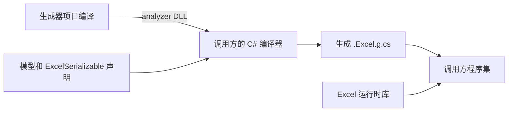

# 在 VS 中阅读和理解 Excel Source Generator

ExcelSourceGenerator.cs 需要作为生成器项目中的 C# 源码被编译，VS 才能为它建立正确的类型、引用和导航信息。把文件列为 None 只能使它出现在项目中；引用一个已经生成的 DLL，也不能替代源代码项目关系。

现在的目录是：

```text
MS.Microservice.Excel/src/
  MS.Microservice.Excel/               # 原 Excel 运行时项目
  MS.Microservice.Excel.Aot/           # 独立 AOT 运行时项目与 NuGet 包
    MS.Microservice.Excel.Aot.csproj
    ExcelGenerator.props              # 源码调用方的 analyzer 项目引用
    ExcelGenerationAttributes.cs      # 业务模型使用的标记属性
    ExcelModelMap.cs                   # 生成代码使用的运行时元数据
  MS.Microservice.Excel.Generator/     # 独立编译期项目，不单独发运行时包
    MS.Microservice.Excel.Generator.csproj
    ExcelSourceGenerator.cs
    AnalyzerReleases.Unshipped.md
    AnalyzerReleases.Shipped.md
```

三个项目都已加入解决方案。旧 Excel 项目不再包含 Aot 子目录，也不再切换编译模式。生成器没有引用 NPOI 或 Excel 运行时项目；它通过 Roslyn 的类型符号读取模型，并生成引用 Excel 运行时 API 的 C# 文本。



## 从哪里打开，F12 应该到哪里

1. 打开 `MS.Microservice.Excel/MS.Microservice.Excel.slnx`（也可重新加载根 `MS.Microservice.slnx`），在解决方案资源管理器中展开 **MS.Microservice.Excel.Generator**，打开 `ExcelSourceGenerator.cs`。它现在是该项目默认收集的 Compile 项；不需要向 Excel 运行时项目手工添加同一文件。
2. 从 `Initialize` 开始读：`ForAttributeWithMetadataName` 找到生成上下文，`Generate` 检查模型和属性，`Read` / `Write` 拼出具体类型的访问代码，`AddSource` 把代码交给当前调用方的编译器。对这些自有方法按 F12 应进入本项目源码。
3. 打开 `ExcelSourceGeneratorTests.cs`，对 `new ExcelSourceGenerator()` 中的类名按 F12。测试使用真实 ProjectReference，VS 能识别这是解决方案中的源代码类型，而不是只有 HintPath 的外部 DLL。
4. 对业务代码中的 `WorkbookModels.Book` 按 F12，目标是调用方编译期间生成的 `.Excel.g.cs`。它不是生成器自身源码；通常也可在调用方项目的“依赖项 → 分析器”下展开本生成器查看。VS 具体树节点名称随版本而异。
5. 对 `IIncrementalGenerator`、`INamedTypeSymbol` 等 Roslyn 类型按 F12，目标可能是元数据、反编译代码或 Source Link 下载的源码，取决于 VS 设置和包的符号。这与自己的 `ExcelSourceGenerator.cs` 是否参与编译是两件事。

如果想在磁盘上对照生成结果：

```powershell
dotnet build MS.Microservice.Excel/test/MS.Microservice.Excel.Tests/MS.Microservice.Excel.Tests.csproj -t:Rebuild -p:EmitCompilerGeneratedFiles=true
```

生成文件在调用方的 `obj` 目录下。它们供阅读；不要手工加入 Compile 或修改它们，下一次生成会覆盖。普通项目构建和 IDE 中的生成不要求先执行这条命令。F12 是导航；若要逐步执行生成器，最直接的入口是调试现有 GeneratorDriver 单元测试并在 `Generate` 下断点。

## AnalyzerReleases.Unshipped.md 是什么

它是**编译期诊断规则的发布台账**。本生成器会报告 `EXCEL001`，所以它既生成代码，也向编译器报告错误。这个文件由 Microsoft.CodeAnalysis.Analyzers 的发布跟踪检查读取，核对规则 ID、分类、默认严重程度等变化。它不列出 Excel 字段，不包含生成代码，也不会在应用运行时执行。

当前这一行：

```text
EXCEL001 | Excel | Error | Invalid generated model declaration
```

| 列 | 本项目的含义 |
|---|---|
| Rule ID | 稳定的诊断编号 EXCEL001，对应 ExcelSourceGenerator.cs 中的 DiagnosticDescriptor |
| Category | Excel，用于归类诊断；不是命名空间或 NuGet 包名 |
| Severity | 默认级别 Error，非法模型声明会使编译失败 |
| Notes | 规则说明；当前涵盖无效上下文、重复列、不支持类型、缺少工厂等声明错误 |

`### New Rules` 表示新增规则；还可以记录 Changed Rules、Removed Rules。文件名中的 Unshipped 表示尚未正式发布的规则变更，不表示生成器不能运行。`AnalyzerReleases.Shipped.md` 保存已发布版本的记录。当前只做过本地验证打包，因此 Shipped 还没有正式发布记录。真正发布新版本时，把本次规则记录移到 Shipped 中该版本的条目，再清空已交付的 Unshipped 内容；不是在每次 build 时自动移动。

`.csproj` 中的 `AdditionalFiles` 把它们交给分析器检查。仅仅把 Markdown 文件放在目录里，并不等于分析器一定会读取它们。详情见 [Roslyn 发布跟踪说明](https://github.com/dotnet/roslyn-analyzers/blob/main/src/Microsoft.CodeAnalysis.Analyzers/ReleaseTrackingAnalyzers.Help.md)。

## ExcelGenerator.props 做什么

它是仓库源码调用方复用的一小段 MSBuild 配置。`.props` 只是文件约定；只有项目通过 Import 导入它，里面的项目项才会参与该项目的构建。

旧文件用 `Analyzer Include=".../bin/Generator/...dll"` 指向一个已经生成的 DLL。它能告诉编译器加载文件，却没有告诉项目系统“源码属于哪个项目、该先构建哪个项目”。现在文件改为 ProjectReference：

```xml
<ProjectReference Include=".../MS.Microservice.Excel.Generator.csproj"
                  OutputItemType="Analyzer"
                  ReferenceOutputAssembly="false"
                  PrivateAssets="all" />
```

| 项目项/元数据 | 作用 |
|---|---|
| ProjectReference / Include | 指定生成器的项目，而不是猜一个 bin 路径；MSBuild 建立项目构建顺序，VS 建立项目关系 |
| MSBuildThisFileDirectory | 路径相对于 props 文件所在目录，避免受调用方项目目录或当前命令行目录影响 |
| OutputItemType=Analyzer | 将该项目输出作为编译器的 analyzer 输入，C# 编译器从中发现并运行 Source Generator |
| ReferenceOutputAssembly=false | 不把生成器当作业务 C# 代码引用的运行时库；调用方不需要 new 生成器，也不需要部署 Roslyn |
| PrivateAssets=all | 该开发依赖不作为调用方包的传递依赖向下游暴露；与 ReferenceOutputAssembly 的职责不同 |

NuGet 用户不需要导入这个文件：包中的 `analyzers/dotnet/cs` 路径会被 SDK 识别。仓库里的源码调用方使用 props。测试项目有一个例外：它需要创建生成器实例交给 GeneratorDriver，所以直接写 ProjectReference，并把 ReferenceOutputAssembly 设为 true；同时保留 Analyzer 输出，以测试真实生成过程。这样也能从测试跳到生成器源码。

## 生成器项目中的节点

| 节点 | 为什么需要 |
|---|---|
| Project Sdk=Microsoft.NET.Sdk | 正常 C# 项目，默认把本目录 .cs 收集为 Compile 项；这是 IDE 能按项目分析源码的基础 |
| TargetFramework=netstandard2.0 | 面向编译器宿主的引用契约，与业务程序的 net10.0 分开；并不表示 Excel 应用要运行在 .NET Standard 上 |
| TreatAsLocalProperty | 允许本项目覆盖命令行传入的 EnableTrimAnalyzer / EnableAotAnalyzer；还原项目图时也能保持编译器组件的目标框架约束 |
| EnableTrimAnalyzer / EnableAotAnalyzer=false | netstandard2.0 编译器组件不执行应用运行时的裁剪/AOT 分析；AOT 运行时项目仍照常检查 |
| IsRoslynComponent=true | 向支持该属性的 IDE 声明这是 Roslyn 组件；源码能编译仍依赖普通 Compile 项和 Roslyn 引用 |
| ImplicitUsings=disable | 生成器明确声明所需命名空间，避免套用仓库 net10.0 项目的隐式 using |
| EnforceExtendedAnalyzerRules=true | 启用编写 analyzer/generator 时的额外正确性检查 |
| IsPackable=false | 不另发一个普通运行时 NuGet 包；DLL 随 Excel AOT 包的 analyzer 目录交付 |
| PackageReference Microsoft.CodeAnalysis.CSharp | 提供 IIncrementalGenerator、类型符号、C# 语法等 API；版本由根 Directory.Packages.props 管理 |
| PrivateAssets=all | Roslyn 是生成器的开发依赖，不成为业务运行时依赖 |
| AdditionalFiles | 将 Shipped/Unshipped 台账交给发布跟踪分析器；它们不是 C# 源码 |

## Excel 运行时项目中的构建节点

`MS.Microservice.Excel.csproj` 现在是普通旧版类库，没有 SG 编译节点。`IsAotCompatible=false` 明确标记保留的旧实现仍使用动态机制。原来的 Aot 子目录已完整迁到同级 `MS.Microservice.Excel.Aot` 项目；两个运行时项目分别构建和打包，不再需要 ExcelVariant。

新 `MS.Microservice.Excel.Aot.csproj` 中与 SG 有关的是：

| 节点 | 执行时机与作用 |
|---|---|
| ProjectReference 到 Generator | MSBuild 先构建生成器，将其输出作为 Analyzer；ReferenceOutputAssembly=false 避免把它当运行时程序集引用，PrivateAssets=all 避免产生普通 NuGet 传递依赖 |
| None Include 生成器 DLL | pack 从生成器的标准输出目录取文件；该项不参与 C# 编译 |
| $(Configuration) | 取当前 Debug 或 Release 构建的生成器输出 |
| Pack=true / PackagePath=analyzers/dotnet/cs | 将 DLL 放进 NuGet 的编译期加载目录；NuGet 调用方自动得到生成器 |
| Visible=false | 隐藏该二进制产物项；可编辑的生成器源码在独立项目中，不会因此被隐藏 |

其余节点是运行时库的常规配置：`Project Sdk` 使用默认源码收集；`OutputType=Library` 输出类库；`InternalsVisibleTo` 允许测试检查内部列操作；`EnableOfficeDiagnostics` 默认 false，为 true 时通过 `DefineConstants` 添加既有诊断符号；`AcceptNPOIOSMFLicense` 用于 NPOI 依赖构建；`PackageReference NPOI` 是工作簿运行时依赖。旧项目还引用 MiniExcel。目标框架、语言版本等继承根 `Directory.Build.props`，包版本继承根集中配置。

## 删除的旧节点及原来用途

| 旧节点 | 原来作用 | 现在为何能删除 |
|---|---|---|
| ExcelVariant、各模式的 PropertyGroup | 根据模式改变框架、程序集名、包依赖和源码集合 | 三个独立项目各自声明固定的职责与依赖 |
| BaseIntermediateOutputPath / BaseOutputPath | 隔离各模式的 obj/bin | 独立项目天然具有各自输出目录 |
| 显式 Sdk.props / Sdk.targets 导入 | 在 SDK 初始化前设置模式目录 | 标准 Project Sdk 隐式导入即可 |
| DefaultItemExcludes 的多模式目录规则 | 防止其他模式的生成源码重复编译 | 标准 SDK 排除本项目 bin/obj，无其他模式 |
| ValidateExcelVariant / RequireExcelPackageVariant | 拒绝未知模式或 All 模式打包 | 直接选择具体 csproj，不再接受模式参数 |
| 条件 Compile / None 指向 Aot/Generator/*.cs | 在不同模式里隐藏或编译生成器文件 | 源文件现在只属于独立项目，无需在运行时项目中切换 Build Action |
| ExcelGeneratorSource ItemGroup | 枚举生成器源码及台账，供增量目标检查输入 | 普通 C# 项目已有标准增量构建依赖 |
| BuildExcelGenerator / BeforeTargets=CoreCompile | 在编译运行时库之前启动生成器构建 | ProjectReference 建立正式的构建依赖关系 |
| Inputs / Outputs | 用时间戳判断是否跳过自定义子构建 | 由生成器项目自身的常规增量构建负责 |
| Exec / dotnet build 当前 csproj | 启动另一个进程，再用 Generator 模式编译同一项目 | 不再递归调用同一项目；也避免子进程输出编码和项目系统上下文分离 |
| Analyzer / bin/Generator/... HintPath | 手工加载旧子构建的输出 | 用 ProjectReference，NuGet 场景则用标准 analyzer 包目录 |

详细的 SG 项目引用、打包和测试示例见 [Roslyn 增量生成器指南](https://github.com/dotnet/roslyn/blob/main/docs/features/incremental-generators.cookbook.md)。本说明对应项目求值、构建及包消费验证；不能把命令行验证等同于已经在你的 VS 会话里实际按过 F12。
