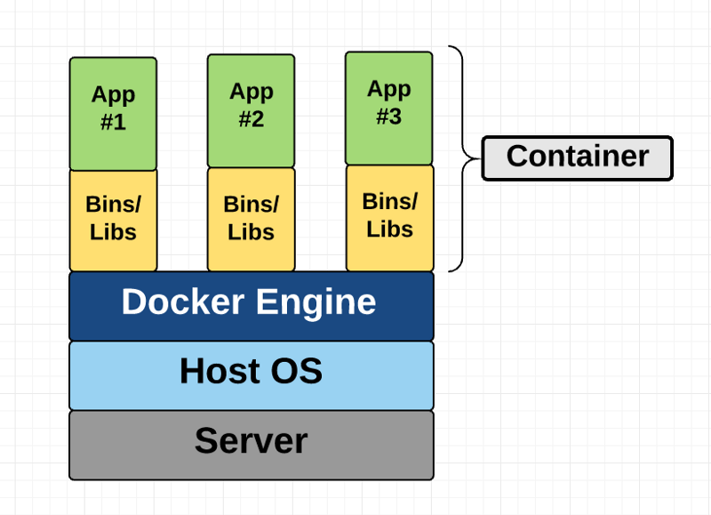
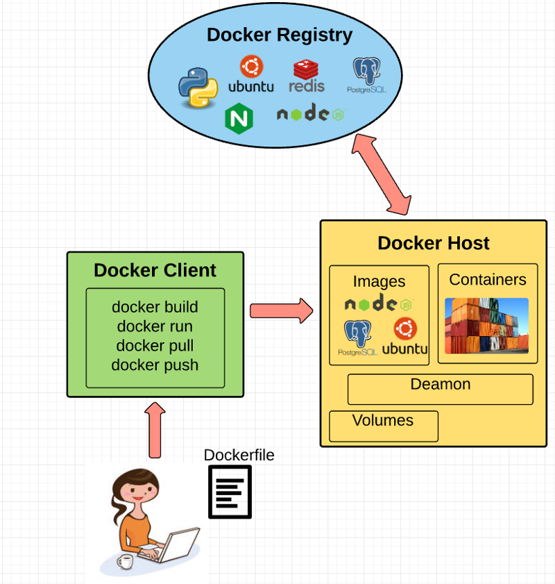
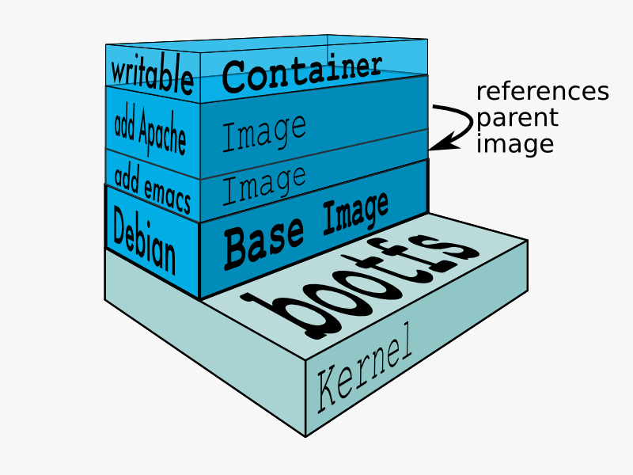

# 容器，虚拟机和Docker入门级介绍

## 容器和虚拟机（VMs）是什么？

容器和虚拟机它们有相似的目标：将应用程序以及它的依赖项隔离到一个自包含单元并可以运行在任何地方。

此外，容器和虚拟机消除了对物理硬件的需求，无论是能耗方面还是成本效益方面都更有效地使用计算资源。

容器和虚拟机主要的不同在于它们的架构体系。接下来让我们走近地看一看

## 虚拟机（VMs）

虚拟机本质上是模拟的真实计算机，它像真实计算机一样执行程序。虚拟机通过使用“hypervisor”运行在物理机器之上。hypervisor 是一个监视器，要么运行在主机上，要么运行在”裸机（bare-metal）“上。

让我们来解读一下术语：

**hypervisor是虚拟机是在其之上运行的一个软件、固件或硬件。**hypervisor自己是运行在被称为“主机”的物理计算机之上的。这个主机提供了虚拟机使用的资源，包括RAM和CPU。这些资源在虚拟机之间分配，可以根据需要进行分配。因此，如果一个虚拟机运行的应用程序资源更丰富，那么您可能会为这个虚拟机分配比运行在同一主机上的其他虚拟机更多的资源。

运行在主机上的虚拟机(同样使用hypervisor)也经常被称为“客户机”。**这个客户机器包含应用程序和运行该应用程序所需的任何东西(例如系统二进制文件和库)。它还携带自己的整个虚拟硬件堆栈，包括虚拟网卡、存储和CPU——这意味着它还拥有自己完整的客户操作系统。**从内部来看，客户机在行为上使用自己的专用资源作为自己的单元。从外部来看，我们知道它是由主机提供的虚拟机共享资源。

如上所述，客户机器可以在托管的或裸机的hypervisor上运行。它们之间有一些重要的区别。

首先，托管的虚拟化管理程序是在主机的操作系统上运行。 例如，一台运行OSX的计算机可以在该操作系统上安装一个虚拟机(例如VirtualBox或VMware Workstation 8)。**虚拟机不能直接访问硬件，所以它必须通过主机操作系统(在我们的例子中，是Mac的OSX)。**

托管的hypervisor的好处是底层硬件不再那么重要。主机的操作系统负责硬件驱动程序，而不是hypervisor本身，因此被认为具有更多的“硬件兼容性（hardware compatibility.）”。另一方面，这个位于硬件和操作系统之间的额外层会产生更多的资源开销，从而降低虚拟机的性能。

裸机的hypervisor环境通过直接在主机的硬件上安装和运行来解决性能问题。**因为它直接与底层硬件接口，所以它不需要运行在主机操作系统上。**在本例中，作为操作系统安装在主机服务器上的第一个东西将是hypervisor。与托管的hypervisor不同，裸机hypervisor有自己的设备驱动程序，并为任何I/O、进程或特定于操作系统的任务直接与每个组件交互。这将带来更好的性能、可伸缩性和稳定性。这里的缺点是硬件兼容性受到限制，因为管理程序只能内置一定数量的设备驱动程序。

在讨论了这么多hypervisor之后，您可能想知道为什么我们需要在虚拟机和主机之间添加这个额外的“hypervisor”层。

因为虚拟机有自己的虚拟操作系统，所以hypervisor在为虚拟机提供管理和执行这个客户操作系统的平台方面扮演着重要的角色。它允许主机共享它的资源，在客户机运行的时候可以共享其资源（It allows for host computers to share their resources amongst the virtual machines that are running as guests on top of them）。


​										虚拟机结构图

如上图所示，VMs为每个虚拟机都打包了虚拟硬件，内核（如操作系统）以及用户空间。

## 容器（Container）

与提供硬件虚拟化的虚拟机不同，容器通过抽象“用户空间”来提供操作系统级虚拟化。当我们看到“容器（container）”一词时，您就会明白我的意思了。

对于意图和目的方面，容器看起来就像一个虚拟机。例如，它们有私有的处理空间，可以root的方式执行命令，有私有的网络接口和IP地址，允许自定义路由和iptable规则，可以挂载文件系统，等等。

容器和虚拟机之间一个很大的区别是，**容器与其他容器共享主机系统的内核**（而虚拟机是每个都有自己的虚拟化操作系统）。



​											容器结构图

这个图向您展示了容器只打包用户空间，而不是像虚拟机那样打包内核或虚拟硬件。每个容器都有自己独立的用户空间，以允许多个容器在单个主机上运行。我们可以看到，所有操作系统级别的体系结构都在容器之间共享。唯一从头创建的部分是bins和libs。这就是容器轻量的原因。

## Docker的由来

Docker是一个基于Linux容器的开源项目。它使用Linux内核的特性，如名称空间（namespace）和控制组（control groups），在操作系统之上创建容器。

Docker已经不是什么新鲜事了;谷歌多年来一直在使用他们自己的容器技术。其他的Linux容器技术包括Solaris zone、BSD jail和LXC，这些技术已经存在很多年了。

那么，为什么Docker突然变得更受欢迎了呢（So why is Docker all of a sudden gaining steam）？

1. **易使用**：Docker能让任何人——开发人员、系统管理员、架构师和其他人——都可以更容易地利用容器，以便快速构建和测试可移植的应用程序。它允许任何人在他们的笔记本电脑上打包应用程序，而这些应用程序可以在任何公共云、私有云甚至裸机上不加修改地运行。这个口号是:“一次构建，到处运行。”
2. **速度**：Docker容器非常轻量和快速。由于容器只是运行在内核上的沙箱环境（sandboxed environments），它们占用的资源更少。你可以在几秒钟内创建和运行一个Docker容器，而虚拟机可能需要更长的时间，因为他们必须每次启动一个完整的虚拟操作系统。
3. **Docker Hub**：Docker用户也受益于Docker Hub日益丰富的生态系统，你可以把它想象成一个“Docker镜像的应用程序商店”。Docker Hub拥有由社区创建的成千上万的公共镜像，这些镜像随时可以使用。搜索满足你需求的镜像是非常容易的，几乎不需要修改就可以下拉使用。
4. **模块化和可伸缩性**：Docker可以很容易地将应用程序的功能分解成单独的容器。例如，你可能让你的Postgres数据库运行在一个容器中，Redis服务器运行在另一个容器中，而你的Node.js应用程序运行在另一个容器中。有了Docker，将这些容器链接在一起来创建你的应用程序变得更加容易，这使得将来独立地扩展或更新组件变得更加容易。

## Docker基础概念

现在，我们已经了解了Docker的总体情况，让我们一一了解Docker的基本部分：



### Docker引擎（Docker Engine）

Docker引擎是Docker运行的底层。它是一个轻量级的运行时和工具，用于管理容器、图像、构建等。它在Linux系统上运行，由以下部分组成：

1. 一个Docker Daemon，运行在主机上，是一个守护进程。
2. 一个Docker客户端，负责与Docker Daemon交互运行命令。
3. 一个REST API，负责与Docker Daemon 远程交互。

#### Docker Client

Docker Client是你作为Docker的最终用户与它沟通的对象。把它想象成Docker的UI。

你正在与Docker Client通信，然后它将你的指令传递给Docker Daemon。

#### Docker Daemon

Docker守护进程实际执行发送到Docker Client的命令——比如构建、运行和分发你的容器。Docker Daemon运行在主机上，但作为用户，你永远不会它进行直接通信。Docker Client也可以在主机上运行，但这不是必须的。Docker Client可以运行在不同的机器上，并与运行在主机上的Docker Daemon通信。

#### Dockerfile

Dockerfile是你编写构建Docker镜像指令的地方。这些指令可以是：

- **RUN apt-get y install some-package**：安装软件包。
- **EXPOSE 8000**：对外暴露端口。
- **ENV ANT_HOME /usr/local/apache-ant**：传递环境变量

等许多之类的指令。一旦你设置了Dockerfile，你就能使用`docker build`命令来构建一个镜像。下面是一个例子：

```dockerfile
# syntax=docker/dockerfile:1
FROM node:12-alpine
RUN apk add --no-cache python2 g++ make
WORKDIR /app
COPY . .
RUN yarn install --production
CMD ["node", "src/index.js"]
EXPOSE 3000
```

### Docker镜像

镜像（Image）是只读模板，您可以从Dockerfile中编写的一组指令构建镜像。镜像中定义了你想要打包的应用程序和它的依赖关系是什么样子，以及当它启动时运行什么进程。

Docker镜像是使用Dockerfile构建的。Dockerfile中的每条指令都会给镜像添加一个新的“图层”，这些图层代表镜像文件系统的一部分，这些图层可以添加或替换之下的图层。层（Layer）是Docker轻量级而强大的关键结构。Docker使用一个联合文件系统（Union File Systems）来实现这一点:

### 联合文件系统（Union File Systems）

Docker使用联合文件系统来建立一个镜像。您可以将联合文件系统看作是一个可堆叠（stackable）的文件系统，这意味着可以透明地覆盖独立的文件系统(称为分支)的文件和目录，从而形成一个单一的文件系统。

在覆盖的分支中具有相同路径的目录的内容被视为单个合并目录，这就避免了为每一层创建单独的副本。相反，它们都可以被赋予指向相同资源的指针;**当某些层需要修改时，它会创建一个副本并修改这个本地副本，保持原始副本不变。这就是为什么文件系统可以在不允许写的情况下“看起来”是可写的。(换句话说，就是一种“COW”的系统。)**

> COW：copy on write，写时复制。是一种计算机程序设计领域的优化策略。简单来讲就是当多个调用者访问同一个资源时，在没有写操作时，它们访问的都是同一个对象资源。一旦触发写操作，就会单独为写操作的调用者复制单独的副本出来供写操作。这样能保持在多个共享一个资源的高效性，在出现错误进行恢复时也非常便利。

层系统（Layers systems）提供了两种好处：

1. **零复制（Duplication-free）：层有助于避免在每次使用镜像创建和运行一个新容器时复制一套完整的文件，使docker容器的实例化非常快速和廉价。**
2. **层隔离**（Layer segregation）：当你改变一个镜像时，Docker只传播更新那个被改变的层。这样做一个改变要快得多。

### 卷（Volumes）

卷是容器的“数据”部分，在创建容器时初始化。卷允许您持久化和共享容器的数据。数据卷与默认的联合文件系统是分开的，并**作为主机文件系统上的普通目录和文件存在**。因此，即使您破坏、更新或重新构建容器，数据卷也不会受到影响。当您想要更新一个卷时，您可以直接对它进行更改。（作为额外的好处，数据卷可以在多个容器之间共享和重用，这非常干净。）

### Docker容器（Container）

如上所述，Docker容器将应用程序的软件封装在一个不可见的盒子里，里面有应用程序运行所需的所有东西。这包括操作系统、应用程序代码、运行时、系统工具、系统库等。 Docker容器是建立在Docker镜像之上的。由于镜像是只读的，Docker在镜像的只读文件系统上添加了一个读写文件系统来创建一个容器。



此外，在创建容器时，Docker会创建一个网络接口，这样容器就可以与本地主机进行通信，给容器附加一个可用的IP地址，并执行你在定义镜像时指定的用于运行应用程序的进程。

一旦成功创建了容器，就可以在任何环境中运行它，而无需进行更改。

## 双击容器

有很多活动的部分。让我好奇的一件事，即容器实际上是如何实现的，特别是在容器周围没有任何抽象的基础设施边界的情况下。在经过我大量阅读相关资料之后，这一切都是有道理的，所以我试图向你解释它!：）

术语“容器”实际上只是一个抽象的概念，用来描述几个不同的特性如何协同工作来可视化一个“容器”。让我们快速地过一遍:

### 1）命名空间（Namespaces）

名称空间为容器提供了它们自己的Linux系统的底层视图，限制了容器可以看到和访问的内容。当你运行一个容器时，Docker会创建一个命名空间给特定容器使用。

Docker在内核中使用了几种不同类型的命名空间，例如:

- **NET**：提供一个容器，它有自己的系统网络堆栈视图(例如，它自己的网络设备，IP地址，IP路由表，/proc/net目录，端口号，等等)。
- **PID**：PID表示进程ID。如果您曾经在命令行中运行`ps aux`来检查系统中有哪些进程在运行，那么您将看到一个名为“PID”的列。PID命名空间为容器提供了它们自己的范围内的进程视图，它们可以查看并与之交互，包括一个独的`init (PID 1)`，它是“所有进程的祖先”。
- **MNT**:为容器提供它自己在系统上的“挂载(mounts)”视图。因此，进程挂载不同的命名空间，就会有不同的文件系统层次结构视图。
- **UTS**：UTS代表UNIX分时系统（Timesharing System）。它允许进程识别系统标识符(如主机名、域名等)。UTS允许容器拥有自己的主机名和NIS域名，它们独立于其他容器和主机系统。
- **IPC**： IPC代表进程间通信。IPC命名空间负责在每个容器内运行的进程之间隔离IPC资源。
- **USER**：这个名称空间用于隔离每个容器中的用户。与主机系统相比，它允许容器具有不同的uid(用户ID)和gid(组ID)范围的视图。因此，进程的uid和gid在用户名称空间内外可能是不同的，这也允许进程在容器外拥有非特权用户，而不会牺牲容器内的root特权。

Docker将这些命名空间一起使用，以隔离并开始创建容器。下一个特性称为控制组。

### 2）控制组（Control groups）

控制组(也称为cgroups)是Linux内核的一个特性，它对一组进程的资源使用(CPU、内存、磁盘I/O、网络等)进行隔离、确定优先级和帐户。从这个意义上说，cgroup确保Docker容器只使用它们需要的资源，并且，如果需要，设置容器“可以”使用的资源的限制。Cgroups还确保单个容器不会耗尽其中一个资源，并导致整个系统崩溃。

最后，Docker使用的另一个特性是联合文件系统:

### 3）隔离联合文件系统

在上面[Docker镜像](#Docker镜像)部分描述了。

这就是Docker容器的全部内容(当然，难点在于实现细节——比如如何管理各个组件之间的交互)。

## Docker的未来:Docker和VMs将共存

虽然Docker确实获得了很大的成功，但我不认为它会对VMs构成真正的威胁。容器将继续占据上风，但仍有许多用例更适合虚拟机。

例如，如果您需要在多个服务器上运行多个应用程序，那么使用vm可能是有意义的。另一方面，如果你需要运行一个应用程序的多个副本，Docker提供了一些引人注目的优势。

此外，虽然容器允许您将应用程序分解为功能更分散的部分，以创建关注点分离，但这也意味着需要管理的部分越来越多，这可能会变得难以处理。

安全性也是Docker容器关注的一个方面——由于容器共享相同的内核，容器之间的屏障更薄了。一个完整的虚拟机只能向主机管理程序发出超调用（hypercalls），而Docker容器可以向主机内核发出系统调用，这为攻击创造了更大的表面积。当安全性特别重要时，开发人员可能会选择虚拟机，它们被抽象的硬件隔离——这使得相互干扰变得更加困难。

当然，随着容器在生产中得到更多的曝光和用户的进一步审查，安全性和管理等问题肯定会发生变化。现在，关于容器vs. vm的争论最适合那些每天都在使用容器的运维人员!

> 超调用（hypercall）：超调用对于系统调用就像hypervisor对于操作系统一样。或者说，超调用对于hypervisor就像系统调用对于内核一样。超调用是一个从域（domain）到hypervisor的软件陷阱（trap）事件，就像一个系统调用是一个从应用程序到内核的软件陷阱一样。域将使用超调用来请求特权操作，比如更新页面表。与系统调用一样，超调用是同步的，但是从hypervisor到域的返回路径使用事件通道。事件通道是一个异步通知队列，并且通知本地硬件上中断通知的相同类型的事件。当队列中有挂起的（pending）事件的域被调度时，OS的事件回调处理器被调用以采取适当的操作。

## 原文链接

https://www.freecodecamp.org/news/a-beginner-friendly-introduction-to-containers-vms-and-docker-79a9e3e119b/