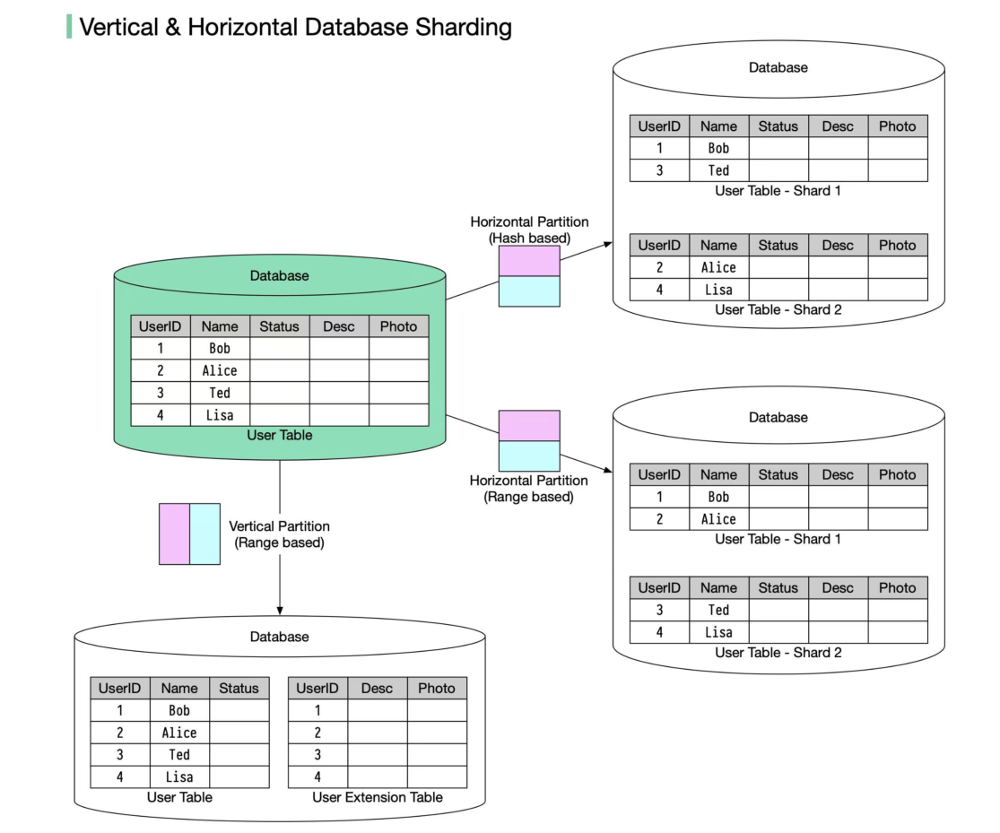

# 数据分区：垂直分区和水平分区

在许多大型应用程序中，数据被分成可以单独访问的分区。通常有两种数据分区策略。 

- **垂直分区(Vertical partitioning)**：这意味着某些列被移动到新表中。每个表包含相同数量的行，但列较少（见下图）。 
- **水平分区(Horizontal partitioning)（通常称为分片）**：它将一个表分成多个较小的表。每个表是一个单独的数据存储，它包含相同数量的列，但行数较少（见下图）。

> 垂直分区，也称为列式分区**，是按照数据模型的不同部分将表拆分为更小的表。这意味着将表中不同的列拆分为不同的表**。例如，一张包含用户信息的表可能会被拆分为一张包含用户基本信息的表和一张包含用户联系信息的表。这种方法通常用于具有大量列但仅需要访问某些列的表。
>
> 水平分区，也称为行式分区，是将表中的行拆分为更小的表。这通常通过根据某些特征对行进行分组来完成，例如根据用户ID或时间戳。这种方法通常用于需要处理大量数据的表，以便更好地管理表的大小和查询性能。 

水平分区是被广泛使用的，所以让我们更加详细地了解一下。

### 路由算法

路由算法决定哪个分区（分片）存储数据。

- 基于范围的分片。该算法使用有序列，例如整数、长整型、时间戳，来分隔行。
- 基于哈希的分片。该算法对一列或多列应用哈希函数，以决定哪行数据去哪个表。

### 优势

- 促进横向扩展。分片有助于添加更多机器以分散负载。 
- 缩短响应时间。通过将一个表分片成多个表，查询的行数减少，结果返回更快。

### 缺点

- 排序操作更为复杂。通常，我们需要从不同的分片中获取数据并在应用程序代码内进行排序（内存排序）。
- 不均匀的分布。某些分片可能包含比其他分片更多的数据（这也称为热点）。 

> 在分布式数据分区，节点分区知识可详见：[固定分区](https://github.com/MarsonShine/MS.Microservice/blob/master/docs/patterns-of-distributed-systems/Fixed-Partitions.md)

## 原文链接

https://blog.bytebytego.com/p/free-system-design-pdf-158-pages