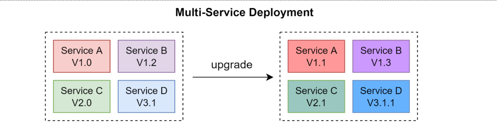
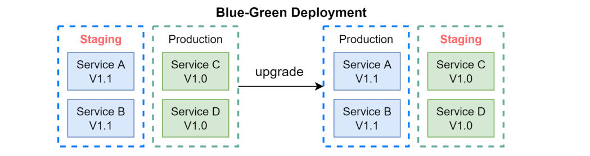
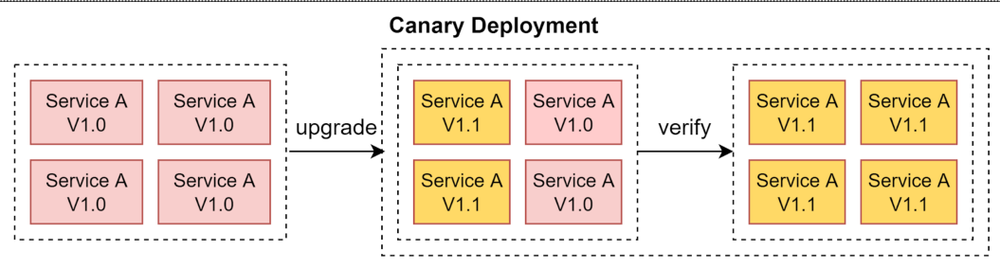

# 部署策略

目前的不是策略主要分为四种

- 多服务部署
- 蓝绿部署（Blue-Green D𝐞𝐩𝐥𝐨𝐲𝐦𝐞𝐧𝐭）
- 金丝雀部署（𝐂𝐚𝐧𝐚𝐫𝐲 𝐃𝐞𝐩𝐥𝐨𝐲𝐦𝐞𝐧𝐭）
- A/B 测试部署

## 多服务部署

在这种模型中，我们同时将新更新内容部署到多个服务中。这种方法易于实施。但由于所有服务同时升级，因此很难管理和测试依赖关系。而且，安全地回滚也很困难。

## 蓝绿部署

使用蓝绿部署，我们拥有两个相同的环境：一个是暂存环境（蓝色），另一个是生产环境（绿色）。暂存环境比生产环境提前一个版本。一旦在暂存环境中进行了测试，就会将用户流量切换到暂存环境，并将暂存环境变成生产环境。这种部署策略容易进行回滚，但是拥有两个相同的生产环境可能会很昂贵。

## 金丝雀部署

金丝雀部署是一种**逐步升级服务的策略**，每次升级只针对用户的一个子集。这种策略比蓝绿部署更便宜，并且易于回滚。但是，由于没有分段环境，我们必须在生产环境中进行测试。这个过程更加复杂，因为我们需要在逐步将更多用户从旧版本中迁移出去的同时监控金丝雀。

## A/B测试部署

在A/B测试中，不同版本的服务同时运行于生产环境中。每个版本针对用户的一个子集运行“实验”。A/B 测试是一种在生产环境中测试新功能的廉价方法。我们需要控制部署过程，以防止一些功能被错误地推送给用户。

## 原文连接

https://blog.bytebytego.com/p/free-system-design-pdf-158-pages

