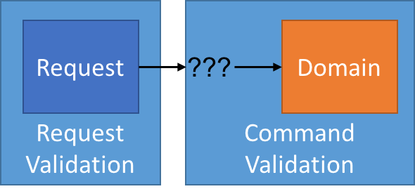

# 领域命令模式 —— 验证

通常，我构建的应用程序都遵循 CQRS，它促使我分隔我的应用程序架构为命令和查询。然而，没有两个应用程序是按照他们应用的 CQRS 完全相同的。这里总会有一些不同。

我应用程序也会为了外部 "请求" 有显式对象，它是绑定到 HTTP 请求变量类型。可能会是 POST，或是 JSON POST，但是无论如何，它们都是请求对象。

真正的请求是 —— 请求对象最终如何影响到我的领域对象？


在我进入不同模式之前，我喜欢确保我理解我将要解决的问题。在上面图片中，从外部请求上来看，我需要了解一些问题：

- 我请求的对象是被接受还是拒绝？
- 如果拒绝了，原因是什么？
- 如果接受了，会发生什么？

在正式情况，它们不是一触发就丢掉的请求，你需要的是某种认可。在我考虑这些选项时我要将这些记在我心里。

## 验证类型

首先考虑验证。我倾向于至少结合两个不同级别验证：

- 请求验证
- 领域验证

考虑请求验证，像 "我填对了表格了么"。这是很容易转换到客户端验证规则。如果在 100 年前，这将是一个接待员确保你已经填好了但所有该填的盒子。这种验证你能立马返回给客户端和不需要知道全领域对象相关的知识。

下一级验证就是领域验证，或者像我经常看到的那样，"业务规则验证"。这种更倾向于系统状态验证，"我能引起变化到我的系统吗？，基于我系统目前的状态"。我可能检查单个实体的状态，一组实体，实体集合中的某个实体，或者是整个系统。这里，关键是我不会检查请求本身，而是针对系统状态。

当你把请求的验证和领域验证混合到一起时，它就不纯粹了。验证框架是不会混合这两者的，并且是经常建议反对为领域实体使用验证框架。在过去我就这么做过，并且结果...并不是很好。

> 作为附注，我尽可能的避免关于系统状态改变任何验证然后进行验证的验证。我的验证应该在我企图去改变的地方，而不是之后。也就是说在实体上没有验证标签，例如。



接着，我需要关注我自己去验证错误是怎么冒出来的。对于请求验证，这是非常简单的。我能马上返回 `400 Bad Request` 以及一个描述了这个请求错误的准确信息体。特别是，请求验证发生在应用程序的 UI 层 —— 我使用的是 MVC 框架内置的。请求验证不能影响我领域验证的设计。

## 领域验证

现在，我已经把我关注的验证分开成请求验证和领域验证，我必须决定我要想要在领域端如何验证，以及我如何把信息往上抛。要记住 —— 这是非常重要的，不仅要了解请求失败，还要知道为什么失败。

在领域端，理解为什么这么设计是很重要的。对于失败，我能有一个或是多个理由么？这个理由需要包含上下文数据么？我必须关联一个失败的原因到指定的输入么？或者是在理由中只需要上下文数据就够了？

下一步，失败要面临什么？当到领域的请求（或命令）通过的时候，它如何告诉我这个命令是无效的？它只是返回一个失败回去么？或者是用一些见解的提示，像一个异常？

```c#
public void DoSomething(SomthingRequest request) {
    if(stateInvalid) {
        throw new DomainValidationException(reason);
    }
    entity.DoSomthing();
}
```

或者

```c#
public bool DoSomthing(SomethingRequest request) {
	if(stateInvali) {
		return false;
	}
	entity.DoSomething();
	return true;
}
```

在这两种情况，我都有负责影响改变的一些方法。我们在下一篇文章能看到这些方法。我已经通过了请求验证，现在需要领域验证了 —— 我能引起基于系统当前状态的变化么？有面临两个方式来检查 —— 直接验证并返回值或非直接验证并抛异常。

## 关于异常的领域验证

乍一看，使用异常来验证似乎是一个坏选择。异常应该是特殊的，而不是一个正常操作的一部分。但是异常将使我坚持 CQS 原则，这里的方法要么都会执行一个行为，或者要么返回值，绝不会两个都是。

> 我个人认为，对于我的应用程序这些外面部分我没那么关注 CQS，它更加关注 OOP。也许我要尝试按照 OOP 来书写将会更加重要。但是我更加关注代码整洁而不是 OOP。

如果我预期异常情况会很频繁，那么用户就会频繁地尝试在我的领域验证上做一些不允许的事情，那么这将不是一个好选择。我不应该仅用异常来绕过 CQS 准则。

然而，我尝试去设计我的 UX，这样用户就不能在一个无效的状态的里获取他们自己。甚至验证 —— 我的 UX 应该引导用户，他们不会把数据放置到无效的状态里。HTML5 `placeholder` 属性或解释性文本在这里有帮助。

但是什么是领域状态？这有点复杂 —— 但在理论情况下，如果不允许用户执行状态改变，无论什么理由，不会给他们这么做的选择！可以用过禁用链接或按钮来通信，或者简单的移除链接或按钮。以 REST 为例，在无效的状态转换下，我不会返回链接和表单。

如果我们可以预先设计我们的 UX，不允许用户在坏状态中获取它们，那么异常就真的是异常，那么我相信使用它们是没问题的。

## 返回成功或失败

在操作中，如果我不想使用异常，而是直接返回一个成功或失败的值，这方面我需要决定一下几点：

- 我能有一个或多个失败理由么？
- 在我的消息中需要上下文信息么？
- 我需要关联我的消息和输入字段么？

这些我都不需要回答，这依赖于应用程序。但是如果要我需要一个理由的话，那么我能给出一个非常简单的 CommandResult:

```c#
public class CommandResult {
    private CommandResult() {}
    
    private CommandResult(string failureReason)
    {
        FailureReason = failureReason;
    }
    
    public string FailureReason { get; }
    public bool IsSuccess => string.IsNullOrEmpty(FailureReason);
    
    public static CommandResult Success { get; } = new CommandResult();
    
    public static CommandResult Fail(string reason)
    {
        return new CommandResult(reason);
    }
    
    public static implicit operator bool(CommandResult result)
    {
        return result.IsSuccess;
    }
}
```

上面的例子，我只是需要一个失败理由。为了简单，提供一个显示操作 `bool`，这样我们就能这么做：

```c#
public IActionResult DoSomething(SomethingRequest request) {
    CommandResult result = service.DoSomething(request);
    return result ? Ok() : BadRequest(result.FailureReason);
}
```

我们当然能让 `CommandResult` 根据我们的需要而变得复杂，来表示我们的命令的结果，但是我喜欢从简单开始。

这两个选择，你应该选择哪种？我们回过头再面对这两个选择，他们都有好处和弊端。在某些时刻，这会成为让你的团队更加舒适以及最合适他们的喜好的选择。

通过了请求和命令验证，那么接下来，让我们处理领域内的命令。

translate from https://jimmybogard.com/domain-command-patterns-validation/