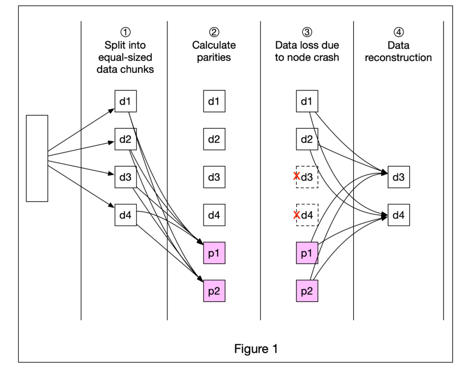
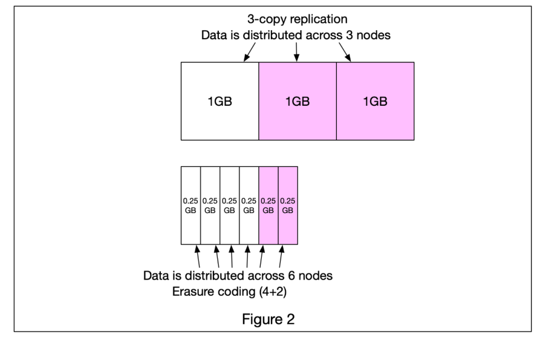

# 纠删码（Erasure coding）

一个在对象存储（例如 S3）中常用的提高数据持久性的技术叫做`纠删码（Erasure coding）`。让我们来看一下它是如何工作的。

纠删码（Erasure coding）与复制（replication）不同，**它将数据分成较小的块并存储在不同的服务器上，同时创建冗余的校验块**。在发生故障时，我们可以使用数据块和校验块来重建数据。让我们看一个具体的例子（4 + 2 纠删码），如上图1 所示： 

1. 数据被分成四个大小相等的数据块 d1，d2，d3 和 d4。
2. 使用数学公式计算校验块 p1 和 p2。举一个简化的例子，p1 = d1 + 2\*d2 - d3 + 4\*d4，p2 = -d1 + 5\*d2 + d3 - 3*d4。
3. 数据块 d3 和 d4 由于节点崩溃而丢失。
4. 使用已知的 d1，d2，p1 和 p2 值，使用数学公式重建丢失的数据块 d3 和 d4。

> 具体的计算过程：
>
> 我们可以通过前面两个公式 p1，p2 来算出 d4：
>
> d4 = (2*p1 - 3*p2 - d1 + 5*d2) / 6
>
> 接下来，我们可以使用d4和已知的数据块来计算 d3：
>
> d3 = d1 + d2 + d4 - p1
>
> 这样就能知道 d3，d4 的数据了

纠删码需要多少额外的空间？对于每两个数据块，我们需要一个校验块，因此存储开销为 50％（图2）。而在 3 个副本的复制中，存储开销为 200％（图2）。

纠删码是否增加了数据的耐久性？假设一个节点的年故障率为 0.81％。根据 Backblaze 的计算，纠删码可以实现 11 个九的耐久性，而 3 个副本的复制可以实现 6 个九的耐久性。

## 好处

当使用纠删码时，存储系统需要为每个数据块计算冗余块并存储它们，这会带来额外的存储开销。但是，在相同冗余级别下，纠删码可以比传统的数据备份方案使用更少的存储空间。

## 原文链接

https://blog.bytebytego.com/p/free-system-design-pdf-158-pages