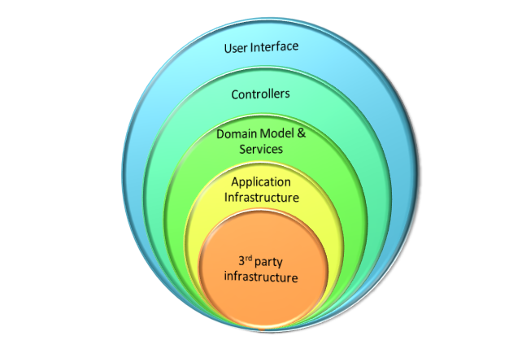
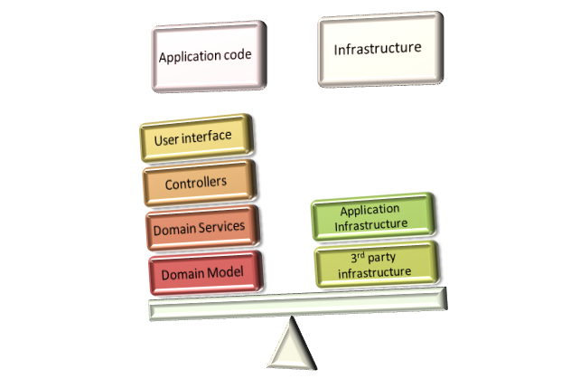

# 基础架构透明原则

代码不仅应该忽略持久性，还应该忽略所有的基础设施问题。

我不关心你的基础设施的代码又多好看，它还是技术上的缺陷。我所知的所有人都是这样。

你使用的 Ioc 容器不应该在你的代码里到处都是，持久化问题也不应该和代码具体混合在一起。侵入式方法，无论它们在做什么，都应该被禁止。

有很多人认为下面的模型是好的

我个人认为这太强调在基础设施层。基础设施不应该坐落在应用程序的最前面。它应该被挤兑到一个小角落里去，只有当没有其他选择时才会让它重见天日。

下面的图标实例是我认为的

对于实际应用层代码要比基础社会层代码要重，而且只有在定义良好的位置，才会有领域服务层向下调用基础设施层。实际上，我会竟可能的将它们隔离。依赖注入，AOP 和 少量的封装应该允许你获得应用程序，这个时候你是不用关心基础设施层的。

这其中的结果就是你更聚焦于实际的业务，而不是使用 FAT12 文件系统实现两阶段提交。

这也不是说基础设施层不重要，它当然非常重要。但是基础设施不应该具有侵略性。

https://ayende.com/blog/3137/infrastructure-ignorance