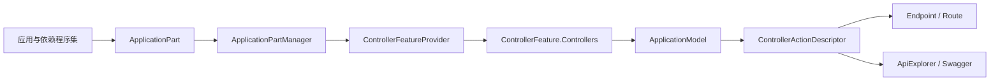
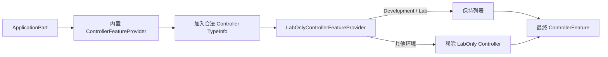

# 使用 IApplicationFeatureProvider 隔离 Development/Lab Controller

本文从 ASP.NET Core MVC 的 Controller 发现机制开始，解释 `LabOnlyControllerFeatureProvider : IApplicationFeatureProvider<ControllerFeature>` 为什么能让实验端点只在 `Development` 或 `Lab` 环境中存在，以及它与认证授权、路由、Swagger 的区别。

对应实现：

- [`LabOnlyControllerFeatureProvider`](../src/MS.Microservice.Web/Infrastructure/Labs/LabOnlyControllerFeatureProvider.cs)
- [`Program.cs` 注册入口](../src/MS.Microservice.Web/Program.cs)
- [`LabOnlyControllerFeatureProviderTests`](../test/MS.Microservice.Core.Tests/Web/Infrastructure/LabOnlyControllerFeatureProviderTests.cs)

## 一、我们真正要解决的问题

仓库同时承担正式框架入口和教学实验。若实验 Controller 与正式 Controller 一起发布到 Production，即使接口带有 `[Authorize]`，路由仍然存在，扫描器可以确认能力，Swagger 也可能暴露接口结构。

本项目需要的结果是：

```text
Development / Lab
    → 实验 Controller 被 MVC 发现
    → 生成 ActionDescriptor、路由和 Swagger 描述

Production / Staging / 其他环境
    → 实验 Controller 不进入 ControllerFeature
    → 不生成 ActionDescriptor、路由和 Swagger 描述
    → 请求最终得到 404
```

这不是“访问控制”，而是“功能发现控制”。

## 二、MVC 启动时做了什么

MVC 不会在每个请求到来时扫描程序集。Controller 列表在应用启动和 MVC 建模阶段形成：



本项目的 Provider 在内置发现完成后做二次筛选：



### ApplicationPart 是什么

`ApplicationPart` 是 MVC 对“应用资源来源”的抽象。最常见的 `AssemblyPart` 表示一个程序集，它可以暴露 Controller、ViewComponent、Razor 编译资源和 Tag Helper 等。

`ApplicationPartManager.ApplicationParts` 保存 MVC 将检查的资源来源。它们只是候选原材料，还不是最终 Controller 列表。

### Feature 是什么

Feature 是从 ApplicationPart 中提取出的某类 MVC 能力：

| Feature | 内容 |
| --- | --- |
| `ControllerFeature` | Controller 的 `TypeInfo` 列表 |
| `ViewComponentFeature` | ViewComponent 类型列表 |
| `TagHelperFeature` | Tag Helper 类型列表 |

本文只操作 `ControllerFeature`。

## 三、IApplicationFeatureProvider&lt;TFeature&gt; 是什么

接口位于 `Microsoft.AspNetCore.Mvc.ApplicationParts`，可以简化理解为：

```csharp
public interface IApplicationFeatureProvider<TFeature>
{
    void PopulateFeature(
        IEnumerable<ApplicationPart> parts,
        TFeature feature);
}
```

它读取 ApplicationPart，并更新当前 Feature。`Populate` 不意味着只能添加；传入的是同一个可变 Feature，因此 Provider 可以添加、移除、去重，或根据 Attribute、环境和配置进行筛选。

## 四、Provider 顺序为什么极其重要

`ApplicationPartManager.PopulateFeature(feature)` 的核心行为可以概括为：

```csharp
foreach (var provider in matchingFeatureProviders)
{
    provider.PopulateFeature(applicationParts, feature);
}
```

所有匹配 `TFeature` 的 Provider 按注册顺序操作同一个 Feature 实例。

MVC 内置的 `ControllerFeatureProvider` 会遍历 ApplicationPart，判断类型是否是合法 Controller，并把其 `TypeInfo` 加入 `ControllerFeature.Controllers`。

本项目将 Provider 追加到末尾：

```csharp
builder.Services.AddControllers()
    .ConfigureApplicationPartManager(options =>
    {
        options.FeatureProviders.Add(
            new LabOnlyControllerFeatureProvider(
                builder.Environment.EnvironmentName));
    });
```

实际顺序是：

```text
内置 ControllerFeatureProvider
    → 先发现并加入 Controller

LabOnlyControllerFeatureProvider
    → 再按当前环境移除实验 Controller
```

如果 Lab Provider 位于内置 Provider 前面，它只会看到空列表；内置 Provider 随后又会把所有 Controller 加入，Production 隔离就会失效。因此 Provider 顺序是正确性的一部分。

## 五、ControllerFeature 是什么

`ControllerFeature` 的核心数据是一个 `IList<TypeInfo> Controllers`。此时保存的是类型元数据，不是 Controller 实例：

- Controller 尚未构造；
- 不会执行构造函数；
- 不会解析 Controller 业务依赖；
- 尚未进入 HTTP 请求；
- 还没有 ActionDescriptor 和 Endpoint。

FeatureProvider 因而是很早、成本很低的筛选点。

## 六、本项目的 LabOnlyAttribute

项目定义：

```csharp
[AttributeUsage(
    AttributeTargets.Class,
    AllowMultiple = false,
    Inherited = false)]
public sealed class LabOnlyAttribute : Attribute;
```

使用方式：

```csharp
[LabOnly]
[ApiController]
[Route("api/v1/[controller]")]
public class DemoController : ControllerBase
{
}
```

当前标记了 `DemoController`、`ImageController`、`OrdersController` 和 `FeatureManagerController`。

Attribute 比在 Provider 中硬编码类型列表更合适：Controller 自己声明类别；新增实验 Controller 不必修改 Provider；review 时边界清晰；Provider 只识别通用的 LabOnly 概念。

`Inherited = false` 要求每个可路由实验 Controller 显式标记，避免某个基类的标记无意扩散到子类。

## 七、逐行理解 LabOnlyControllerFeatureProvider

### 1. 泛型接口

```csharp
public sealed class LabOnlyControllerFeatureProvider
    : IApplicationFeatureProvider<ControllerFeature>
```

这表示它只参与 ControllerFeature 构建，不影响 Razor、Tag Helper、ViewComponent 或 Minimal API。

### 2. 启动时计算环境开关

```csharp
private readonly bool _labEndpointsEnabled =
    environmentName == Development
    || environmentName == Lab;
```

实际实现大小写不敏感，因此 `Lab` 和 `lab` 都有效。环境在启动时确定，不会在每个请求中重新读取；修改环境变量后必须重启。

### 3. Development/Lab 保持列表

```csharp
if (_labEndpointsEnabled)
{
    return;
}
```

此时不修改内置 Provider 已发现的 Controller。

### 4. 生产环境倒序删除

```csharp
for (var index = feature.Controllers.Count - 1; index >= 0; index--)
{
    if (feature.Controllers[index]
        .IsDefined(typeof(LabOnlyAttribute), inherit: false))
    {
        feature.Controllers.RemoveAt(index);
    }
}
```

倒序是为了避免删除元素后后续元素前移而被跳过。删除尾部元素不会影响尚未访问的较小索引，也无需复制额外列表。

### 5. 为什么 parts 参数没有用于筛选

内置 Provider 已把 ApplicationPart 中的类型转成 ControllerFeature。当前策略只关心最终 Controller 是否有 `[LabOnly]`，直接检查 Feature 更简单。仍对 `parts` 做空值检查，是为了遵守接口契约并尽早暴露错误。

## 八、为什么最终是 404

MVC 会创建 ControllerFeature，调用 ApplicationPartManager.PopulateFeature，再把最终 Controller 类型交给 ApplicationModel 和 ActionDescriptor 构建流程。

```text
没有 Controller TypeInfo
    → 没有 ApplicationModel
    → 没有 ControllerActionDescriptor
    → 没有 Endpoint
    → 路由匹配不到
    → 404
```

认证授权中间件只能处理已经匹配到的 Endpoint。这里 Endpoint 根本不存在，所以不会进入 `[Authorize]`、Policy 或 Controller Action。

### 为什么 Swagger 也会消失

Swagger 的 Controller 描述依赖 MVC ApiExplorer，而 ApiExplorer 建立在 ActionDescriptor 之上。Controller 被移除后没有 ApiDescription，也就没有 Swagger operation。

这比 Swagger Filter 更可靠：Swagger Filter 只隐藏描述，真实路由仍然存在。

## 九、替代方案对比

| 方案 | Production 路由 | 返回 | Swagger | 适用场景 |
| --- | --- | --- | --- | --- |
| `[Authorize]` | 存在 | 401/403 | 通常存在 | 正式接口访问控制 |
| Action Filter 判断环境 | 存在 | 自定义 | 通常存在 | 请求期业务判断 |
| Middleware 拦截路径 | 存在 | 自定义 | 仍可能存在 | 临时流量控制 |
| Swagger Filter | 存在 | 可访问 | 隐藏 | 仅文档定制 |
| 删除整个 ApplicationPart | 整个程序集消失 | 404 | 消失 | 整包插件开关 |
| `#if DEBUG` | 取决于构建物 | 404 | 消失 | 不同构建变体 |
| FeatureProvider | 指定 Controller 不存在 | 404 | 消失 | 同程序集按 Controller 筛选 |

本项目的实验和正式 Controller 位于同一程序集，FeatureProvider 的粒度最合适。

## 十、环境判定与部署风险

当前只允许 `Development` 和 `Lab`。可通过 `ASPNETCORE_ENVIRONMENT` 设置。未设置时默认 Production，因此 Docker 默认不发现实验 Controller。

```powershell
$env:ASPNETCORE_ENVIRONMENT = "Lab"
dotnet run --project src/MS.Microservice.Web/MS.Microservice.Web.csproj
```

### Lab 不是认证机制

如果生产部署错误地设置成 `Lab`，实验接口就会启用。因此仍应：

- CI/CD 明确设置 Production；
- 禁止生产配置复用 Lab 环境；
- 部署后核对环境名和路由；
- Lab 不直接暴露公网；
- 必要时增加网络层访问控制。

FeatureProvider 是降低攻击面的架构护栏，不替代认证、授权和网络隔离。

## 十一、只隐藏 Controller 的边界

FeatureProvider 只影响 MVC Controller discovery：

- 路由和 Action 不存在；
- 但 Application Service、Repository、Wolverine Handler 仍可能注册；
- 后台服务不会自动停用；
- Minimal API 不经过 ControllerFeature，因此不会自动过滤。

未来把实验模块移动到独立 Sample Host 后，Production 才能从依赖和 DI 层面完全不加载它们。

## 十二、测试如何证明行为

测试构造包含 `AccountController` 和四个实验 Controller 的 ControllerFeature，然后直接调用 Provider。

Production 断言所有 `[LabOnly]` 类型被移除且 `AccountController` 保留；Development/Lab 断言全部保留；另逐个检查四个目标 Controller 是否带有 Attribute。

```bash
dotnet test test/MS.Microservice.Core.Tests/MS.Microservice.Core.Tests.csproj \
  --filter FullyQualifiedName~LabOnlyControllerFeatureProviderTests
```

当前是快速、确定性的 Feature 层测试。等宿主启动依赖拆分完成后，可增加 `WebApplicationFactory` 测试，直接验证 Production 404 和 Development 200/401。

## 十三、如何新增实验 Controller

```csharp
[LabOnly]
[ApiController]
[Route("api/lab/[controller]")]
public sealed class NewExperimentController : ControllerBase
{
}
```

同时把类型加入实验 Controller 测试数据，验证 Production 移除、Lab 保留，并根据风险决定是否仍需 `[Authorize]`。

## 十四、常见问题

### 为什么不用 IsDevelopment 包住 MapControllers？

`MapControllers()` 会映射全部 Controller，Production 连正式接口也会消失，粒度太粗。

### 为什么不用 Controller 构造函数检查环境？

构造函数运行时路由已经存在，还可能把配置问题变成请求期异常。FeatureProvider 更早、更稳定。

### 为什么不用 Authorization Policy？

Policy 解决“谁能访问”，不能解决“端点是否存在”，会留下路由和元数据。

### 能否用于 Minimal API？

不能直接使用。Minimal API 通过 `MapGet`、`MapPost` 显式创建 Endpoint，应在映射阶段按环境决定是否调用。

### 能否动态开关实验端点？

当前设计不能。动态路由需要更新 EndpointDataSource，并增加并发、缓存和文档一致性复杂度。环境隔离适合启动期稳定决策。

## 十五、官方源码依据

- [ApplicationPartManager 官方源码](https://github.com/dotnet/aspnetcore/blob/main/src/Mvc/Mvc.Core/src/ApplicationParts/ApplicationPartManager.cs)
- [ControllerFeatureProvider 官方源码](https://github.com/dotnet/aspnetcore/blob/main/src/Mvc/Mvc.Core/src/Controllers/ControllerFeatureProvider.cs)
- [ControllerActionDescriptorProvider 官方源码](https://github.com/dotnet/aspnetcore/blob/main/src/Mvc/Mvc.Core/src/ApplicationModels/ControllerActionDescriptorProvider.cs)
- [Microsoft Learn：Application Parts 与 Feature Providers](https://learn.microsoft.com/aspnet/core/mvc/advanced/app-parts)
- [IApplicationFeatureProvider&lt;TFeature&gt; API](https://learn.microsoft.com/dotnet/api/microsoft.aspnetcore.mvc.applicationparts.iapplicationfeatureprovider-1)
