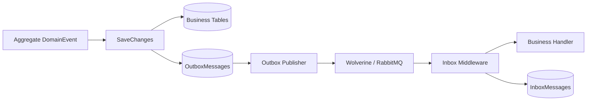

# Message、Inbox、Outbox 与 Wolverine：可靠消息设计速览

## 1. 目标

数据库与消息 Broker 不能共享一个普通本地事务。如果先保存数据库再发消息，进程可能在两步之间崩溃；如果先发消息再保存数据库，下游可能处理一条实际已经回滚的业务事件。

Transactional Outbox 的核心做法是：**业务数据和待发送消息先写入同一个数据库事务，再由后台进程发送消息**。[AWS：Transactional Outbox Pattern](https://docs.aws.amazon.com/prescriptive-guidance/latest/cloud-design-patterns/transactional-outbox.html)



本项目提供的是：

```text
Outbox 至少一次投递 + Inbox 幂等消费
```

不是端到端 exactly-once。

## 2. Message 契约

Canonical 契约位于 `MS.Microservice.Core.Messaging`：

| 契约 | 用途 |
| --- | --- |
| `IEventContract` | 所有平台消息事件的根 marker |
| `IDomainEvent` | 聚合内部产生的业务事实 |
| `IIntegrationEvent` | 跨应用边界发布的稳定契约 |
| `IntegrationEvent` | 带 `Id` 与 UTC 创建时间的集成事件基类 |

Domain、旧 Core EventBus 和独立 EventBus 都通过兼容 shim 指向这组契约；Wolverine 只负责传输和 Handler 调度，不再定义另一套业务事件接口。

当前 Outbox 的 `MessageType` 使用 assembly-qualified CLR type，便于同版本反序列化。跨版本长期兼容仍应增加稳定 event name、schema version 和显式类型注册表，不能把 CLR 名称当作永久公共协议。

Outbox 发布时会把 `OutboxMessage.MessageId` 写入 Wolverine Envelope 的 `ms-microservice-message-id` header，并设置相同的 transport `DeduplicationId`。Inbox 优先使用该 header，而不是 Wolverine 每次发送可能重新生成的 `Envelope.Id`，因此 Outbox 重试和 Broker 重投仍得到同一个 deduplication key。

## 3. Outbox 如何实现

### 写入

`ActivationDbContext.SaveChangesAsync` 在调用 EF 基础保存前：

1. 从 ChangeTracker 收集 `IHasDomainEvents`；
2. 序列化每个 DomainEvent；
3. 创建 `OutboxMessage`；
4. 让业务实体和 Outbox insert 进入同一次 `SaveChanges`；
5. 保存成功后才清空内存 DomainEvents；
6. 保存失败时保留事件并 detach 临时 Outbox entry。

因此不会出现“业务回滚但消息已经发出”的 ghost message。

### 状态

```text
Pending → Publishing → Published
                  ↘ Failed → Publishing
                           ↘ DeadLettered
DeadLettered --人工重放--> Pending
```

失败使用指数退避，并受 `MaxRetryCount` 和最大延迟限制。超过预算进入 `DeadLettered`，不会无限重试。

### 并发领取

Publisher 在 PostgreSQL 事务中使用：

```sql
FOR UPDATE SKIP LOCKED
```

每个实例会跳过已被其他实例锁定的行，再写入自己的 `LockToken` 和租约时间。PostgreSQL 官方说明 `SKIP LOCKED` 适合多个消费者并发访问 queue-like table，避免等待已锁行。[PostgreSQL：SELECT / SKIP LOCKED](https://www.postgresql.org/docs/current/sql-select.html)

核心索引：

| 索引 | 目的 |
| --- | --- |
| `(Status, NextAttemptAtUtc, OccurredAtUtc)` | 快速找到当前可发布消息，并保持稳定顺序 |
| `LockedUntilUtc` | 回收崩溃实例遗留的过期租约 |
| `MessageType` | 按契约类型排查和运维 |

### 发布确认窗口

发布顺序是：

```text
发送到 Wolverine/Broker → 标记 Outbox Published
```

如果进程在发送成功后、数据库确认前崩溃，租约过期后消息会再次发送。这就是至少一次投递产生重复消息的窗口，也是 Inbox 必须存在的原因。

## 4. Inbox 如何实现

### 去重键

```text
DeduplicationKey = Consumer + MessageId
```

同一 consumer 对同一 MessageId 只能建立一条 receipt；不同 consumer 可以各处理一次。

数据库同时使用：

- `DeduplicationKey` 主键；
- `(MessageId, Consumer)` 唯一索引。

应用层的“先查询”只是快速路径，真正解决并发竞态的是数据库唯一约束。

### Processing lease

Inbox receipt 使用 `ProcessingToken` 和 `ProcessingLeaseExpiresAtUtc`：

- 已 `Processed`：直接短路；
- 正在有效 lease 内处理：重复投递直接短路；
- `Failed` 或 lease 已过期：允许新 token 抢占重试；
- 旧 Handler 只能用自己的 token 确认，不能覆盖新一轮状态。

### Wolverine middleware

`InboxConsumptionMiddleware` 只应用于 `IEventContract`：

| 阶段 | 行为 |
| --- | --- |
| `BeforeAsync` | 注册 receipt、抢占 lease；重复消息返回 `HandlerContinuation.Stop` |
| Handler | 只在首次投递或合法重试时执行 |
| `AfterAsync` | Handler 成功后标记 `Processed` |
| `FinallyAsync` | Handler 未完成时标记 `Failed` |

Wolverine 官方 middleware 约定允许 Before 返回 `HandlerContinuation.Stop`，并把 Before 产生的状态对象传给 After/Finally。[Wolverine：Handler Middleware](https://wolverinefx.net/guide/handlers/middleware.html)

抢占 Processing lease 后，middleware 会在 Handler 前开启 `ActivationDbContext` 事务。Handler 的业务 `SaveChangesAsync`、可能产生的新 Outbox，以及 After 阶段的 Inbox `Processed` 更新共享该事务：全部成功才 commit；Handler 异常则 rollback，再独立记录 Inbox `Failed`。因此不会出现“业务副作用已提交，但 Inbox 尚未确认”而导致的重复副作用窗口。

## 5. Wolverine 在这里负责什么

本项目没有使用 Wolverine 自带数据库表替代自定义 Outbox/Inbox，而是复用 Wolverine 的两个能力：

1. `IMessageBus.PublishAsync`：Outbox Publisher 的传输出口；
2. Handler middleware：消费前去重、成功确认和失败记录。

RabbitMQ 只是可替换 transport；Outbox/Inbox 的一致性边界仍在 PostgreSQL。Wolverine RabbitMQ transport 使用 RabbitMQ .NET Client，并支持自动拓扑和 conventional routing。[Wolverine：RabbitMQ Transport](https://wolverinefx.net/guide/messaging/transports/rabbitmq/)

Wolverine 本身也提供内置 durable inbox/outbox。本项目选择自定义表，是为了让状态、索引、人工重放和审计生命周期保持显式；两种方案不应在同一 endpoint 上重复启用。[Wolverine：Durable Messaging](https://wolverinefx.net/guide/durability/)

## 6. 能力边界

| 场景 | 结果 |
| --- | --- |
| 业务保存失败 | 业务和 Outbox 一起回滚 |
| 保存成功、发送前崩溃 | Pending Outbox 在重启后继续发布 |
| 发送成功、确认前崩溃 | 可能重复发送，由 Inbox 去重 |
| 多 Publisher 实例 | `SKIP LOCKED` + lease 避免同时领取 |
| 多次消费同一消息 | consumer + messageId 唯一约束短路 |
| 持续发送失败 | 指数退避后进入 DeadLettered |
| 人工重放 | 受 `Manage` policy 保护，DeadLettered → Pending |

消息顺序目前只保证 Outbox 按 `OccurredAtUtc, MessageId` 领取，不提供跨聚合或跨分区的全局严格顺序。AWS 也指出至少一次 Broker 可能产生重复消息，因此 consumer 必须幂等。[AWS：Publish/Subscribe Pattern](https://docs.aws.amazon.com/prescriptive-guidance/latest/cloud-design-patterns/publish-subscribe.html)

## 7. 关键代码入口

- `MS.Microservice.Core/Messaging/EventContracts.cs`
- `ActivationDbContext.SaveChangesAsync`
- `EfCoreOutboxStore` / `OutboxPublisher`
- `EfCoreInboxStore` / `InboxConsumptionMiddleware`
- `OutboxOperationsController`
- `MS.Microservice.Messaging.IntegrationTests`

## 8. 参考资料

1. [AWS：Transactional Outbox Pattern](https://docs.aws.amazon.com/prescriptive-guidance/latest/cloud-design-patterns/transactional-outbox.html)
2. [AWS：Publish/Subscribe Pattern](https://docs.aws.amazon.com/prescriptive-guidance/latest/cloud-design-patterns/publish-subscribe.html)
3. [PostgreSQL：SELECT / SKIP LOCKED](https://www.postgresql.org/docs/current/sql-select.html)
4. [Wolverine：Handler Middleware](https://wolverinefx.net/guide/handlers/middleware.html)
5. [Wolverine：Durable Messaging](https://wolverinefx.net/guide/durability/)
6. [Wolverine：EF Core Inbox/Outbox](https://wolverinefx.net/guide/durability/efcore/outbox-and-inbox)
7. [Wolverine：RabbitMQ Transport](https://wolverinefx.net/guide/messaging/transports/rabbitmq/)
