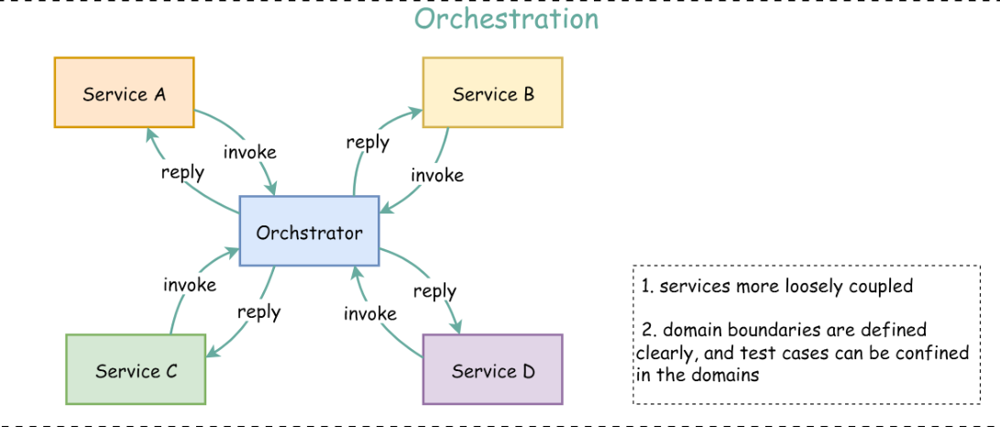
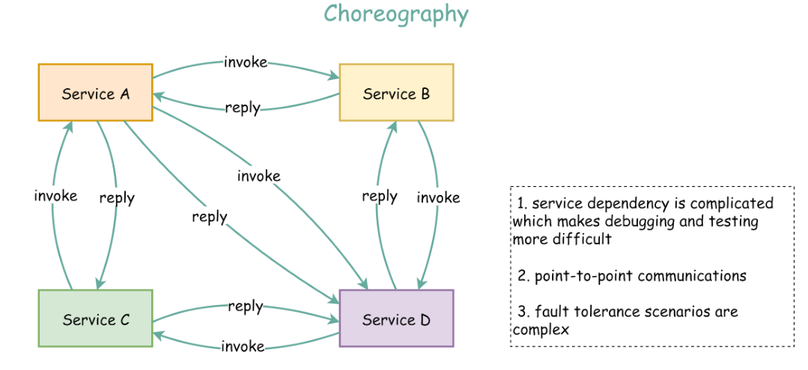

# 微服务之间的交互与协作

在微服务架构中，有两种常见的方式来管理不同服务之间的协作：编排（Orchestration）和协同（Choreography）。

## 编排（Orchestration）

**编排是指使用一个中心化的调度器来协调和管理不同服务之间的交互和通信**。在编排模式下，中心化的调度器充当一个指挥者的角色，它负责决定每个服务何时启动、何时停止，以及如何与其他服务进行交互。编排模式可以实现高度的控制和可见性，但也带来了更高的复杂性和耦合度。

## 协同（Choreography）

**协同是指服务之间通过约定好的协议和接口自发地协作和通信，而不需要中心化的调度器来管理**。在协同模式下，每个服务都有自己的职责和任务，它们通过相互通信来完成整个业务流程。协同模式可以降低复杂度和耦合度，但也需要更多的协调和监控工作。

**编排的好处：**

1. 可靠性 - 编排具有内置的事务管理和错误处理机制，而编排是点对点通信，容错场景更加复杂。

2. 可扩展性 - 当向编排添加新服务时，只需要修改编排器的交互规则，而在编排中需要修改所有交互服务。 

**编排的一些限制：**

1. 性能 - 所有服务通过集中式编排器进行通信，因此延迟比编排要高。此外，吞吐量受编排器容量的限制。

2. 单点故障 - 如果编排器出现故障，则所有服务都无法通信。为了缓解这种情况，编排器必须高度可用。 

现实世界的用例：[Netflix Conductor](https://github.com/Netflix/conductor) 是一款微服务编排器，您可以阅读更多有关编排器设计的详细信息。

## 参考链接

https://blog.bytebytego.com/p/free-system-design-pdf-158-pages