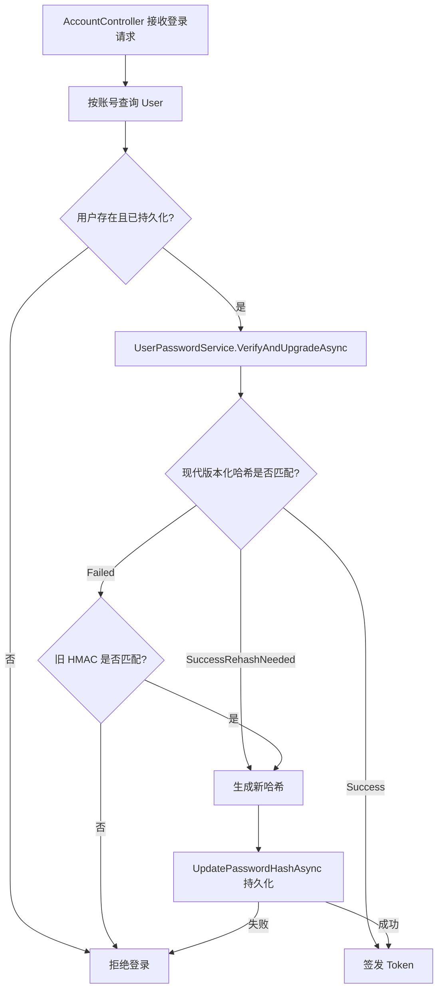

# 使用 IPasswordHasher 实现安全的密码存储与平滑升级

本文解释 ASP.NET Core 的 `IPasswordHasher<TUser>` 是什么、解决什么问题，以及它在 MS.Microservice 当前登录流程中的实际用法。

对应实现：

- [`UserPasswordService`](../src/MS.Microservice.Web/Application/Identity/UserPasswordService.cs)
- [`AccountController`](../src/MS.Microservice.Web/Controller/AccountController.cs)
- [`User`](../src/MS.Microservice.Domain/Aggregates/IdentityModel/User.cs)
- [`UserDomainService`](../src/MS.Microservice.Domain/Services/UserDomainService.cs)
- [`IdentityApplicationModule`](../src/MS.Microservice.Web/Infrastructure/AutofacModules/IdentityApplicationModule.cs)
- [`UserPasswordServiceTests`](../test/MS.Microservice.Core.Tests/Web/Infrastructure/UserPasswordServiceTests.cs)

## 一、先理解密码存储的目标

服务端不应该保存用户明文密码，也不应该保存可以解密回明文的密文。正确目标是保存**不可逆的密码哈希**：

```text
用户输入密码
    ↓
耗时的密码哈希算法 + 随机盐 + 工作因子
    ↓
只保存版本化哈希字符串
```

登录时不需要“解密密码”，而是把用户本次输入交给密码哈希器验证：

```text
Verify(数据库中的哈希, 用户本次输入)
    → 匹配 / 不匹配 / 匹配但需要升级
```

### 为什么旧 HMAC 不适合保存密码

项目旧实现使用：

```csharp
CryptologyHelper.HmacSha256(password + salt)
```

HMAC 适合消息完整性校验，但计算速度很快。密码数据库泄露后，攻击者也能高速尝试大量候选密码。旧实现的盐只有 4 个字符，且原来使用普通 `Random` 生成，进一步降低了抗破解能力。

密码哈希器的目标恰恰相反：单次计算应该有意保持一定成本，从而限制离线暴力破解速度。

## 二、IPasswordHasher 是什么

`IPasswordHasher<TUser>` 位于 `Microsoft.AspNetCore.Identity`，是 ASP.NET Core Identity 提供的密码哈希抽象。它可以独立使用，不要求项目采用完整的 Identity 用户表、登录页面或 `UserManager`。

核心接口可以简化理解为：

```csharp
public interface IPasswordHasher<TUser>
{
    string HashPassword(TUser user, string password);

    PasswordVerificationResult VerifyHashedPassword(
        TUser user,
        string hashedPassword,
        string providedPassword);
}
```

### HashPassword

把明文密码转换成可以持久化的版本化哈希字符串：

```csharp
string passwordHash = passwordHasher.HashPassword(user, rawPassword);
```

返回值内部包含验证所需的信息，例如格式版本、随机盐和工作参数。应用应该把它当作不透明字符串保存，不要自行解析，也不要再单独拼接盐。

同一个密码连续调用两次通常会产生不同的哈希，这是随机盐在发挥作用，不代表验证会失败。

### VerifyHashedPassword

验证用户提供的密码：

```csharp
PasswordVerificationResult result = passwordHasher.VerifyHashedPassword(
    user,
    storedPasswordHash,
    providedPassword);
```

返回结果有三种：

| 结果 | 含义 | 应用行为 |
| --- | --- | --- |
| `Failed` | 密码不匹配，或哈希格式无效 | 拒绝登录 |
| `Success` | 密码匹配，当前哈希参数仍符合要求 | 正常登录 |
| `SuccessRehashNeeded` | 密码匹配，但哈希版本或工作参数已经落后 | 生成新哈希、持久化后再登录 |

第三种结果使系统能够逐步提高密码安全强度，而不要求所有用户同时重置密码。

### PasswordHasher&lt;TUser&gt; 的内核：自描述密码哈希

最容易产生疑惑的代码是：

```csharp
passwordHasher.VerifyHashedPassword(
    user,
    passwordHash,
    providedPassword);
```

这里没有单独传入 salt、PRF 或迭代次数，因为这些验证参数已经编码进 `passwordHash`。默认实现生成的字符串不是“只有最终 hash 的文本”，而是一个二进制密码哈信封（password hash envelope）经过 Base64 编码后的结果：

```text
passwordHash = Base64(
    格式版本
    + 算法参数
    + 随机 salt
    + 最终派生出的 subkey
)
```

Base64 只是把二进制转换成便于数据库保存的文本，不提供加密能力。任何人都可以解码并看到格式参数和 salt，但无法从中直接还原密码。salt 本来就不需要保密。

#### 当前 Identity V3 的二进制布局

根据当前 ASP.NET Core 官方源码，Identity V3 的格式为：

```text
{ 0x01, prf, iterationCount, saltLength, salt, subkey }
```

精确布局如下：

| 偏移 | 长度 | 内容 | 说明 |
| --- | ---: | --- | --- |
| `0` | 1 byte | 格式标记 `0x01` | 表示 Identity V3 |
| `1` | 4 bytes | PRF | `UInt32`，大端序 |
| `5` | 4 bytes | 迭代次数 | `UInt32`，大端序 |
| `9` | 4 bytes | salt 长度 | `UInt32`，大端序 |
| `13` | `saltLength` | 随机 salt | 默认 128 bit，即 16 bytes |
| `13 + saltLength` | 剩余部分 | PBKDF2 subkey | 默认 256 bit，即 32 bytes |

当前官方默认参数是：

```text
格式             Identity V3
密码派生函数     PBKDF2
PRF              HMAC-SHA512
迭代次数         100,000
salt             128 bit，由安全随机数生成器产生
subkey           256 bit
```

因此，使用默认参数时，Base64 之前的 payload 可以理解为：

```text
1 byte format marker
+ 4 bytes PRF
+ 4 bytes iteration count
+ 4 bytes salt length
+ 16 bytes salt
+ 32 bytes subkey
= 61 bytes
```

最终数据库保存的是这 61 bytes 的 Base64 文本，而不是 61 个可直接阅读的字符。

#### Identity V2 为什么也能验证

旧的 Identity V2 格式是：

```text
{ 0x00, salt, subkey }
```

V2 的算法参数没有逐项写入 payload，而是由 `0x00` 格式标记隐式确定：PBKDF2-HMAC-SHA1、1,000 次迭代、128-bit salt、256-bit subkey。

这说明“参数包含在 passwordHash 中”有两种形式：

- V2：格式标记决定一套固定参数；
- V3：格式标记之外，还显式存储 PRF、迭代次数和 salt 长度。

#### HashPassword 内部做了什么

Identity V3 的生成过程可以简化为：

```text
1. 使用 RandomNumberGenerator 生成随机 salt
2. 使用 PBKDF2(password, salt, PRF, iterationCount) 派生 subkey
3. 写入格式标记 0x01
4. 以大端序写入 PRF、迭代次数和 salt 长度
5. 追加 salt
6. 追加 subkey
7. 对整个 byte[] 进行 Base64 编码
```

对应伪代码：

```csharp
byte[] salt = SecureRandom(16);
byte[] subkey = Pbkdf2(password, salt, prf, iterationCount, 32);

byte[] payload = Combine(
    formatMarker,
    prf,
    iterationCount,
    salt.Length,
    salt,
    subkey);

string passwordHash = Convert.ToBase64String(payload);
```

#### VerifyHashedPassword 内部做了什么

验证过程不是“再次调用 HashPassword 然后比较字符串”，因为再次生成的随机 salt 会不同。真正流程是：

```text
1. Base64 解码数据库中的 passwordHash
2. 读取第一个 byte，识别 V2 或 V3
3. 按对应格式读取 PRF、迭代次数和 salt
4. 使用读取出的参数和 providedPassword 重新派生 subkey
5. 使用固定时间比较重新派生的 subkey 与 payload 中的 subkey
6. 根据格式和参数返回 Failed、Success 或 SuccessRehashNeeded
```

可以把核心逻辑理解成：

```csharp
var payload = Convert.FromBase64String(passwordHash);
var formatVersion = payload[0];
var parameters = ReadParameters(payload, formatVersion);

var actualSubkey = Pbkdf2(
    providedPassword,
    parameters.Salt,
    parameters.Prf,
    parameters.IterationCount,
    parameters.SubkeyLength);

return FixedTimeEquals(actualSubkey, parameters.ExpectedSubkey);
```

这就是为什么调用 `VerifyHashedPassword` 时不需要传 salt：验证器从 `passwordHash` 自己读取 salt 和算法参数。

#### SuccessRehashNeeded 如何判断

当前官方实现会在下列典型情况中返回 `SuccessRehashNeeded`：

- 当前配置为 Identity V3，但数据库仍是 V2 格式；
- V3 payload 中的迭代次数低于当前配置；
- V3 使用旧 PRF，例如 HMAC-SHA1 或 HMAC-SHA256，而当前要求 HMAC-SHA512。

因此调高工作因子或升级框架算法时，不需要额外新增“哈希版本”数据库列。哈希字符串本身已经携带判断依据。

应用代码仍应把该字符串视为不透明值。上面的布局用于理解、审计和故障排查，不建议在业务代码中自行解析；格式兼容应交给 `IPasswordHasher<User>`。

官方依据：

- [ASP.NET Core PasswordHasher 官方源码](https://github.com/dotnet/aspnetcore/blob/main/src/Identity/Extensions.Core/src/PasswordHasher.cs)
- [PasswordHasherOptions 官方源码](https://github.com/dotnet/aspnetcore/blob/main/src/Identity/Extensions.Core/src/PasswordHasherOptions.cs)
- [ASP.NET Core Identity Password Hasher 配置说明](https://learn.microsoft.com/aspnet/core/security/authentication/identity-configuration#password-hasher-options)

## 三、它能解决什么，不能解决什么

`IPasswordHasher<User>` 能够提供：

- 不可逆的密码存储；
- 每个密码独立的随机盐；
- 带版本信息的哈希格式；
- 可调整的工作因子；
- 旧工作参数的自动识别与重新哈希；
- 统一且容易测试的哈希/验证接口。

它不能替代：

- HTTPS；
- 登录限流、验证码和账号锁定；
- MFA/双因素认证；
- JWT 密钥管理；
- 数据库访问控制；
- 密码复杂度和泄露密码检查；
- 安全审计与异常登录检测。

另外，当前登录请求中的 Base64 只是一种传输编码，不是加密。密码在网络传输中的保密性仍然必须依赖 HTTPS。

## 四、项目中的依赖注入方式

项目在 `IdentityApplicationModule` 中注册默认实现：

```csharp
builder.RegisterType<PasswordHasher<User>>()
    .As<IPasswordHasher<User>>()
    .SingleInstance();

builder.RegisterType<UserPasswordService>()
    .As<IUserPasswordService>()
    .InstancePerLifetimeScope();
```

这里两个生命周期不同：

- `PasswordHasher<User>` 只持有不可变选项，没有 DbContext 和请求状态，支持并发使用，因此可以是 Singleton。
- `UserPasswordService` 依赖 `IUserDomainService`，后者最终依赖请求级 DbContext，因此使用请求作用域。

这与之前的 RBAC Handler 不同：RBAC Handler 会沿依赖链持有 DbContext，所以不能注册为 Singleton。

## 五、当前项目的登录验证流程

当前完整流程如下：



`AccountController` 不再直接知道密码哈希算法，只负责协调登录用例：

```csharp
if (user == null
    || user.IsTransient()
    || !await userPasswordService.VerifyAndUpgradeAsync(
        user,
        providedPassword,
        HttpContext.RequestAborted))
{
    // 返回统一的账号或密码错误
}
```

这样 Controller 不需要区分现代哈希、旧 HMAC 或未来的新格式。

## 六、现代哈希验证

`UserPasswordService` 首先尝试标准验证：

```csharp
var result = passwordHasher.VerifyHashedPassword(
    user,
    user.Password,
    providedPassword);
```

处理规则：

```text
Failed                → 尝试旧 HMAC 兼容验证
Success               → 直接允许登录
SuccessRehashNeeded   → 重新生成哈希并持久化
```

哈希字符串损坏或格式非法时必须按验证失败处理，不能回退为明文比较。

## 七、旧 HMAC 用户如何平滑迁移

数据库中已有用户仍可能保存旧格式：

```text
Password = HMAC-SHA256(明文密码 + 旧 Salt)
Salt     = 旧 4 字符盐
```

兼容步骤是：

1. 标准 `IPasswordHasher<User>` 验证失败；
2. 使用旧算法计算候选 HMAC；
3. 使用 `CryptographicOperations.FixedTimeEquals` 比较，降低时序侧信道风险；
4. 如果匹配，立即调用 `HashPassword` 生成现代哈希；
5. 通过 `UpdatePasswordHashAsync` 保存；
6. 只有保存成功才继续签发 Token。

这是一种“登录时迁移”策略：活跃用户不需要重置密码，第一次成功登录后自动完成升级。

### 为什么升级保存失败时拒绝登录

如果新哈希没有成功落库却已经签发 Token，系统会出现“本次认证认为迁移成功，但数据库仍保留旧凭据”的状态分裂。当前项目选择一致性优先：升级失败就不签发 Token，让用户稍后重试。

另一种可选策略是允许登录并记录重试任务，但这需要可靠后台任务、监控和幂等处理，当前项目尚未具备完整基础设施。

## 八、User.Password 和 User.Salt 如何保存

现代密码调用：

```csharp
user.SetPasswordHash(versionedPasswordHash);
```

实体会执行：

```text
Password = IPasswordHasher 生成的完整版本化哈希
Salt     = "v2"
```

`Salt = "v2"` 只是当前数据库结构的兼容标记，不是真正的密码盐。真实随机盐已经包含在 `Password` 的版本化哈希字符串中。

对于纯现代 `IPasswordHasher<User>` 方案，用户表只需要一个 `PasswordHash` 字段，独立 `Salt` 字段可以并且应该删除。即使未来提高迭代次数或调整 PRF，也不需要新增独立算法版本字段，因为这些信息已经包含在 `passwordHash` 中。

当前代码暂时保留 `Salt`，不是因为 `IPasswordHasher<User>` 需要它，而是因为系统仍要兼容尚未迁移的旧 HMAC 用户：

```text
旧用户验证需要：旧 Password + 旧 Salt
现代用户验证只需：版本化 PasswordHash
```

如果现在直接删除数据库 `Salt`，尚未登录完成升级的旧用户将无法验证密码，只能全部走密码重置。

因此删除 `Salt` 字段应采用明确的迁移顺序：

1. 所有新建用户和修改密码流程停止生成旧 HMAC；
2. 登录流程继续把活跃旧用户升级为现代哈希；
3. 统计仍为旧格式的用户数量；
4. 对长期不登录的旧用户执行密码重置或离线迁移策略；
5. 确认数据库中不再存在需要旧 Salt 验证的用户；
6. 删除 `UserPasswordService` 中的旧 HMAC fallback；
7. 通过 EF Core migration 删除 `Salt` 列；
8. 删除 `User.Salt`、`PasswordSaltHelper`、构造参数和相关测试。

当前实体写入 `Salt = "v2"`，只是让现代哈希在现有“必填、最大长度 4”的数据库约束下可落库，并方便迁移期间统计。完成上述步骤后，`v2` 标记和整个 `Salt` 字段都应删除。

推荐最终模型：

```csharp
public class User
{
    public string PasswordHash { get; private set; } = string.Empty;
}
```

而不是：

```csharp
public string PasswordHash { get; private set; }
public string Salt { get; private set; } // 现代 PasswordHasher 不需要
public int IterationCount { get; private set; } // 已包含在 PasswordHash
public string PasswordAlgorithm { get; private set; } // 已包含在 PasswordHash
```

## 九、在新用户或改密流程中如何使用

新密码写入的正确模式是：

```csharp
string passwordHash = passwordHasher.HashPassword(user, rawPassword);
await userDomainService.UpdatePasswordHashAsync(
    user,
    passwordHash,
    cancellationToken);
```

不要再这样做：

```csharp
// 错误：快速 HMAC 不适合作为密码哈希
string hash = CryptologyHelper.HmacSha256(password + salt);

// 错误：不要对 IPasswordHasher 的结果再次哈希
string doubleHash = SomeHash(passwordHasher.HashPassword(user, password));

// 错误：不要比较两个 HashPassword 调用的返回值
bool same = passwordHasher.HashPassword(user, password)
    == passwordHasher.HashPassword(user, password);
```

由于每次哈希包含随机盐，验证必须调用 `VerifyHashedPassword`。

> 当前提交只完成登录验证和旧用户迁移。新用户创建以及两条修改密码路径仍暂时使用旧 HMAC，将在下一个独立安全提交中统一切换，便于逐个 review。

## 十、调整工作因子

可以通过 `PasswordHasherOptions` 调整工作因子：

```csharp
services.Configure<PasswordHasherOptions>(options =>
{
    options.CompatibilityMode = PasswordHasherCompatibilityMode.IdentityV3;
    options.IterationCount = /* 经过目标服务器基准测试后确定 */;
});
```

不要盲目复制固定数值。合理值应在生产规格相近的服务器上进行基准测试，在安全性与登录延迟之间取得平衡。

提高配置后：

- 新密码直接使用新参数；
- 旧参数生成的哈希仍可验证；
- 验证结果返回 `SuccessRehashNeeded`；
- 用户下次成功登录时完成升级。

降低工作因子通常不会主动降低已有哈希的安全强度，也不应为了短期性能问题批量降级密码哈希。

## 十一、测试覆盖与运行方式

核心测试位于：

- [`UserPasswordServiceTests`](../test/MS.Microservice.Core.Tests/Web/Infrastructure/UserPasswordServiceTests.cs)：现代验证、旧 HMAC 升级、错误密码、重新哈希、持久化失败和 Autofac 解析。
- [`UserDomainServiceTests`](../test/MS.Microservice.Infrastructure.Tests/UserDomainServiceTests.cs)：新哈希写入实体并通过 UnitOfWork 持久化。
- [`UserTests`](../test/MS.Microservice.Core.Tests/Domain/IdentityModel/UserTests.cs)：密码格式标记写入。
- [`RbacAuthorizationHandlerTests`](../test/MS.Microservice.Core.Tests/Web/Infrastructure/RbacAuthorizationHandlerTests.cs)：权限缓存不暴露密码和盐。

运行密码相关测试：

```bash
dotnet test test/MS.Microservice.Core.Tests/MS.Microservice.Core.Tests.csproj \
  --filter FullyQualifiedName~UserPasswordServiceTests

dotnet test test/MS.Microservice.Infrastructure.Tests/MS.Microservice.Infrastructure.Tests.csproj \
  --filter FullyQualifiedName~UserDomainServiceTests
```

## 十二、生产检查清单

- 数据库只保存哈希，不保存明文密码；
- 日志、异常、缓存和遥测中不包含密码或密码哈希；
- 登录接口只通过 HTTPS 暴露；
- 登录失败统一返回模糊错误，避免泄露账号是否存在；
- 登录接口设置限流、失败计数和告警；
- 调整工作因子前进行基准测试；
- 监控旧 HMAC 用户的剩余数量，但不要记录具体哈希；
- 长期未登录、无法自动迁移的旧用户应通过安全的密码重置流程处理；
- 不自行解析或修改 `IPasswordHasher` 输出格式；
- 不把 `Salt = "v2"` 当成真实密码盐使用。

## 十三、常见问题

### 哈希字符串为什么每次都不同？

因为每次生成都会使用新的随机盐。只要 `VerifyHashedPassword` 返回成功，就表示密码匹配。

### 能不能从哈希还原密码？

不能。密码哈希是单向操作。忘记密码只能重置，不能解密找回。

### 数据库泄露后，有盐是不是就绝对安全？

不是。盐可以防止预计算表和相同密码产生相同哈希，但弱密码仍可能被猜中，因此还需要足够的工作因子、密码策略、泄露密码检查和 MFA。

### 为什么接口需要传入 User？

泛型用户参数允许实现根据用户上下文扩展策略。默认 `PasswordHasher<User>` 主要使用密码和配置，但调用方仍应传入对应的实际用户对象。

### 为什么不直接使用完整 ASP.NET Core Identity？

本项目已有自己的领域实体、仓储和登录流程，只需要复用成熟的密码哈希能力，因此使用较小的 `IPasswordHasher<User>` 抽象。若未来需要密码重置 Token、锁定、MFA、外部登录等完整能力，再评估引入完整 Identity。
