# MS.Microservice 文档中心

> 这里是关于微服务架构、领域驱动设计（DDD）、分布式系统理论、消息队列、云原生、数据库、可观测性和工程实践的知识库。本页是 `docs/` 目录的总导航：知识图谱 + 学习路径 + 分类索引。

## 如何使用这个文档中心

| 你的角色 | 建议从这些入口开始 |
| --- | --- |
| **新手入门** | 先看 [快速入口](#一快速入口) 中的"微服务总体理解"和"DDD/领域建模" |
| **架构设计者** | 从 [知识图谱](#二知识图谱) 出发，按主题深入各个分类导航 |
| **框架 / 平台维护者** | 优先关注 [framework-optimization-roadmap.md](./framework-optimization-roadmap.md) 和"工程实践"分类 |
| **排查问题时** | 进入 [可观测与诊断](#可观测监控与-linux-诊断) 分类，参考 `diagnosis/` 工具矩阵 |
| **系统学习** | 按 [推荐学习路径](#三推荐学习路径) 逐条走 |

---

## 一、快速入口

| 主题 | 推荐首读 | 一句话理由 |
| --- | --- | --- |
| 框架优化路线 | [framework-optimization-roadmap.md](./framework-optimization-roadmap.md) | 了解本仓库基础设施模块拆分计划 |
| 微服务总体理解 | [Microservices-Collaborate-And-Interact.md](./Microservices-Collaborate-And-Interact.md) | 微服务协作模式（编排 vs 编舞） |
| DDD / 领域建模 | [basic-concept/Domain.md](./basic-concept/Domain.md) → [basic-concept/Application.md](./basic-concept/Application.md) | 领域层与应用层设计入门 |
| 分布式系统基础 | [CAP-Theorem.md](./CAP-Theorem.md) → [Eventual-Consistency.md](./Eventual-Consistency.md) | CAP 定理与最终一致性 |
| 消息队列 | [mq/RabbitMQ.md](./mq/RabbitMQ.md) → [mq/Kafka.md](./mq/Kafka.md) | RabbitMQ 与 Kafka 对比入门 |
| 服务治理 / Service Mesh | [consul/README.md](./consul/README.md) → [service-mesh/README.md](./service-mesh/README.md) | Consul 注册发现 + 服务网格概念 |
| 容器与 Kubernetes | [Container-VMs-Docker.md](./Container-VMs-Docker.md) → [k8s/README.md](./k8s/README.md) | 从容器概念到 K8S 实战 |
| 数据库与数据架构 | [Data-Partition.md](./Data-Partition.md) → [distribution-database/cassandra.md](./distribution-database/cassandra.md) | 数据分区与分布式数据库 |
| 可观测与诊断 | [observable-system/metrics-monitor-and-altering-system.md](./observable-system/metrics-monitor-and-altering-system.md) → [diagnosis/README.md](./diagnosis/README.md) | 监控告警 + Linux 诊断工具矩阵 |
| 工程实践 | [Domain-Command-Patterns-Handlers.md](./Domain-Command-Patterns-Handlers.md) → [Replace-Throw-Exception-With-Notification.md](./Replace-Throw-Exception-With-Notification.md) | 命令模式、验证与设计原则 |

---

## 二、知识图谱

```mermaid
flowchart TD
    DOCS["📚 MS.Microservice Docs"] --> DDD["🧩 领域建模 / DDD"]
    DOCS --> ARCH["🏗️ 架构模式"]
    DOCS --> DIST["🌐 分布式系统"]
    DOCS --> COMM["📨 通信与消息"]
    DOCS --> GOV["⚙️ 服务治理与云原生"]
    DOCS --> DATA["🗄️ 数据与存储"]
    DOCS --> OBS["🔍 可观测与诊断"]

    DDD --> DDD_1["Domain / Application"]
    DDD --> DDD_2["Bounded Context"]
    DDD --> DDD_3["Value Object / Enumeration"]
    DDD --> DDD_4["SeedWork"]
    DDD --> DDD_5["Anemic Domain Model"]
    DDD --> DDD_6["Infrastructure / Persistence Ignorance"]
    DDD --> DDD_7["Domain Command Patterns"]
    DDD --> DDD_8["Notification 替代 Exception"]

    ARCH --> ARCH_1["CQRS"]
    ARCH --> ARCH_2["Event Sourcing / Snapshot"]
    ARCH --> ARCH_3["Reporting Database"]
    ARCH --> ARCH_4["Gateway"]
    ARCH --> ARCH_5["Serverless"]
    ARCH --> ARCH_6["Deployment Strategy"]
    ARCH --> ARCH_7["Conway's Law"]
    ARCH --> ARCH_8["Multiple Canonical Models"]

    DIST --> DIST_1["CAP Theorem"]
    DIST --> DIST_2["Eventual Consistency"]
    DIST --> DIST_3["Data Partition"]
    DIST --> DIST_4["Distributed Lock"]
    DIST --> DIST_5["Patterns Library (30+)"]
    DIST_5 --> DIST_5A["Paxos / Quorum"]
    DIST_5 --> DIST_5B["Leader & Followers"]
    DIST_5 --> DIST_5C["Replicated Log / WAL"]
    DIST_5 --> DIST_5D["Clock / Lease / HeartBeat"]
    DIST_5 --> DIST_5E["Gossip / State Watch"]

    COMM --> COMM_1["RabbitMQ"]
    COMM --> COMM_2["Kafka"]
    COMM --> COMM_3["MassTransit"]
    COMM --> COMM_4["gRPC"]

    GOV --> GOV_1["Consul"]
    GOV --> GOV_2["Service Mesh"]
    GOV --> GOV_3["Load Balance"]
    GOV --> GOV_4["Kubernetes"]
    GOV --> GOV_5["Docker / Container / VM"]
    GOV --> GOV_6["Clos Topology"]
    GOV --> GOV_7["LDAP"]

    DATA --> DATA_1["Cassandra"]
    DATA --> DATA_2["TiDB"]
    DATA --> DATA_3["PostgreSQL (Event Sourcing SQL)"]
    DATA --> DATA_4["Erasure Coding"]
    DATA --> DATA_5["Data Volume & Latency Unit"]
    DATA --> DATA_6["Time Series DB"]
    DATA --> DATA_7["Big Data Pipeline"]

    OBS --> OBS_1["Metrics / Alerting"]
    OBS --> OBS_2["Linux Diagnosis Tools"]
    OBS --> OBS_3["Database Selection for Observable System"]
```

---

## 三、推荐学习路径

### 1. 微服务与架构入门路径
1. [Microservices-Collaborate-And-Interact.md](./Microservices-Collaborate-And-Interact.md) — 理解编排与编舞
2. [CQRS.md](./CQRS.md) — 命令查询职责分离
3. [Gateway.md](./Gateway.md) — 网关模式
4. [Event-Source-Pattern.md](./Event-Source-Pattern.md) — 事件溯源
5. [Serverless Architectures.md](./Serverless%20Architectures.md) — 无服务架构
6. [Multiple-Cannoical-Models.md](./Multiple-Cannoical-Models.md) — 多规范模型

### 2. DDD 与领域建模路径
1. [basic-concept/Domain.md](./basic-concept/Domain.md) — 领域层设计
2. [basic-concept/Application.md](./basic-concept/Application.md) — 应用层职责
3. [Context-Bounded.md](./Context-Bounded.md) — 限界上下文
4. [ValueObject.md](./ValueObject.md) — 值对象
5. [SeedWork.md](./SeedWork.md) — 基础抽象与模板
6. [Anemic-Domain-Model.md](./Anemic-Domain-Model.md) — 贫血模型反模式
7. [Infrastructure-Ignorance.md](./Infrastructure-Ignorance.md) + [Persistence-Ignorance.md](./Persistence-Ignorance.md) — 基础架构 / 持久化透明
8. [Domain-Command-Patterns-Handlers.md](./Domain-Command-Patterns-Handlers.md) — 领域命令处理
9. [Domain-Command-Validation.md](./Domain-Command-Validation.md) — 命令验证
10. [Event-Sourcing-Order-Controller-Example.md](./Event-Sourcing-Order-Controller-Example.md) — 完整实战示例

### 3. 分布式系统路径
1. [CAP-Theorem.md](./CAP-Theorem.md) — CAP 定理基础
2. [Eventual-Consistency.md](./Eventual-Consistency.md) — 最终一致性
3. [Data-Partition.md](./Data-Partition.md) — 数据分区
4. [How-To-Do-Distributed-Locking.md](./How-To-Do-Distributed-Locking.md) — 分布式锁实战
5. [distribution-lock/redis-distribution-lock.md](./distribution-lock/redis-distribution-lock.md) — Redis 分布式锁
6. [patterns-of-distributed-systems/README.md](./patterns-of-distributed-systems/README.md) — 分布式系统模式库（30+ 模式）
7. 从模式库按需深入：[Paxos](./patterns-of-distributed-systems/Paxos.md)、[Quorum](./patterns-of-distributed-systems/Quorum.md)、[WAL](./patterns-of-distributed-systems/Write-Ahead-Log.md) 等

### 4. 消息队列路径
1. [mq/RabbitMQ.md](./mq/RabbitMQ.md) — RabbitMQ 概览
2. [mq/customer-model-in-mq.md](./mq/customer-model-in-mq.md) — 消费语义
3. [mq/ack.md](./mq/ack.md) — 消费与发布确认
4. [mq/dead-letter.md](./mq/dead-letter.md) — 死信队列
5. [mq/ttl.md](./mq/ttl.md) — 消息 TTL
6. [mq/Kafka.md](./mq/Kafka.md) — Kafka 概览
7. [mq/why-kafka-faster.md](./mq/why-kafka-faster.md) — Kafka 高性能原理
8. [mq/rabbitmq-cluster-guid.md](./mq/rabbitmq-cluster-guid.md) — RabbitMQ 集群
9. [MassTransit-QuicklyStart.md](./MassTransit-QuicklyStart.md) — MassTransit 快速入门

### 5. 云原生 / K8S / 服务治理路径
1. [Container-VMs-Docker.md](./Container-VMs-Docker.md) — 容器与虚拟机
2. [k8s/README.md](./k8s/README.md) — Kubernetes 入门
3. [Deployment-Stratege.md](./Deployment-Stratege.md) — 部署策略
4. [Clos-Topology.md](./Clos-Topology.md) — 网络拓扑
5. [consul/README.md](./consul/README.md) — Consul 服务发现
6. [load-balance/README.md](./load-balance/README.md) — 负载均衡
7. [service-mesh/README.md](./service-mesh/README.md) — 服务网格
8. [grpc/README.md](./grpc/README.md) — gRPC 通信

### 6. 可观测与诊断路径
1. [observable-system/metrics-monitor-and-altering-system.md](./observable-system/metrics-monitor-and-altering-system.md) — 监控告警架构
2. [observable-system/how-choose-database-in-observable.md](./observable-system/how-choose-database-in-observable.md) — 可观测数据库选型
3. [diagnosis/README.md](./diagnosis/README.md) — Linux 诊断工具矩阵

### 7. 框架优化 / 工程实践路径
1. [framework-optimization-roadmap.md](./framework-optimization-roadmap.md) — 框架拆分路线图
2. [Replace-Throw-Exception-With-Notification.md](./Replace-Throw-Exception-With-Notification.md) — 通知替代异常
3. [Enumeration.md](./Enumeration.md) — 枚举类替代方案
4. [Separated-Interface.md](./Separated-Interface.md) — 接口分离
5. [ConwayLaw.md](./ConwayLaw.md) — 康威定律
6. [LDAP.md](./LDAP.md) — 目录服务

---

## 四、分类导航

### 领域建模与 DDD

| 文档 | 说明 |
| --- | --- |
| [basic-concept/Domain.md](./basic-concept/Domain.md) | 领域层设计：富模型、行为、规则与限界上下文 |
| [basic-concept/Application.md](./basic-concept/Application.md) | 应用层角色：协调领域模型完成业务用例 |
| [Context-Bounded.md](./Context-Bounded.md) | 限界上下文：将大领域拆分为多个统一模型 |
| [ValueObject.md](./ValueObject.md) | 值对象：通过值相等性而非唯一标识来标识的复合对象 |
| [SeedWork.md](./SeedWork.md) | 基础抽象模板：替代重量级框架的可控扩展模式 |
| [Anemic-Domain-Model.md](./Anemic-Domain-Model.md) | 贫血领域模型反模式：实体缺行为、逻辑集中到 Service |
| [Infrastructure-Ignorance.md](./Infrastructure-Ignorance.md) | 基础架构透明：用 DI 和封装隔离基础设施 |
| [Persistence-Ignorance.md](./Persistence-Ignorance.md) | 持久化透明：领域模型不依赖持久化机制 |
| [Separated-Interface.md](./Separated-Interface.md) | 接口分离：在消费方包中定义接口以降低耦合 |
| [Enumeration.md](./Enumeration.md) | 枚举类替代方案：避免 switch 和多态不足 |
| [Replace-Throw-Exception-With-Notification.md](./Replace-Throw-Exception-With-Notification.md) | 验证通知：用通知对象替代异常，一次收集全部错误 |
| [Domain-Command-Patterns-Handlers.md](./Domain-Command-Patterns-Handlers.md) | 领域命令处理模式：静态辅助类 vs 服务对象 |
| [Domain-Command-Validation.md](./Domain-Command-Validation.md) | 命令验证：请求验证与领域验证分层 |

### 微服务架构与工程模式

| 文档 | 说明 |
| --- | --- |
| [Microservices-Collaborate-And-Interact.md](./Microservices-Collaborate-And-Interact.md) | 微服务协作：编排（Orchestration）与编舞（Choreography） |
| [CQRS.md](./CQRS.md) | CQRS：读写模型分离，提升扩展性与复杂度管理 |
| [Event-Source-Pattern.md](./Event-Source-Pattern.md) | 事件溯源：以追加日志存储所有状态变更 |
| [Event-Sourcing-Order-Controller-Example.md](./Event-Sourcing-Order-Controller-Example.md) | Order 事件溯源完整实战：从 Controller 到 Domain 全链路 |
| [Snapshot.md](./Snapshot.md) | 快照模式：在特定时间点访问对象瞬时状态 |
| [Reporting-Database.md](./Reporting-Database.md) | 报表数据库：为分析优化，隔离报表与业务库 |
| [Gateway.md](./Gateway.md) | 网关模式：封装外部系统访问与术语转换 |
| [Deployment-Stratege.md](./Deployment-Stratege.md) | 部署策略：多服务 / 蓝绿 / 金丝雀 / A/B 测试 |
| [Serverless Architectures.md](./Serverless%20Architectures.md) | 无服务架构：BaaS + FaaS，消除常驻服务器管理 |
| [Multiple-Cannoical-Models.md](./Multiple-Cannoical-Models.md) | 多规范模型：跨限界上下文维护多套有效数据模型 |
| [ConwayLaw.md](./ConwayLaw.md) | 康威定律：系统架构反映组织沟通结构 |
| [framework-optimization-roadmap.md](./framework-optimization-roadmap.md) | 框架优化路线图：EF Core / SqlSugar / 可观测 / 消息拆分计划 |

### 分布式系统理论

| 文档 | 说明 |
| --- | --- |
| [CAP-Theorem.md](./CAP-Theorem.md) | CAP 定理：分区时必须在一致性与可用性间抉择 |
| [Eventual-Consistency.md](./Eventual-Consistency.md) | 最终一致性：副本通过反熵与协调逐步收敛 |
| [Data-Partition.md](./Data-Partition.md) | 数据分区：垂直分区与水平分区策略 |
| [Data-Volume-And-Latency-Unit.md](./Data-Volume-And-Latency-Unit.md) | 数据量级与延迟单位参考表 |
| [How-To-Do-Distributed-Locking.md](./How-To-Do-Distributed-Locking.md) | 分布式锁实战分析：Redlock 等方案的正确性与效率 |
| [distribution-lock/redis-distribution-lock.md](./distribution-lock/redis-distribution-lock.md) | Redis 分布式锁：Redlock 算法的安全性与活性保障 |
| [distribution-lock/time-series-database.md](./distribution-lock/time-series-database.md) | 时序数据库：LSM-Tree 优化写入密集、追加型数据 |
| [patterns-of-distributed-systems/README.md](./patterns-of-distributed-systems/README.md) | 分布式系统模式库总目：30+ 模式，含一致性与复制 |
| [patterns-of-distributed-systems/Write-Ahead-Log.md](./patterns-of-distributed-systems/Write-Ahead-Log.md) | WAL：以追加命令日志提供持久性保证 |
| [patterns-of-distributed-systems/Paxos.md](./patterns-of-distributed-systems/Paxos.md) | Paxos 共识：三阶段（Prepare / Accept / Commit） |
| [patterns-of-distributed-systems/Quorum.md](./patterns-of-distributed-systems/Quorum.md) | Quorum 选举：多数确认避免脑裂 |
| [patterns-of-distributed-systems/Leader-And-Followers.md](./patterns-of-distributed-systems/Leader-And-Followers.md) | 领导者与跟随者：单 Leader 协调写、Followers 复制 |
| [patterns-of-distributed-systems/Replicated-Log.md](./patterns-of-distributed-systems/Replicated-Log.md) | 复制日志：跨节点 WAL 复制保证状态机一致性 |
| [patterns-of-distributed-systems/High-Water-Mark.md](./patterns-of-distributed-systems/High-Water-Mark.md) | 高水位标记：跟踪已复制到 Quorum 的最大日志索引 |
| [patterns-of-distributed-systems/Low-Water-Mark.md](./patterns-of-distributed-systems/Low-Water-Mark.md) | 低水位标记：标记可安全清理的最旧日志索引 |
| [patterns-of-distributed-systems/Segmented-Log.md](./patterns-of-distributed-systems/Segmented-Log.md) | 分段日志：大 WAL 拆分为小段以优化清理与启动 |
| [patterns-of-distributed-systems/HeartBeat.md](./patterns-of-distributed-systems/HeartBeat.md) | 心跳检查：周期性探活消息检测节点故障 |
| [patterns-of-distributed-systems/Lease.md](./patterns-of-distributed-systems/Lease.md) | 租约：限时独占资源访问 + 定期续约 |
| [patterns-of-distributed-systems/Generation-Clock.md](./patterns-of-distributed-systems/Generation-Clock.md) | 时钟生成器：单调递增序号标记 Leader 任期 |
| [patterns-of-distributed-systems/Lamport-Clock.md](./patterns-of-distributed-systems/Lamport-Clock.md) | Lamport 时钟：逻辑时间戳建立事件偏序 |
| [patterns-of-distributed-systems/Hybrid-Clock.md](./patterns-of-distributed-systems/Hybrid-Clock.md) | 混合时钟：系统时间戳 + 逻辑时钟，跨服务器单调 |
| [patterns-of-distributed-systems/Version-Vector.md](./patterns-of-distributed-systems/Version-Vector.md) | 版本向量：每节点计数器检测并发更新 |
| [patterns-of-distributed-systems/Versioned-Value.md](./patterns-of-distributed-systems/Versioned-Value.md) | 版本值：存储不可变历史版本，允许读取过去值 |
| [patterns-of-distributed-systems/Consistent-Core.md](./patterns-of-distributed-systems/Consistent-Core.md) | 一致性核心：小集群（3-5 节点）提供强一致协调 |
| [patterns-of-distributed-systems/Emergent-Leader.md](./patterns-of-distributed-systems/Emergent-Leader.md) | 自动涌现 Leader：按年龄自然选出，无需显式选举 |
| [patterns-of-distributed-systems/Clock-Bound.md](./patterns-of-distributed-systems/Clock-Bound.md) | 时钟约束等待：等待集群时钟超过时间戳再操作 |
| [patterns-of-distributed-systems/Fixed-Partitions.md](./patterns-of-distributed-systems/Fixed-Partitions.md) | 固定分区：保持分区数不变以维持数据映射 |
| [patterns-of-distributed-systems/Key-Range-Partitions.md](./patterns-of-distributed-systems/Key-Range-Partitions.md) | 键范围分区：按排序键范围分区以高效范围查询 |
| [patterns-of-distributed-systems/Follower-Reads.md](./patterns-of-distributed-systems/Follower-Reads.md) | 从读：允许 Follower 处理只读请求以提升吞吐 |
| [patterns-of-distributed-systems/Idempotent-Receiver.md](./patterns-of-distributed-systems/Idempotent-Receiver.md) | 幂等接收：客户端唯一 ID 过滤重复请求 |
| [patterns-of-distributed-systems/Gossip-Dissemination.md](./patterns-of-distributed-systems/Gossip-Dissemination.md) | Gossip 传播：随机节点选择广播状态更新 |
| [patterns-of-distributed-systems/State-Watch.md](./patterns-of-distributed-systems/State-Watch.md) | 状态监听：值变化时通知关注客户端 |
| [patterns-of-distributed-systems/Single-Update-Queue.md](./patterns-of-distributed-systems/Single-Update-Queue.md) | 单更新队列：单线程序列化状态变更 |
| [patterns-of-distributed-systems/Single-Socket-Channel.md](./patterns-of-distributed-systems/Single-Socket-Channel.md) | 单 Socket 通道：持久单一连接保证消息顺序 |
| [patterns-of-distributed-systems/Request-Batch.md](./patterns-of-distributed-systems/Request-Batch.md) | 批处理请求：合并多请求减少网络往返 |
| [patterns-of-distributed-systems/Request-Pipeline.md](./patterns-of-distributed-systems/Request-Pipeline.md) | 请求管道：不等响应连续发送以最大化吞吐 |
| [patterns-of-distributed-systems/Request-Wating-List.md](./patterns-of-distributed-systems/Request-Wating-List.md) | 请求等待列表：跟踪待处理请求以关联 Quorum 响应 |
| [patterns-of-distributed-systems/Two-Phase-Commit.md](./patterns-of-distributed-systems/Two-Phase-Commit.md) | 两阶段提交：Prepare + Commit 跨节点原子更新 |

### 消息队列与异步通信

| 文档 | 说明 |
| --- | --- |
| [mq/RabbitMQ.md](./mq/RabbitMQ.md) | RabbitMQ 概览：发布确认、订阅、路由、生命周期、认证 |
| [mq/Kafka.md](./mq/Kafka.md) | Kafka 概览：高吞吐分布式消息系统 |
| [mq/why-kafka-faster.md](./mq/why-kafka-faster.md) | Kafka 为什么快：顺序 I/O 与零拷贝原理 |
| [mq/rabbitMQ-via-kafka.md](./mq/rabbitMQ-via-kafka.md) | RabbitMQ vs Kafka：设计与实现差异对比 |
| [mq/customer-model-in-mq.md](./mq/customer-model-in-mq.md) | 消费语义：最多一次 / 至少一次 / 精确一次 |
| [mq/ack.md](./mq/ack.md) | ACK 机制：消费确认与发布确认保证可靠投递 |
| [mq/dead-letter.md](./mq/dead-letter.md) | 死信队列：消费失败或超时消息的重路由机制 |
| [mq/ttl.md](./mq/ttl.md) | 消息 TTL：队列级与消息级过期时间配置 |
| [mq/priority.md](./mq/priority.md) | 优先级队列：1-255 优先级与性能代价 |
| [mq/direct-reply-to.md](./mq/direct-reply-to.md) | Direct Reply-to：RPC 客户端免声明临时应答队列 |
| [mq/alternate-exchanges.md](./mq/alternate-exchanges.md) | 备用 Exchange：无法路由消息的兜底目的地 |
| [mq/blocked-connection-notification.md](./mq/blocked-connection-notification.md) | 连接阻塞通知：Broker 资源受限时通知客户端 |
| [mq/consumer-cancel.md](./mq/consumer-cancel.md) | 消费者取消通知：消费意外终止时提醒客户端 |
| [mq/configuration.md](./mq/configuration.md) | RabbitMQ 配置：配置文件 / 环境变量 / 平台路径 |
| [mq/configuration-persistence.md](./mq/configuration-persistence.md) | 消息持久化配置：队列索引与消息存储的内存开销 |
| [mq/rabbitmq-cluster-guid.md](./mq/rabbitmq-cluster-guid.md) | RabbitMQ 集群指引：节点命名、发现与组网 |
| [MassTransit-QuicklyStart.md](./MassTransit-QuicklyStart.md) | MassTransit 快速入门（文档待补充） |

### 服务发现、RPC 与 Service Mesh

| 文档 | 说明 |
| --- | --- |
| [consul/README.md](./consul/README.md) | Consul：服务发现、健康检查、KV 存储与安全通信 |
| [service-mesh/README.md](./service-mesh/README.md) | 服务网格：透明代理处理服务间通信的基础设施层 |
| [load-balance/README.md](./load-balance/README.md) | 负载均衡：L2 / L3 / L7 各层方案与适用场景 |
| [grpc/README.md](./grpc/README.md) | gRPC：HTTP/2 + Protobuf 实现高性能跨语言 RPC |
| [LDAP.md](./LDAP.md) | LDAP：轻量目录访问协议，集中认证与目录服务 |

### 云原生、容器与 Kubernetes

| 文档 | 说明 |
| --- | --- |
| [Container-VMs-Docker.md](./Container-VMs-Docker.md) | 容器 / 虚拟机 / Docker 入门介绍与对比 |
| [Clos-Topology.md](./Clos-Topology.md) | Clos 拓扑：多层小交换机实现高带宽可扩展网络 |
| [k8s/README.md](./k8s/README.md) | K8S 入门：基础资源结构与学习资料索引 |
| [k8s/examples/](./k8s/examples/) | K8S 配置示例集：Pod、Deployment、Service、ConfigMap、PVC、RBAC 等 |

### 数据库、数据架构与存储

| 文档 | 说明 |
| --- | --- |
| [distribution-database/cassandra.md](./distribution-database/cassandra.md) | Cassandra：大规模、高写入吞吐、跨数据中心容错 |
| [distribution-database/tidb.md](./distribution-database/tidb.md) | TiDB：HTAP 混合负载，强一致性与高可用 |
| [postgresql/event-sourcing-order.sql](./postgresql/event-sourcing-order.sql) | PostgreSQL 事件溯源 Order 表结构示例 SQL |
| [Erasure-Coding.md](./Erasure-Coding.md) | 纠删码：数据块 + 校验块冗余实现容错 |
| [Data-Volume-And-Latency-Unit.md](./Data-Volume-And-Latency-Unit.md) | 数据量级与延迟单位参考 |
| [bigdata/README.md](./bigdata/README.md) | 大数据管道：采集、存储、处理、数仓、可视化 |

### 可观测、监控与 Linux 诊断

| 文档 | 说明 |
| --- | --- |
| [observable-system/metrics-monitor-and-altering-system.md](./observable-system/metrics-monitor-and-altering-system.md) | 指标监控告警系统：采集 / 存储 / 处理 / 可视化分层架构 |
| [observable-system/how-choose-database-in-observable.md](./observable-system/how-choose-database-in-observable.md) | 可观测数据库选型：推荐 InfluxDB / Prometheus 等 TSDB |
| [diagnosis/README.md](./diagnosis/README.md) | Linux 诊断工具矩阵：工具→指标对照表 |

### 其他工程实践与设计原则

| 文档 | 说明 |
| --- | --- |
| [Separated-Interface.md](./Separated-Interface.md) | 接口分离：消费方定义接口降低耦合 |
| [Enumeration.md](./Enumeration.md) | 枚举类：替代原生 enum 以支持多态 |
| [ConwayLaw.md](./ConwayLaw.md) | 康威定律：组织沟通结构决定系统架构 |
| [LDAP.md](./LDAP.md) | LDAP 目录服务协议入门 |

---

## 五、全量文档索引

> 以下列出 `docs/` 中所有 Markdown 与 SQL 文档，按路径排序，确保无遗漏。

### 根级文档

| 文件 | 标题 |
| --- | --- |
| [Anemic-Domain-Model.md](./Anemic-Domain-Model.md) | 贫血领域模型 |
| [CAP-Theorem.md](./CAP-Theorem.md) | CAP 定理 |
| [CQRS.md](./CQRS.md) | CQRS——命令查询职责分离 |
| [Clos-Topology.md](./Clos-Topology.md) | Clos 拓扑 |
| [Container-VMs-Docker.md](./Container-VMs-Docker.md) | 容器，虚拟机和Docker入门级介绍 |
| [Context-Bounded.md](./Context-Bounded.md) | 边界上下文 |
| [ConwayLaw.md](./ConwayLaw.md) | 康威定律 |
| [Data-Partition.md](./Data-Partition.md) | 数据分区：垂直分区和水平分区 |
| [Data-Volume-And-Latency-Unit.md](./Data-Volume-And-Latency-Unit.md) | 数据卷大小单位 |
| [Deployment-Stratege.md](./Deployment-Stratege.md) | 部署策略 |
| [Domain-Command-Patterns-Handlers.md](./Domain-Command-Patterns-Handlers.md) | 领域命令模式处理程序 |
| [Domain-Command-Validation.md](./Domain-Command-Validation.md) | 领域命令模式 —— 验证 |
| [Enumeration.md](./Enumeration.md) | 枚举的替代方案 —— 枚举类 |
| [Erasure-Coding.md](./Erasure-Coding.md) | 纠删码（Erasure coding） |
| [Event-Source-Pattern.md](./Event-Source-Pattern.md) | 事件溯源模式 |
| [Event-Sourcing-Order-Controller-Example.md](./Event-Sourcing-Order-Controller-Example.md) | Order 事件溯源：从 Controller 到核心层的完整示例 |
| [Eventual-Consistency.md](./Eventual-Consistency.md) | 最终一致性 |
| [framework-optimization-roadmap.md](./framework-optimization-roadmap.md) | Framework Optimization Roadmap |
| [Gateway.md](./Gateway.md) | 网关(Gateway) |
| [How-To-Do-Distributed-Locking.md](./How-To-Do-Distributed-Locking.md) | 如何使用分布式锁 |
| [Infrastructure-Ignorance.md](./Infrastructure-Ignorance.md) | 基础架构透明原则 |
| [LDAP.md](./LDAP.md) | LDAP |
| [MassTransit-QuicklyStart.md](./MassTransit-QuicklyStart.md) | MassTransit 快速入门 |
| [Microservices-Collaborate-And-Interact.md](./Microservices-Collaborate-And-Interact.md) | 微服务之间的交互与协作 |
| [Multiple-Cannoical-Models.md](./Multiple-Cannoical-Models.md) | 多规范模型 |
| [Persistence-Ignorance.md](./Persistence-Ignorance.md) | 持久化透明原则 |
| [Replace-Throw-Exception-With-Notification.md](./Replace-Throw-Exception-With-Notification.md) | 验证——通知代替抛错 |
| [Reporting-Database.md](./Reporting-Database.md) | 报表数据库（ReportingDatabase） |
| [SeedWork.md](./SeedWork.md) | 种子作业 |
| [Separated-Interface.md](./Separated-Interface.md) | 接口分离原则 |
| [Serverless Architectures.md](./Serverless%20Architectures.md) | 无服务架构（Serverless Architectures） |
| [Snapshot.md](./Snapshot.md) | 快照模式 |
| [ValueObject.md](./ValueObject.md) | 值对象 |

### 子目录文档

| 文件 | 标题 |
| --- | --- |
| [basic-concept/Application.md](./basic-concept/Application.md) | 应用层 |
| [basic-concept/Domain.md](./basic-concept/Domain.md) | 领域层设计 |
| [bigdata/README.md](./bigdata/README.md) | 大数据 |
| [consul/README.md](./consul/README.md) | Consul |
| [diagnosis/README.md](./diagnosis/README.md) | Linux 诊断工具 |
| [distribution-database/cassandra.md](./distribution-database/cassandra.md) | Cassandra 分布式结构化存储系统 |
| [distribution-database/tidb.md](./distribution-database/tidb.md) | TiDB——分布式 HTAP 数据库 |
| [distribution-lock/redis-distribution-lock.md](./distribution-lock/redis-distribution-lock.md) | Redis 分布式锁 |
| [distribution-lock/time-series-database.md](./distribution-lock/time-series-database.md) | 时序数据库（Time Series Database） |
| [grpc/README.md](./grpc/README.md) | gRPC |
| [k8s/README.md](./k8s/README.md) | K8S 相关资料 |
| [load-balance/README.md](./load-balance/README.md) | 负载均衡 |
| [mq/Kafka.md](./mq/Kafka.md) | Kafka |
| [mq/RabbitMQ.md](./mq/RabbitMQ.md) | RabbitMQ |
| [mq/ack.md](./mq/ack.md) | 消费确认和发布确认（ACK） |
| [mq/alternate-exchanges.md](./mq/alternate-exchanges.md) | 备用 Exchanges |
| [mq/blocked-connection-notification.md](./mq/blocked-connection-notification.md) | 连接阻塞通知 |
| [mq/configuration.md](./mq/configuration.md) | RabbitMQ 配置 |
| [mq/configuration-persistence.md](./mq/configuration-persistence.md) | 消息持久化配置 |
| [mq/consumer-cancel.md](./mq/consumer-cancel.md) | 消费者取消通知 |
| [mq/customer-model-in-mq.md](./mq/customer-model-in-mq.md) | 消费模型 |
| [mq/dead-letter.md](./mq/dead-letter.md) | 死信问题 |
| [mq/direct-reply-to.md](./mq/direct-reply-to.md) | 直接答复（Direct Reply-to） |
| [mq/priority.md](./mq/priority.md) | 优先级队列的支持 |
| [mq/rabbitMQ-via-kafka.md](./mq/rabbitMQ-via-kafka.md) | RabbitMQ via Kafka |
| [mq/rabbitmq-cluster-guid.md](./mq/rabbitmq-cluster-guid.md) | 集群指引 |
| [mq/ttl.md](./mq/ttl.md) | 消息 TTL（Time-To-Live）和过期 |
| [mq/why-kafka-faster.md](./mq/why-kafka-faster.md) | Kafka 为什么快？ |
| [observable-system/how-choose-database-in-observable.md](./observable-system/how-choose-database-in-observable.md) | 如何选择适合指标收集服务的数据库？ |
| [observable-system/metrics-monitor-and-altering-system.md](./observable-system/metrics-monitor-and-altering-system.md) | 指标监控和警报系统 |
| [patterns-of-distributed-systems/README.md](./patterns-of-distributed-systems/README.md) | 分布式系统模式总目录 |
| [patterns-of-distributed-systems/Clock-Bound.md](./patterns-of-distributed-systems/Clock-Bound.md) | Clock-Bound Wait |
| [patterns-of-distributed-systems/Consistent-Core.md](./patterns-of-distributed-systems/Consistent-Core.md) | 一致性核心 |
| [patterns-of-distributed-systems/Emergent-Leader.md](./patterns-of-distributed-systems/Emergent-Leader.md) | Emergent Leader |
| [patterns-of-distributed-systems/Fixed-Partitions.md](./patterns-of-distributed-systems/Fixed-Partitions.md) | 固定分区（Fixed Partitions） |
| [patterns-of-distributed-systems/Follower-Reads.md](./patterns-of-distributed-systems/Follower-Reads.md) | 从读（Follower Reads） |
| [patterns-of-distributed-systems/Generation-Clock.md](./patterns-of-distributed-systems/Generation-Clock.md) | 时钟生成器 |
| [patterns-of-distributed-systems/Gossip-Dissemination.md](./patterns-of-distributed-systems/Gossip-Dissemination.md) | Gossip Dissemination |
| [patterns-of-distributed-systems/HeartBeat.md](./patterns-of-distributed-systems/HeartBeat.md) | 心跳检查 |
| [patterns-of-distributed-systems/High-Water-Mark.md](./patterns-of-distributed-systems/High-Water-Mark.md) | 高水位标记(High-Water Mark) |
| [patterns-of-distributed-systems/Hybrid-Clock.md](./patterns-of-distributed-systems/Hybrid-Clock.md) | 混合时钟（Hybrid Clock） |
| [patterns-of-distributed-systems/Idempotent-Receiver.md](./patterns-of-distributed-systems/Idempotent-Receiver.md) | 幂等接收（Idempotent Receiver） |
| [patterns-of-distributed-systems/Key-Range-Partitions.md](./patterns-of-distributed-systems/Key-Range-Partitions.md) | 键范围分区（Key-Range Partitions） |
| [patterns-of-distributed-systems/Lamport-Clock.md](./patterns-of-distributed-systems/Lamport-Clock.md) | 兰伯特时钟（Lamport Clock） |
| [patterns-of-distributed-systems/Leader-And-Followers.md](./patterns-of-distributed-systems/Leader-And-Followers.md) | 领导着与跟随者(Leader And Followers) |
| [patterns-of-distributed-systems/Lease.md](./patterns-of-distributed-systems/Lease.md) | 租约（Lease） |
| [patterns-of-distributed-systems/Low-Water-Mark.md](./patterns-of-distributed-systems/Low-Water-Mark.md) | 低水位标记(Low-Water Mark) |
| [patterns-of-distributed-systems/Paxos.md](./patterns-of-distributed-systems/Paxos.md) | Paxos |
| [patterns-of-distributed-systems/Quorum.md](./patterns-of-distributed-systems/Quorum.md) | Quorum |
| [patterns-of-distributed-systems/Replicated-Log.md](./patterns-of-distributed-systems/Replicated-Log.md) | 复制日志 |
| [patterns-of-distributed-systems/Request-Batch.md](./patterns-of-distributed-systems/Request-Batch.md) | 批量请求 |
| [patterns-of-distributed-systems/Request-Pipeline.md](./patterns-of-distributed-systems/Request-Pipeline.md) | 请求管道 |
| [patterns-of-distributed-systems/Request-Wating-List.md](./patterns-of-distributed-systems/Request-Wating-List.md) | 请求等待列表 |
| [patterns-of-distributed-systems/Segmented-Log.md](./patterns-of-distributed-systems/Segmented-Log.md) | 分段日志(Segmented Log) |
| [patterns-of-distributed-systems/Single-Socket-Channel.md](./patterns-of-distributed-systems/Single-Socket-Channel.md) | 单 Socket 通道(Single Socket Channel) |
| [patterns-of-distributed-systems/Single-Update-Queue.md](./patterns-of-distributed-systems/Single-Update-Queue.md) | 单更新队列(Single Update Queue) |
| [patterns-of-distributed-systems/State-Watch.md](./patterns-of-distributed-systems/State-Watch.md) | 状态监听（State Watch） |
| [patterns-of-distributed-systems/Two-Phase-Commit.md](./patterns-of-distributed-systems/Two-Phase-Commit.md) | 两阶段提交（Two Phase Commit） |
| [patterns-of-distributed-systems/Version-Vector.md](./patterns-of-distributed-systems/Version-Vector.md) | 版本向量（Version Vector） |
| [patterns-of-distributed-systems/Versioned-Value.md](./patterns-of-distributed-systems/Versioned-Value.md) | 版本值(Versioned Value) |
| [patterns-of-distributed-systems/Write-Ahead-Log.md](./patterns-of-distributed-systems/Write-Ahead-Log.md) | Write-Ahead Log（预写日志） |
| [service-mesh/README.md](./service-mesh/README.md) | 什么是服务网格 |

### SQL 示例

| 文件 | 说明 |
| --- | --- |
| [postgresql/event-sourcing-order.sql](./postgresql/event-sourcing-order.sql) | PostgreSQL 事件溯源 Order 表结构 SQL |

### 资源目录（非文档，供引用）

| 目录 | 说明 |
| --- | --- |
| [asserts/](./asserts/) | 图片资源目录：被上述 Markdown 文档引用的截图、示意图、架构图 |
| [k8s/examples/](./k8s/examples/) | K8S 配置示例：Pod、Deployment、ConfigMap、RBAC、HPA 等 YAML 示例 |
| [diagnosis/asserts/](./diagnosis/asserts/) | 诊断工具截图资源 |

---

## 六、维护规则

1. **新增文档时必须同步更新本 README**：在对应的分类导航和全量索引中同时添加入口。
2. **新增专题目录时必须加入知识图谱**：确保新主题在 Mermaid 图中有所体现。
3. **每个文档入口必须有一句话说明**：说明应准确反映文章主题，不能仅重复文件名。
4. **不允许出现死链**：所有链接必须是 GitHub 可点击的相对路径，指向实际存在的文件。
5. **不允许只新增文件但不纳入分类导航**：每个 .md / .sql 文件必须被至少一个分类或索引表覆盖。
6. **`asserts/`、`examples/` 等资源目录**：不出现在文档导航中，但保留在全量索引的资源目录说明区。
