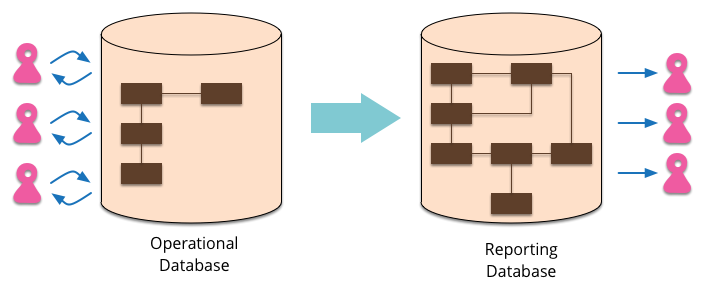

# 报表数据库（ReportingDatabase）

大多数企业级应用程序用一个数据库做数据持久化存储。数据库支持更新应用程序状态操作，也支持各种供报表使用和分析。然而，报表和常规操作的需要是不同的 — —来自方法的不同和数据访问模式的不同。当发生这种情况的时候，一个明智的选择就是独立分开报表需求到报表数据库中，它只需要花费拷贝数据的基本操作，但是用不同的方法展示它。

报表数据库它是一个完整的，不同于一般操作的数据库。它可能是一个完全不同的数据库产品，使用[多语言持久化](https://martinfowler.com/bliki/PolyglotPersistence.html)。它应该被设计用在报表需求上。

一个报表数据库有如下优势：

- 报表数据库结构是能够订制设计的，这样能够更容易的导出报表。
- 你不能标准化一个报表数据库，因为它是只读的。为了使查询和报表更加简单，你能根据需要自由的复制数据
- 开发团队能重构操作数据库，无需改变报表数据库
- 重复执行查询报表数据库，不会添加操作数据库的负载。
- 你能在数据库中存储派生的数据，使用派生数据让它更容易报表，而不用在单独引入一组逻辑
- 对于不同报表需求你可能还会有多报表数据库

在报表数据库的缺点就是数据必须要保持最新的。简单的例子就是当你做一些操作，比如用一整夜的时间把数据填充进报表数据库。这经常能很好的工作，因为很多报表需求就是要昨天的数据。如果你需要更多时间的数据，你可以使用消息系统，将操作数据库的所有数据转到报表数据库。这就更加复杂了，但是这些数据还能够保持最新的。绝大多数报表都是使用稍微陈旧的数据，并且你能生成特殊报表例子，对于你真正需要秒级的数据。

另一种方法就是使用视图。这个其实就是封装了业务数据，允许你正规化。为了将操作负载和报表负载分开，为了更好的读取，你需要复制视图到其他节点。这个主要的限制就是派生数据的灵活性不如你从内存编程环境。

当你的领域逻辑或者是其他内存代码中有大量逻辑时，报表数据库很好的适合。领域逻辑能使用在处理操作数据的更新上，也能计算派生数据，丰富报表数据库。

https://martinfowler.com/bliki/ReportingDatabase.html