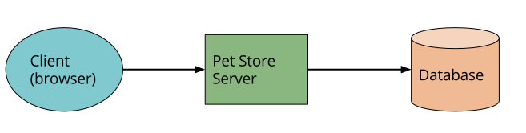
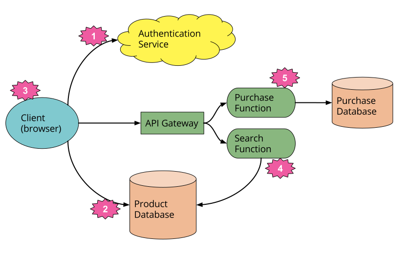
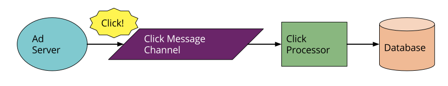
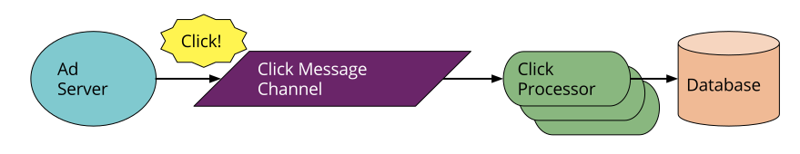

# 无服务架构（Serverless Architectures）

无服务器架构是一种应用程序设计，它整合了第三方的 “后端即服务（backend as a service）” (BaaS)服务，以及/或包含在“ 功能即服务（functional as a service）” (FaaS) 平台上托管的临时容器中运行的自定义代码。通过使用这些思想以及单页应用程序等相关思想，这样的体系结构消除了对传统的始终在线服务器组件的大量需求。无服务器架构可能受益于显著降低的操作开销、复杂度和工程交付时间，而代价是增加对供应商依赖和相对不成熟的支持服务的依赖。

**无服务计算（Serverless Computing）**，或者更简单的 Serverless，在软件架构世界中是一个非常火热的话题。云供应商三巨头 —— Amazon、Google 以及 Microsoft 都很在 Serverless 上投资了大量资源，我们看到的许多致力于此的大量书籍以及开源项目，会议以及软件供应商。但是什么是 Serverless？为什么考虑 Serverless 是值得的？这篇文章就是为了解决这些问题的。

让我们从什么是无服务架构开始，并列出其中的优点和缺点。

# 什么是 Serverless？

就像软件领域的许多趋势一样，没有人清楚地知道什么是无服务器。首先，它包含两个不同但重叠的领域：

1. Serverless 最初用于描述显著或完全合并第三方云托管应用程序和服务的应用程序，以管理服务器端逻辑和状态。这些典型的 “富客户端（rich client）” 应用程序 —— 想想单页面应用程序或移动应用程序 —— 使用云访问数据库（如 Parse、Firebase）的庞大生态系统，身份验证服务（如 Auth0、AWS Cognito），等等。这些类型的服务之前都被描述为 “后端即服务”，我在后面的内容将此简述为 “BaaS”。
2. Serverless 也可以是指服务器端逻辑仍然由应用程序开发人员编写的应用程序，但是，与传统架构不同的是，它运行在无状态计算的容器中，它负责事件触发的、短暂的(可能只持续一次调用)、完全由第三方管理的。称之为 “函数即服务（FaaS）”。（注意：[原始资源](https://twitter.com/marak/status/736357543598002176)将它命名的，但是现在无法访问了）[AWS Lambda](https://aws.amazon.com/lambda/) 是其中最受欢迎的 FaaS 平台实现，但是也有很多其它的实现。

在这篇文章里，我们主要集中讨论 FaaS。这不仅是因为 Serverless 领域的更新和大量的炒作，而且它与我们通常认为的技术架构有显著的不同。

BaaS 和 Faas 在它们的操作属性中有一些是相关的（如无资源管理）并且经常一起使用。最大的云供应商全部都有 “无服务组合（Serverless portfolios）”，包含 BaaS 和 Faas 的一些产品—— 例如，[Amazon Serverless](https://aws.amazon.com/serverless/) 产品页。Google 的 BaaS 数据库 Firebase 数据库就已经通过 [Google 云函数 Firebase](https://firebase.google.com/docs/functions/) 显式支持了 FaaS。

小公司在这两个领域也有类似的联系。[Auth0](https://auth0.com/) 从一个实现了多用户管理的 BaaS 产品开始，随后创建了配套的 FaaS 服务 [Webtask](https://webtask.io/)。该公司通过扩展将这一想法更进一步，使其他 SaaS 和 BaaS 公司能够轻松地向现有产品添加 FaaS 功能，从而创建统一的无服务器产品。

## 一系列的案例

### UI 驱动程序

让我们回头看具有服务器端逻辑的传统三层面向客户端的系统。一个典型的例子就是电商 app。

传统架构图看起来就像下面展示：

使用这种体系结构，客户端可能相对不智能，系统中的许多逻辑 —— 身份验证、页面导航、搜索和事务 —— 都是由服务器应用程序实现的。

如果使用 Serverless 架构的话，那么就会像下图所示：

这是一个非常简化的视图，但即使在这里我们也看到了一些显著的变化：

1. 我们在应用程序中删除了身份验证以及用第三方 BaaS 服务替换（如 Auth0）

2. 使用其它的 BaaS 的案例，我们允许客户端直接访问数据库的一个子集（用于产品列表），该数据库本身完全由第三方托管（例如谷歌 Firebase）。对于以这种方式访问数据库的客户机，我们可能有不同的安全配置文件，而对于访问数据库的服务器资源，我们可能有不同的安全配置文件。

3. 前面两点暗示了非常重要的第三点：一些在宠物商店服务（Pet Store Server）中的逻辑现在在客户端中，例如，跟踪用户会话，理解应用程序的 UX 结构，从数据库读取数据并将其转换成可用的视图，等等。客户端正在朝着成为单页应用程序的方向发展。

4. 我们可能希望在服务器中保留一些与 UX 相关的功能，例如，如果它是计算密集型的或需要访问大量的数据。在我们的宠物店例子中就是 “搜索” 功能。与原始体系结构中始终运行的服务器不同，我们可以实现一个 FaaS 函数，该函数通过 API 网关（稍后介绍）响应 HTTP 请求。客户端和服务器的 “搜索” 功能都从同一个数据库中读取产品数据。

   如果我们选择使用 AWS Lambda 作为我们的 FaaS 平台，我们可以将从原来的宠物商店服务器的搜索代码移植到新的宠物商店上，而不需要完全重写，因为 Lambda  支持 Java 和 javascript —— 我们最初使用的实现语言。

5. 最后，我们可以将 “Purchase” 功能替换为另一个独立的 FaaS 功能，出于安全考虑，选择将其保留在服务器端，而不是在客户端中重新实现它。它的前端也是一个 API 网关。**在使用 FaaS 时，将不同的逻辑需求分解为单独部署的组件是一种非常常见的方法。**

回过头来看，这个例子展示了关于无服务架构的另一个非常重要的观点。在原始版本中，所有流、控制和安全性都由中央服务器应用程序管理（中心化管理）。在无服务版本中，没有这些问题的中心仲裁者。**是去中心化的**。相反，我们看到编排比编排（**choreography over orchestration** ）更受欢迎，每个组件都扮演更具有体系结构意识的角色 —— 这一想法在微服务方法中也很常见。

使用这种方式有很多好处。Sam Newman 在他的[构建微服务](https://samnewman.io/books/building_microservices/)的笔记中记载道，以这种方式构建系统会 “更加灵活，更加适应变化”，无论是作为整体还是通过组件的独立更新；有更好的明确的分工；还有一些令人着迷的成本效益，Gojko Adzic 在这次精彩的[演讲](https://gojko.net/2017/10/05/serverless-design-gotocph.html)中讨论了这一点。

### 消息驱动程序、

另一个例子是后端数据处理服务。

现在你正在写一个用户中心应用程序，它需要以秒级快速响应请求，它还需要为随后的处理捕捉所有的用户所发生的不同状态。在说一个在线广告系统：当用户点击一个广告时，要快速重定向到广告目标页。与此同时，你还要手机点击事件发生的事实以便向广告商收取费用。（这个例子并不是假设的——我在 Intent Media 的前团队正是有这种需求，他们以 Serverless 的方式实现了这种需求。）

你可以看到传统架构是下面图展示的。”广告服务器“ 同步响应到用户并发送一个 ”点击事件“ 到通信管道中去。然后该消息由更新数据库的 “点击处理程序” 异步处理，例如，以减少广告客户的预算。

Severless 模式就像下面所示：

能看到不同么？不同的是在这个架构图中要比第一个例子的变化要小得多 —— 这也是为什么 Serverless 技术在异步消息处理如此受欢迎的用例。我们用 FaaS 取代了长期的消息消费者程序。这个函数运行在供应商提供的事件驱动上下文内。注意，云平台供应商都会提供消息 broker 以及 FaaS 环境 —— 两个系统紧密相连。

FaaS 环境也能并发的处理多个消息，通过复制多个 FaaS 实例。根据我们编写原始流程的方式，这可能是我们需要考虑的新概念。

## 分解 ”函数即服务（Function as a Service）“

之前已经提到 FaaS，现在是时候解释它真正的含义了。首先我们来看一下 Amazon FaaS 产品的[公开描述](https://aws.amazon.com/lambda/)：Lambda。我已经加了一些标记，后面我会拓展。

> AWS Lambda 能允许您在不配置或管理服务器的情况下运行代码。1) 使用 Lamda 您可以为几乎任何类型的应用程序或后端服务运行代码。2）所有这些都是零管理。只要上传代码，Lambda 就会处理运行所需的一切。3）以高可用的方式拓展代码。你可以设置你的代码自动在其它 AWS 服务上触发。4）或者可以在任何网站和移动 app 直接调用。

1. 从根本上讲，FaaS 是不需要管理自己的服务器系统或长期运行的服务器程序运行后台代码。与容器和 PaaS（平台即服务）等现代体系结构趋势相比，第二个子句 —— 长期存在的服务器应用程序 —— 是一个关键的区别。

   如果我们回到点击处理程序的例子，FaaS 替代了点击处理程序服务（可能是物理机，上面有一个应用程序）不需要特定的服务器，也不需要一直需要运行的应用程序。

2. FaaS 产品不需要对特定的框架或库进行编码。FaaS 函数是语言和环境方面的常规应用程序。例如 AWS Lambda 函数可以在Javascript、Python、Go、任何JVM 语言（Java、Clojure、Scala 等）或任何 . net 语言中实现“一级类（first class）”。然而，Lambda 函数还可以执行与其部署构件绑定的另一个进程，因此您可以实际使用任何可以编译成 Unix 进程的语言（请参阅本文后面的Apex）。

   但是 FaaS 功能有重要的架构限制，特别是在状态和执行持续时间方面。我们很快就会讲到。

   让我们再次回到我们的点击处理示例。在转移到 FaaS 时，唯一需要更改的代码是 “主方法” (启动)代码，因为它被删除了，而且很可能是顶级消息处理程序（“消息侦听器接口”实现）的特定代码，但这可能只是方法签名的更改。其余的代码（例如，写入数据库的代码）在 FaaS 中没有什么不同。

3. 部署与传统系统非常不同，因为我们不需要自己运行承载应用程序的服务器。在 FaaS 环境中，我们将函数的代码上传到 FaaS 供应商，而提供者则负责提供资源、实例化 vm、管理进程等所有必要的工作。

4. 水平扩展是完全自动的、弹性的，并由提供者管理。如果您的系统需要并行处理 100 个请求，则供应商将处理该请求，而不需要您进行任何额外的配置。执行函数的 ”计算容器” 是短暂的，FaaS 供应商提供者完全由运行时需求驱动来创建和销毁它们。最重要的是，使用 FaaS，供应商处理所有底层资源的供应和分配 — 用户根本不需要集群或虚拟机管理。

   让我们回到点击处理器那个案例。假设我们今天是个好日子，客户的点击量是平常的十倍。对于传统的体系结构，我们的点击处理应用程序能够处理这个问题吗？例如，我们是否开发了能够同时处理多条消息的应用程序？如果我们这样做了，一个正在运行的应用程序实例是否足以处理高负载？如果我们能够运行多个实例，那么拓展是自动的，还是需要手动重新配置？使用 FaaS 方法，所有这些问题都已经得到了回答 —— 您需要提前以假设水平伸缩的并行性编写该函数，但从这一点开始，FaaS 提供者会自动处理所有上面说的这些需求。

5. FaaS 中的函数通常由提供者定义的事件类型触发。对于 Amazon AWS，这样的触发包括 S3（文件/对象）更新、时间（计划任务）和添加到消息总线的消息（例如，[Kinesis](https://aws.amazon.com/kinesis/)）。

6. 大多数提供者还允许作为对 HTTP 请求的响应触发函数。在 AWS 中，通常通过使用 API 网关来实现这一点。在我们的 Pet Store 示例中，我们使用了一个API 网关来实现 “搜索” 和 “购买” 功能。还可以通过平台提供的 API 直接调用函数，可以从外部调用，也可以从相同的云环境中调用，但这种用法相对不常见。

### 状态

FaaS 函数在处理本地（机器/实例绑定）状态时有很大的限制，例如存储在内存变量中的数据，或写入本地磁盘的数据。您的确有这样的存储需求，但您不能保证这种状态在多个调用之间持久化，而且更强烈地说，您不应该假设一个函数调用的状态对另一个相同的调用是可用的。因此 FaaS 函数通常被描述为**无状态**的，但是更准确地说，**需要持久的 FaaS 函数的任何状态都需要在 FaaS 函数实例之外被具体化。**

对于无状态的 FaaS 函数，例如对于那些仅提供输入到输出的函数转换的应用程序，这是无关紧要的。但对于其他人来说，这可能会对应用程序架构产生很大的影响，尽管不是唯一的——"[十二因素应用程序](http://12factor.net/)"的概念有完全相同的限制。这种面向状态的函数通常会利用数据库、跨应用程序缓存（如 Redis）或网络文件/对象存储（如 S3）来跨请求存储状态，或提供处理请求所需的进一步输入。

### 执行期间

FaaS 函数在它每次允许调用的时间是受限的。目前 AWS Lambda 函数响应一个事件的时间在超时时间到达终止之前最多为 5 分钟。Microsoft Azure 和 Google Cloud Functions 都有相同的限制。

这意味着如果不进行重新架构，某些长期存在的这类任务就不适合 FaaS 功能 —— 您可能需要创建几个不同的协同 FaaS 功能，这在以前传统环境中你可能有一个长时间任务同时执行协作和执行。

### 启动延迟和 ”冷启动“

FaaS 平台在每个事件之前初始化一个函数的实例需要一些时间。即使对于一个特定的函数，启动延迟也可能变化很大，这取决于许多因素，可能从几毫秒到几秒不等。这听起来很糟，但让我们更具体一点，以 AWS Lambda 为例。Lambda 函数的初始化可以是“热启动” —— 重用 Lambda 函数的一个实例以及来自前一个事件的宿主容器。或者是“冷启动” —— 创建一个新的容器实例，启动函数宿主进程，等等。

不出所料，在考虑启动延迟时，最让人关心的就是这些冷启动。

冷启动取决于很多因素：你使用的语言，你使用的那些组件，所写的代码以及 Lamdba 功能自己的配置环境，是否需要连接 [VPC](https://aws.amazon.com/vpc/) 资源等等。这些方面很多都是受开发者控制的，所以通常可以减少作为冷启动的一部分而导致的启动延迟。

与冷启动持续时间一样可变的是冷启动频率。例如，如果一个函数每秒处理 10 个事件，每个事件处理时间为 50 毫秒，那么您可能只会看到 Lambda 每 10 万到20 万个事件发生一次冷启动。另一方面，如果您每小时处理一次事件，您可能会看到每个事件的冷启动，因为 Amazon 会在几分钟后停止不活动的 Lambda 实例。了解这一点将有助于您理解冷启动是否会影响聚合，以及您是否希望对函数实例执行“保持活跃状态”以避免它们被忽略。

冷启动有什么影响？这取决于应用程序的形式和流量形状。我以前在 Intent Media 的团队有一个异步消息处理 Lambda 应用，用 Java 实现（通常是启动时间最慢的语言），每天处理数亿条消息，他们不担心这个组件的启动延迟。也就是说，如果您正在编写一个低延迟的交易应用程序，那么此时您可能不希望使用云托管的FaaS 系统，无论您使用哪种语言来实现。

无论您是否认为您的应用程序可能存在这样的问题，您都应该使用类似于产品的负载来测试性能。如果您的用例现在不能工作，您可能想在几个月后再试一次，因为这是 FaaS 供应商持续改进的主要领域。

### API 网关

我们前面提到的无服务的一个方面是“API 网关“。API 网关是在配置中定义路由和终结点的 HTTP 服务器，每个路由都与处理该路由的资源相关联。在无服务体系结构中，此类处理程序通常是 FaaS 函数。

当 API 网关接收到请求时，它会找到与请求匹配的路由配置，如果是 FaaS 支持的路由，它会调用相关 FaaS 函数来表示原始请求。通常，API 网关将允许从 HTTP 请求参数映射到 FaaS 函数的更简洁的输入，或者将允许通过整个 HTTP 请求（通常作为一个 JSON 对象）。FaaS 函数将执行其逻辑并将结果返回给 API网关，该网关将该结果转换为 HTTP 响应，并将该响应传递回原始调用者。

Amazon Web Services 有自己的API网关(名称稍有混淆的“API 网关”)，其他供应商也提供类似的功能。Amazon 的 API Gateway 本身就是一个 BaaS（是的，是BaaS！）服务，因为它是一个您可以配置的外部服务，但不需要您自己运行或提供。

除了纯粹的路由请求之外，**API 网关还可以执行身份验证、输入验证、响应代码映射等等**。(如果你在思考这是否真的是个好主意的时候，你蜘蛛般的感觉开始发麻，那就先别想了!我们稍后再进一步考虑。)

具有 FaaS 功能的 API 网关的一个用例是以无服务的方式创建基于 http 的微服务，这些微服务具有来自 FaaS 功能的所有扩展、管理和其他好处。

当我第一次写这篇文章时，至少 Amazon API Gateway 的工具还非常不成熟。自那以后，这些工具有了显著的改进。像 AWS API Gateway 这样的组件还不是“主流”，但希望它们不像以前那么痛苦，而且只会继续改进。

### 工具

### 开源

# 什么不是 Serverless

## 比较 PaaS

## 比较容器

## NoOps

## 存储过程即服务

原文连接：https://martinfowler.com/articles/serverless.html