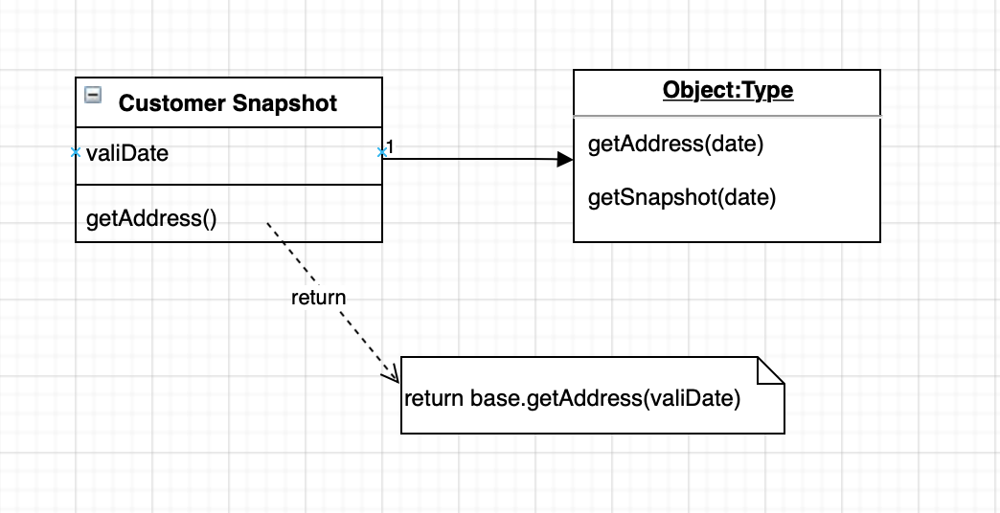

在某个时刻一个对象的视图

|       Customer       |
| :------------------: |
|   getAddress(Date)   |
| getPhoneNumber(Date) |
|  getSnapshot(Date)   |

|  Customer Snapshot   |
| :------------------: |
|    validDate 字段    |
|   getAddress(Date)   |
| getPhoneNumber(Date) |

> 注意，这部分内容是 Martin Fowler 最初的一个草图。仅供参考

# 如何工作

快照（shapshot）只是一个关于这个时态对象（temporal object）的一个简单的视图模型。如果整个时态对象在 getAddress(date) 表单中有一个访问器，那么快照就会有一个访问器 getAddress(date)。快照的所有问题都是临时的（non-temporay）。

当你创建一个快照时，你必须提供一个合适的日期。如果存在双时间性（Bi-temporality），那么你则需要实际日期和记录日期。

快照是一个试图，它能帮助你访问，在大多数例子中，它们应该是不变的。这里可能会有一个例外（an exception to），就是当你更新快照并使用它在某个日期中返回真实对象。这不是我经常要做的事，并且通常只有在一个与时间无关的外部系统时才会这样做。

# 何时使用它

时间性（temporality）给设计增加了不少的复杂性，以及有时候你不想在这方面消耗太多精力。也许你会在上下文中在某些特定的时间点做一些特殊的处理，并且你也不想时刻牢记在系统的某个时刻要做一些特殊的处理。或者你会链接到与时间性无关的系统。然后会在这个系统中使用快照。

# 例子：实现快照（Java）

创建一个快照非常简单。关键点就是使用委托，它会让快照的行为像一个底层对象适配器。



```java
public class Customer {
	private TemporalCollection addresses = new SingleTemporalCollection();
	public Address getAddress(MfDate date) {
		return (Address) addresses.get(date);
	}
	public Address getAddress() {
    return getAddress(MfDate.today());
  }
  public void putAddress(MfDate date, Address value) {
    addresses.put(date, value);
  }
}

public class CustomerSnapshot {
	private Customer base;
  private MfDate validDate;
  public CustomerSnapshot (Customer base, MfDate validDate) {
    this.base = base;
    this.validDate = validDate;
  }
  public Address getAddress() {
    return base.getAddress(validDate);
  }
}
```

要注意，在这个例子中，你是通过 `CustomerSnapshot` 构造函数提供一个 `customer` 和一个实际的日期来创建快照的。你也可以通过调用 Customer 的 `createSnapshot(Date)` 方法。使用构造函数会使你避免一个从 customer 到快照的依赖。

# 延伸阅读

其实快照模式就是备忘录模式。**主要用途就是需要维护或记录属性历史的类，或者是保存的属性是这个对象众多属性中一小部分时，可以用到备忘录（快照）将一小部分模式还原到原始对象中。**

# C# 代码实现

详见 https://github.com/MarsonShine/Books/tree/master/DesignPattern/DesignPatternCore

