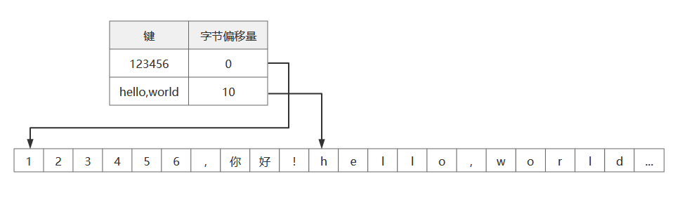
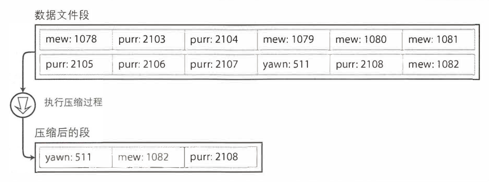
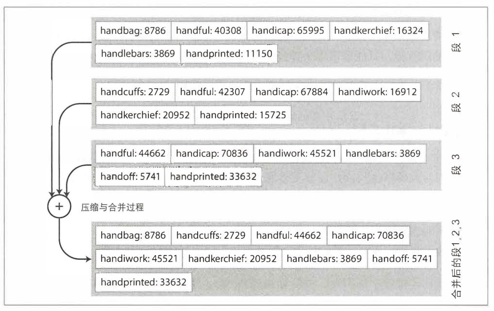
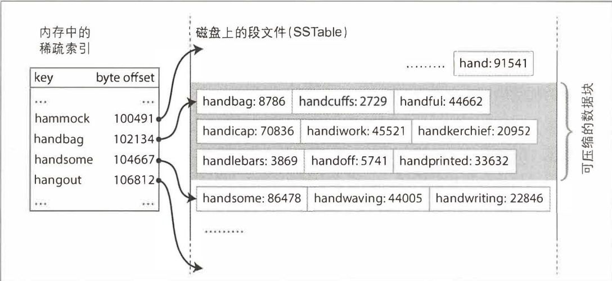

# 时序数据库（Time Series Database）

所谓时序数据库就是所有数据都与时间这个变量密切相关。随着时间的变化，数据都会发生变化，且以时间为索引的数据库。

时序数据具有一下特点：

- 数据写多读少
- 数据几乎不会删除，绝大多数都是追加状态
- 数据不变量

这样的数据基本上会以时间这个维度做索引，所以会进行特殊的很激进的存储、访问和保留策略（Retention Policies）。

时序数据库是以**日志结构的合并树（LSM-Tree）**来代替传统的关系型数据库中的 B+ Tree 作为存储结构的。而 LSM-Tree 就非常适合写多读少，追加且几乎不删改数据的场景。

时序数据库设置了非常激进的数据保留策略，**它会根据过期时间（TTL）自动删除过期的数据**，这在关系型数据库来说是不可能的事情。

时序数据库对数据进行了**再采样（Resampling）**以节省空间，比如最近几天的数据可能需要精确到秒，而查询一个月前的数据只需要精确到天，查询一年前的数据只要精确到周就足够了。这样将数据重采样时就会节省大量的存储空间。

> 关于**轮替型数据库（Round Robin Database，RRD）**，这是一种时序数据库更加极端的形式，它以环形缓冲的思路实现的，只能存储固定数量的最新数据，超期或超过容量的数据就会轮替覆盖，因此它也有固定的数据库容量，但是能无限的接收数据输入。

在实际应用产品方面，[DB-Engines](https://db-engines.com/en/ranking/time+series+dbms) 数据显示 Prometheus 内置的 以及 [InfluxDB](https://en.wikipedia.org/wiki/InfluxDB) 都是时序数据库的实现，并且实用度在前三。

## 日志结构的合并树（LSM-Tree）

LSM Tree（Log-Structured Merge-Tree）是一种专门针对写操作优化的数据存储结构，被广泛用于 [BigTable](https://cloud.google.com/bigtable)、[LevelDB](https://github.com/google/leveldb) 和 [RocksDB](https://github.com/facebook/rocksdb) 等场景。

它的存储结构分为两个部分：内存存储结构（MemTable）和磁盘文件（SSTable）。
它的基本原理与过程如下：

1. 数据分为多层，通常包括一个内存存储结构(MemTable)和多个磁盘文件(SSTable)。写入操作先写入 MemTable。
2. 当 MemTable 占用内存超过一定阈值后，其中的数据将持久化存储到磁盘上的 SSTable 文件中，并在内存重建一个新的空 MemTable 接收新的写入。
3. 由于写入操作只是简单的追加到 MemTable，因此写入很快,这是 LSM Tree 的主要优化点。
4. 为了查询效率，LSM Tree会在固定时间间隔对磁盘上生成的多个 SSTable 文件进行合并，生成一个新的大的 SSTable 文件,同时删除老的 SSTable 文件。每层文件合并时基于文件内数据有序这一特点。
5. 查询时,需要先在 MemTable 查找,如果没找到,再依次在各层 SSTable 文件中由小到大查找。

在讲 LSM-Tree 之前，我们得先提到哈希索引。key-value 类型并不是唯一可以索引的数据， 但它随处可见， 而且是其他更复杂索引的基础构造模块。

以此为基础，我们假设数据存储全部采用追加形式的文件组成，那么根据哈希索引策略：保存内存中的 key-value 的 hash map，把每个键一一映射到数据文件中特定字节偏移量，这样就能找到对应数据的位置了。如下图所示：

当查找某个值时，使用 hash map 来找到文件中的偏移量，即存储位置，最后读取内容。这种方式很简单，但是具有很高性能的读和写，只要所有的 key 可以放入内存（因为 hash map）需要保存到内存中。 而 value 数据量则可以超过内存大小， 只需一次磁盘寻址， 就可以将value从磁盘加载到内存。 如果那部分数据文件已经在文件系统的缓存中， 则读取根本不需要任何的磁盘I/0。

这非常适合记录每个键的值频繁修改的场景。比如 url 的访问量，key 是 url，value 是访问次数。当记录方式追加文件方式。这种场景一般都是有大量的写操作，但是没有太多不同的 key，即每个 key 都有大量的写操作，但将所有的 key 保存在内存中是可行的。

就像前面说的，通常是通过追加文件的方式存储的，那么追加到一个文件就势必用尽磁盘空间的。一个好的解决方案就是用分段（segment）。当文件大小达到一定的阈值就写入新的文件。这个时候就会做一个压缩的操作，即将重复的键丢弃，只保留最新的值。压缩过程如下

​								（图来源于《DDID》）

因为数据再写入文件后是不会再修改，所以合并的段会被写入到另一个的文件。这些合并的过程是可以在后台线程进行的。由于是新的文件，所以这是不影响旧的可用段的读取和写请求。当合并结束之后就可以将那些旧的段文件删除。

> 真正具有工业级的实现远远不止上面的实现，主要实现还包括：
>
> 1. 文件格式：最佳文件格式是二进制，如以字节长度来记录字符串的长度，之后跟上原字符串
> 2. 删除记录：采用标记删除法
> 3. 崩溃恢复：如果在合并过程或是写入/读取过程服务器发生崩溃，那么在内存中的 hash map 就会丢失，那么就要支持恢复，如可以从头到尾读取整个文件，然后记录每个 key 的最新偏移量来恢复 hash map。这样当文件很大时恢复过程会很慢，所以可以使用快照的方式，将结果直接缓存到磁盘上，系统重启时直接读取磁盘对应的内容即可。
> 4. 部分写入的记录：数据库随时可能崩溃，包括将记录追加到日志的过程中。可以增加校验位来判断记录是否重复或者损坏，可以直接丢弃不记录。
> 5. 并发控制：由于写入必须要以严格的先后顺序追加到日志中，通常解决方案是只用一个写线程。

有了这些知识我们还要了解 SSTables

前面我们再追加记录时，我们是要求要有严格的先后顺序。如果我们现在要求 key-value 对的顺序按键的顺序排序。该如何做呢？

这种格式其实就被称为排序字符串表，简称 SSTables。它要求每个键在每个合并的段文件中只能出现一次（压缩过程已经确保了）。这样与原来的哈希索引有什么优势呢？

1. 合并更加高效，我们可以用合并排序算法在合并过程中比较每个键的顺序输出到新的文件中。
2. 在文件中查找特定的键，必须要在内容中保存所有键的索引。因为所有的键的有序的，我们可以根据已知键值范围，来确定目标键的区域再顺序查找即可。如下面我要查找 `handiwork`，我们目前只知道 `handbag` 和 `handsome` 的偏移量，由于有序我们就知道 handiwork 一定在 handbag 和 handsome 之间。我们找到 handbag 然后按顺序查找即可。

LSM-Tree 是 SSTable 演化后的产物，是**基于合并和压缩排序文件原理的存储引擎通常都被称为 LSM 存储引擎**。

Lucense 和 Solr 等全文索引系统所使用的搜索引擎，就是采用了类似的方法来保存词典。虽然实际 Lucense 要比 key-value 复杂很多、但他基于类似的想法：给定搜索查询中的某个单词， 找到提及该单词的所有文档（网页 、 产品描述等）。 它主要采用 key-value 结构实现， 其中键是单词（词条）， 值是所有包含该单词的文档 ID 的列表（倒排表）。 在 Lucene 中， 从词条到 posting list 的映射关系保存在类 SSTable 的排序文件中， 这些文件可以根据需要在后台合并。

# 参考资料
- https://time.geekbang.org/column/article/348551
- 《数据密集型应用系统设计》
