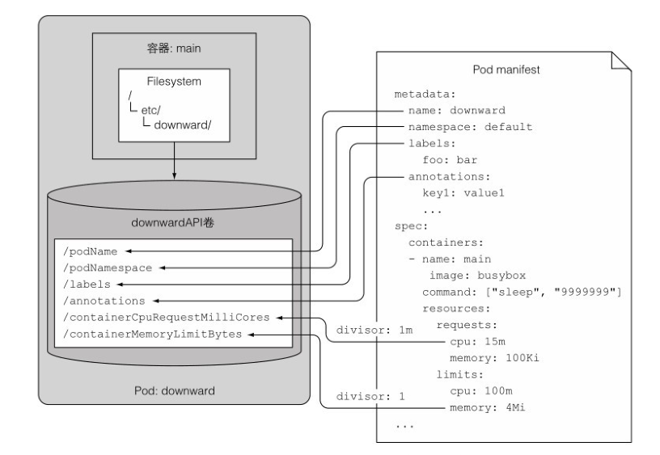
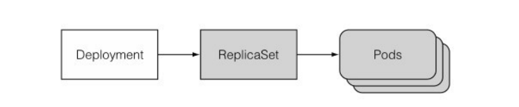
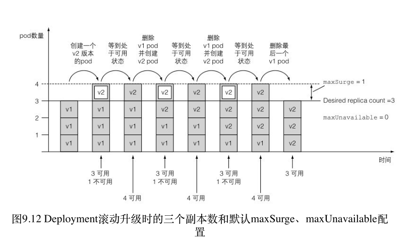
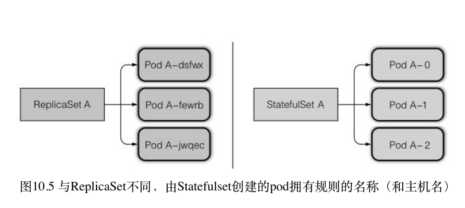

# K8S 相关资料

官网社区：https://kubernetes.io/docs/home/

中文社区：http://docs.kubernetes.org.cn

书籍：

1. [Kubernetes 指南](https://kubernetes.feisky.xyz/#ben-shu-ban-ben-geng-xin-ji-lu)（次数更新涉及到的版本为 v1.11 版本，很陈旧了）
2. 《Kubernetes in Action》

# Kubernet 资源三个结构

## metadata

这主要包括**名称、命名空间、标签和关于该容器的其他信息**

## spec

主要包含 pod 的内容实际说明，例如 pod 的容器、卷以及其他数据

## status

包含当前运行中的 pod 的状态信息，例如 pod 所处的条件、每个容器的描述和状态，以及内部 IP 和其他基本信息

# 初学遇到的问题

##  创建 pod 遇到的问题

在启动一个 pod 时，直接运行以下命令：

```bash
kubectl run basicdata --image=basicdata:latest --port=9000
```

这段命令 k8s 会驱使 doker 去镜像仓库拉取对应的 `basicdata:latest` 的镜像，但是这个镜像由于本地的，还没有 push 到远程仓库中。所以当执行查询 pod 状态信息时，会出现以下错误状态：

```bash
kubectl get pods # 查询所有 pod 状态
```

结果如下：

```bash
NAME        READY   STATUS    RESTARTS   AGE
basicdata   1/1     ImagePullBackOff   0          23m
```

要想知道 pods 的详细信息，则可以执行以下命令：

```bash
kubectl get pods -o wide
```

这是拉取镜像时出现未知错误，要想查看具体哪一步出了问题，可以执行以下命令：

```bash
kubectl describe pod
```

返回的就是具体哪一步出现了错误。

**解决方案**：

这是因为 k8s 默认的镜像拉取策略时远程为主的。所以我们可以修改其配置项 `imagePullPolicy`，而 windows 可以直接在创建 pod 时指定拉取策略 `--image-pull-policy Never`，或者是 `--image-pull-policy IfNotPresent`：

```
kubectl run basicdata --image=basicdata:latest --port=9000 --image-pull-policy Never
```

这个时候 pod 是运行状态了，那么此时我们还不能通过 localhost:port 访问，因为 k8s 还没有暴露对外访问的端口。可以通过 service 和 `kubectl expose` 实现，具体详见：https://kubernetes.io/docs/tasks/administer-cluster/access-cluster-services/

具体命令如下：

```bash
 kubectl expose rc basicdata --type=LoadBalancer --name basicdata-tcp
```

> 注意，上述命令只能在建立 replicationcontroller 之后才有效果。

## 直接访问 pod bash

```bash
 kubectl exec -it basicdata-2fzx8 -- bash
```

## 如何横向拓展 pod 节点

我们可以通过创建一个 basicdata 的 replicationcontroller。首先我们定义一个 replicationcontroller.yml 文件

```yaml
apiVersion: v1
kind: ReplicationController
metadata:
  name: basicdata
spec:
  replicas: 3
  selector:
    app: basicdata
  template:
    metadata:
      name: basicdata
      labels:
        app: basicdata
    spec:
      containers:
      - name: basicdata
        image: basicdata:latest
        imagePullPolicy: IfNotPresent
        ports:
        - containerPort: 9000
```

再执行以下命令：

```bash
kubectl apply -f .\replicationcontroller.yml
```

## 关于 kubernet dashboard

kubectl 默认启动 pod 是不带 dashboard 的，所以我们要新起一个 dashboard，具体措施详见 https://github.com/kubernetes/dashboard/blob/master/docs/user/access-control/creating-sample-user.md

首先准备两个用户权限文件：

```yaml
# admin-user.yml
apiVersion: v1
kind: ServiceAccount
metadata:
  name: admin-user
  namespace: kubernetes-dashboard
  
# cluster-role-binding.yml
apiVersion: rbac.authorization.k8s.io/v1
kind: ClusterRoleBinding
metadata:
  name: admin-user
roleRef:
  apiGroup: rbac.authorization.k8s.io
  kind: ClusterRole
  name: cluster-admin
subjects:
- kind: ServiceAccount
  name: admin-user
  namespace: kubernetes-dashboard
```

具体步骤如下：

```yaml
# 1
kubectl apply -f https://raw.githubusercontent.com/kubernetes/dashboard/v2.2.0/aio/deploy/recommended.yaml
# 2
kubectl proxy
# 3
kubectl apply -f ./admin-user.yml
# 4
kubectl apply -f ./cluster-role-binding.yml
# 5
kubectl -n kubernetes-dashboard get secret $(kubectl -n kubernetes-dashboard get sa/admin-user -o jsonpath="{.secrets[0].name}") -o go-template="{{.data.token | base64decode}}"
# 6 拷贝 #5 输出的 token 填入 dashboard 的 token 输入栏即可
# 7 如果要删除
kubectl -n kubernetes-dashboard delete serviceaccount admin-user
kubectl -n kubernetes-dashboard delete clusterrolebinding admin-user
```

## 如何查看已经创建的 pod 的 yaml 文件内容

```bash
kubectl get po basicdata-8znt9 -o yaml
```

## 如何给大量的 pod 分组

可以通过设置标签 `labels`

```yaml
apiVersion: v1
kind: Pod
metadata:
  name: basicdata-label
  labels:	# 设置标签
    creation_method: manual
    env: dev
spec:
  containers:
  - image: basicdata:latest # 创建容器所用的镜像
    imagePullPolicy: IfNotPresent # 本地拉取，如果本地没有则拉取远程镜像仓库
    name: basicdata # 容器名称
    ports:
    - containerPort: 9000 # pod 开启应用监听的端口
      protocol: TCP
```

查询带有标签的 pods 信息：

```bash
kubectl get pods --show-labels
# 查询指定标签,显示成列
kubectl get po -L creation_method,env
# 只查询带有指定标签的 pod
kubectl get po -l creation_method,env
kubectl get po -l '!env'  # 查询非 env 标签的 pod
```

修改已有的 pod 的标签：

```bash
kubectl label po basicdata env=staging --overwrite
```

## 除了标签还有命名空间可以分组

创建命名空间

```
kubectl create -f .\custom-namespace.yml
```

```yml
apiVersion: v1
kind: Namespace
metadata: 
  name: custom-namespace
```

也可以直接通过命令

```bash
kubectl create namespace custom-namespace
# 也可以直接在创建pod时就添加命名空间
kubectl create -f basicdata-manual.yml -n custom-namespace
```

## kubectl 命令重复很长的命令，可以设置别名

如 `alias kcd= 'kubectl config set-context $(kubectl config currentcontext) --namespace'`，然后可以直接这样使用：

`kcd some-namespace` 快捷的进行命名空间切换了

> 注意：尽管命名空间将对象分隔到不同的组，只允许你对属于特定命名空间的对象进⾏操作，但实际上命名空间之间并不提供对正在运⾏的对象的任何隔离。

## 删除 pod

```bash
kubectl delete po podName1,podName2 # 删除指定 pod
```

按标签批量删除 pod

```bash
kubectl delete po -l env=dev # 删除环境变量位 dev 的 pod
```

通过命名空间删除 pod

```bash
kubectl delete ns custom-namespace	# 删除 custom-namespace 命名空间的所有内容
```

删除所有的 pod

```bash
kebectl delete pod --all
```

> 通过 rc 控制的 pod 经过上面的删除操作是无法删除所有的 pod 的，因为 rc 会始终创建 pod。所以我们要想完全的删除这些资源，就还得删除 rc。也可以直接执行 `kubectl delete all --all`

## 设置 Pod 健康检查

```yml
apiVersion: v1
kind: Pod
metadata:
  containers:
  - image: basicdata:latest # 创建容器所用的镜像
    imagePullPolicy: IfNotPresent # 本地拉取，如果本地没有则拉取远程镜像仓库
    name: basicdata-unhealthy # 容器名称
    livenessProbe: # 存活探针
      httpGet:  # http get 类型的探针
        path: /
        port: 9000


# 存活探针默认的设置是定期调用指定路径，如果超过 5 次 http 状态码不是 20x/3xx 就会重启 pod
```

启动之后，可以用命令 `kubectl describe po basicdata-unhealthy` 查看其中的节点 `Liveness` 这个存活探针的工作流程。

> **在设置探针的时候要注意，一般默认会有初始化延迟时间的，也就是 `initialDelaySeconds: 15`。因为如果设置 0 就代表立即启动健康检查探测，这个时候容器还没启动，所以就会导致探测失败。**

在设置探针的时候要注意**职责分离**，举个例子，如果服务端失败是因为数据库连接失败，那么即使是多次重启（在数据库恢复之前）是无用的。又如后端出现问题，前端服务器的探针应该不受影响。并且一定要是**轻量级**的。

## 关于 ReplicationController

rc 运行过程包括三个模块：

- 标签选择器 label selector
- replica count 副本个数，指定应运行的 pod 数量
- pod template pod 模板，用于创建新的 pod 模板副本。**模板仅影响由此 ReplicationController 创建的新pod。**

## 删除 RC 会自动删除受 RC 管理的 Pod 么

因为 Pod 是受 RC 管理的（指由 RC 创建的 Pods），那么是不是只要直接删除 RC 就会自动删除那些 Pods 呢？

```bash
kubectl delete rc basicdata-rc
```

上面命令是会自动删除对应的管理的 pod 的。但是能只删除现有的 rc 而不影响现有正在运行的 pod 么？其实也有的，增加选项参数 `--cascade=false` 就代表只是删除 rc 不删除 pod，即将对应的 pods 不受 rc 的控制。

```bash
kubectl delete rc basicdata-rc --cascade=false	# 删除之后，对应的 pod 就独立了，即人为删除是不会重建的
```

## 关于 ReplicaSet（请停止使用 ReplcationController）

根据 kubernet 的建议，后续会删除 replicationcontroller，应该始终使用 replicaset 代替。使用方式几乎完全一样。

定义 ReplicaSet

```yaml
apiVersion: apps/v1 # ReplicaSet 不是 api v1 的一部分，所以要指定正确的 api version
kind: ReplicaSet
metadata:
  name: basicdata-replicaset
spec:
  replicas: 3
  selector: 
    matchLabels: # matchLabels 选择器,与 rc 不同
      app: basicdata-rc
  template:
    metadata:
      labels:
        app: basicdata-rc
    spec:
      containers:
      - name: basicdata
        image: basicdata:latest
        imagePullPolicy: IfNotPresent
```

### ReplicaSet 标签匹配的优势：标签表达式

```yaml
... 
  selector: 
    matchExpressions:
      - key: app
        operator: In
        values:
          - basidata-rc
...
```

每个表达式必须包括：

1. key
2. operator，有四个运算符
   1. In：Label 的值必须与其中⼀个指定的 values 匹配
   2. NotIn：Label 的值与任何指定的 values 不匹配。
   3. Exists：pod 必须包含⼀个指定名称的标签（值不重要）。**注意，指定了这个标识符，就不应该标明 values**
   4. DoesNotExist：pod 不得包含有指定名称的标签。**并且 values 属性不能指定**
3. values

如果同时指定 matchLabels 和 matchExpressions，则所有标签都必须同时匹配这两个条件。

### 删除 rs

```bash
kubectl delete rs basicdata-replicaset
```

## 关于 DaemonSet

因为它的⼯作是确保**⼀个 pod 匹配它的选择器并在每个节点上运⾏。即每个节点上运行一个 pod**。其副本是在节点上随机分布的。

```yaml
apiVersion: apps/v1
kind: DaemondSet
metadata:
  name: ssd-monitor
spec:
  selector:
    matchLabels:
      apps: ssd-monitor
    template:
      metadata:
        labels:
          app: ssd-monitor
      spec:
        nodeSelector:
          disk: ssd # 节点选择器，选择 disk=ssd 标签的节点
        constainers:
        - name: main
          image: luksa/ssd-monitor
```

这就代表了选择每个带有 disk=ssd 标签的节点上部署一个 pod。

## 关于定时任务 pod（Job）

像定时作业不应该像之前的 pod 一样一直保持启动状态。有些 pod 如完成特定的作业，当这个作业的 pod 完成时就关闭无需重新开启。这个时候我们就需要开启 Job 类型的 pod

```yaml
apiVersion: batch/v1
kind: Job
metadata:
  name: batch-job
spec:
  template:
    metadata:
      labels:
        app: batch-job
    spec:
      restartPolicy: OnFailure  # 定义重启策略
      containers:
      - name: main
        image: luksa/batch-job
```

要注意的是其中的 `restartPolicy`，默认是 `Always`，但是我们不需要它无限重启，而是正常完成就可以关闭。所以我们要设置成 `Onfailure`。还有一个值是 `Never`。

可以设置 `completions` 以及 `parallelism` 属性来实现串行还是并行完成作业。

### 横向伸缩 Job

```bash
kubectl scale job multi-completion-batch-job --replicas 3
```

效果就是将 parallelism 变为 3，另外的 pod 就会立即启动。

## 直连 pod 执行 cmd 命令

```bash
kubectl exec basicdata-8znt9 -- curl -s http://10.111.206.238
```

> 双横杠（--）代表着 kubectl 命令项的结束。在两个横杠之后的内容是指在 pod 内部需要执⾏的命令。

## 创建对外访问的服务

### NodePart

通过创建 NodePort 服务，可以让 Kubernetes 在其所有节点上保留⼀个端口（所有节点上都使⽤相同的端口号），并将传⼊的连接转发给作为服务部分的 pod。

即：连接集群外部的服务通讯

```yml
apiVersion: v1
kind: Service
metadata:
  name: basicdata-nodepart
spec:
  type: NodePort
  ports:
  - port: 8000
    targetPort: 9000
    nodePort: 30123 # 通过集群节点的 30123 端口可以访问该服务
  selector:
    app: basicdata
```

> 在通信时要注意可能会因为防火墙的原因通信失败

### LoadBlancer

```yml
apiVersion: v1
kind: Service
metadata:
  name: basicdata-loadbalancer
spec:
  type: LoadBalancer
  ports:
  - port: 9001	# 如果端口被其它程序占用则会失败
    targetPort: 9000
  selector:
    app: basicdata
```

### Ingress

通过创建 Ingress 服务也能对外部访问服务。

⼀个重要的原因是每个LoadBalancer 服务都需要⾃⼰的负载均衡器，以及独有的公有 IP 地址，**⽽ Ingress 只需要⼀个公⽹ IP 就能为许多服务提供访问。**

**只有 Ingress 控制器在集群中运⾏，Ingress 资源才能正常⼯作。**不同的 Kubernetes 环境使⽤不同的控制器实现，但有些并不提供默认控制器。

Kubernet 官方提供了很多 Ingress 控制器，具体详见：https://kubernetes.io/zh/docs/concepts/services-networking/ingress/

## 获取所有节点的 IP

```bash
kubectl get nodes -o jsonpath='{.items[*].status.addresses[?(@.type=="ExternalIP")].address}' #
kubectl get nodes -o json # 查看所有节点的信息，json 格式
```

## TLS

```yaml
apiVersion: networking.k8s.io/v1
kind: Ingress
metadata:
  name: basicdata-ingress-tls
spec:
  tls:
  - hosts:
    - basicdata.example.com
    secretName: tls-secret
  rules:
    - host: basicdata.example.com
      http:
        paths:
        - path: /
          backend:
            serviceName: basicdata-nodepart
            servicePost: 8000
```

首先要创建 Secret；第一步就要创建私钥和证书：

```bash
openssl genrsa -out tls.key 2048	# 创建 tls.key 密钥
openssl req -new -x509 -key tls.key -out tls.cert -days 360 -subj /CN=basic.example.com	# 创建 tls.cert 证书
```

创建 Secret

```bash
kubectl create secret tls tls-secret --cert=tls.cert --key=tls.key
```

然后通过 CertificateSigningRequest（CSR） 资源签署证书：

```bash
kubectl certificate approve <name of the CSR>
```

> 请注意，证书签署者组件必须在集群中运⾏，否则创建 CertificateSigningRequest 以及批准或拒绝将不起作⽤。

## 探针（probe）

探针之前有说到存货探针，相当于一个健康检查。除了存活探针之外还有**就绪探针（readiness probe）**，代表 pod 准备就绪了。内部是通过申明就绪探针的检验方式来实现的，在 `spec.containers` 节点下增加就绪探针申明：

```yml
readinessProbe:  # pod 的每个容器都会有一个就绪探针
  exec:
    command:
    - ls
    - /var/ready
```

工作原理就是 pod 会检测所在的服务器中是否有指定的 /var/ready 文件，如果有的话说明就准备就绪了，反之查询 pod 的状态会一直处于 `ready /0` 状态。

就绪探针类型有三种：

- Exec  探针，执行进程的地方。容器的状态进程的退出状态代码确定。
- HTTP GET 探针，向容器发送 HTTP GET 请求，通过响应的 HTTP 状态代码判断容器是否准备好。
- TCP Socket 探针，它打开⼀个TCP 连接到容器的指定端口。如果连接已建⽴，则认为容器已准备就绪。

## 客户端如何连接所有的 Pod

- 通过访问 Kubernetes API 获取 pod 以及它的 IP 地址列表
- 通过解析 DNS 查找发现 pod IP，客户端可以做一个简单的 DNS A 记录查找属于该服务的所有 pod IP。客户端可以使用该信息连接到其中一个、多个或全部

具体措施：这个时候我们可以开启新的 pod，利用 `tutum/dnsutils` 镜像来访问其它的 pod，这样就能进行 dns 解析获取该服务所有的 pod 的 IP 信息。

```bash
kubectl run dnsutils --image=tutum/dnsutils --command -- sleep infinity
```

然后运行 dnsutils 的命令：

```bash
kubectl exec dnsutils nslookup basicdata-headless
```

```
Server:         10.96.0.10
Address:        10.96.0.10#53

Name:   basicdata-headless.default.svc.cluster.local
Address: 10.1.0.178
Name:   basicdata-headless.default.svc.cluster.local
Address: 10.1.0.176
Name:   basicdata-headless.default.svc.cluster.local
Address: 10.1.0.177
Name:   basicdata-headless.default.svc.cluster.local
Address: 10.1.0.183
```

上述查询都是查出该服务中已经准备就绪（就绪探针）的 pod。那么如果要查所有（也包括哪些未就绪的）的 pod 呢？

在服务的 `metadata.annotations` 节点下添加 `service.alpha.kubernetes.io/tolerate-unready-endpoints: true`。注意最新版这个节点已经弃用，改用 `.spec.publishNotReadyAddresses: true` 即可。

## 卷：容器之间共享数据

在一个 pod 上创建三个容器，容器之间共享卷。先创建一个 pod：

```yml
apiVersion: v1
kind: Pod
metadata:
  name: fortune
spec:
  containers:
  - image: marsonshine/fortune
    name: html-generator
    volumeMounts:
    - name: html
      mountPath: /var/htdocs
  - image:  nginx:alpine
    name: web-server
    volumeMounts:
    - name: html
      mountPath: /usr/share/nginx/html
      readOnly: true	# 卷只读
    ports:
    - containerPort: 8080
      protocol: TCP
volumes:  # 一个名为 html 的类型为 emptyDir 的卷，挂载在上面的两个容器中
  - name: html
    emptyDir: {}
```

除了 `emptyDir` 卷之外，还有一个 `gitRepo` 卷是比较实用的。在 pod 建立时就会在对应的 git 地址克隆下来放到对应的位置。并且还能开启一个 "sidercar" 附加容器来协助这些 git 仓库的同步。

注意：**`emptyDir` 和 `gitRepo` 生命周期与 pod 是一致的，也就是说 pod 被删除时，这两个卷的内容也会跟着删除**

## 访问容器上具体的文件

在大多数情况下，这些 pod 不应该访问文件系统上的任务文件。但是总有时候我们希望能在特殊场景下能狗访问哪些文件。我们可以通过 `hostPath` 卷来实现这个目的。

hostPath：**指向节点文件系统上的特定文件或目录，在同一个节点上运行的 pod 其 hostPath 路径相同说明这些就能访问相同的文件或目录**。

不同于 `emptyDir` 和 `gitRepo` 两个卷，`hostPath` 是持久化的，即同一节点内的其它 pod 删除，这个卷的内容不会删除。

但请注意，**多容器共享一个卷总不是一个好选择，在请选择这个方案之前一定要再三斟酌**。

## 持久化存储

kubernetes 内部提供了不同卷驱动的持久化卷，如 Google Kubernetes 引擎的 GCE 持久磁盘 `gcePersistentDisk`、还有 AWS 的 `awsElasticBlockStore` 以及 NFS 卷。

其创建构建 pod 流程如图：


关于 NFS 相关的例子见：https://github.com/kubernetes/examples/tree/master/staging/volumes/nfs

简而言之：1. 创建持久卷；2. 创建持久卷申明来获取持久卷；3. 创建 pod（pod 中引用了持久卷申明）

### 通过 StorageClass 动态配置定义可用存储类型

1. 创建 StorageClass 定义可用存储类型
2. 这样就可以在持久卷申明中引用 1 创建的名字来定义存储类型

创建 pod 的流程图：


## 传递 cmd 命令行参数

在 `spec.containers.args` 添加要执行的参数：

```yml
spec:
  containers:
  - image: marsonshine/fortune:args
	args: ["2"]	# 单个值
	# args:	# 多个值
    # - foo
    # - bar
    # - "2"
    name: html-generator
    ...
```

注意：参数位数字的时候要记得加引号，字符串反倒不需要加。

## 设置环境变量给应用程序

```yml
spec:
  containers:
  - image: marsonshine/fortune:args
    env:
    - name: INTERVAL
      value: "30"
    - name: SECOND_VAR  # 可以在环境变量中引用另一个环境变量
      value: "$(INTERVAL) REFFRENCE"
    name: html-generator
```

上面配置变量的方式都是硬编码方式，为了能在多个环境下复用 pod 的定义，需要将配置从 pod 定义的描述中解耦出来。可以通过 ConfigMap 来完成这个目的。

## 如何使用 ConfigMap

```bash
kubectl create configmap fortune-config --from-literal=sleep-interval=25  # --from-literal参数可创建包含多条⽬的ConfigMap
kubectl create configmap myconfigmap --from-literal=foo=bar --from-literal=bar=baz --from-literal=one=two
```

这个时候就会生成一个 json 文件：

```json
{
	"sleep-interval": "25"
}
```

ConfigMap 也支持读取多个文件，并将每个文件内的 k/v 合并：


定义了这些 k/v 配置信息之后该如何传递给各个 pod 呢？

```yml
spec:
  containers:
  - image: marsonshine/fortune:env
    env:
    - name: INTERVAL
      valueFrom:
        configMapKeyRef:
          name: fortune-config
          key: sleep-interval
```

当配置项很多的时候。如果要像上面那样一个一个的申明，那肯定是很繁琐。那么这个时候就可以通过前缀匹配多个配置

```yml
spec:
  containers:
  - image: marsonshine/fortune:env
    env:
    - name: INTERVAL
      valueFrom:
      - prefix: CONFIG_	# 匹配所有前缀为 CONFIG 的环境变量配置
        configMapKeyRef:
          name: fortune-config
          key: sleep-interval
```

### 通过 configMap 卷将条目暴露为文件

```bash
kubectl create configmap fortune-config --from-file=configmap-files	# configmap-files 为文件夹，也可以是具体文件
```

有什么好处呢？

**可以达到配置热更新的效果，无需重新创建 pod 或重启容器**。ConfigMap 被更新之后，卷中引用它的所有文件也会相应更新，进程发现文件被更改之后进行重载。Kubernetes 同样支持文件更新之后手动通知容器。

```bash
kubectl edit configmap fortune-config
```

更改之后执行

```bash
kubectl exec fortune-configmap-volume -c web-server cat /etc/nginx/conf.d/my-nginx-config.conf
```

也可以通知 Nginx 重载配置

```bash
kubectl exec fortune-configmap-volume -c web-server -- nginx -s reload
```

内部是通过**符号链接**来完成的。当修改 ConfigMap 时，Kubernetes 通过创建符号链接将所有的卷文件连接到一起，然后一次性修改所有的文件。

### ConfigMap 更新的短时间内的数据配置不一致性

由于configMap 卷中⽂件的更新⾏为对于所有运⾏中⽰例⽽⾔不是同步的，因此不同 pod 中的⽂件可能会在长达⼀分钟的时间内出现不⼀致的情况。

## 传递敏感资源

传递含有敏感资源时，我们需要创建 Secret 资源。首先要创建密钥和证书，然后将其存入 Secret。

```bash
openssl genrsa -out https.key 2048
openssl req -new -x509 -key .\https.key -out https.cert -days 3650 -subj /CN=www.kubia-example.com
```

为了防止敏感信息泄露，官方建议通过 Secret 卷存储于内存中

```bash
kubectl exec fortune-https -c web-server -- mount | grep certs
```

## 使用私有镜像仓库

```bash
# 格式：kubectl create secret docker-register secretName --option=<>
kubectl create secret docker-register mysecretName 
	--docker-server=marsonshine 
	--docker-username=marsonshine 
	--docker-password=password 
	--docker-email=marsonshine@163.com
```

指定私有仓库镜像 pod

```yml
apiVersion: v1
kind: Pod
metadata:
  name: private-pod
spec:
  imagePullSecrets:
  - name: mydockerhubsecret
  containers:
  - image: marsonshine/basicdata:private
    name: main
```

注意：并不需要为每个 pod 都指定私有仓库的个人敏感信息。

## 通过环境变量暴露元数据

通过建立一个 downward pod 节点 [downward-api-env.yml](./examples/downward-api-env.yml)，在创建 pod 之后就能通过命令查看容器中的环境变量，并且在**该容器内的所有进程都可以读取这些信息。**

除了通过环境变量的方式，还可以通过 [dowanwardAPI 卷](https://kubernetes.io/zh/docs/tasks/inject-data-application/downward-api-volume-expose-pod-information/#the-downward-api)的方式挂载这些信息来实现同样的目的。

其生成的过程与生成的文件如下图所示




## 应用容器访问 kubernetes API 服务器

进入其中一个容器命令内部：`kubectl exec -it curl -- bash`；节点像访问 kubernetes api 服务器是要通过安全验证的。生成 pod 容器时，会自动创建 token，位于 `/var/run/secrets/kubernetes.io/serviceaccount`。

如果我们直接访问会报 SSL 问题

```bash
$ curl https://kubernetes
curl: (60) SSL certificate problem: unable to get local issuer certificate
More details here: https://curl.se/docs/sslcerts.html
```

这个时候可以通过使用 CA 证书

```bash
curl --cacert /var/run/secrets/kubernetes.io/serviceaccount/ca.crt https://kubernetes
# 上述命令可以简化成下面语句，先定义一个环境变量 CURL_CA_BUNDLE=/var/run/secrets/kubernetes.io/serviceaccount/ca.crt
# 这样就不用每次访问的时候都携带 --cacert
$ export CURL_CA_BUNDLE=/var/run/secrets/kubernetes.io/serviceaccount/ca.crt
$ curl https://kubernetes
```

这个时候虽然通过了 API 服务器身份验证，但是还有资源的授权，这个时候可以利用 secret 生辰 token

```bash
$ TOKEN=$(cat /var/run/secrets/kubernetes.io/serviceaccount/token)
```

然后访问的携带这个 token 即可

```bash
curl -H "Authorization: Bearer $TOKEN" https://kubernetes
```

## 基于角色的控制访问（RBAC）

允许所有用户操作任务指令：

```bash
kubectl create clusterrolebinding permissive-binding --clusterrole=cluster-admin --group=system.serviceaccounts
```

获取该 pod 所属的命名空间

```bash
$ NS=$(cat /var/run/secrets/kubernetes.io/serviceaccount/namespace)
$ curl -H "Authorization: Bearer $TOKEN" https://kubernetes/api/v1/namespaces/$NS/pods
```

要访问这些信息就像前面所做的一样非常繁琐复杂，其实我们可以通过在同节点创建一个 ambassador 代理实现与 API 服务器交互

```yml
apiVersion: v1
kind: Pod
metadata:
  name: curl-with-ambassador
spec:
  containers:
  - name: main
    image: curlimages/curl
    command: ["sleep", "999999"]
  - name: ambassador
    image: marsonshine/kubectl-proxy:1.10.0
```

启动容易并执行命令 bash 则可以直接通过 `curl localhost:8001` 获取同命名空间下的所有信息。其实这个镜像所作就是我们前面做的步步工作。镜像工作执行的脚本如下：

```bash
#!/bin/sh

API_SERVER="https://$KUBERNETES_SERVICE_HOST:$KUBERNETES_SERVICE_PORT"
CA_CRT="/var/run/secrets/kubernetes.io/serviceaccount/ca.crt"
TOKEN="$(cat /var/run/secrets/kubernetes.io/serviceaccount/token)"

/kubectl proxy --server="$API_SERVER" --certificate-authority="$CA_CRT" --token="$TOKEN" --accept-paths='^.*'
```

## 平滑升级、发布应用

### 先删除旧版本 pod，在创建新的 pod

这个适合能容忍一小段时间不可用的场景

### 先创建新的 pod，再删除旧版本 pod

这个可以不用是应用暂停。但是这种措施会占用更多的资源，同环境下得多占用一般的硬件设备，要多一半 pod。

还有一种方式是手动将 service 将流量切换到最新的 pod：修改 [service 标签选择器](https://kubernetes.io/docs/reference/generated/kubectl/kubectl-commands#-em-selector-em-)：`$ kubectl set selector (-f FILENAME | TYPE NAME) EXPRESSIONS [--resource-version=version]` 

```bash
kubectl set selector --local -f - 'environment=qa' -o yaml
```

### 滚动升级

创建 rc 和 svc

```yml
apiVersion: v1
kind: ReplicationController
metadata:
  name: mynodeserver-v1
spec:
  replicas: 3
  template:
    metadata:
      name: mynodeserver
      labels:
        app: nodeserver
    spec:
      containers:
      - image: marsonshine/mynodeserver:v1
        imagePullPolicy: IfNotPresent
        name: nodejs
---
apiVersion: v1
kind: Service
metadata:
  name: mynodeserver
spec:
  type: LoadBalancer
  selector:
    app: nodeserver
  ports:
  - port: 8080
    targetPort: 8080
```

循环执行 curl http://localhost:8080 模拟正在运行的环境

```sh
while true;
do curl http://localhost:8080;
done
```

然后将 `mynodeserver` 镜像的内容改成 v2 并生成镜像 `marsonshine/mynodeserver:v2`

然后执行：`kubectl rolling-update mynodeserver-v1 mynodeserver-v2 --image=marsonshine/mynodeserver:v2`

> 注意，上面的命令已经过时被删掉了，最新的命令后面会提到

#### 滚动升级的过程

我们先来谈论 `kubectl rolling-update` 的执行过程。在执行的过程中 kubectl 会执行一下操作：

1. 复制 `mynodeserver-v1` 的内容，命名为 `mynodeserver-v2`，并设置其 replicas=0

   1. 复制的过程中修改了 pod 模板的镜像的版本。
   2. 还修改了 pod 标签选择器，由原来的 `app: nodeserver` 还增加了一个 `deployment=xxxxxxx`。要注意，为了防止新的 rc 把旧版本的 rc 下的 pod 加入管理，在复制的过程中把旧版本的 rc 中的 pod 也加了 `deployment=yyyyy`，并在各自的标签选择器加上这个标签。这样就不影响。**但也正是因为直接修改了 rc pod 的内容，才会导致这种滚动升级方式取消了**。

2. 执行 pod 流量切换

   1. 缩小旧版本 rc-v1 的 replicas 为 2；增加新版本 rc-v2 的 replicas 为 1

   2. 继续重复上面的动作，直到完全切换完毕。

这种方案的问题：`kubectl rzhzhegeolling-update` 执行过程是在客户端执行的，通过调用 API 服务器来实现增加/减少副本数。那么如果当升级的过程中失去网络连接，这个时候 pod 和 rc 都处于中间状态。而 deployment 的部署方式只需要在 pod 定义中更改所期望的 tag，并让 kubernetes 用运行新镜像的 pod 替换旧的 pod。因为之前的方法在切换的时候频繁的在 v1 和 v2 之间修改 tag 和 pod 的内容，而 deployment 就是负责处理这里面的逻辑，我们在编写 deployment 的时候都不需要特定指明版本 pod，因为它可以同时管理多个版本的 pod。

#### Deployment 滚动升级

当创建一个 deployment 时，rc 和 rs 都会跟着创建，这些 pod 是由 deployment 创建的 rs 创建和管理的。



**Deployment 也是由标签选择器、期望副数和 pod 模板组成的**

```yml
apiVersion: apps/v1
kind: Deployment
metadata:
  name: mynodeserver
spec:
  replicas: 3
  template:
    metadata:
      name: mynodeserver
      labels:
        app: nodeserver
    spec:
      containers:
      - image: marsonshine/mynodeserver:v1
        imagePullPolicy: IfNotPresent
        name: nodejs
  selector:
    matchLabels:
      app: nodeserver
```

可以看到，相较于之前的文件，这里只是更改了 kind 和不带版本号的 name 以及删除了 service。更加简洁了。

```bash
kubectl create -f ..\nodeserver-deployment-v1.yml --record	# --record 开启记录历史版本号
```

查看 deployment 的部署状态：

```bash
kubectl rollout status deployment mynodeserver
```

#### 升级 Deployment

当使⽤ ReplicationController 部署应⽤时，必须通过运⾏ `kubectl rolling-update` 显式地告诉 Kubernetes 来执⾏更新，甚⾄必须为新的 ReplicationController 指定名称来替换旧的资源。Kubernetes 会将所有原来的 pod 替换为新的 pod，并在结束后删除原有的 ReplicationController。在整个过程中必须保持终端处于打开状态，让 kubectl 完成滚动升级。

而 Deployment 只需要修改资源中定义的 pod 模板，kubernetes 就会自动将实际的系统状态更新为资源中定义的状态。

事实上执行 Deployment 升级是由升级策略 RollingUpdate 决定的。

```bash
kubectl set image deployment mynodeserver nodejs=marsonshine/mynodeserver:v2
```

这个时候你会发现正在运行状态的 `curl http://localhost:8080` 会由 `This is v1 running in pod xxxx` 陆续变为 `This is v2 running in pod yyyy`。

### 回滚升级

假设我们在升级的时候发生错误了，那么我们需要回滚。这个时候我们具体要回滚到哪一个版本，我们可以先查询历史版本记录：

```bash
kubectl rollout history deployment mynodeserver deployment.apps/mynodeserver
```

#### 回滚指定版本

```bash
kubectl rollout undo deployment mynodeserver --to-revision=1
```

回滚的过程跟升级的过程一样，控制 replicas 的数量。由于发版升级次数越来越多，这个时候可以用 Deployment 属性 revisionHistoryLimit 来控制历史版本的数量限制。

我们也可以设置一些参数来控制升级策略

```yml
spec:
  strategy:
    rollingUpdate:
      maxSurge: 1	# 根据设定的期望副本数，最多允许超出 pod 实例的数量。默认为25%。即假设副本数是4，那么在滚动升级中不会运行超过5个实例
      maxUnavailable: 0	# 最多允许 pod 不可用的数量，默认值25%。所以可用 pod 实例的数量不能低于副本数的75%。如果副本数为4，那么不可用的pod最多只有一个
    type: RollingUpdate
```



### 部分升级

就像之前的例子一样，如果最新的版本出现问题，一升级全部升级，这就导致了一出错全部出错。所以我们需要一种方案能够部分升级，让一部分用户先体验新版本，发现没有问题之后再把剩下的旧版本全部升级。这就是金丝雀发布。

```bash
kubectl set image deployment mynodeserver nodejs=marsonshine/mynodeserver:v4
```

再执行暂停

```
kubectl rollout pause deployment mynodeserver
```

⼀个新的 pod 会被创建，与此同时所有旧的 pod 还在运⾏。⼀旦新的 pod 成功运⾏，服务的⼀部分请求将被切换到新的 pod。

确定没问题之后再恢复升级

```
kubectl rollout resume deployment mynodeserver
```

## StatusfulSet —— 多个 pod 示例设置独自的卷内存

这个 pod 实例需要在别的节点上重建，**但是新的实例必须与被替换的实例拥有相同的名称、⽹络标识和状态**。

StatusfulSet 保证了 pod 在重新调度后保留了原来的标识和状态，但 StatusfulSet 创建的副本不是完全一样的，**他可以为每个副本单独设置数据卷**。这些 pod 的名字都是固定的。这与 ReplicaSet 管理调度的 pod 不同



首先要创建持久化存储卷

```
kubectl create -f ./persistent-volumes-hostpath.yml
```

创建服务

```
kubectl create -f ./nodepet-service-headless.yml
```

定义并创建 StatusfulSet

```bash
kubectl create -f ./nodepet-statusfulset.yml
```

更新 StatusfulSet 修改所需的属性值

```
kubectl edit statusfulset nodepet
```

### 强制删除有问题的 pod

```bash
kubectl delete po nodeserver-0 --force --grace-period 0
```


# kubectl 修改资源对象的方式总结

| 方法              |                             作用                             |
| :---------------- | :----------------------------------------------------------: |
| kubectl edit      | 使用默认编辑器打开配置资源。可以直接修改内容，保存并退出，资源对象则会被更新：<br />`kubectl edit deployment mynodeserver` |
| kubectl apply     | 通过完整的 yaml 或 json 文件，应用其中新的值来修改对象。如果文件指定的对象不存在则创建。<br />`kubectl apply -f nodeserver-deployment-v2.yml` |
| kubectl patch     | 修改单个资源属性<br />`kubectl patch deployment mynodeserver --patch "{\"spec\":{\"minReadySeconds\": 10}}"` |
| kubectl replace   | 将指定文件替换<br />`kubectl replace -f nodeserver-deployment-v2.yml ` |
| kubectl set image | 修改 Pod、ReplicationController、Deployment、DemonSet、Job 或 ReplicaSet 内的镜像<br />`kubectl set image deployment mynodeserver nodejs=marsonshine/mynodeserver:v2` |

# 权限相关 RoleBinding

## Role

创建用户角色权限：

```bash
kubectl create role service-reader --verb=get --verb=list --resource=services -n bar
```

上述命令就是创建了一个名为 service-reader 的角色，设置了各种能获取的资源与权限。与下面的 yaml 申明是等价的

```yaml
apiVersion: rbac.authorization.k8s.io/v1
kind: Role
metadata:
  namespace: foo
  name: service-reader
rules:
- apiGroups: [""]
  verbs: ["get", "list"]
  resources: ["services"]
```

## RoleBinding

创建了角色就得把角色绑定到一个主体上；必须将⾓⾊绑定⼀个到主体，它可以是⼀个 user（⽤户）、⼀个 ServiceAccount 或⼀个组（⽤户或 ServiceAccount 的组）。

```bash
kubectl create rolebinding test --role=service-reader --serviceaccount=foo:default -n foo
```

如果要绑定用户或组的话，可以使用可选参数 --user 或 --group。

## ClusterRole

ClusterRole 是⼀种集群级资源，它允许访问没有命名空间的资源和⾮资源（括Node、PersistentVolume、Namespace，等等）型的 URL，或者作为单个命名空间内部绑定的公共⾓⾊，从⽽避免必须在每个命名空间中重新定义相同的⾓⾊。

### 创建 ClusterRole

```bash
kubectl create clusterrole pv-reader --verb=get,list --resouce=persistentvolumes
```

```yaml
apiVersion: rbac.authorization.k8s.io/v1
kind: ClusterRole
metadata:
  name: pv-reader
rules:
- apiGroups: [""]
  verbs: ["get", "list"]
  resources: ["persistentvolumes"]
```

### ClusterRoleBinding

创建 ClusterRole 之后就需要绑定，如果还是向之前的通过 RoleBinding 绑定主体是行不通的。得通过 ClusterRoleBinding 绑定主体

```bash
kubectl create clusterrolebinding pv-test --clusterrole=pv-reader --serviceaccount=foo:default
```

访问非自愿性 URL：

```bash
kubectl get clusterrole system:discovery -o yaml

kubectl get clusterrolebinding system:discovery -o yaml
```

**如果你创建了⼀个 ClusterRoleBinding 并在它⾥⾯引⽤了 ClusterRole，在绑定中列出的主体可以在所有命名空间中查看指定的资源。相反，如果你创建的是⼀个 RoleBinding，那么在绑定中列出的主体只能查看在 RoleBinding 命名空间中的资源。**

```bash
kubectl create clusterrolebinding view-test --clusterrole=view --serviceaccount=foo:default
```

# QOS- 服务质量

qos 有三个等级，优先级从低到高分别为：

1. BestEffort
2. Burstable
3. Guaranteed

QoS 等级决定着哪个容器第⼀个被杀掉，这样释放出的资源可以提供给⾼优先级的 pod 使⽤。BestEffort 等级的pod⾸先被杀掉，其次是 Burstable pod，最后是 Guaranteed pod。Guaranteed pod 只有在系统进程需要内存时才会被杀掉。

如果 pod 的 Qos 等级都是一致的，那么就会根据 OOM 的分数值来决定哪个 pod 进程先被杀掉（值高的被优先杀掉进程）。

# AutoScaler  自动横向伸缩

## 基于 CPU

给 pod 启用自动横向伸缩：

```
kubectl autoscale deployment kubia --cpu-percent=30 --min=1 --max=5
```

上面命令将 Deployment 设置为伸缩目标。还设置了 cpu 使用率为 30%，指定了副本最小和最大数量。

*⼀定要确保⾃动伸缩的⽬标是 Deployment ⽽不是底层 ReplicaSet。*

删除 HPA 资源时，AutoScaler 控制器会检测到这一变更，就会执行相应的动作。需要注意的是，**删除 HPA 资源只会禁⽤⽬标资源的⾃动伸缩**（本例中的 Deployment），而它的伸缩规模会保持在删除资源的时刻。**在你为 Deployment 创建⼀个新的 HPA 资源之后，⾃动伸缩过程就会继续进⾏**。

上面提到的都是i基于 CPU 度量标准来自动伸缩，还有根据内存度量以及其它自定义度量标准来自动伸缩。

# 限制集群缩容时的服务干扰

通过创建 PDB（PodDisruptionBudget） 来做到这一点：

```
kubectl create pdb kubia-pdb --selector=app=kubia --min-avaiable=3
```

上述命令确保了 kubia pod 有三个示例在运行。其中的 min-avaiable 数值也可以用百分比表示。

配置 pod 的⾃动横向伸缩很简单，**只要创建⼀个**
**HorizontalpodAutoscaler 对象，将它指向⼀个Deployment、ReplicaSet、ReplicationController，并设置 pod 的⽬标CPU使⽤率即可。**

带有 -it 和 --rm 选项的 kubectl run 命令在 pod 中运⾏⼀次性的进程，并在按下 CTRL+C 组合键时⾃动停⽌并删除该临时 pod。

``` 
kubectl run --it --rm --restart=Never loadgenerator --image=busybox -- sh -c "while true; do wget -O - -q http://kubia.default; done"
```

