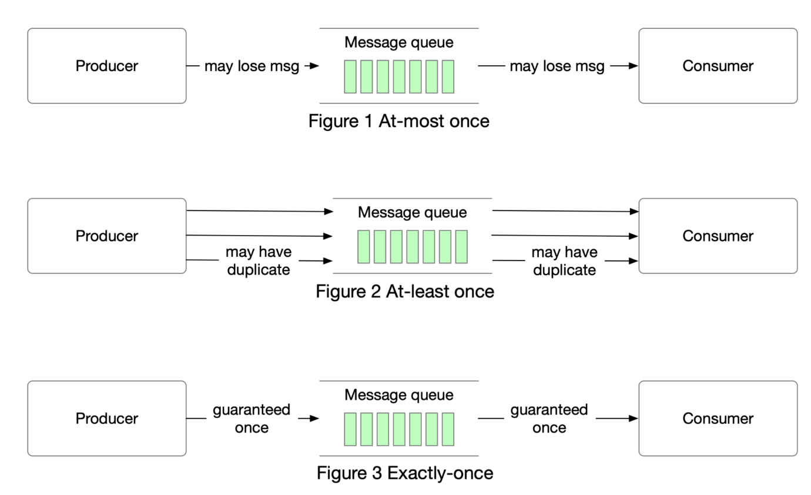

# 消费模型

在现代架构中，系统被分解成小而独立的构建块，它们之间有着明确定义的接口。消息队列为这些构建块提供通信和协调。今天，让我们讨论不同的交付语义：最多一次、至少一次和恰好一次。

消息队列一般包含三个消息消费模式

- 最多一次
- 至少一次
- 恰好一次

## 最多一次

如字面意思所示，`at-most once` 意味着消息最多被投递一次。**消息可能会丢失，但不会被重新投递**。这是 `at-most once` 传递在高层次上的工作方式。

应用场景：它适用于像监控指标这样的用例，其中可以接受少量数据丢失。

## 最少一次

随着数据交付语义的发展，**可以适当地交付一条消息多次，但不能丢失任何消息。** 

使用场景：使用至少一次的情况下，消息不会丢失，但可能会多次传递相同的消息。虽然从用户角度来看并不理想，但至少一次的交付语义通常足以应对数据重复不是大问题或者消费者端可以进行去重的使用情况。例如，对于每个消息都有一个唯一键的情况下，在将重复数据写入数据库时，可以拒绝该消息（即就是[消息幂等](https://github.com/MarsonShine/MS.Microservice/blob/master/docs/patterns-of-distributed-systems/Idempotent-Receiver.md)）。

## 恰好一次

`Exactly once` 是实现起来最困难的传递语义。它对用户友好，但对系统性能和复杂性的成本很高。

适用场景：金融相关的使用场景（支付、交易、会计等）。当重复不可接受且下游服务或第三方不支持幂等性时，`Exactly once` 尤为重要。

## 原文链接

https://blog.bytebytego.com/p/free-system-design-pdf-158-pages