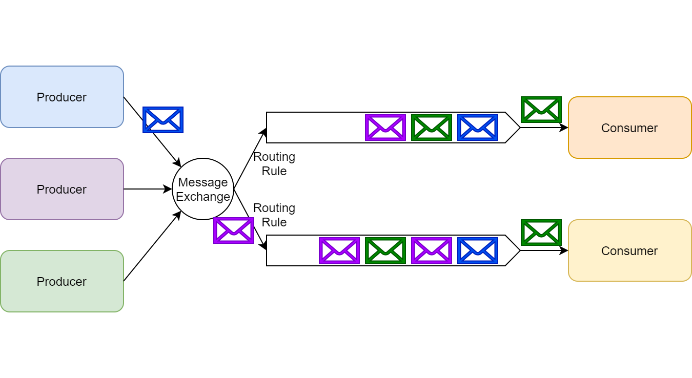
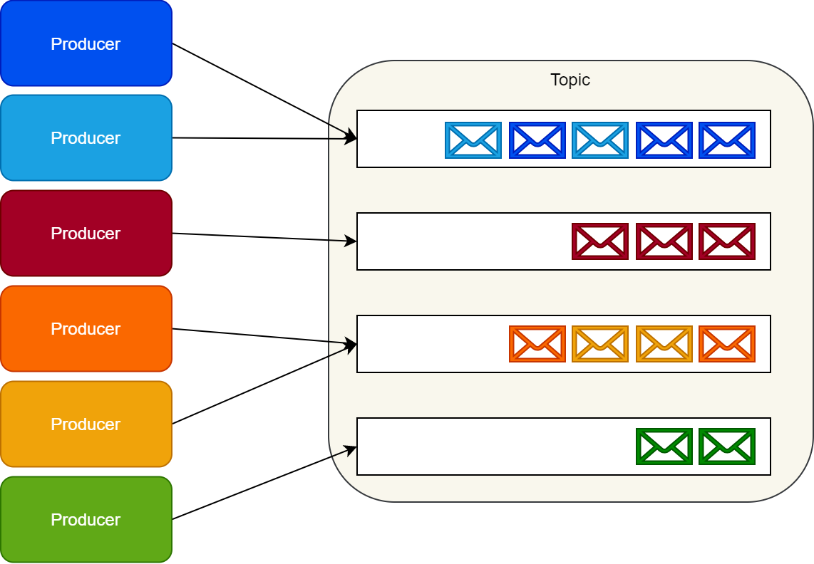

# RabbitMQ via Kafka

消息中间件是指利用高效可靠的消息传递机制进行与平台无关的数据交流，并基于数据通信来进行分布式系统的集成。通过提供消息传递和消息排队模型，**它可以在分布式环境下提供应用解耦、弹性伸缩、冗余存储、流量削峰、异步通信、数据同步等等功能**，其作为分布式系统架构中的一个重要组件，有着举足轻重的地位。消息中间件的成熟产品有很多，如 **ActiveMQ**，**ActiveMQ**，**ActiveMQ** ，**RocketMQ**，**RocketMQ**。

从消息中间件的生态环境和成熟度来说，本文主要在 RabbitMQ 和 Kafka 之间做调研选择。

两者在消息发布与消费过程其实是由相似之处的，都能支持对消息的**失败确认补偿机制**，成功确认会移除队列中的消息（较与 kafka，broker 只保留成功的消息）

# 设计的不同

## RebbitMQ

Rabbit 诞生之初就是消息中间件为核心的。主要核心概念为 Exchange 交换机和 Queue 队列。

其中交换机和队列相关的概念如下

| 名词          | 描述                                                         |
| ------------- | ------------------------------------------------------------ |
| Queue         | 用来存储消息（Message），消费者绑定 Queue 来绑定消息         |
| Exchange      | 生产者发送消息至交换机，由它根据 Exchange Type、Binding Key、Routing Key 将消息路由到一个多个队列中 |
| Exchange Type | Direct、Fanout、Topic、Headers                               |
| Routing Key   | 生产者发送消息给 Exchange 会指定一个Routing Key              |
| Binding Key   | 在绑定 Exchange 与 Queue 时会指定一个Binding Key             |

## Kafka

严格意思上说，Kafka 不是消息中间件，它的设计之初就是为了解决流媒体问题的，它是一个分布式流式系统，它没有 Queue 这个概念。取而代之是通过主题 Topic 来存储消息记录的。所以它本身不具备消息队列一般的要具备的特征，如队列，优先级队列，死信问题等（但并不是说就不能实现上述功能，这需要应用端配合解决）。

Kafka 主要涉及的核心如下：

| 名词           | 描述                                                         |
| -------------- | ------------------------------------------------------------ |
| Topic          | 队列是通过Topic进行隔离的，生产者发送消息必须指定Topic       |
| Broker         | 一个 Kafka Server 被称为一个Broker。                         |
| Partition      | 每个 Topic 可以包含多个 Partition，多个 Partition 会平均分配给同一个 Consumer Group 里的不同 Consumer 进行消费 |
| Consumer Group | 不在同一个 Group 的 Consumer 能重复消费同一条消息（订阅），相同 Group 的 Consumer 存在消费竞争（负载均衡） |

# 消息模式

消息队列的模式主要分为两种，pull 和 push。由于 pull 都是每个客户端消费者都必须轮询消息服务器的各种状态，所以在性能方面会有点影响，RabbitMQ 是采用 push 方式，并结合自身特征，利用混合模式实现广播（pub/sub）模式：订阅者以组队的方式然后在组内以竞争关系作为消费者去处理某个具体队列上的消息，这种由订阅者构成的组我们称为消费者组。按照这种方式，实现了发布/订阅模式，同时也能够很好的伸缩（scale-up）订阅者去处理收到的消息。

Kafka 则根据设计可以天然的与发布-定于模式结合。

**RabbitMQ 还内置了死信问题**，通过创建一个死信队列来处理死信问题，将死信重新入队列进行重新绑定消费。

# 功能对比

| **对比项**     | **RabbitMQ**                                | **Kafka**  |
| -------------- | ------------------------------------------- | ---------- |
| **吞吐量**     | 低                                          | 高         |
| **有序性**     | 全局有序性                                  | 分区有序性 |
| **消息可靠性** | 多策略组合                                  | 消息持久化 |
| **流处理**     | 不支持（最新版本支持）                      | 支持       |
| **时效性**     | 高                                          | 中         |
| **运维便捷度** | 高                                          | 中         |
| **系统依赖**   | 无                                          | zookeeper  |
| **Web监控**    | 自带                                        | 第三方     |
| **优先级队列** | 支持                                        | 不支持     |
| **死信**       | 支持                                        | 不支持     |
| **客户端支持** | 支持多种语言                                | 同         |
| **社区生态**   | 好                                          | 同         |
| **安全机制**   | （TLS/SSL、SASL）身份认证和（读写）权限控制 | 同         |
| **消息回溯**   | 支持                                        | 不支持     |

# 性能与消息可靠性

Kafka的诞生的是处理高并发日志的，吞吐量比较高，每秒请求数达到数十万量级

RabittMQ 每秒请求处理为万级

关于 kafka 高性能，吞吐的背后：Kafka 存储信息是异步批量处理信息，磁盘顺序读写，同步刷盘等操作实现的高性能，高吞吐。**但这其实是牺牲了消息可靠性换来的性能，因为 Kafka 的 broker 会在一段时间内把发送过来的信息存储到内存中，然后在一段时间内出发刷盘把消息同步到磁盘中。在同步刷新的期间如果发生宕机，那么此时存在内容中的消息队列（Topic）会丢失。**但并不是说 Kafka 就不支持实时写入磁盘，在确认机制（ack）最新的特性得出，Kafka 现在也支持设置 broker 的 ack 可以在消息一接收就会写入磁盘，但是吞吐量和性能会由损失。

反过来也是如此，目前的 RabbitMQ 也支持了批量处理消息等操作。

所以一般情况下，RabbitMQ 大多用在支付等实时性要求高的场景；Kafka 大多用在大数据库，日志处理等实时性要求不高的场景。

# 开发运维

Kafka 需要依赖三方产品。**与 .NET 集成生态欠佳**

RabbiMQ 内置消息监控，UI 界面，方便维护查看，并且拥有众多成熟开源的框架，如 EasyNetQ，RestBus，RabbitMQ.Client，NotNetCore.CAP，NServiceBus 等。

# 目前选型方案

目前采用的是框架体系是 RabbitMQ + DotNetCore.CAP。

## Why DotNetCore.CAP

这个框架目前社区参与度较高，集成度也高，还处于积极维护状态。并且集成支持 RabbitMQ  以及 Kafka。所以在后续出现业务转变，场景转变，可以在很少的人力成本进行切换。

在维护方面，DotNetCore.CAP 动态集成了 Dashboard，能方便快速查看消息的消费情况，并可以适时进行手动补偿措施。并且优化了 RabbitMQ 原本对事务的性能优化，DotNetCore.CAP 提供了根据 eBay 给出的方案 —— 本地消息表来完成异步事务，来达到高性能的目的。

> 关于本地消息表详见：https://www.cnblogs.com/savorboard/p/base-an-acid-alternative.html，英文版详见：http://queue.acm.org/detail.cfm?id=1394128。

但正式因为如此，**理论性性能点就转移到本地消息表了，但是由于分布式，很方便支持横向拓展，就能应付绝大部分业务场景。**2PC 与 多阶段提交带来的新问题（补偿成本问题）也是需要极大的成本解决的。

# Demo 地址

http://192.168.11.6:10080/maoshuai/eventbus

例子包括了

- 消息失败重试
- 消息事务场景
- 服务宕机重启的场景

# 参考资料

- https://www.rabbitmq.com/#features
- http://kafka.apache.org/documentation/
- https://cap.dotnetcore.xyz/
- https://www.cloudamqp.com/blog/2017-12-29-part1-rabbitmq-best-practice.html
- https://zhuanlan.zhihu.com/p/161224418
- https://zhuanlan.zhihu.com/p/37993013
- https://www.cnblogs.com/skychen1218/p/13731498.html#4693989
- http://www.dockone.io/article/9756