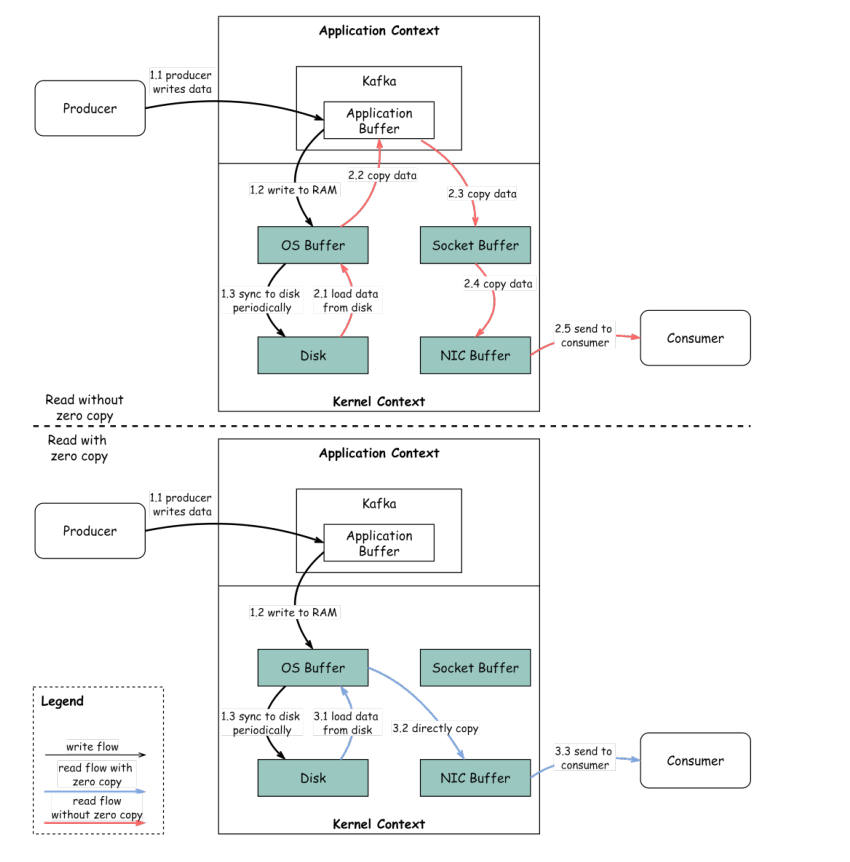

# Kafka 为什么快？

Kafka 通过**顺序 I/O**和**零拷贝原则（Zero Copy Principle）**实现了低延迟的消息传递。和零拷贝原则。同样的技术也普遍应用于许多其他的消息/流媒体平台。
下图说明了数据是如何在生产者和消费者之间传输的，生产者和消费者之间的数据传输，以及零拷贝的含义。

- Step 1.1~1.3：生产者写数据到磁盘
- Step 2：消费者读数据（通过普通手段而非零拷贝技术）
  - 2.1 数据从磁盘加载到操作系统缓存
  - 2.2 数据从操作系统缓存拷贝到 Kafka 应用程序
  - 2.3 Kafka 从应用端拷贝数据到 socket 缓冲区
  - 2.4 数据从 socket 缓冲区拷贝到网卡
  - 2.5 网卡再把数据拷贝出来给消费者
- Step 3：消费者读数据（通过零拷贝技术）
  - 3.1 数据从磁盘加载到操作系统缓存
  - 3.2 操作系统缓存直接将数据拷贝给网卡（通过底层 `sendfile()` 方法）
  - 3.3 网卡发送数据给消费者

零拷贝是在应用程序上下文和内核上下文之间保存多个数据副本的快捷方式。这种方法将时间缩短了大约 65%。

> 关于零拷贝详见：[零拷贝](https://github.com/MarsonShine/Books/blob/master/CSAPP/docs/zero-copy.md)

