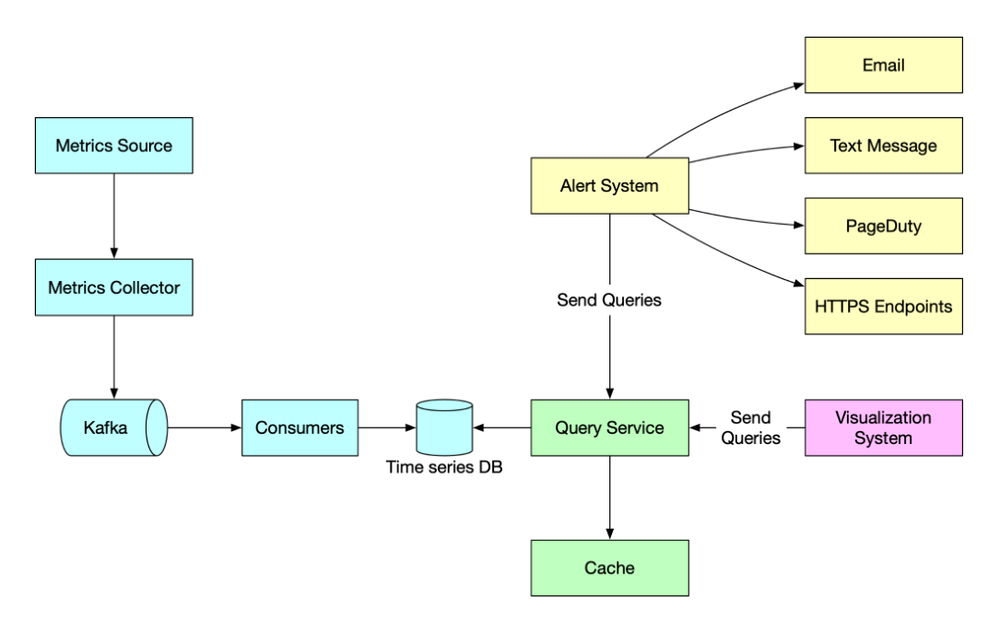

# 指标监控和警报系统

一个良好设计的指标监控和警报系统在提供基础设施的健康状态可见性以确保高可用性和可靠性方面起着关键作用。下图简要说明了系统的工作原理。

**指标源：**可以是应用服务器、SQL 数据库、消息队列等。 

**指标收集器：**它收集指标数据并将数据写入时序数据库。 

**时序数据库：**它将指标数据存储为时间序列。通常提供自定义查询接口以分析和汇总大量的时间序列数据。它通过标签维护索引，以便快速查找时间序列数据。 

**Kafka：**Kafka 用作高度可靠和可扩展的分布式消息平台。它将数据收集和数据处理服务解耦。

**消费者：**消费者或流处理服务（如Apache Storm、Flink 和 Spark）处理并将数据推送到时间序列数据库。 

**查询服务：**查询服务使从时间序列数据库中查询和检索数据变得容易。如果我们选择了一个好的时间序列数据库，这应该是一个非常轻量级的包装器。它也可以完全由时间序列数据库自己的查询接口替代。 

**告警系统：**它将告警通知发送到各种告警目的地。 

**可视化系统：**它以各种图形/图表的形式显示指标。