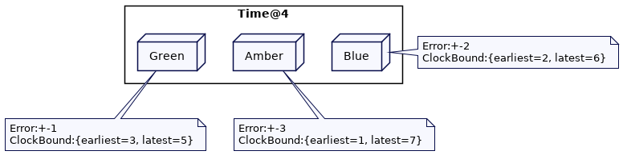

# Clock-Bound Wait

在读取和写入值之前及时等待覆盖集群节点之间的不确定性，以便值可以在集群节点之间正确排序。

## 问题

有一个键值存储，其中的值使用指定的每个版本的时间戳存储。所有处理客户端请求的集群节点都能够使用请求处理节点上的当前时间戳读取最新版本。

在下面的例子中，值“Before Dawn“按照Green的时钟在时间点2更新为“After Dawn”。Both Alice 和 Bob 都正准备读取title的最新值。当Alice的请求被集群节点Amber处理时，Bob的请求已经被集群节点 Blue 处理。Amber的时钟在1处延迟了。这意味着当 Alice 读取最新的值时，它会传递“Before Dawn”的值。Blue在时钟2处;当Bob读取最新的值时，它返回值为”After Dawn“。


这违反了所谓的[外部一致性](https://cloud.google.com/spanner/docs/true-time-external-consistency)。如果 Alice 和 Bob 现在打电话，Alice 会感到困惑。Bob 将告诉她最新的值是“After Dawn”，而她的集群节点显示的是“Before Dawn”。

如果 Green 的时钟很快，并且与 Amber 的时钟相比，写入发生在“未来”，情况也是如此。

如果存储值时将系统时间戳作为版本，这是一个问题，因为[挂钟不是单调的](Lease.md#挂钟不是单调的monotonic)。**来自两个不同服务器的时钟值不能也不应该进行比较**。当[混合时钟](Hybrid-Clock.md)在[版本值](Versioned-Value.md)中被用作一个版本时，它允许值在单个服务器上以及在不同的服务器上被排序，这些服务器是因果相关的。然而，混合时钟(或任何基于[Lamport时钟](Lamport-Clock.md))都只能给出[部分顺序](Lamport-Clock.md#部分排序（Partially Order）)。这意味着不能对跨不同节点的两个不同客户端存储的没有因果关系的任何值进行排序。当使用时间戳跨集群节点读取值时，这会产生问题。**如果读取请求源自时钟滞后的集群节点，它可能无法读取给定值的最新版本**。

## 解决方案

**集群节点等待，直到集群中每个节点上的时钟值确保高于在读取或写入时分配给该值的时间戳。**

如果两个时钟之间的差异非常小，写请求可以等待，而不会增加大量的开销。作为一个例子，假设集群节点之间的最大时钟偏差是10ms(这意味着，在任何给定的时间点，集群中最慢的时钟会滞后t - 10ms。)。为了保证每个其他集群节点的时钟设置超过t，处理任何写操作的集群节点必须等待t + 10ms才能存储该值。

考虑一个带有[版本值](Versioned-Value.md)的键值存储，其中每次更新都作为新值添加，并使用时间戳作为版本。在 Alice 和 Bob 的例子中，存储“title@2”的写操作将会等待，直到集群节点挂钟处于2.这确保了即使 Alice 的集群节点的时钟落后了，Alice 也总能看到标题的最新值。

考虑一个稍微不同的场景。Philip 更新title值为“After Dawn”。Green 时钟处于2。但是 Green 知道可能有一个服务器的时钟滞后时间高达1个单位。因此，它必须在写操作中等待1个单位的时间。


当 Philip 更新 title 时，服务器 Blue 在处理 Bob 的读请求。Blue 的时钟处于2，所以它可以在时间戳2读取 title。与此同时，Green 还没有提供该值。这意味着 Bob 读取的是低于2的最高时间戳的值，即“Before Dawn”


Alice 的读请求由服务器 Amber 处理的。Amber的时钟是1，所以它试图读取时间戳为1的标题。Alice 得到的值是“Before Dawn”


一旦 Philip 的写请求完成——在 max_diff 的等待结束之后，如果 Bob 现在发送一个新的读请求，服务器 Blue 将根据其时钟(已提前到3)尝试读取最新的值；这将返回值“After Dawn”


如果 Alice 初始化一个新请求，服务器 Blue 将会根据每个时钟读取最新的值——即现在是2。即返回值为”After Dawn“


实现此解决方案时的主要问题是，使用当前可用的日期/时间硬件和操作系统 API 根本无法获得跨集群节点的准确时间差。这就是挑战的本质，因此谷歌有自己的专门的日期时间 API，称为 [True time](https://cloud.google.com/spanner/docs/true-time-external-consistency)。同样，亚马逊有 [AWS Time Sync Service](https://aws.amazon.com/about-aws/whats-new/2021/11/amazon-time-sync-service-generate-compare-timestamps/) 和一个名为 [ClockBound](https://github.com/aws/clock-bound) 的库。 但是，这些 API 非常特定于 Google 和 Amazon，因此无法真正超出这些组织的范围进行扩展

通常，键值存储使用[混合时钟](Hybrid-Clock.md)来实现[版本值](Versioned-Value.md)。虽然不可能获得时钟之间的确切差异，但可以根据历史观察选择一个合理的默认值。跨数据中心的服务器上观察到的最大时钟漂移值通常为 200 到 500 毫秒。

键值存储在存储值之前等待配置的 max-offset。

```java
class KVStore {
  ...
  int maxOffset = 200;
  NavigableMap<HybridClockKey, String> kv = new ConcurrentSkipListMap<>();
  public void put(String key, String value) {
      HybridTimestamp writeTimestamp = clock.now();
      waitTillSlowestClockCatchesUp(writeTimestamp);
      kv.put(new HybridClockKey(key, writeTimestamp), value);
  }

  private void waitTillSlowestClockCatchesUp(HybridTimestamp writeTimestamp) {
      var waitUntilTimestamp = writeTimestamp.add(maxOffset, 0);
      sleepUntil(waitUntilTimestamp);
  }

  private void sleepUntil(HybridTimestamp waitUntil) {
      HybridTimestamp now = clock.now();
      while (clock.now().before(waitUntil)) {
          var waitTime = (waitUntil.getWallClockTime() - now.getWallClockTime()) ;
          Uninterruptibles.sleepUninterruptibly(waitTime, TimeUnit.MILLISECONDS);
          now = clock.now();
      }
  }

  public String get(String key, HybridTimestamp readTimestamp) {
      return kv.get(new HybridClockKey(key, readTimestamp));
  }
}
```

### 读重启（Read Restart）

对于每个写请求来说，等待的时间间隔 200ms 太高了。这就是为什么像 [CockroachDB](https://www.cockroachlabs.com/docs/stable/) 或 [YugabyteDB](https://www.yugabyte.com/) 这样的数据库会在读请求中实现检查。

当服务一个读请求时，集群节点会检查在`readTimestamp`和`readTimestamp + 最大时钟漂移`的间隔内是否有可用的版本。如果版本可用(假设读取器的时钟可能滞后)，则要求它使用该版本重新启动读取请求。

```java
class KVStore {
  ...
  public void put(String key, String value) {
      HybridTimestamp writeTimestamp = clock.now();
      kv.put(new HybridClockKey(key, writeTimestamp), value);
  }

  public String get(String key, HybridTimestamp readTimestamp) {
      checksIfVersionInUncertaintyInterval(key, readTimestamp);
      return kv.floorEntry(new HybridClockKey(key, readTimestamp)).getValue();
  }

  private void checksIfVersionInUncertaintyInterval(String key, HybridTimestamp readTimestamp) {
      HybridTimestamp uncertaintyLimit = readTimestamp.add(maxOffset, 0);
      HybridClockKey versionedKey = kv.floorKey(new HybridClockKey(key, uncertaintyLimit));
      if (versionedKey == null) {
          return;
      }
      HybridTimestamp maxVersionBelowUncertainty = versionedKey.getVersion();
      if (maxVersionBelowUncertainty.after(readTimestamp)) {
          throw new ReadRestartException(readTimestamp, maxOffset, maxVersionBelowUncertainty); // 手动抛错，在Client拦截并重试
      }
      ;
  }
}

class Client {
  ...
  String read(String key) {
      int attemptNo = 1;
      int maxAttempts = 5;
      while(attemptNo < maxAttempts) {
          try {
              HybridTimestamp now = clock.now();
              return kvStore.get(key, now);
          } catch (ReadRestartException e) {
              logger.info(" Got read restart error " + e + "Attempt No. " + attemptNo);
              Uninterruptibles.sleepUninterruptibly(e.getMaxOffset(), TimeUnit.MILLISECONDS);
              attemptNo++;
          }

      }
      throw new ReadTimeoutException("Unable to read after " + attemptNo + " attempts.");
  }
}
```

在上面 Alice 和 Bob 的例子中，如果有一个“title”的时间戳为2的版本，并且 Alice 发送了一个时间戳为1的读请求，将会抛出一个`ReadRestartException`，要求 Alice重新启动读时间戳为2的读请求。


只有在不确定的时间间隔内写入 version，才会重启读操作。写请求不需要等待。

**重要的是要记住，最大时钟漂移的配置值是一个假设，它无法得到保证。在某些情况下，一个坏服务器的时钟偏移可能比假设的值大。在这种情况下，问题将持续存在。**

### 使用 Clock Bound APIs

像 Google 和 Amazon 这样的云提供商，使用原子（atomic）时钟和 GPS 来实现时钟机制，以确保跨集群节点的时钟漂移保持在几毫秒以下。正如我们刚才讨论的，Google 有[True Time](https://cloud.google.com/spanner/docs/true-time-external-consistency)。AWS提供“[AWS时间同步服务](https://cloud.google.com/spanner/docs/true-time-external-consistency)”和“[ClockBound](https://cloud.google.com/spanner/docs/true-time-external-consistency)”。

要确保正确实现这些等待，集群节点有两个关键要求。

- 集群节点间的时钟漂移被保持在最低限度。谷歌的 Ture Time 在大多数情况下保持在1ms以下(在最坏的情况下为7ms)
- 时钟偏移在日期-时间API中总是可用的，这确保程序员不需要猜测值。

集群节点上的时钟机器计算日期时间值的误差范围。考虑到本地系统时钟返回的时间戳可能存在错误，API 会明确显示错误。它将给出时钟值的下限和上限。保证实时值在这个区间内。

```java
public class ClockBound {
	public final long earliest;
    public final long latest;

    public ClockBound(long earliest, long latest) {
        this.earliest = earliest;
        this.latest = latest;
    }

    public boolean before(long timestamp) {
        return timestamp < earliest;
    }

    public boolean after(long timestamp)   {
        return timestamp > latest;
    }
}
```

正如[AWS 博客](https://aws.amazon.com/blogs/mt/manage-amazon-ec2-instance-clock-accuracy-using-amazon-time-sync-service-and-amazon-cloudwatch-part-1/)中所解释的，错误在每个集群节点上计算为 ClockErrorBound。实时值总是介于本地时钟时间和 `+- ClockErrorBound` 之间。

每当请求日期-时间时，都会返回错误边界。

```java
public ClockBound now() {
    return now;
}
```

有时钟限制的API保证了两个属性

- 时钟边界应该在集群节点之间重叠
- 对于两个时间值 t1,t2，如果 t1 < t2，那么在所有集群节点中 clock_bound(t1).earlist < clock_bound(t2).latest

假设我们有三个集群节点:Green、Blue 和 Amber。每个节点可能有不同的误差界限。假设 Green 的误差是1，Amber的是2，Orange 的是3。在时间4时，集群节点间的时钟绑定如下所示:



在这个场景中，需要遵循两个规则来实现提交等待(commit-wait)。

- 对于任何写操作，应该选择时钟绑定的最新值作为时间戳。这将确保它总是高于分配给以前写操作的所有时间戳(考虑下面的第二条规则)。

- 在存储该值之前，系统必须等待，直到写时间戳小于时钟绑定的最早值。

  这是因为在所有集群节点中，最早的值保证低于ClockBound的最新值。将来任何使用ClockBound的最新值读取的人都可以访问此写入操作。此外，保证在将来发生任何其他写入操作之前对该值进行排序。

```java
class KVStore {
  ...
  public void put(String key, String value) {
      ClockBound now = boundedClock.now();
      long writeTimestamp = now.latest;
      addPending(writeTimestamp);
      waitUntilTimeInPast(writeTimestamp);
      kv.put(new VersionedKey(key, writeTimestamp), value);
      removePending(writeTimestamp);
  }


  private void waitUntilTimeInPast(long writeTimestamp) {
      ClockBound now = boundedClock.now();
      while(now.earliest < writeTimestamp) {
          Uninterruptibles.sleepUninterruptibly(now.earliest - writeTimestamp, TimeUnit.MILLISECONDS);
          now = boundedClock.now();
      }
  }


  private void removePending(long writeTimestamp) {
      pendingWriteTimestamps.remove(writeTimestamp);
      try {
          lock.lock();
          cond.signalAll();
      } finally {
          lock.unlock();
      }
  }

  private void addPending(long writeTimestamp) {
      pendingWriteTimestamps.add(writeTimestamp);
  }
}
```

如果我们回到上面的 Alice 和 Bob 的例子，当“title”—“After Dawn”—的值被 Philip 写在服务器 Green 上时，在 Green 上的 put 操作会等待，直到所选的写时间戳低于时钟界的最早值。这保证了每个其他集群节点都有一个更高的时间戳来表示ClockBound的最新值。为了说明这一点，考虑以下场景。Green 的误差边界值是 +-1。因此，put操作从时间4开始，当它存储值时，Green 将获得时钟界的最新值，即5。然后它等待，直到ClockBound的最早值大于5。本质上，Green 在将值实际存储在键值存储区之前等待不确定区间。


当该值在键值存储中可用时，ClockBound的最新值保证在每个集群节点上都大于5。这意味着 Bob 的请求由 Blue 处理，Alice 的请求由 Amber 处理，都保证获得"title"的最新值。


如果 Green 有“更宽”的时间界限(time bounds)，我们将得到相同的结果。误差范围越大，等待的时间就越长。如果 Green 的错误界限（error bounds）最大，它将继续等待，然后才能使键值存储中的值可用。Amber 和 Blue 都无法获得该值，直到它们的最新时间值超过 7。当 Alice 在最晚时钟 7 获得最新的 title 值时，将保证每个其他集群节点都能获得它最新时间值。


### 读等待（Read-Wait）

当读取该值时，客户端总是从其集群节点的ClockBound中选取最大值。

接收请求的集群节点需要确保在特定请求时间戳返回响应后，在该时间戳或较低时间戳处没有写入任何值。

如果请求中的时间戳高于服务器上的时间戳，则集群节点将等待，直到时钟赶上，然后返回响应。

然后，它将检查是否有任何挂起的较低时间戳的并尚未存储的写请求。如果有，则读请求将暂停，直到请求完成。

然后，服务器将根据请求时间戳读取值并返回该值。这将确保一旦响应以特定的时间戳返回，就不会以较低的时间戳写入值。这种保证称为[快照隔离](https://jepsen.io/consistency/models/snapshot-isolation)

```java
class KVStore{
  ...
  final Lock lock = new ReentrantLock();
  Queue<Long> pendingWriteTimestamps = new ArrayDeque<>();
  final Condition cond  = lock.newCondition();

  public Optional<String> read(long readTimestamp) {
      waitUntilTimeInPast(readTimestamp);
      waitForPendingWrites(readTimestamp);
      Optional<VersionedKey> max = kv.keySet().stream().max(Comparator.naturalOrder());
      if(max.isPresent()) {
          return Optional.of(kv.get(max.get()));
      }
      return Optional.empty();
  }

  private void waitForPendingWrites(long readTimestamp) {
      try {
          lock.lock();
          while (pendingWriteTimestamps.stream().anyMatch(ts -> ts <= readTimestamp)) {
              cond.awaitUninterruptibly();
          }
      } finally {
          lock.unlock();
      }
  }
}
```

考虑最后一个场景：Alice 的读请求是被服务器 Amber 处理的，此时错误边界是3。它选择了最新时间为7来读取这个值。与此同时，Philip 的写请求是通过 服务器 Green 处理的（错误边界为 +-1），它选择5存储这个值。Alice 的读请求会一直等待直到 Green 的最早时间超过7，然后等待写请求。然后返回时间戳小于7的最新值。


## 例子

Google 的 [TrueTime API](https://cloud.google.com/spanner/docs/true-time-external-consistency)为我们提供了Clock Bound。[Spanner](https://cloud.google.com/spanner)使用它来实现commit-wait

[AWS时间同步服务](https://aws.amazon.com/about-aws/whats-new/2021/11/amazon-time-sync-service-generate-compare-timestamps/)确保了最小的时钟偏移。可以使用 [ClockBound API](https://github.com/aws/clock-bound) 来实现等待以对整个集群中的事件进行排序。

[CockroachDB](https://www.cockroachlabs.com/docs/stable/) 实现读重启。它还有一个实验性的选项，根据配置的最大时钟漂移值使用提交等待。

[YugabyteDB](https://www.yugabyte.com/) 根据配置的最大时钟漂移值实现读重启。

