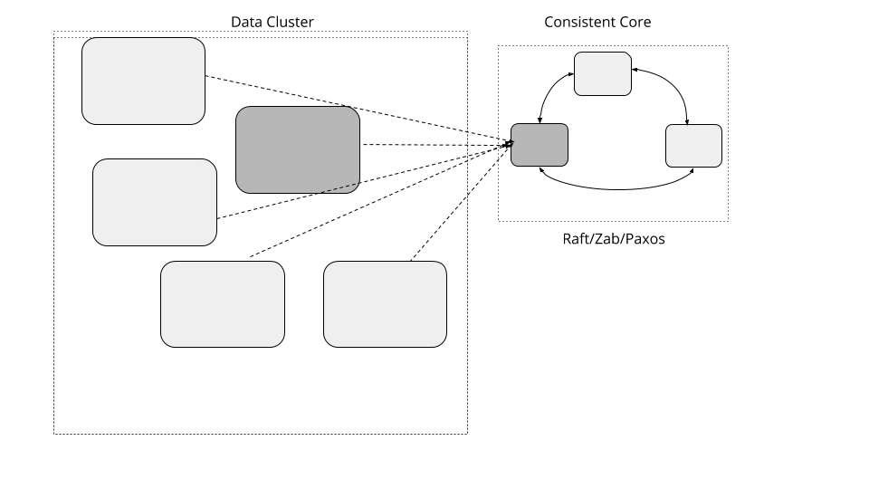

# 一致性核心

维护较小的集群，提供更强的一致性来允许大型数据集群协调服务器活动，而无需实现基于仲裁（Quorum）算法。

## 问题

当集群处理随着数据的大量增多，所需要的服务器也会逐渐增多。集群服务器都有一些共同的要求，比如指定服务器成为特定服务的主服务器，管理成员信息组，映射数据分区至服务器等等。这些实现也需要容错性。一个通用的方法就是使用基于 [Quorum](Quorum.md) 的容错一致性算法。但是在基于仲裁的系统吞吐量的高低是受集群大小决定的。

## 解决方案

实现一个小的，如 3-5 个节点的集群，它会提供线性保证和容错性。一个独立的数据集群能使用小的一致集群来管理元数据并使用 [Lease](Lease.md) 之类的原语进行集群范围内的决策。这种方式，数据集群能增长到大量得服务器，但是仍然能用一些小得元数据集群做一些需要强一致性保证。



具体到接口一致性就像下面这样：

```java
public interface ConsistentCore {
    CompletableFuture put(String key, String value);
    List<String> get(String keyPrefix);
    CompletableFuture registerLease(String name, long ttl);
    void refreshLease(String name);
    void watch(String name, Consumer<WatchEvent> watchCallback);
}
```

至少，一致性核心提供了一个简单得 k/v 存储机制。它可以用来存储元数据。

## 元数据存储

这个存储是利用一致性算法实现的，如 Raft。它的一个例子就是复制预写日志（Replicated Write Ahead Log）的实现，这里面复制的部分就是靠 [Leader Followers]() 处理的，高水位标记是用仲裁（Quorum）来追踪成功复制。

### 支持层级存储

一致性核心要点就是用来存储数据的，比如像：成员关系组或者跨服务的分布式任务。一个通用的用例模式就是使用前缀来界定元数据类型的范围。例如拿成员关系组举例，keys 会被像 /servers/1，/servers/2 等这样存储。对于分配给服务器的任务，键值可以是 /tasks/task1， /tasks/task2。数据通过特定前缀来读取所有键值。例如，为了获取在集群中所有数据的信息，就会用前缀 /servers 读取所有键值信息。

下面是一个使用的案例：

服务器它们能使用一致性注册自己，通过使用前缀 /servers 创建它们自己的键。

```java
client1.setValue("/servers/1", "{address:192.168.199.10, port:8000}");

client2.setValue("/servers/2", "{address:192.168.199.11, port:8000}");

client3.setValue("/servers/3", "{address:192.168.199.12, port:8000}");
```

客户端然后就可以通过前缀 /servers 读取在集群中所有服务器的信息：

```java
assertEquals(client1.getValue("/servers"), Arrays.asList("{address:192.168.199.12, port:8000}", 
													   "{address:192.168.199.11, port:8000}",
                                                            "{address:192.168.199.10, port:8000}"));
```

由于存储数据的层次性，像 [zookeeper](https://zookeeper.apache.org/)，[chubby](https://research.google/pubs/pub27897/) 提供像接口一样的文件系统，它是用户创建目录和文件或是节点的地方，具有父节点和子节点的概念。[etcd3](https://coreos.com/blog/etcd3-a-new-etcd.html) 具有平面键空间，能够获得一系列键。

## 处理客户端交互

一致性核心功能的一个关键的要求的就是客户端怎么与它交互。下面这些方面就是客户端如何使用一致性核心工作的。

### 查找 leader

这对于运行在 leader 上所有的操作来说都是很重要的，所以客户端库需要第一时间查找 leader 服务器。这里有两个方法能满足这种要求。

- 在一致性核心的从服务器中必须要知道主服务器，所以如果一个客户端连接到一个从服务器，它能返回主服务器的地址。客户端则通过返回的地址直接连接主服务器。还要注意，当客户端与服务器建立连接时，这个服务器可能正在被选举中。在这种情况下，这些服务器是不会返回主服务器地址的，并且客户端需要等待且尝试连接其它服务器。

- 服务器能实现一个转接机制，转接所有客户端的请求到主服务器上。这允许客户端去连接任务服务器的。再一次，如果服务器又在选举中，除非主服务器已经成功选举并且合法的主服务器已经建立，那么客户端会一直重新尝试连接。

  像 zoopkeeper 和 etcd 这样的产品就是通过这种方法实现的，因为它们允许一些只读请求由从服务器处理；这避免了当大量客户端是只读的时候，主服务器成为性能上的瓶颈。在特定请求之上，这减少了在客户端去连接主还是从的复杂度。

查找 leader 的一个简单的方法就是尝试连接每个服务器并且发送一个请求，不是 leader 的服务器，就会返回一个重定向返回。

```java
private void establishConnectionToLeader(List<InetAddressAndPort> servers) {
    for (InetAddressAndPort server : servers) {
        try {
            SingleSocketChannel socketChannel = new SingleSocketChannel(server, 10);
            logger.info("Trying to connect to " + server);
            RequestOrResponse response = sendConnectRequest(socketChannel);
            if (isRedirectResponse(response)) {
                redirectToLeader(response);
                break;
            } else if (isLookingForLeader(response)) {
                logger.info("Server is looking for leader. Trying next server");
                continue;
            } else { //we know the leader
                logger.info("Found leader. Establishing a new connection.");
                newPipelinedConnection(server);
                break;
            }
        } catch (IOException e) {
            logger.info("Unable to connect to " + server);
            //try next server
        }
    }
}

private boolean isLookingForLeader(RequestOrResponse requestOrResponse) {
    return requestOrResponse.getRequestId() == RequestId.LookingForLeader.getId();
}

private void redirectToLeader(RequestOrResponse response) {
    RedirectToLeaderResponse redirectResponse = deserialize(response);
    newPipelinedConnection(redirectResponse.leaderAddress);

    logger.info("Connected to the new leader "
            + redirectResponse.leaderServerId
            + " " + redirectResponse.leaderAddress
            + ". Checking connection");
}


private boolean isRedirectResponse(RequestOrResponse requestOrResponse) {
    return requestOrResponse.getRequestId() == RequestId.RedirectToLeader.getId();
}
```

如果我们知道服务器能处理我们得请求得话，仅仅只是建立 TCP 连接还不够。所以客户端会发送一个特殊请求来确认服务器它能服务（接受）这个请求或者重定向到 leader 服务器。

```java
private RequestOrResponse sendConnectRequest(SingleSocketChannel socketChannel) throws IOException {
    RequestOrResponse request
            = new RequestOrResponse(RequestId.ConnectRequest.getId(), "CONNECT", 0);
    try {
        return socketChannel.blockingSend(request);
    } catch (IOException e) {
        resetConnectionToLeader();
        throw e;
    }
}
```

如果一个 leader 服务器挂了，可以使用相同的技术来从集群中标识一个新的选举的 leader。

一旦连接的，这个客户端维护一个到主服务器的[单 Socket 通道](Single-Socket-Channel.md)。

### 处理重复请求

在失败的情况下，客户端可能要尝试连接新的 leader，重新发送请求。但是如果那些请求是已经在之前那个 leader 处理期间失败了，可能会导致重复的结果。因此在服务器上能有一个机制来忽略重复的请求是很重要的。[幂等接收者（Idempotent Receiver）](idempotent-receiver.dm)模式就是可以用来保护重复请求。

在一组服务器之间协作这些任务，是通过使用 [Lease](time-bound-lease.md) 工作的。这同样能用在实现成员信息组和失败保护机制。

[状态监控](state-watch.md) 是用来获取通知，改变元数据或者时间边界租赁（time bound leases）

## 例子

Google 著名的 [chubby](https://research.google/pubs/pub27897/) 锁服务就是用来管理元数据和服务器之间的协作。

[Kafka](https://kafka.apache.org/) 使用 [zookeeper](https://zookeeper.apache.org/) 管理元数据和做像为集群选举 leader 那样做决策。在 Kafka [建议的架构变化](https://cwiki.apache.org/confluence/display/KAFKA/KIP-500%3A+Replace+ZooKeeper+with+a+Self-Managed+Metadata+Quorum)中将会用自己的 [raft](https://raft.github.io/) 来替换 zookeeper，基于集群控制器。

[bookkeeper](https://bookkeeper.apache.org/) 使用 zookeeper 来管理集群元数据

[kubernetes](https://kubernetes.io/) 使用 [ectd](https://etcd.io/) 协调，管理集群元数据以及成员信息组的信息

所有的大数据存储和像 [hdfs](https://hadoop.apache.org/docs/r3.0.0/hadoop-project-dist/hadoop-hdfs/HDFSHighAvailabilityWithNFS.html)，[spark](http://spark.apache.org/docs/latest/spark-standalone.html#standby-masters-with-zookeeper)，[flink](https://ci.apache.org/projects/flink/flink-docs-release-1.11/ops/jobmanager_high_availability.html) 这样的处理系统都使用 zookeeper 这种来实现高可用以及集群协作。