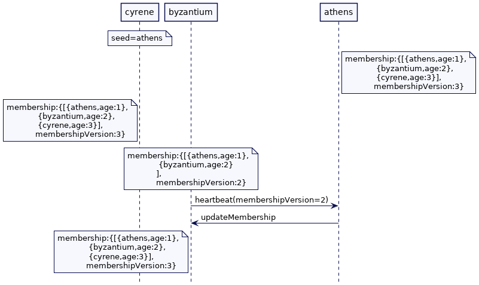
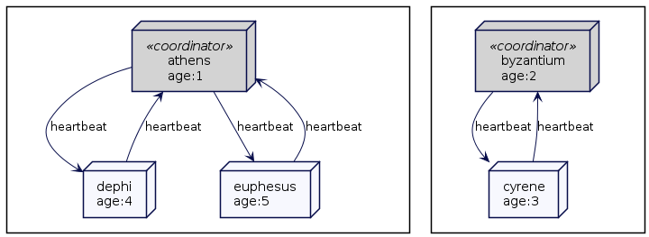

# Emergent Leader

根据集群中节点的大小对它们进行排序，从而允许节点在不进行显式选举的情况下选择leader。

## 问题

对等系统的集群节点都是平等的，没有严格意义上的leader。这意味着没有像[Leader和Followers](Leader-And-Followers.md)中那样明确了Leader选举过程。有时集群也不想依赖单独的 [Consistent Core](Consistent-Core.md)来实现更好的可用性。但仍然需要一个集群节点为那些以完成诸如将数据分区分配给其他集群节点以及跟踪新集群节点何时加入或失败并采取纠正措施等任务充当集群协调者。

## 解决方案

对等系统中使用的一种常用技术就是根据集群节点的“年龄”对其进行排序。集群中最“老”的成员扮演集群协调者的角色。协调者负责决定成员资格的更改以及做出诸如[固定分区](Fixed-Partitions.md) )应放置在哪些集群节点的位置等决策。

为了形成群集，群集中的一个节点充当种子节点（seed node）或引导节点（introduce node）。所有集群节点都通过联系种子节点加入集群。

每个集群节点都配置有种子节点地址。当集群节点启动时，它会尝试联系种子节点以加入集群。

```java
class ClusterNode {
  ...
	MembershipService membershipService;
  public void start(Config config) {
      this.membershipService =  new MembershipService(config.getListenAddress());
      membershipService.join(config.getSeedAddress());
  }
}
```

种子节点可以是集群中的任意节点。它将自己的地址配置为种子节点地址，并且是第一个启动的节点。它会立即开始接受请求。这时种子节点的年龄为1。

```java
class MembershipService {
	Membership membership;
  public void join(InetAddressAndPort seedAddress) {
      int maxJoinAttempts = 5;
      for(int i = 0; i < maxJoinAttempts; i++){
          try {
              joinAttempt(seedAddress);
              return;
          } catch (Exception e) {
              logger.info("Join attempt " + i + "from " + selfAddress + " to " + seedAddress + " failed. Retrying");
          }
      }
      throw new JoinFailedException("Unable to join the cluster after " + maxJoinAttempts + " attempts");
  }

  private void joinAttempt(InetAddressAndPort seedAddress) throws ExecutionException, TimeoutException {
      if (selfAddress.equals(seedAddress)) {
          int membershipVersion = 1;
          int age = 1;
          updateMembership(new Membership(membershipVersion, Arrays.asList(new Member(selfAddress, age, MemberStatus.JOINED))));
          start();
          return;
      }
      long id = this.messageId++;
      CompletableFuture<JoinResponse> future = new CompletableFuture<>();
      JoinRequest message = new JoinRequest(id, selfAddress);
      pendingRequests.put(id, future);
      network.send(seedAddress, message);


      JoinResponse joinResponse = Uninterruptibles.getUninterruptibly(future, 5, TimeUnit.SECONDS);
      updateMembership(joinResponse.getMembership());
      start();
  }

  private void start() {
      heartBeatScheduler.start();
      failureDetector.start();
      startSplitBrainChecker();
      logger.info(selfAddress + " joined the cluster. Membership=" + membership);
  }


  private void updateMembership(Membership membership) {
      this.membership  = membership;
  }
}
```

可以有多个种子节点。但是只有在种子节点加入集群后才开始接受请求。此外，如果种子节点关闭，集群仍将正常工作，但不能向集群中添加新节点。

> 通常会提供不同的发现机制来查找要加入集群的节点。如[JGroups](http://www.jgroups.org/)提供不同的[发现协议](https://docs.jboss.org/jbossas/docs/Clustering_Guide/beta422/html/jbosscache-jgroups-discovery.html)。[Akka](https://akka.io/)提供了几种[发现机制](https://docs.jboss.org/jbossas/docs/Clustering_Guide/beta422/html/jbosscache-jgroups-discovery.html)。

然后非种子节点向种子节点发送加入请求。种子节点通过创建新成员记录并分配其“年龄”来处理该加入请求。然后，它会更新自己的成员列表，并使用这个新成员列表向所有现有成员发送消息。然后它等到确保响应从每个节点返回，但即使响应延迟，最终也会返回加入响应。

```java
class MembershipService {
  ...
	public void handleJoinRequest(JoinRequest joinRequest) {
      handlePossibleRejoin(joinRequest);
      handleNewJoin(joinRequest);
  }

  private void handleNewJoin(JoinRequest joinRequest) {
      List<Member> existingMembers = membership.getLiveMembers();
      updateMembership(membership.addNewMember(joinRequest.from));
      ResultsCollector resultsCollector = broadcastMembershipUpdate(existingMembers);
      JoinResponse joinResponse = new JoinResponse(joinRequest.messageId, selfAddress, membership);
      resultsCollector.whenComplete((response, exception) -> {
          logger.info("Sending join response from " + selfAddress + " to " + joinRequest.from);
          network.send(joinRequest.from, joinResponse);
      });
  }

class Membership {
  ...
  public Membership addNewMember(InetAddressAndPort address) {
      var newMembership = new ArrayList<>(liveMembers);
      int age = yongestMemberAge() + 1;
      newMembership.add(new Member(address, age, MemberStatus.JOINED));
      return new Membership(version + 1, newMembership, failedMembers);
  }

  private int yongestMemberAge() {
      return liveMembers.stream().map(m -> m.age).max(Integer::compare).orElse(0);
  }
}
```

如果一个节点早已集群的节点，在崩溃后会重新加入，则与该成员相关的故障检测状态将被清除。

```java
class MembershipService {
	private void handlePossibleRejoin(JoinRequest joinRequest) {
      if (membership.isFailed(joinRequest.from)) {
          //member rejoining
          logger.info(joinRequest.from  + " rejoining the cluster. Removing it from failed list");
          membership.removeFromFailedList(joinRequest.from);
      }
  }
}
```

然后将其作为新成员添加进来。每个成员需要唯一的标识。它可以在启动时被分配一个唯一标识符。这就提供了一个参考点，可以检查它是否已经加入到集群。

成员资格类维护活动成员和失败成员的列表。如果成员按照故障检测部分中的说明停止发送[HeartBeat](HeartBeat.md)，则会从活动列表移至失败列表。

```java
class Membership {
	...
	public class Membership {
      List<Member> liveMembers = new ArrayList<>();
      List<Member> failedMembers = new ArrayList<>();
  
      public boolean isFailed(InetAddressAndPort address) {
          return failedMembers.stream().anyMatch(m -> m.address.equals(address));
      }
  }
}
```

### 向所有已存在的成员发送成员资格更新

成员更新同时发送给其他所有节点。协调者节点还需要跟踪所有成员是否都成功接收了更新。

一种常见的技术是向所有节点发送单向请求，并期待返回ack消息。集群节点向协调者节点发送ack消息以确认收到成员更新。ResultCollector 对象可以异步跟踪所有消息的接收，并在每次接收到成员资格更新的ack时收到通知。一旦接收到预期的ack消息，它就完成它的futrue。

```java
class MembershipService {
	  private ResultsCollector broadcastMembershipUpdate(List<Member> existingMembers) {
      ResultsCollector resultsCollector = sendMembershipUpdateTo(existingMembers);
      resultsCollector.orTimeout(2, TimeUnit.SECONDS);
      return resultsCollector;
  }

  Map<Long, CompletableFuture> pendingRequests = new HashMap();
  private ResultsCollector sendMembershipUpdateTo(List<Member> existingMembers) {
      var otherMembers = otherMembers(existingMembers);
      ResultsCollector collector = new ResultsCollector(otherMembers.size());
      if (otherMembers.size() == 0) {
          collector.complete();
          return collector;
      }
      for (Member m : otherMembers) {
          long id = this.messageId++;
          CompletableFuture<Message> future = new CompletableFuture();
          future.whenComplete((result, exception)->{
              if (exception == null){
                  collector.ackReceived();
              }
          });
          pendingRequests.put(id, future);
          network.send(m.address, new UpdateMembershipRequest(id, selfAddress, membership));
      }
      return collector;
  }

class MembershipService {
  private void handleResponse(Message message) {
      completePendingRequests(message);
  }

  private void completePendingRequests(Message message) {
      CompletableFuture requestFuture = pendingRequests.get(message.messageId);
      if (requestFuture != null) {
          requestFuture.complete(message);
      }
  }
}

class ResultsCollector {
	...
  class ResultsCollector {
      int totalAcks;
      int receivedAcks;
      CompletableFuture future = new CompletableFuture();
  
      public ResultsCollector(int totalAcks) {
          this.totalAcks = totalAcks;
      }
  
      public void ackReceived() {
          receivedAcks++;
          if (receivedAcks == totalAcks) {
              future.complete(true);
          }
      }
  
      public void orTimeout(int time, TimeUnit unit) {
          future.orTimeout(time, unit);
      }
  
      public void whenComplete(BiConsumer<? super Object, ? super Throwable> func) {
          future.whenComplete(func);
      }
  
      public void complete() {
          future.complete("true");
      }
  }
}
```

要了解 ResultCollector 的工作原理，我们思考一个具有一组节点的集群：我们将它们称为 athens、byzantium 和 cyrene。其中 athens 是协调者节点。当新节点 delphi 向 athens 发送一个加入请求时，athens 更新成员并向 byantium 和 cyrene 发送 updatemmembership 请求。它还创建一个 ResultCollector 对象来跟踪ack。它记录通过 ResultCollector 接收到的每个确认。当它收到来自 byantium 和 cyrene 的ack，然后它返回响应给 delphi。


像[Akka](https://akka.io/)这样的框架使用[Gossip传播](Gossip-Dissemination.md)和[Gossip收敛](https://doc.akka.io/docs/akka/current/typed/cluster-concepts.html#gossip-convergence)来跟踪更新是否已经到达所有集群节点。

### 例子

考虑另外三个节点。还是 athens，byzantium 和 cyrene。athens 是种子节点；其他两个节点也是这样配置的。

当 athens 启动时，它发现自己就是种子节点。它立即初始化成员列表并开始接受请求。


当 byzantium 启动时，会向 athens 发送一个加入请求。请注意，即使 byzantium 在 athens 之前启动，它也会一直尝试发送加入请求，直到它可以连接到 athens。athens 最终将 byzantium 添加到成员列表中，并将更新后的成员列表发送给 byzantium。一旦 byzantium 收到来自 athens 的响应，它就可以开始接受请求。


随后 byzantium 开始向 athens 发送心跳，同样 athens 也向 byzantium 发送心跳。

接着 cyrene 开始。它向 athens 发送加入请求。athens 更新成员名单，并将更新后的成员名单发送给 byantium。然后 athens 将带有成员列表的加入响应发送给cyrene。


最后所有的节点都互相发送心跳。

### 处理丢失的成员更新

有些集群节点可能会错过成员更新。有两种解决方案来处理这个问题。

如果所有成员都向所有其他成员发送心跳信号，则可以将**成员版本号作为心跳信号的一部分发送**。然后，处理心跳的集群节点可以请求最新的成员。像[Akka](https://akka.io/)这样的框架使用[Gossip传播](Gossip-Dissemination.md)跟踪 gossip 状态的[收敛（convergence）](https://doc.akka.io/docs/akka/current/typed/cluster-concepts.html#gossip-convergence)。

```java
class MembershipService {
	private void handleHeartbeatMessage(HeartbeatMessage message) {
      failureDetector.heartBeatReceived(message.from);
      if (isCoordinator() && message.getMembershipVersion() < this.membership.getVersion()) {
          membership.getMember(message.from).ifPresent(member -> {
              logger.info("Membership version in " + selfAddress + "=" + this.membership.version + " and in " + message.from + "=" + message.getMembershipVersion());

              logger.info("Sending membership update from " + selfAddress + " to " + message.from);
              sendMembershipUpdateTo(Arrays.asList(member));
          });
      }
  }
}
```

在上面的例子中，如果 byzantium 错过了来自 athens 的成员更新，那么当 byzantine 将心跳发送给 athens 时，它将被检测到。然后 athens 可以将最新的成员信息交给 byzantium。



另一种就是每个集群节点可以定期检查最新的成员列表，例如每隔一秒 - 与其他集群节点。如果任何节点发现其成员列表已过时，则它可以请求最新的成员列表，以便对其进行更新。**为了能够比较成员列表，通常会维护版本号并在每次发生更改时递增**。

### 故障探测

每个集群还运行一个故障探测器来检查是否有任何集群节点丢失心跳。在一个简单的情况下，所有集群节点向所有其他节点发送心跳。但是只有协调器将节点标记为失败，并将更新后的成员列表传递给所有其他节点。这可以确保不是所有节点都单方面决定其他节点是否已经失败。[Hazelcast](https://hazelcast.com/)就是这种实现的一个例子。

```java
class MembershipService {
  ...
  private boolean isCoordinator() {
      Member coordinator = membership.getCoordinator();
      return coordinator.address.equals(selfAddress);
  }

  TimeoutBasedFailureDetector<InetAddressAndPort> failureDetector
          = new TimeoutBasedFailureDetector<InetAddressAndPort>(Duration.ofSeconds(2));

  private void checkFailedMembers(List<Member> members) {
      if (isCoordinator()) {
          removeFailedMembers();

      } else {
          //if failed member consists of coordinator, then check if this node is the next coordinator.
          claimLeadershipIfNeeded(members);
      }
  }

  void removeFailedMembers() {
      List<Member> failedMembers = checkAndGetFailedMembers(membership.getLiveMembers());
      if (failedMembers.isEmpty()) {
          return;
      }
      updateMembership(membership.failed(failedMembers));
      sendMembershipUpdateTo(membership.getLiveMembers());
  }
}
```

#### 避免全心跳（Avoiding all-to-all heartbeating）

在大型集群中，全心跳是不可行的。通常，每个节点只会从几个其他节点接收心跳。如果检测到故障，它将广播到所有其他节点（包括协调器）。

例如，在[Akka](https://akka.io/)中，节点环（node ring）是通过对网络地址进行排序形成的，每个集群节点仅向少数集群节点发送心跳。[Ignite](https://ignite.apache.org/docs/latest/)将集群中的所有节点排列成一个环，每个节点只向它旁边的节点发送心跳。[Hazelcast](https://hazelcast.com/)使用了全心跳。

由于添加节点或节点故障而导致的任何成员关系更改都需要广播到所有其他集群节点。一个节点可以连接到其他每个节点来发送所需的信息。[gossip传播](Gossip-Dissemination.md)可以用来传播这些信息。

#### 脑裂情况（Split Brain Situation）

即使单个协调器节点决定何时将另一个节点标记为关闭，也没有发生显式的leader选举来选择哪个节点充当协调器。每个集群节点都希望从现有的协调节点得到一个心跳;如果它没有及时获得心跳，那么它们都可以声称自己是协调器，并从成员列表中删除现有的协调器。

```java
class MembershipService {
	private void claimLeadershipIfNeeded(List<Member> members) {
      List<Member> failedMembers = checkAndGetFailedMembers(members);
      if (!failedMembers.isEmpty() && isOlderThanAll(failedMembers)) {
          var newMembership = membership.failed(failedMembers);
          updateMembership(newMembership);
          sendMembershipUpdateTo(newMembership.getLiveMembers());
      }
  }

  private boolean isOlderThanAll(List<Member> failedMembers) {
      return failedMembers.stream().allMatch(m -> m.age < thisMember().age);
  }

  private List<Member> checkAndGetFailedMembers(List<Member> members) {
      List<Member> failedMembers = members
              .stream()
              .filter(member -> !member.address.equals(selfAddress) && failureDetector.isMonitoring(member.address) && !failureDetector.isAlive(member.address))
              .map(member -> new Member(member.address, member.age, member.status)).collect(Collectors.toList());

      failedMembers.forEach(member->{
          failureDetector.remove(member.address);
          logger.info(selfAddress + " marking " + member.address + " as DOWN");
      });
      return failedMembers;
  }
}
```

这可能会造成这样一种情况：在现有的集群中形成了两个或多个子组，每个子组都认为其他组失败了。这被称为裂脑问题。

思考下面例子，五个节点的集群，athens，byzantium，cyrene，delphi 和 euphesus。如果 athens 接收了 delphi 和 euphesus 的心跳，但停止了 byzantium 和 cyrene 的心跳，这就标志着 byzantium 和 cyrene 都失败了。

byzantium 和 cyrene 可以互相发送心跳，但不再接收来自 athens、delphi 和 euphesus 的心跳。byzantium 是集群中第二个最老的成员，然后成为协调者。因此形成了两个独立的阵营，一个是 athens 作为协调者另一个是 byzantium 作为协调者。



#### 处理脑裂

解决脑分裂问题的一种常见方法是检查是否有足够的成员来处理任何客户端请求，如果没有足够的活动成员，则拒绝请求。例如，[Hazelcast](https://hazelcast.com/)允许您配置最小集群大小来执行任何客户端请求。

```java
public void handleClientRequest(Request request) {
    if (!hasMinimumRequiredSize()) {
        throw new NotEnoughMembersException("Requires minium 3 members to serve the request");
    }
}

private boolean hasMinimumRequiredSize() {
    return membership.getLiveMembers().size() > 3;
}
```

拥有大多数节点的部分继续运行，但正如Hazelcast文档中解释的那样，总是会有一个[时间窗口](https://docs.hazelcast.com/imdg/4.2/network-partitioning/split-brain-protection#time-window-for-split-brain-protection)，在此保护尚未生效。

如果没有将集群节点标记为关闭，则可以避免这个问题，除非能保证它们不会导致脑裂。例如，Akka 建议您不要通过故障检测器将节点[标记为关闭](https://doc.akka.io/docs/akka/2.5/cluster-usage.html#auto-downing-do-not-use-)；你可以改用它的[裂脑解析器](https://doc.akka.io/docs/akka-enhancements/current/split-brain-resolver.html)。

#### 脑裂恢复

协调者定期运行一个作业，检查它是否可以连接到失败的节点。如果可以建立连接，它会发送一个特殊的消息来表明它想要触发**脑裂合并（split brain merge）**。

如果接收节点是子集群的协调者，它将检查发起请求的集群是否属于少数群体。如果是，它将发送合并请求。收到合并请求的少数组的协调者将在少数子组中的所有节点上执行合并请求。

```java
class MembershipService {
	...
	splitbrainCheckTask = taskScheduler.scheduleWithFixedDelay(() -> {
                  searchOtherClusterGroups();
          },
          1, 1, TimeUnit.SECONDS);
}

class MembershipService {
	private void searchOtherClusterGroups() {
      if (membership.getFailedMembers().isEmpty()) {
          return;
      }
      List<Member> allMembers = new ArrayList<>();
      allMembers.addAll(membership.getLiveMembers());
      allMembers.addAll(membership.getFailedMembers());
          if (isCoordinator()) {
          for (Member member : membership.getFailedMembers()) {
              logger.info("Sending SplitBrainJoinRequest to " + member.address);
              network.send(member.address, new SplitBrainJoinRequest(messageId++, this.selfAddress, membership.version, membership.getLiveMembers().size()));
          }
      }
 }
}
```

如果接收节点是多数子组的协调者，它会要求发送协调者节点与自己（集群）合并。

```java
class MembershipService {
	private void handleSplitBrainJoinMessage(SplitBrainJoinRequest splitBrainJoinRequest) {
      logger.info(selfAddress + " Handling SplitBrainJoinRequest from " + splitBrainJoinRequest.from);
      if (!membership.isFailed(splitBrainJoinRequest.from)) {
          return;
      }

      if (!isCoordinator()) {
          return;
      }

      if(splitBrainJoinRequest.getMemberCount() < membership.getLiveMembers().size()) {
          //requesting node should join this cluster.
          logger.info(selfAddress + " Requesting " + splitBrainJoinRequest.from + " to rejoin the cluster");
          network.send(splitBrainJoinRequest.from, new SplitBrainMergeMessage(splitBrainJoinRequest.messageId, selfAddress));

      } else {
          //we need to join the other cluster
          mergeWithOtherCluster(splitBrainJoinRequest.from);
      }

  }

  private void mergeWithOtherCluster(InetAddressAndPort otherClusterCoordinator) {
      askAllLiveMembersToMergeWith(otherClusterCoordinator);
      handleMerge(new MergeMessage(messageId++, selfAddress, otherClusterCoordinator)); //initiate merge on this node.
  }

  private void askAllLiveMembersToMergeWith(InetAddressAndPort mergeToAddress) {
      List<Member> liveMembers = membership.getLiveMembers();
      for (Member m : liveMembers) {
          network.send(m.address, new MergeMessage(messageId++, selfAddress, mergeToAddress));
      }
  }
}
```

在上节讨论的例子中，**当 athens 可以与 byzantium 通信时，它会要求 byzantium 与自己合并。**


然后，较小的子组的协调者要求其组内的所有集群节点触发合并。合并操作关闭并将群集节点重新加入到较大的子组的协调者中。

```java
class MembershipService {
	private void handleMerge(MergeMessage mergeMessage) {
      logger.info(selfAddress + " Merging with " + mergeMessage.getMergeToAddress());
      shutdown();
      //join the cluster again through the other cluster's coordinator
      taskScheduler.execute(()-> {
          join(mergeMessage.getMergeToAddress());
      });
  }
}
```

在上面的例子中，byzantium 和 cyrene 关闭，并重新加入 athens，再次形成一个完整的集群。


#### 与[Leader-Fowllers](Leader-And-Followers.md)的比较

将这种模式与Leader-Fowller的模式进行比较是很有用的。leader-follower设置，就像[Consistent Core](Consistent-Core.md)模式所使用的那样，除非leader通过运行选举被选中，否则不会起作用。这保证了集群节点的[Quorum](Quorum.md)就谁是leader达成了一致。在最坏的情况下，如果没有达成一致，系统将无法处理任何请求。换句话说，**Leader-Fowllers与之相比，对于可用性，它更喜欢一致性**。

另一方面，emergent leader总是有一些集群节点作为leader来处理客户端请求。**在这种情况下，可用性优于一致性**。

> 所以将Emergent Leader称其为应急Leader是最合适的

## 例子

在[JGroups](http://www.jgroups.org/)中，最老的成员是协调者并决定成员资格的变化。在[Akka](https://akka.io/)中，集群中最老的成员运行 Actor 单例，如分片协器，它决定[固定分区](Fixed-Partition.md)在集群节点之间的放置。 [Hazelcast](https://hazelcast.com/)和[Ignite](https://ignite.apache.org/docs/latest/) 等内存数据网格拥有最老的成员作为集群协调器。