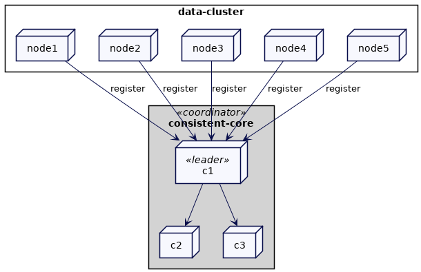
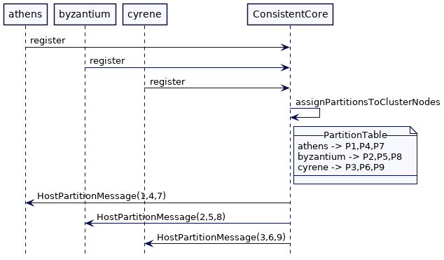
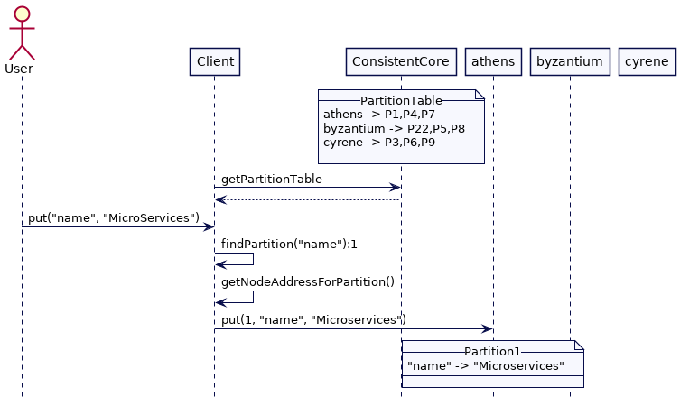
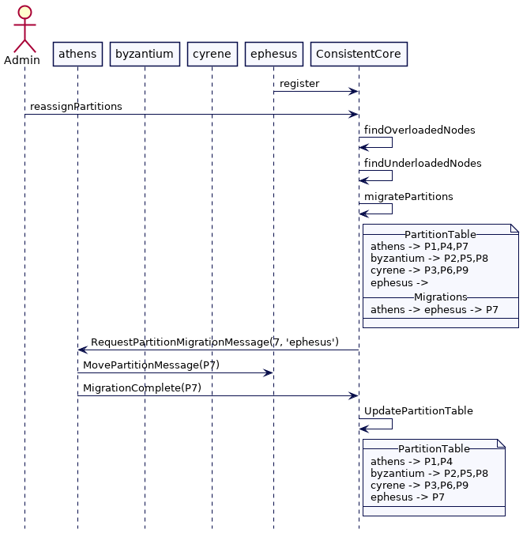

# 固定分区（Fixed Partitions）

保持固定数量的分区，以便在集群大小变化时能保持数据到分区的映射不变。

## 问题

为了跨一组集群节点分割数据，需要将每个数据项映射到这些节点。将数据映射到集群节点有两个要求。

- 分布应该均衡
- 应该可以知道哪个集群节点存储特定的数据项，而无需向所有节点发出请求

考虑一个键值存储，它是许多存储系统的良好代理，这两个要求都可以通过使用键的散列并使用模运算将其映射到集群节点来满足。所以如果我们有一个三节点的集群，我们可以将键 Alice, Bob, Mary 和 Philip 映射如下

| Keys   | Hash                                    | 节点索引（Hash%3） |
| ------ | --------------------------------------- | ------------------ |
| Alice  | 133299819613694460644197938031451912208 | 0                  |
| Bob    | 63479738429015246738359000453022047291  | 1                  |
| Mary   | 37724856304035789372490171084843241126  | 2                  |
| Philip | 83980963731216160506671196398339418866  | 2                  |

然而，这种方法会在集群节点数量发生变化时会有问题。如果有至少两个节点加入到集群，即集群中有5个节点。这是映射就会变成：

| Keys   | Hash                                    | 节点索引（Hash%3） |
| ------ | --------------------------------------- | ------------------ |
| Alice  | 133299819613694460644197938031451912208 | 3                  |
| Bob    | 63479738429015246738359000453022047291  | 1                  |
| Mary   | 37724856304035789372490171084843241126  | 1                  |
| Philip | 83980963731216160506671196398339418866  | 1                  |

几乎所有键的映射位置都发生了变化。即使只添加几个新的集群节点，也需要移动所有数据。当数据量很大时，这是不可取的。

## 解决方案

**将数据映射到逻辑分区。逻辑分区被映射到集群节点。**即使添加或删除了集群节点，数据到分区的映射也不会改变。集群启动时带有预先配置的分区数，在本例中为1024个。当向集群中添加新节点时（不超过1024），此编号不会改变。因此，使用键的散列将数据映射到分区的方式就会保持不变。

分区均匀分布在集群节点上是很重要的。**当将分区移动到新节点时，数据移动的部分应该相对较小，速度应该较快**。一旦配置，分区号不会改变;这意味着它应该有足够的空间来满足未来数据量的增长。

因此，所选择的分区数量应该明显高于集群节点的数量。例如，[Akka](https://akka.io/)建议应该有10倍于节点数量的分区。[Apache Ignite](https://ignite.apache.org/docs/latest/data-modeling/data-partitioning/)分区数的默认值为1024。对于小于100的集群，[Hazelcast](https://hazelcast.com/)的默认值是271。

数据存储或检索是一个两个步骤的过程。

- 首先要找到给定数据项的分区
- 然后就会找到存储分区的集群节点

当添加新的集群节点时，为了让数据在集群节点中保持均衡，可以将一些分区移动到新的节点上。

### 选择哈希函数

选择独立于平台和运行时具有相同散列值的散列方法是至关重要的。例如，Java等编程语言为每个对象提供散列。然而**，重点需要注意这个哈希值是依赖于 JVM 运行时的。即两个不同的 JVM 对于相同的 key 会产生不一样的值**。为了解决这个问题，使用了像 MD5 散列或 Murmur 哈希这样的散列算法。

```java
class HashingUtil {
  public static BigInteger hash(String key)
  {
      try
      {
          MessageDigest messageDigest = MessageDigest.getInstance("MD5");
          return new BigInteger(messageDigest.digest(key.getBytes()));
      }
      catch (Exception e)
      {
          throw new RuntimeException(e);
      }
  }
}
```

**<font color="red">键不映射到节点，而是映射到分区</font>**。考虑到有9个分区，表如下所示。在向集群添加新节点时，键到分区的映射不会改变

| Keys   | Hash                                    | Partition(Hash%9) | Node |
| ------ | --------------------------------------- | ----------------- | ---- |
| Alice  | 133299819613694460644197938031451912208 | 0                 | 0    |
| Bob    | 63479738429015246738359000453022047291  | 1                 | 1    |
| Mary   | 37724856304035789372490171084843241126  | 5                 | 1    |
| Philip | 83980963731216160506671196398339418866  | 2                 | 2    |

### 映射分区到集群节点

分区是需要映射到集群节点的。还需要存储映射，并使客户端能够访问映射。这通常是使用[一致性核心](Consistent-Core.md)；这两者都处理。专用的一致性核心充当协调者，跟踪集群中的所有节点并将分区映射到节点。它还使用[复制日志](Replicated-Log.md)以容错方式存储映射。[YugabyteDB](https://www.yugabyte.com/)中的主集群或[Kafka中的控制器实现](https://cwiki.apache.org/confluence/display/KAFKA/KIP-631%3A+The+Quorum-based+Kafka+Controller)都是很好的例子。

像[Akka](https://akka.io/)或[Hazelcast](https://hazelcast.com/)这样的点对点系统也需要一个特定的集群节点来充当协调器。他们使用[应急领导者](Emergent-Leader.md)作为协调者。

像[kubernetes](https://kubernetes.io/)这样的系统使用像[etcd](https://etcd.io/)这样的通用[一致性核心](Consistent-Core.md)。他们需要选择一个集群节点来充当这里讨论的协调器的角色

#### 跟踪集群成员



每个集群节点都将自己注册到一致性核心（consistent-core）。它还会定期发送一个[HeartBeat](HeartBeat.md)，以允许一致性核心检测节点故障

```java
class KVStore {
  ...
  public void start() {
      socketListener.start();
      requestHandler.start();
      network.sendAndReceive(coordLeader, new RegisterClusterNodeRequest(generateMessageId(), listenAddress));
      scheduler.scheduleAtFixedRate(()->{
          network.send(coordLeader, new HeartbeatMessage(generateMessageId(), listenAddress));
      }, 200, 200, TimeUnit.MILLISECONDS);

  }
}
```

协调器处理这个注册并存储这些成员信息

```java
class ClusterCoordinator {
  ...
  ReplicatedLog replicatedLog;
  Membership membership = new Membership();
  TimeoutBasedFailureDetector failureDetector = new TimeoutBasedFailureDetector(Duration.ofMillis(TIMEOUT_MILLIS));

  private void handleRegisterClusterNodeRequest(Message message) {
      logger.info("Registering node " + message.from);
      CompletableFuture completableFuture = registerClusterNode(message.from);
      completableFuture.whenComplete((response, error) -> {
          logger.info("Sending register response to node " + message.from);
          network.send(message.from, new RegisterClusterNodeResponse(message.messageId, listenAddress));
      });
  }

  public CompletableFuture registerClusterNode(InetAddressAndPort address) {
      return replicatedLog.propose(new RegisterClusterNodeCommand(address));
  }
}
```

当在[复制日志](Replicated-Log.md)中提交注册时，成员关系将被更新

```java
class ClusterCoordinator {
  ...
  private void applyRegisterClusterNodeEntry(RegisterClusterNodeCommand command) {
      updateMembership(command.memberAddress);
  }

  private void updateMembership(InetAddressAndPort address) {
      membership = membership.addNewMember(address);
      failureDetector.heartBeatReceived(address);
  }
}
```

协调者维护了集群中所有节点的列表：

```java
class Membership {
  ...
  public class Membership {
      List<Member> liveMembers = new ArrayList<>();
      List<Member> failedMembers = new ArrayList<>();
  
      public boolean isFailed(InetAddressAndPort address) {
          return failedMembers.stream().anyMatch(m -> m.address.equals(address));
      }
  }
  
  public class Member implements Comparable<Member> {
      InetAddressAndPort address;
      MemberStatus status;
      ...
}
```

协调器将使用类似于[Lease](Lease.md)的机制检测集群节点故障。如果集群节点停止发送心跳，该节点将被标记为失败。

```java
class ClusterCoordinator {
  ...
  @Override
  public void onBecomingLeader() {
      scheduledTask = executor.scheduleWithFixedDelay(this::checkMembership,
              1000,
              1000,
              TimeUnit.MILLISECONDS);
      failureDetector.start();
  }

  private void checkMembership() {
      List<Member> failedMembers = getFailedMembers();
      if (!failedMembers.isEmpty()) {
          replicatedLog.propose(new MemberFailedCommand(failedMembers));
      }
  }

  private List<Member> getFailedMembers() {
      List<Member> liveMembers = membership.getLiveMembers();
      return liveMembers.stream()
              .filter(m -> failureDetector.isMonitoring(m.getAddress()) && !failureDetector.isAlive(m.getAddress()))
              .collect(Collectors.toList());

  }
}
```

##### 例子

考虑这里有三个节点的集群，athens，byzantium，cyrene。我们预设9个分区，流程如下



客户端可以使用分区表将给定的键映射到特定的集群节点。



现在我们新增一个节点 ephesus 到集群中。管理员触发重新分配，协调器通过检查分区表来检查哪些节点负载不足。它发现 ephesus 是负载不足的节点，并决定分配分区7给它，将它从 athens 移出。协调器存储这次迁移，然后向 athens 发送请求，将分区7移动到 ephesus。一旦迁移完成，athens 会通知协调器。协调器然后更新分区表。



#### 为集群节点分配分区

协调器将分区分配给当时已知的集群节点。如果每次添加新的集群节点时都会触发它，它可能会过早映射分区，直到集群达到稳定状态。这就是为什么应该将协调器配置为等到集群达到最小大小。

第一次完成分区分配时，可以简单地以轮询方式完成。

```java
class ClusterCoordinator {
  ...
  CompletableFuture assignPartitionsToClusterNodes() {
      if (!minimumClusterSizeReached()) {
          return CompletableFuture.failedFuture(new NotEnoughClusterNodesException(MINIMUM_CLUSTER_SIZE));
      }
      return initializePartitionAssignment();
  }

  private boolean minimumClusterSizeReached() {
      return membership.getLiveMembers().size() >= MINIMUM_CLUSTER_SIZE;
  }

  private CompletableFuture initializePartitionAssignment() {
      partitionAssignmentStatus = PartitionAssignmentStatus.IN_PROGRESS;
      PartitionTable partitionTable = arrangePartitions();
      return replicatedLog.propose(new PartitiontableCommand(partitionTable));
  }

  public PartitionTable arrangePartitions() {
      PartitionTable partitionTable = new PartitionTable();
      List<Member> liveMembers = membership.getLiveMembers();
      for (int partitionId = 1; partitionId <= noOfPartitions; partitionId++) {
          int index = partitionId % liveMembers.size();
          Member member = liveMembers.get(index);
          partitionTable.addPartition(partitionId, new PartitionInfo(partitionId, member.getAddress(), PartitionStatus.ASSIGNED));
      }
      return partitionTable;
  }
}
```

复制日志能够让分区表持久化

```java
class ClusterCoordinator {
  ...
  PartitionTable partitionTable;
  PartitionAssignmentStatus partitionAssignmentStatus = PartitionAssignmentStatus.UNASSIGNED;

  private void applyPartitionTableCommand(PartitiontableCommand command) {
      this.partitionTable = command.partitionTable;
      partitionAssignmentStatus = PartitionAssignmentStatus.ASSIGNED;
      if (isLeader()) {
          sendMessagesToMembers(partitionTable);
      }
  }
}
```

一旦分区分配被持久化了，协调器就会向集群中所有节点发送消息，告知分区的归属。

```java
class ClusterCoordinator {
  ...
  List<Integer> pendingPartitionAssignments = new ArrayList<>();

  private void sendMessagesToMembers(PartitionTable partitionTable) {
      Map<Integer, PartitionInfo> partitionsTobeHosted = partitionTable.getPartitionsTobeHosted();
      partitionsTobeHosted.forEach((partitionId, partitionInfo) -> {
          pendingPartitionAssignments.add(partitionId);
          HostPartitionMessage message = new HostPartitionMessage(requestNumber++, this.listenAddress, partitionId);
          logger.info("Sending host partition message to " + partitionInfo.hostedOn + " partitionId=" + partitionId);
          scheduler.execute(new RetryableTask(partitionInfo.hostedOn, network, this, partitionId, message));
      });
  }
}
```

控制器将不断尝试到达节点，直到它的消息成功。

```java
class RetryableTask {
  ...
  static class RetryableTask implements Runnable {
      Logger logger = LogManager.getLogger(RetryableTask.class);
      InetAddressAndPort address;
      Network network;
      ClusterCoordinator coordinator;
      Integer partitionId;
      int attempt;
      private Message message;

      public RetryableTask(InetAddressAndPort address, Network network, ClusterCoordinator coordinator, Integer partitionId, Message message) {
          this.address = address;
          this.network = network;
          this.coordinator = coordinator;
          this.partitionId = partitionId;
          this.message = message;
      }

      @Override
      public void run() {
          attempt++;
          try {
              //stop trying if the node is failed.
              if (coordinator.isSuspected(address)) {
                  return;
              }
              logger.info("Sending " + message + " to=" + address);
              network.send(address, message);
          } catch (Exception e) {
              logger.error("Error trying to send ");
              scheduleWithBackOff();
          }
      }

      private void scheduleWithBackOff() {
          scheduler.schedule(this, getBackOffDelay(attempt), TimeUnit.MILLISECONDS);
      }


      private long getBackOffDelay(int attempt) {
          long baseDelay = (long) Math.pow(2, attempt);
          long jitter = randomJitter();
          return baseDelay + jitter;
      }

      private long randomJitter() {
          int i = new Random(1).nextInt();
          i = i < 0 ? i * -1 : i;
          long jitter = i % 50;
          return jitter;
      }

  }
}
```

当集群节点收到一个创建分区的请求时，它会使用给定的分区id创建一个分区。如果我们想象这种情况发生在一个简单的键值存储中，它的实现如下所示:

```java
class KVStore {
  ...
  Map<Integer, Partition> allPartitions = new ConcurrentHashMap<>();
  private void handleHostPartitionMessage(Message message) {
      Integer partitionId = ((HostPartitionMessage) message).getPartitionId();
      addPartitions(partitionId);
      logger.info("Adding partition " + partitionId + " to " + listenAddress);
      network.send(message.from, new HostPartitionAcks(message.messageId, this.listenAddress, partitionId));
  }

  public void addPartitions(Integer partitionId) {
      allPartitions.put(partitionId, new Partition(partitionId));

  }
}

class Partition {
  ...
  SortedMap<String, String> kv = new TreeMap<>();
  private Integer partitionId;
}
```

一旦协调器接收到了分区成功创建的消息，它就会持久化到复制日志中，并将分区状态更新为在线状态。

```java
class ClusterCoordinator {
  ...
  private void handleHostPartitionAck(Message message) {
      int partitionId = ((HostPartitionAcks) message).getPartitionId();
      pendingPartitionAssignments.remove(Integer.valueOf(partitionId));
      logger.info("Received host partition ack from " + message.from + " partitionId=" + partitionId + " pending=" + pendingPartitionAssignments);
      CompletableFuture future = replicatedLog.propose(new UpdatePartitionStatusCommand(partitionId, PartitionStatus.ONLINE));
      future.join();
  }
}
```

一旦到达了[高水位标记](High-Water-Mark.md)，并且应用这些记录，分区的状态将被更新。

```java
class ClusterCoordinator {
  ..
  private void updateParitionStatus(UpdatePartitionStatusCommand command) {
      removePendingRequest(command.partitionId);
      logger.info("Changing status for " + command.partitionId + " to " + command.status);
      logger.info(partitionTable.toString());
      partitionTable.updateStatus(command.partitionId, command.status);
  }
}
```

##### 客户端接口

如果我们重新考虑一个简单的键值存储的例子，如果一个客户端需要查询/存储指定键的值，它要通过下面几步：

- 客户端对键应用哈希函数，并基于分区的总数找到相关的分区。
- 客户端从协调者中获取分区表并找到了该分区的集群节点。客户端还会定期刷新分区表。

从协调器获取分区表的客户端可能很快就会导致瓶颈，尤其是当所有请求都由单个协调器处理时。这就是为什么通常的做法是在所有集群节点上只保持元数据可用。协调器可以将元数据推送到集群节点，或者集群节点可以从协调器提取元数据。然后，客户端可以连接到任何集群节点来刷新元数据。

这通常在键值存储提供的客户端库中实现，或者通过客户端请求处理(在集群节点上发生)实现。

```java
class Client {
  ...
    public void put(String key, String value) throws IOException {
      Integer partitionId = findPartition(key, noOfPartitions);
      InetAddressAndPort nodeAddress = getNodeAddressFor(partitionId);
      sendPutMessage(partitionId, nodeAddress, key, value);
  }

  private InetAddressAndPort getNodeAddressFor(Integer partitionId) {
      PartitionInfo partitionInfo = partitionTable.getPartition(partitionId);
      InetAddressAndPort nodeAddress = partitionInfo.getAddress();
      return nodeAddress;
  }

  private void sendPutMessage(Integer partitionId, InetAddressAndPort address, String key, String value) throws IOException {
      PartitionPutMessage partitionPutMessage = new PartitionPutMessage(partitionId, key, value);
      SocketClient socketClient = new SocketClient(address);
      socketClient.blockingSend(new RequestOrResponse(RequestId.PartitionPutKV.getId(),
                                                JsonSerDes.serialize(partitionPutMessage)));
  }

  public String get(String key) throws IOException {
      Integer partitionId = findPartition(key, noOfPartitions);
      InetAddressAndPort nodeAddress = getNodeAddressFor(partitionId);
      return sendGetMessage(partitionId, key, nodeAddress);
  }

  private String sendGetMessage(Integer partitionId, String key, InetAddressAndPort address) throws IOException {
      PartitionGetMessage partitionGetMessage = new PartitionGetMessage(partitionId, key);
      SocketClient socketClient = new SocketClient(address);
      RequestOrResponse response = socketClient.blockingSend(new RequestOrResponse(RequestId.PartitionGetKV.getId(), JsonSerDes.serialize(partitionGetMessage)));
      PartitionGetResponseMessage partitionGetResponseMessage = JsonSerDes.deserialize(response.getMessageBodyJson(), PartitionGetResponseMessage.class);
      return partitionGetResponseMessage.getValue();
  }
}
```

##### 移动分区至新添加的成员

当新节点加入到集群时，一些分区会移动至其它的节点。节点一旦增加，这个过程是自动发生的。但是它可能涉及到在集群节点之间移动的大量数据，这就是为什么管理员通常会触发重新分区。一种简单的方法是计算每个节点应该托管的分区的平均数量，然后将额外的分区移动到新节点。例如，如果分区数是30，以及在集群中有三个节点，则每个节点应该托管10个分区。如果新添加一个节点，那么每个节点就是7。因此协调器会尝试从集群节点中移动三个分区到新的节点。

```java
class ClusterCoordinator {
  ...
  List<Migration> pendingMigrations = new ArrayList<>();

  boolean reassignPartitions() {
      if (partitionAssignmentInProgress()) {
          logger.info("Partition assignment in progress");
          return false;
      }
      List<Migration> migrations = repartition(this.partitionTable);
      CompletableFuture proposalFuture = replicatedLog.propose(new MigratePartitionsCommand(migrations));
      proposalFuture.join();
      return true;
  }

  public List<Migration> repartition(PartitionTable partitionTable) {
    int averagePartitionsPerNode = getAveragePartitionsPerNode();
    List<Member> liveMembers = membership.getLiveMembers();
    var overloadedNodes = partitionTable.getOverloadedNodes(averagePartitionsPerNode, liveMembers);
    var underloadedNodes = partitionTable.getUnderloadedNodes(averagePartitionsPerNode, liveMembers);
    // 将分区移动至未过载的节点
    var migrations = tryMovingPartitionsToUnderLoadedMembers(averagePartitionsPerNode, overloadedNodes, underloadedNodes);
    return migrations;
}

  private List<Migration> tryMovingPartitionsToUnderLoadedMembers(int averagePartitionsPerNode,
                                                                Map<InetAddressAndPort, PartitionList> overloadedNodes,
                                                                Map<InetAddressAndPort, PartitionList> underloadedNodes) {
      List<Migration> migrations = new ArrayList<>();
      for (InetAddressAndPort member : overloadedNodes.keySet()) {
          var partitions = overloadedNodes.get(member);
          var toMove = partitions.subList(averagePartitionsPerNode, partitions.getSize());
          overloadedNodes.put(member, partitions.subList(0, averagePartitionsPerNode));
          ArrayDeque<Integer> moveQ = new ArrayDeque<Integer>(toMove.partitionList());
          while (!moveQ.isEmpty() && nodeWithLeastPartitions(underloadedNodes, averagePartitionsPerNode).isPresent()) {
              assignToNodesWithLeastPartitions(migrations, member, moveQ, underloadedNodes, averagePartitionsPerNode);
          }
          if (!moveQ.isEmpty()) {
              overloadedNodes.get(member).addAll(moveQ);
          }
      }
    return migrations;
  }

  int getAveragePartitionsPerNode() {
      return noOfPartitions / membership.getLiveMembers().size();
  }
}
```

协调器将把计算得到的迁移持久化到复制日志中，然后发送跨集群节点移动分区的请求。

```java
private void applyMigratePartitionCommand(MigratePartitionsCommand command) {
    logger.info("Handling partition migrations " + command.migrations);
    for (Migration migration : command.migrations) {
        RequestPartitionMigrationMessage message = new RequestPartitionMigrationMessage(requestNumber++, this.listenAddress, migration);
        pendingMigrations.add(migration);
        if (isLeader()) {
            scheduler.execute(new RetryableTask(migration.fromMember, network, this, migration.getPartitionId(), message));
        }
    }
}
```

当集群节点接收到迁移的请求时，它会将分区标记为迁移。这将停止对分区的任何进一步的修改。然后它将整个分区数据发送到目标节点。

```java
class KVStore {
  ...
  private void handleRequestPartitionMigrationMessage(RequestPartitionMigrationMessage message) {
      Migration migration = message.getMigration();
      Integer partitionId = migration.getPartitionId();
      InetAddressAndPort toServer = migration.getToMember();
      if (!allPartitions.containsKey(partitionId)) {
          return;// The partition is not available with this node.
      }
      Partition partition = allPartitions.get(partitionId);
      partition.setMigrating();
      network.send(toServer, new MovePartitionMessage(requestNumber++, this.listenAddress, toServer, partition));
  }
}
```

集群节点收到请求之后，就会将自己添加到新的分区并返回确认ack

```java
class KVStore {
  ...
  private void handleMovePartition(Message message) {
      MovePartitionMessage movePartitionMessage = (MovePartitionMessage) message;
      Partition partition = movePartitionMessage.getPartition();
      allPartitions.put(partition.getId(), partition);
      network.send(message.from, new PartitionMovementComplete(message.messageId, listenAddress,
              new Migration(movePartitionMessage.getMigrateFrom(), movePartitionMessage.getMigrateTo(),  partition.getId())));
  }
}
```

以前拥有该分区的集群节点将发送迁移完成消息给集群协调器

```java
class KVStore {
  ...
  private void handlePartitionMovementCompleteMessage(PartitionMovementComplete message) {
      allPartitions.remove(message.getMigration().getPartitionId());
      network.send(coordLeader, new MigrationCompleteMessage(requestNumber++, listenAddress,
              message.getMigration()));
  }
}
```

集群协调器然后会标记迁移为完成。这个变化过程会持久化到复制日志中。

```java
class ClusterCoordinator {
  ...
  private void handleMigrationCompleteMessage(MigrationCompleteMessage message) {
      MigrationCompleteMessage migrationCompleteMessage = message;
      CompletableFuture propose = replicatedLog.propose(new MigrationCompletedCommand(message.getMigration()));
      propose.join();
  }
  
  private void applyMigrationCompleted(MigrationCompletedCommand command) {
      pendingMigrations.remove(command.getMigration());
      logger.info("Completed migration " + command.getMigration());
      logger.info("pendingMigrations = " + pendingMigrations);
      partitionTable.migrationCompleted(command.getMigration());
  }
}

class PartitionTable {
  ...
  public void migrationCompleted(Migration migration) {
      this.addPartition(migration.partitionId, new PartitionInfo(migration.partitionId, migration.toMember, ClusterCoordinator.PartitionStatus.ONLINE));
  }
}
```

## 案例

在[Kafka](https://kafka.apache.org/)中，每个topic都有固定数量的分区

[Akka中的分片分配](https://doc.akka.io/docs/akka/current/typed/cluster-sharding.html#shard-allocation)配置了固定数量的分片。原则是让分片的数量是集群大小的10倍

内存中的数据网格产品(如[Apache Ignite 中的分区](https://ignite.apache.org/docs/latest/data-modeling/data-partitioning/)和[Hazelcast中的分区](https://docs.hazelcast.com/imdg/4.2/overview/data-partitioning))有固定数量的分区，这些分区是为它们的缓存配置的。

