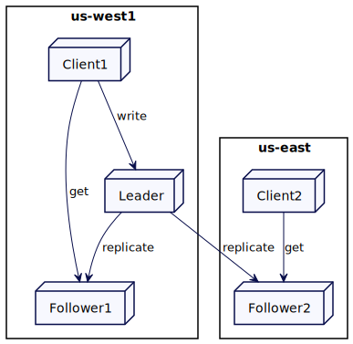
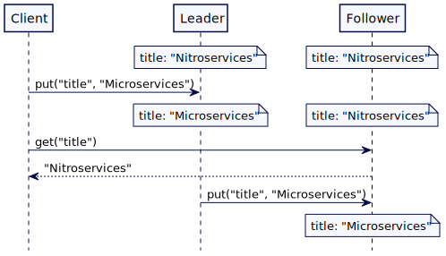
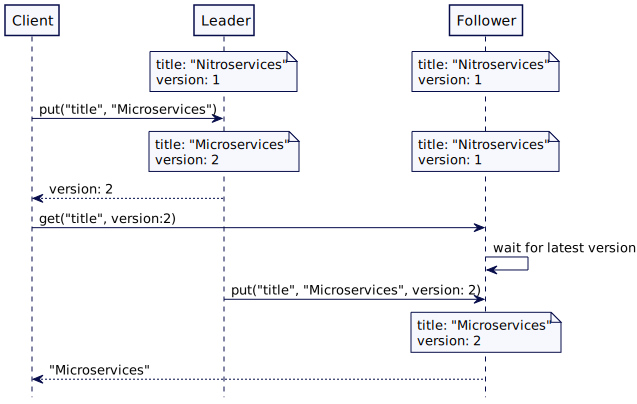

# 从读（Follower Reads）

在 follower 提供读请求服务，以实现更好的吞吐量和更低的延迟。

## 问题

当使用 Leader 和 follower 模式时，如果向 Leader 发送了太多请求，可能会导致 Leader 负载过大。此外，设置了多数据中心，位于远程数据中心的客户端，向leader 的请求将受到额外的延迟。

## 解决方案

**当写请求需要转到 leader 以保持一致性时，只读请求可以转到最近的 followe**r。当客户端大部分是只读时，这特别有用。

值得注意的是，从 follower 中读取的客户端可能会得到旧的值。leader 和 follower 之间总会有一个复制延迟(replication lag)，即使是在像 [raft](https://raft.github.io/) 这样实现共识算法的系统。这是因为，即使 leader 知道提交了哪些值，它也需要另外一条消息来与 follower 交互（通知）。所以从 follower 服务器读取数据只在允许稍微老一点的值的情况下使用。



​																						 从最近的从节点读取数据

## 查找最近复制点

关于这些节点的位置，集群节点维护了额外的元数据信息。

```java
class ReplicaDescriptor… 
  public class ReplicaDescriptor {
      public ReplicaDescriptor(InetAddressAndPort address, String region) {
          this.address = address;
          this.region = region;
      }
      InetAddressAndPort address;
      String region;
  
      public InetAddressAndPort getAddress() {
          return address;
      }
  
      public String getRegion() {
          return region;
      }
  }
```

集群客户端可以基于自己的区域选择本地副本。

```java
class ClusterClient…
  public List<String> get(String key) {
      List<ReplicaDescriptor> allReplicas = allFollowerReplicas(key);
      ReplicaDescriptor nearestFollower = findNearestFollowerBasedOnLocality(allReplicas, clientRegion);
      GetValueResponse getValueResponse = sendGetRequest(nearestFollower.getAddress(), new GetValueRequest(key));
      return getValueResponse.getValue();
  }

  ReplicaDescriptor findNearestFollowerBasedOnLocality(List<ReplicaDescriptor> followers, String clientRegion) {
      List<ReplicaDescriptor> sameRegionFollowers = matchLocality(followers, clientRegion);
      List<ReplicaDescriptor> finalList = sameRegionFollowers.isEmpty()?followers:sameRegionFollowers;
      return finalList.get(0);
  }

  private List<ReplicaDescriptor> matchLocality(List<ReplicaDescriptor> followers, String clientRegion) {
      return followers.stream().filter(rd -> clientRegion.equals(rd.region)).collect(Collectors.toList());
  }
```

例如，如果有两个 follower 副本，一个在美国西部地区，另一个在美国东部地区。来自西部区域的客户端，将连接到东部区域的副本。

```java
class CausalKVStoreTest… 
  public void getFollowersInSameRegion() {
      List<ReplicaDescriptor> followers = createReplicas("us-west", "us-east");
      ReplicaDescriptor nearestFollower = new ClusterClient(followers, "us-east").findNearestFollower(followers);
      assertEquals(nearestFollower.getRegion(), "us-east");
  }
```

集群客户端或协调的集群节点也可以跟踪观察集群节点的延迟。它可以定期发送 [HeartBeat](HeartBeat.md) 来捕获延迟，并使用它来获取具有最小延迟的从节点。为了做出更公平的选择，[mongodb](https://www.mongodb.com/) 或 [cockroachdb](https://www.cockroachlabs.com/docs/stable/) 等产品将延迟计算为移动平均数。集群节点通常维护一个 [Single Socket 通道](Single-Socket-Channel.md)来与其他集群节点通信。Single Socket 通道需要一个心跳来保持连接活跃。因此，捕获延迟和计算移动平均可以很容易地实现。

```java
class WeightedAverage… 
  public class WeightedAverage {
      long averageLatencyMs = 0;
      public void update(long heartbeatRequestLatency) {
          //Mongodb 使用加权平均实现的例子
          //运行时，心跳消息到目标节点的加权平均往返时间。
          // 加权80%为旧往返时间，20%为新往返时间。
          averageLatencyMs = averageLatencyMs == 0
                  ? heartbeatRequestLatency
                  : (averageLatencyMs * 4 + heartbeatRequestLatency) / 5;
      }
  
      public long getAverageLatency() {
          return averageLatencyMs;
      }
  }

class ClusterClient… 
  private Map<InetAddressAndPort, WeightedAverage> latencyMap = new HashMap<>();
  private void sendHeartbeat(InetAddressAndPort clusterNodeAddress) {
      try {
          long startTimeNanos = System.nanoTime();
          sendHeartbeatRequest(clusterNodeAddress);
          long endTimeNanos = System.nanoTime();

          WeightedAverage heartbeatStats = latencyMap.get(clusterNodeAddress);
          if (heartbeatStats == null) {
              heartbeatStats = new WeightedAverage();
              latencyMap.put(clusterNodeAddress, new WeightedAverage());
          }
          heartbeatStats.update(endTimeNanos - startTimeNanos);

      } catch (NetworkException e) {
          logger.error(e);
      }
  }
```

这个延迟信息可以用来选择网络延迟最小的从节点。

```java
class ClusterClient… 
  ReplicaDescriptor findNearestFollower(List<ReplicaDescriptor> allFollowers) {
      List<ReplicaDescriptor> sameRegionFollowers = matchLocality(allFollowers, clientRegion);
      List<ReplicaDescriptor> finalList
              = sameRegionFollowers.isEmpty() ? allFollowers
                                                :sameRegionFollowers;
      return finalList.stream().sorted((r1, r2) -> {
          if (!latenciesAvailableFor(r1, r2)) {
              return 0;
          }
          return Long.compare(latencyMap.get(r1).getAverageLatency(),
                              latencyMap.get(r2).getAverageLatency());

      }).findFirst().get();
  }

  private boolean latenciesAvailableFor(ReplicaDescriptor r1, ReplicaDescriptor r2) {
      return latencyMap.containsKey(r1) && latencyMap.containsKey(r2);
  }
```

## 断开或慢的从节点

follower 可能会与 leader 断开连接，停止更新。在某些情况下，缓慢的磁盘可能会阻碍整个复制过程，从而导致慢盘落后于 leader。follower 可以跟踪是否在一段时间内没有收到 leader 的消息，并停止为用户请求服务。

例如，像 [mongodb](https://www.mongodb.com/) 这样的产品允许选择一个具有[最大允许延迟时间](https://docs.mongodb.com/manual/core/read-preference-staleness/#std-label-replica-set-read-preference-max-staleness)的副本。如果副本滞后于 leader 的时间超过这个最大时间，它就不会被选择为请求服务。在[kafka](https://kafka.apache.org/) 中，如果 follower 检测到消费者请求的偏移量太大，它会响应 OFFSET_OUT_OF_RANGE 错误。然后消费者与 leader 通信。

## 读自己的写

从 follower 服务器读可能会有问题，因为在常见的场景中，客户端写了一些内容，然后立即尝试读取它，这可能会带来令人惊讶的结果。

假设有一个客户注意到一些图书数据错误地包含了 “title”:“Nitroservices”。它通过一个写一个 “title”: "Microservices" 来纠正这一点，这是给 leader 的。然后它立即读这个值，**但是读请求会转到一个可能还没有来得及更新的 follower**。



​																									从 follower 中读取旧值

这是一个常见的问题。例如，[直到最近](https://aws.amazon.com/about-aws/whats-new/2020/12/amazon-s3-now-delivers-strong-read-after-write-consistency-automatically-for-all-applications/)，Amazon S3 都没有阻止这种情况的发生。

为了解决这个问题，每次写入时，服务器不仅存储新值，而且还存储单调增长的版本戳(version stamp)。这个值(stamp)可以是[高水位标记](High-Water-Mark.md)或[混合时钟](Hybrid-Clock.md)。服务器在对写请求的响应中返回这个存储值的版本戳。然后，如果客户端希望稍后读取该值，它将版本戳作为其读请求的一部分。如果读请求转到一个 follower，它会检查它的存储值，看它是否等于或高于请求的版本戳记。如果不是，它会等到有了最新版本后再返回。这样，客户端将始终读取与它们写入的值一致的值—这通常称为**读自己的写一致性**。

请求的流程如下所示：为了纠正错误的写值，将 “title”:“Microservices“ 写给 leader。leader 在响应中将版本 2 返回给客户端。当客户端试图读取 “title” 的值时，它在请求中传递版本号 2。接收请求的 follower 服务器检查它自己的版本号是否是最新的。因为 follower 服务器上的版本号仍然是 1，所以它会等待，直到它从 leader 那里得到那个版本。一旦它有了匹配的(或更高的)版本，它就完成读请求，并返回值。



​																				从节点读取自己的写

简直存储的代码如下所示。值得注意的是 follower 可能会落后太多或与 leader 断开连接。所以它不会无限期地等待。会配置超时值。如果跟踪服务器不能在超时时间内获得更新，将返回一个错误响应给客户端。然后，客户端可以重试从其他从节点读取数据。

```java
class ReplicatedKVStore… 
  Map<Integer, CompletableFuture> waitingRequests = new ConcurrentHashMap<>();
  public CompletableFuture<Optional<String>> get(String key, int atVersion) {
      if(this.server.serverRole() == ServerRole.FOLLOWING) {
          //check if we have the version with us;
          if (!isVersionUptoDate(atVersion)) {
              //wait till we get the latest version.
              CompletableFuture<Optional<String>> future = new CompletableFuture<>();
              //Timeout if version does not progress to required version
              //before followerWaitTimeout ms.
              future.orTimeout(config.getFollowerWaitTimeoutMs(), TimeUnit.MILLISECONDS);
              waitingRequests.put(atVersion, future);
              return future;
          }
      }
      return CompletableFuture.completedFuture(mvccStore.get(key, atVersion));
  }

  private boolean isVersionUptoDate(int atVersion) {
      Optional<Integer> maxVersion = mvccStore.getMaxVersion();
      return maxVersion.map(v -> v >= atVersion).orElse(false);
  }
```

一旦键值存储传递给客户端请求的版本，它就可以向客户端发送响应。

```java
class ReplicatedKVStore… 
  private Response applyWalEntry(WALEntry walEntry) {
      Command command = deserialize(walEntry);
      if (command instanceof SetValueCommand) {
          return applySetValueCommandsAndCompleteClientRequests((SetValueCommand) command);
      }
      throw new IllegalArgumentException("Unknown command type " + command);
  }

  private Response applySetValueCommandsAndCompleteClientRequests(SetValueCommand setValueCommand) {
      getLogger().info("Setting key value " + setValueCommand);
      version = version + 1;
      mvccStore.put(new VersionedKey(setValueCommand.getKey(), version), setValueCommand.getValue());
      completeWaitingFuturesIfFollower(version, setValueCommand.getValue());
      Response response = Response.success(version);
      return response;
  }

  private void completeWaitingFuturesIfFollower(int version, String value) {
      CompletableFuture completableFuture = waitingRequests.remove(version);
      if (completableFuture != null) {
          completableFuture.complete(Optional.of(value));
      }
  }
```

## 线性读

有时读请求需要获得最新的可用数据。复制延迟是不能容忍的。在这些情况下，需要将读请求转到 leader。这是[一致性核心](Consistent-Core.md)解决的一个常见设计问题。

## 例子

- [neo4j](https://neo4j.com/docs/operations-manual/current/clustering/) 允许建立[因果集群(causal clusters)](https://neo4j.com/docs/operations-manual/current/clustering-advanced/lifecycle/#causal-clustering-lifecycle)。每个写操作返回一个书签，可以在对读副本执行查询时传递这个书签。书签确保客户端将始终获得在书签处写入的值。
- [mongodb](https://www.mongodb.com/) 在其副本集中保持[因果一致性](https://docs.mongodb.com/manual/core/causal-consistency-read-write-concerns/)。写操作返回 operationTime；这将在后续的读请求中传递，以确保读请求返回在读请求之前发生的写操作。
- [cockroachdb](https://www.cockroachlabs.com/docs/stable/) 允许客户端从从[节点服务器](https://www.cockroachlabs.com/docs/v20.2/follower-reads.html)读取。leader 服务器上完成写入，leader 服务器就会发布最新时间戳，称为关闭时间戳。如果在关闭的时间戳处有值，follower 允许读取值。
- [Kafka](https://kafka.apache.org/) 允许消费来自 [follower broker](https://cwiki.apache.org/confluence/display/KAFKA/KIP-392%3A+Allow+consumers+to+fetch+from+closest+replica) 的消息。follower 知道在 leader 的[高水位标志](High-Water-Mark.md)。在 kafka 的设计中，不是等待最新的更新，而是返回一个OFFSET_NOT_AVAILABLE 错误给消费者，并期望消费者重试。

## 原文

https://martinfowler.com/articles/patterns-of-distributed-systems/follower-reads.html