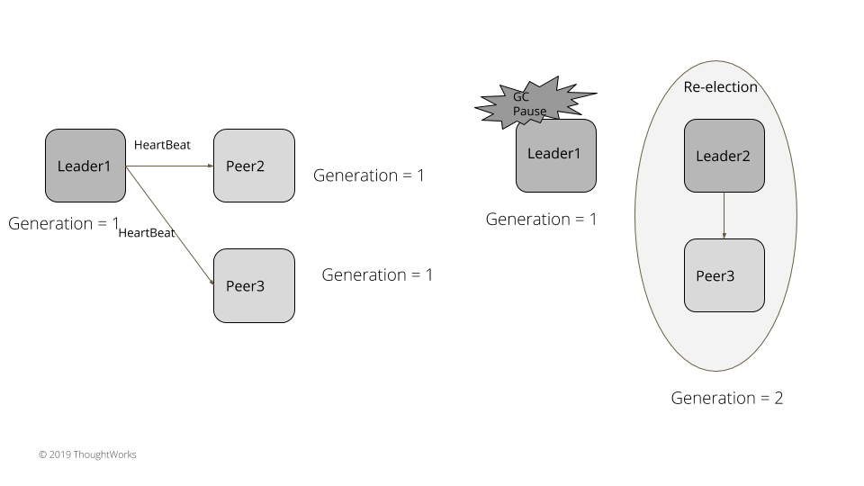
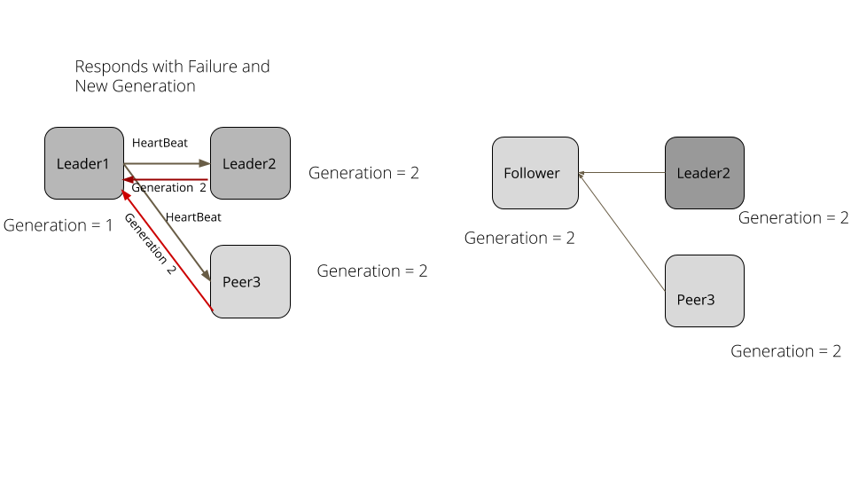

# 时钟生成器

一个递增的数字，表示服务器的生成。

## 问题

在 [Leader 和 Follwers](https://martinfowler.com/articles/patterns-of-distributed-systems/leader-follower.html) 的设置中，可能会存在 leader 临时与 followers 断开连接。这可能是由垃圾回收导致的暂停，或者是网络的临时中断导致的。在这个例子中，leader 进程还在运行，是在暂停和网络扰乱之后，它仍旧在尝试发送备份请求到 follwers。同时集群的其它 follower 会选择一个新的 leader 并从旧 leader 中接收请求，这个行为非常危险。旧 leader 它自己应该可以探测出暂时与集群断开连接了，并采取必要的纠正措施从领导者身份退出。

## 解决方案

保持一个单调递增的数字，来表示服务器的生成。每次新选举了一位 leader，它应该通过生成一个自增长数字标记一下。生成器需要在服务重启之后可用，所以它每次都会存到[预写记录日志（WAL）](https://martinfowler.com/articles/patterns-of-distributed-systems/wal.html)中。我们也讨论过了 [High-Water Mark](https://martinfowler.com/articles/patterns-of-distributed-systems/high-watermark.html)，followers 会使用这些信息来发现其中的冲突。

在启动时，服务器需要从日志中读取最新的生成值。

```c#
class ReplicationModule {
	this.replicationState = new ReplicationState(config, wal.GetLastLogEntryGeneration());
}
```

有了 [Leader 和 Follwers](https://martinfowler.com/articles/patterns-of-distributed-systems/leader-follower.html)，服务器就会在每次选举新的领袖时生成自增长数字。

```c#
class ReplicationModule {
	private void StartLeaderElection() {
		replicationState.SetGeneration(replicationState.GetGeneration() + 1);
		RegistSelfVote();
		RequestVoteFrom(followers);
	}
}
```

服务器就会发送生成后的值作为投票请求的一部分给其它服务器。这种方式，在成功选举之后，所有的服务器就会有相同的生成值。一旦 leader 被选出，followers 就会知道新的生成值

```c#
private void BecomeFollower(long generation) {
	replicationState.SetGeneration(generation);
	TransitionTo(ServerRole.FOLLOWING);
}
```

因此，leader 在每个请求中都包含这个生成值发送给 followers。它还包括在每个心跳检查消息里以及发送给 followers 的备份请求中。

leader 连同每个条目和生成值保存在 WAL 中

```c#
long AppendToLocalLog(byte[] data) {
	var logEntryId = wal.GetLastLogEntryId() + 1;
	var logEntry = new WALEntry(logEntryId, data, EntryType.DATA, replicationState.GetGeneration());
	return wal.WriteEntry(logEntry);
}
```

这样，作为 Leader和follower 复制机制的一部分，它也被持久化到 follower 日志中。

如果一个 follower 从一个废弃的 leader 中获得一个消息，follower 它知道这个 leader 的 generation 值太低了，就会回复失败的响应体。

```c#
long currentGeneration = replicationState.GetGeneration();
if(currentGeneration > replicationRequest.GetGeneration()) {
	return new ReplicationResponse(FAILED, ServerId(), currentGeneration, wal.getLastLogEntryId());
}
```

当一个 leader 获取了这个失败的返回体，它就会变成 follower 并如期跟着新的 leader 通信。

```c#
// 失效的 leader
if (!response.IsSuccessded()) {
	StepDownIfHigherGenerationReponse(response);
	return;
}

private void StepDownIfHigherGenerationReponse(ReplicationResponse replicationResponse) {
	if (replicationResponse.GetGeneration() > replicationState.GetGeneration()) {
		BecomeFollwer(replicationResponse.GetGeneration());
	}
}
```

考虑下面例子。有三个集群，leader1 是已经存在的 leader。在集群中所有的服务器都有一个 1 的 generation。Leader1 连续发送心跳检查给 followers。leader1 发生了垃圾回收导致暂停了 5 秒。followers 没有得到心跳检查的返回，于是选举了新的 leader。这个新的 leader 生成了 2 的 generation。GC 过后，leader1 继续发送请求给其它 followers 服务器。followers 和新的 leader 的 generation 都变成了 2，就会拒绝请求并带最新的 generation 的返回体回去。leader1 处理这个失败的返回体并下台变成 follower，并更新自己的 generation 的值为 2。





## 例子

### Raft

[Raft](https://raft.github.io/) 使用一个术语的概念来标记 leader generation。

### Zab

在 [Zookeeper](https://zookeeper.apache.org/doc/r3.4.13/zookeeperInternals.html#sc_atomicBroadcast) 中，epoch 号作为每个传输 id 的一部分进行维护。因此，在 Zookeeper 中持久化的每个传输都有一个以 epoch 标记的 generation。

### Cassandra

在 [Cassandra](http://cassandra.apache.org/) 中，每个服务器存储一个生成编号，该编号在服务器每次重启时递增。generation 信息保存在系统密钥空间中，并作为附属消息的一部分传播到其他服务器。服务器会接收这个信息并比较它所知道的 generation 值。如果在消息的 generation 的值高，那它就知道服务重启过并丢弃了它正在维护的所有状态，然后请求一个新的状态。

### Epoch's in Kafka

在 [Kafka](https://kafka.apache.org/) 中，每次为 Kafka 集群选择一个新控制器时，都会创建一个 epoch 数并存储在 Zookeeper 中。这个 epoch 包含了在每个请求，这个请求从控制器发送到集群中其它服务器中。另一个维护的被称为 [LeaderEpoch](https://cwiki.apache.org/confluence/display/KAFKA/KIP-101+-+Alter+Replication+Protocol+to+use+Leader+Epoch+rather+than+High+Watermark+for+Truncation)，是以了解一个分区的 follower 是否落后于他们的高水位标记。


原文：https://martinfowler.com/articles/patterns-of-distributed-systems/generation.html

