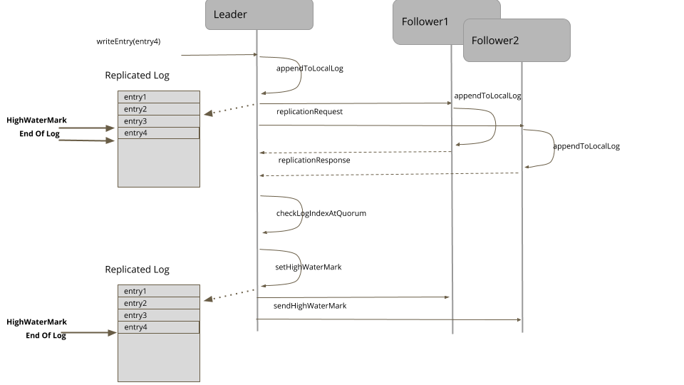
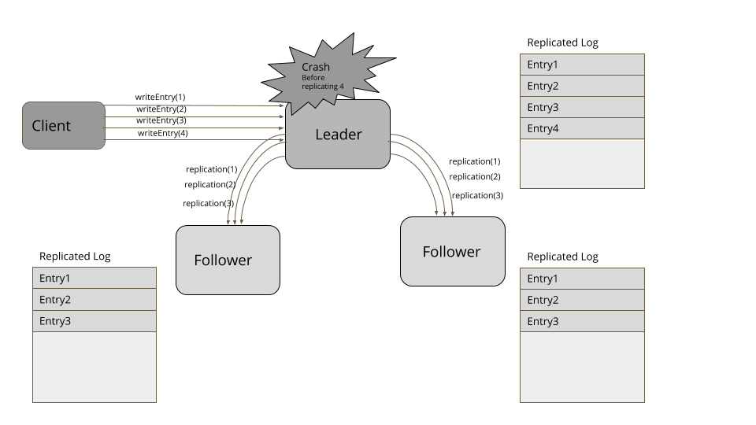
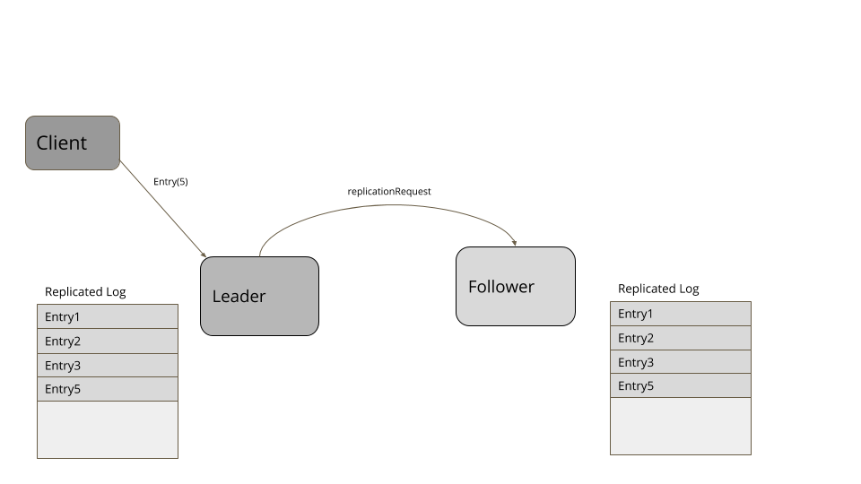
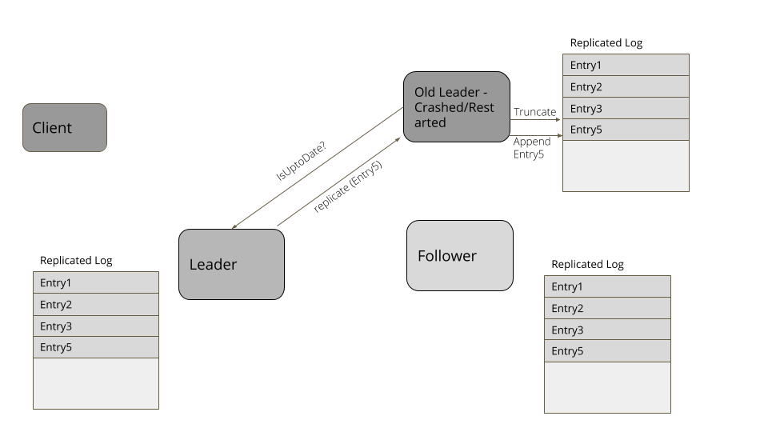

# 高水位标记(High-Water Mark)

描述：是一个索引，表示写在日志里来显示最后一次成功复制。

## 问题

[WAL](https://martinfowler.com/articles/patterns-of-distributed-systems/wal.html) 模式是用在服务器崩溃以及重启之后来恢复状态。但是单单一个 write-ahead 日志还不足以在服务器故障场景下提供一个高可用的能力。如果是单服务器故障，客户端将无法工作，直到服务器重启。为了让系统更加高可用，我们在多个服务器上备份了日志。使用 [Leader 和 Follower](https://martinfowler.com/articles/patterns-of-distributed-systems/leader-follower.html)，leader 备份所有的日志条目到[选举](https://martinfowler.com/articles/patterns-of-distributed-systems/quorum.html)的 Followers。现在 leader 故障了，一个新的 leader 就会被选举出来并且大多数客户端能在集群下像之前正常工作。但是这里仍然会有一些事情导致故障：

- 在发送日志条目到所有 followers 之前 leader 就发生了故障
- 在发送日志条目到一些 followers 之后 leader 发生故障，但无法发送给大多数 followers。

## 解决方案

高水位标记是在日志文件中记录最后的日志条目的一个索引，这个日志条目记录着成功备份到 followers。leader 在备份期间，在高水位线上传递给它的 followers。在集群下所有的服务器都应该只向低于高水位线标记更新的客户端传输数据。

下面是操作顺序



对于每个日志条目，leader 会追加日志到本地 wal，然后发给所有的 followers。

```java
leader (class ReplicationModule...)
private Long appendAndReplicate(byte[] data) {
      Long lastLogEntryIndex = appendToLocalLog(data);
      logger.info("Replicating log entries from index " + lastLogEntryIndex);
      replicateOnFollowers(lastLogEntryIndex);
      return lastLogEntryIndex;
}
private void replicateOnFollowers(Long entryAtIndex) {
      for (final FollowerHandler follower : followers) {
          replicateOn(follower, entryAtIndex); //send replication requests to followers
      }
}
```

followers 处理复制请求并将日志条目附加到它们的本地日志中。在成功附加日志条目之后，它们将使用它们拥有的最新日志条目的索引来响应 leader。该响应还包括服务器的当前[生成时钟](https://martinfowler.com/articles/patterns-of-distributed-systems/generation.html)。

```java
follower (class ReplicationModule...) 
private ReplicationResponse handleReplicationRequest(ReplicationRequest replicationRequest) {
      List<WALEntry> entries = replicationRequest.getEntries();
      for (WALEntry entry : entries) {
          logger.info("Applying log entry " + entry.getEntryId() + " in " + serverId());
          wal.writeEntry(entry);
      }
      return new ReplicationResponse(SUCCEEDED, serverId(), replicationState.getGeneration(), wal.getLastLogEntryId());
}
```

当收到响应时，leader 要时刻保持在每个服务器的备份日志索引的追踪。

```java
class ReplicationModule…

recordReplicationConfirmedFor(response.getServerId(), response.getReplicatedLogIndex());
long logIndexAtQuorum = computeHighwaterMark(logIndexesAtAllServers(), config.numberOfServers());
if (logIndexAtQuorum > replicationState.getHighWaterMark()) {
      var previousHighWaterMark = replicationState.getHighWaterMark();
      applyLogAt(previousHighWaterMark, logIndexAtQuorum);
      replicationState.setHighWaterMark(logIndexAtQuorum);
}
```

高水位线标记能够通过查看 followers 以及自己日志的日志索引来计算出来，并且获取(picking up)在大多数服务器可用的索引。

```java
class ReplicationModule…
  Long computeHighwaterMark(List<Long> serverLogIndexes, int noOfServers) {
      serverLogIndexes.sort(Long::compareTo);
      return serverLogIndexes.get(noOfServers / 2);
  }
```

无论常规的心跳检查或是一个单独的请求，leader 都会传递高水位线给 followers。然后 followers 就根据次来设置高水位标记。

所有客户端只有在高水位线下才能读取这个日志条目。日志条目超出了这个高水位标记，那么对于客户端来说就不可见的，因为这个条目没有确认是否备份，所以当 leader 故障，并且有一些服务器会被选举称为 leader 时。它们可能是不可用的。

```java
class ReplicationModule…
  public WALEntry readEntry(long index) {
      if (index > replicationState.getHighWaterMark()) {
          throw new IllegalArgumentException("Log entry not available");
      }
      return wal.readAt(index);
  }
```

## 日志截断(Log Truncation)

当一个服务器奔溃或重启时加入集群，这里有一些可能会在日志里发生一些冲突日志条目。无论何时这个服务器加入到集群，集群的 leader 都要知道日志里的潜在冲突的条目。然后截断日志到 leader 具体匹配到那个条目的地方，然后使用后续的条目来更新日志以确保集群的日志能够匹配。

思考下面的例子。客户端发送一个请求，在日志中添加 4 个条目。 leader 成功备份了 3 个 followers，但是在添加 entry4 到自己日志之后失败了。followers 中的一个会被选择称为新的 leader 并接受更多来自客户端的条目。当失败的时候，leader 会重新加入这个集群，那么 entry4 就冲突了。所以它需要截断日志直到 entry3，然后添加 entry5 添加到一个匹配的使用集群其余的日志。



​																											上图为 leader 失败的场景



​																									上图为新的 leader



​																									日志截断

任何一个重启或重新加入集群的服务器在一个暂停之后，找到新的 leader。然后它就会询问当前的高水位标记，截断日志到高水位线，然后就能从这个新 leader 获取所有超过高水位标记的日志项。

像 RAFT 这样的复制算法可以通过检查自己日志中的日志项和请求中的日志项来找出冲突项。将删除具有相同日志索引但处于较低[生成时钟](https://martinfowler.com/articles/patterns-of-distributed-systems/generation.html)的条目。

class ReplicationModule…

```java
  private void maybeTruncate(ReplicationRequest replicationRequest) throws IOException {
      if (replicationRequest.hasNoEntries() || wal.isEmpty()) {
          return;
      }

      List<WALEntry> entries = replicationRequest.getEntries();
      for (WALEntry entry : entries) {
          if (wal.getLastLogEntryId() >= entry.getEntryId()) {
              if (entry.getGeneration() == wal.readAt(entry.getEntryId()).getGeneration()) {
                  continue;
              }
              wal.truncate(entry.getEntryId());
          }
      }
  }
```

支持日志截断的简单的实现就是映射日志索引和文件位置。然后日志就能通过给定的索引来截断，像下面的例子一样：

```java
  class WALSegment…
  public void truncate(Long logIndex) throws IOException {
      var filePosition = entryOffsets.get(logIndex);
      if (filePosition == null) throw new IllegalArgumentException("No file position available for logIndex=" + logIndex);

      fileChannel.truncate(filePosition);
  }
```

## 例子

- 所有的一致性算法都使用高水位标记的概念来知道何时应用提出的状态改变。例如在 [RAFT](https://raft.github.io/) 的一致性算法中，高水位标记被称为 'CommitIndex'。
- 在 [Kafka 备份协议](https://www.confluent.io/blog/hands-free-kafka-replication-a-lesson-in-operational-simplicity/) 中，维护了一个名为 ''high-water mark' 的独立索引。消费者只有到达了这个 high-water mark 值才能看到条目。
- [Apache BookKeeper](https://bookkeeper.apache.org/)里有一个 '[最后添加确认](https://bookkeeper.apache.org/archives/docs/r4.4.0/bookkeeperProtocol.html)' 的概念，它是一个成功在参与选举的 bookies 中备份的条目。

原文链接：https://martinfowler.com/articles/patterns-of-distributed-systems/high-watermark.html


