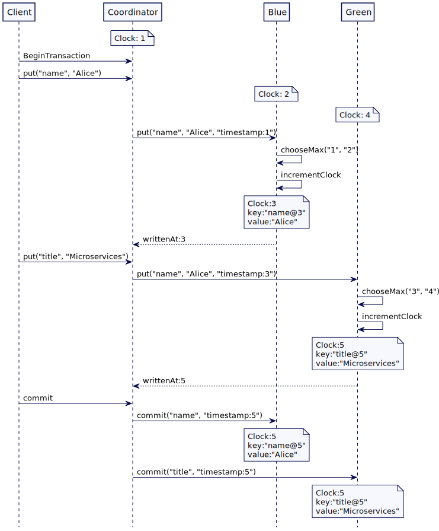

# 混合时钟（Hybrid Clock）

使用**系统时间戳和逻辑时间戳的组合来将日期-时间作为版本**，可以对其进行排序

## 问题

当 [Lamport Clock](Lamport-Clock.md) 被用作 [Versioned Value](Versioned-Value.md) 中的一个 version 时，客户端并不知道存储特定版本的实际日期-时间。对于客户端来说，使用日期-时间（如 01-01-2020）来访问 version，而不是使用整数（如1、2、3）是很有用的。

## 解决方案

[混合逻辑时钟(Hybrid Logical Clock)](https://cse.buffalo.edu/tech-reports/2014-04.pdf) 提供了一种方式，它有一个 version 是单调地增加，就像一个简单的整数，但是它还和实际的日期时间有关联。[mongodb](https://www.mongodb.com/blog/post/transactions-background-part-4-the-global-logical-clock) 或 [cockroachdb](https://www.cockroachlabs.com/docs/stable/architecture/transaction-layer.html) 等数据库在实践中使用了混合时钟。

一个混合逻辑时钟的实现方法如下：

```java
class HybridClock… 
  public class HybridClock {
      private final SystemClock systemClock;
      private HybridTimestamp latestTime;
      public HybridClock(SystemClock systemClock) {
          this.systemClock = systemClock;
          this.latestTime = new HybridTimestamp(systemClock.currentTimeMillis(), 0);
      }
```

它将最新的时间作为混合时间戳的一个实例来维护，**混合时间戳是使用系统时间和一个整数计数器构造的**。

```java
class HybridTimestamp… 
  public class HybridTimestamp implements Comparable<HybridTimestamp> {
  	  private final long wallClockTime;
      private final int ticks;
  
      public HybridTimestamp(long systemTime, int ticks) {
          this.wallClockTime = systemTime;
          this.ticks = ticks;
      }
  
      public static HybridTimestamp fromSystemTime(long systemTime) {
          return new HybridTimestamp(systemTime, -1); //initializing with -1 so that addTicks resets it to 0
      }
  
      public HybridTimestamp max(HybridTimestamp other) {
          if (this.getWallClockTime() == other.getWallClockTime()) {
              return this.getTicks() > other.getTicks()? this:other;
          }
          return this.getWallClockTime() > other.getWallClockTime()?this:other;
      }
  
      public long getWallClockTime() {
          return wallClockTime;
      }
  
      public HybridTimestamp addTicks(int ticks) {
          return new HybridTimestamp(wallClockTime, this.ticks + ticks);
      }
  
      public int getTicks() {
          return ticks;
      }
  
      @Override
      public int compareTo(HybridTimestamp other) {
          if (this.wallClockTime == other.wallClockTime) {
              return Integer.compare(this.ticks, other.ticks);
          }
          return Long.compare(this.wallClockTime, other.wallClockTime);
      }
  }
```

混合时钟可以使用与 [Lamport 时钟](Lamport-Clock.md)版本完全相同的方式。每个服务器都有一个混合时钟的实例。

```java
class Server…

  HybridClockMVCCStore mvccStore;
  HybridClock clock;

  public Server(HybridClockMVCCStore mvccStore) {
      this.clock = new HybridClock(new SystemClock());
      this.mvccStore = mvccStore;
  }
```

每次写入一个值时，都会有一个混合时间戳与之关联。窍门是检查系统时间值是否在时间上回退，如果是这样，自增另一个数字代表组件逻辑部分来反映时钟进度。

```java
class HybridClock…

  public synchronized HybridTimestamp now() {
      long currentTimeMillis = systemClock.currentTimeMillis();
      if (latestTime.getWallClockTime() >= currentTimeMillis) {
           latestTime = latestTime.addTicks(1);
      } else {
          latestTime = new HybridTimestamp(currentTimeMillis, 0);
      }
      return latestTime;
  }
```

服务器从客户端接收到的每个写请求都带有一个时间戳。接收服务器将自己的时间戳与请求的时间戳进行比较，并将自己的时间戳设置为两者中较高的一个。

```java
class Server… 
  public HybirdTimestamp write(String key, String value, HybridTimestamp requestTimestamp) {
      // update own clock to reflect causality
      HybridTimestamp writeAtTimestamp = clock.tick(requestTimestamp);
      mvccStore.put(key, writeAtTimestamp, value);
      return writeAtTimestamp;
  }

class HybirdClock...
  public synchronized HybridTimestamp tick(HybridTimestamp requestTime) {
      long nowMillis = systemClock.currentTimeMillis();
      //set ticks to -1, so that, if this is the max, the next addTicks reset it to zero.
      HybridTimestamp now = HybridTimestamp.fromSystemTime(nowMillis);
      latestTime = max(now, requestTime, latestTime);
      latestTime = latestTime.addTicks(1);
      return latestTime;
  }
  
  private HybridTimestamp max(HybridTimestamp ...times) {
      HybridTimestamp maxTime = times[0];
      for (int i = 1; i < times.length; i++) {
          maxTime = maxTime.max(times[i]);
      }
      return maxTime;
  }
```

这个时间戳用于写入值时返回给客户端。请求客户端更新自己的时间戳，然后使用这个时间戳发出进一步的写操作。

```java
class Client… 
  HybridClock clock = new HybridClock(new SystemClock());
  public void write() {
      HybridTimestamp server1WrittenAt = server1.write("key1", "value1", clock.now());
      clock.tick(server1WrittenAt);

      HybridTimestamp server2WrittenAt = server2.write("key2", "value2", clock.now());

      assertTrue(server2WrittenAt.compareTo(server1WrittenAt) > 0);
  }
```

## 混合时钟多版本存储

当值存储在键值存储区时，可以使用混合时间戳作为版本。这些值存储的方式在 [Versioned Value](Versioned-Value.md) 有讨论。

```java
class HybridClockReplicatedKVStore… 
  private Response applySetValueCommand(VersionedSetValueCommand setValueCommand) {
      mvccStore.put(setValueCommand.getKey(), setValueCommand.timestamp, setValueCommand.value);
      Response response = Response.success(setValueCommand.timestamp);
      return response;
  }

class HybridClockMVCCStore… 
  ConcurrentSkipListMap<HybridClockKey, String> kv = new ConcurrentSkipListMap<>();

  public void put(String key, HybridTimestamp version, String value) {
      kv.put(new HybridClockKey(key, version), value);
  }

class HybridClockKey…
  public class HybridClockKey implements Comparable<HybridClockKey> {
      private String key;
      private HybridTimestamp version;
  
      public HybridClockKey(String key, HybridTimestamp version) {
          this.key = key;
          this.version = version;
      }
  
      public String getKey() {
          return key;
      }
  
      public HybridTimestamp getVersion() {
          return version;
      }
  
      @Override
      public int compareTo(HybridClockKey o) {
          int keyCompare = this.key.compareTo(o.key);
          if (keyCompare == 0) {
              return this.version.compareTo(o.version);
          }
          return keyCompare;
      }
```

读取值的方式与[版本键的排序](https://github.com/MarsonShine/MS.Microservice/blob/master/docs/patterns-of-distributed-systems/Versioned-Value.md#%E7%89%88%E6%9C%AC%E9%94%AE%E7%9A%84%E6%8E%92%E5%BA%8F)中所讨论的完全一样。通过使用混合时间戳作为键的后缀，versioned 键以这种排列方式可以形成自然顺序。这个实现使我们能够使用 map 的 API 获取特定版本的值。

```java
class HybridClockMVCCStore…
  public Optional<String> get(String key, HybridTimestamp atTimestamp) {
      Map.Entry<HybridClockKey, String> versionKeys = kv.floorEntry(new HybridClockKey(key, atTimestamp));
      getLogger().info("Available version keys " + versionKeys + ". Reading@" + versionKeys);
      return (versionKeys == null)? Optional.empty(): Optional.of(versionKeys.getValue());
  }
```

## 混合时间戳转换为日期时间

混合时钟可以通过合并系统时间戳和逻辑事件编号（logical clicks number）转换为实际的时间戳值。正如在 [hybrid-clock 论文](https://cse.buffalo.edu/tech-reports/2014-04.pdf)中所提到的，**系统时间的前 48 位可以被保留，较低的 16 位可以被逻辑计数器取代。**

```java
class HybridTimestamp… 
  public LocalDateTime toDateTime() {
      return LocalDateTime.ofInstant(Instant.ofEpochMilli(epochMillis()), ZoneOffset.UTC);
  }
  
  public long epochMillis() {
      //Compact timestamp as discussed in https://cse.buffalo.edu/tech-reports/2014-04.pdf.
      return (wallClockTime >> 16 << 16) | (ticks << 48 >> 48);
  }
```

## 分配时间戳给分布式事务

像 [mongodb](https://www.mongodb.com/) 和 [cockroachdb](https://www.cockroachlabs.com/docs/stable/) 这样的数据库使用了 [Hybrid Clock](Hybrid-Clock.md) 来维护分布式所的因果关系（causality）。使用分布式锁，需要重点注意的是，在事务提交的时候作为事务的一部分所有存储的值都应在跨服务器的相同的时间戳。因此，请求服务器与所有参与服务器通信，告知事务提交时它收到的最高时间戳。这个非常适合用[两阶段](https://en.wikipedia.org/wiki/Two-phase_commit_protocol)协议实现的事务。

下面例子展示了如何在事务提交时确定最高时间戳。假设这里有三台服务器。服务器 Blue 存储名称，服务器 Green 存储标题。有一个单独的服务器作为协调器。正如所见，每个服务器都有自己不同的逻辑时钟值。这可以是一个单一的整数或混合时钟。作为协调者服务器以已知的时钟值 1 开始向服务器 Blue 写入数据。但是 Blue 的时钟是 2，所以它将其自增，并在时间戳 3 处写入值。时间戳 3 以响应体形式返回给协调者。对于所有随后发送到其他服务器的请求，协调器使用时间戳 3。服务器 Green 在请求中接收到了时间戳 3，但是它的时钟是 4。所以它会选择更高的值，也就是 4。自增并在时间戳 5 写入值并返回给协调者。当事务提交时，协调者使用它收到的最高时间戳来提交事务。事务中更新的所有值都将存储在这个最高时间戳处。



​																					（跨服务传播提交时间戳）

关于时间戳处理程序使用事务一个非常简单的代码如下所示：

```java
class TransactionCoordinator…
	public Transaction beginTransaction() {
			return new Transaction(UUID.randomUUID().toString());
	}
	
	public void putTransactionally() {
			Transaction txn = beginTransaction();
			HybridTimestamp coordinatorTime = new HybridTimestamp(1);
			HybridTimestamp server1WriteTime
              = server1.write("name", "Alice", coordinatorTime, txn);

      HybridTimestamp server2WriteTime = server2.write("title", "Microservices", server1WriteTime, txn);

      HybridTimestamp commitTimestamp = server1WriteTime.max(server2WriteTime);
      commit(txn, commitTimestamp);
	}
	
	private void commit(Transaction txn, HybridTimestamp commitTimestamp) {
			server1.commitTxn("name", commitTimestamp, txn);
			server2.commitTxn("title", commitTimestamp, txn);
	}
```

事务实现还可以使用两阶段提交协议的准备阶段来了解每个参与服务器使用的最高时间戳。

## 例子

[mongodb](https://www.mongodb.com/) 在它的 MVCC 存储中使用混合时间戳来维护版本。

[cockrachdb](https://www.cockroachlabs.com/docs/stable/) 使用分布式事务用了混合时间戳来维护因果关系（causality）