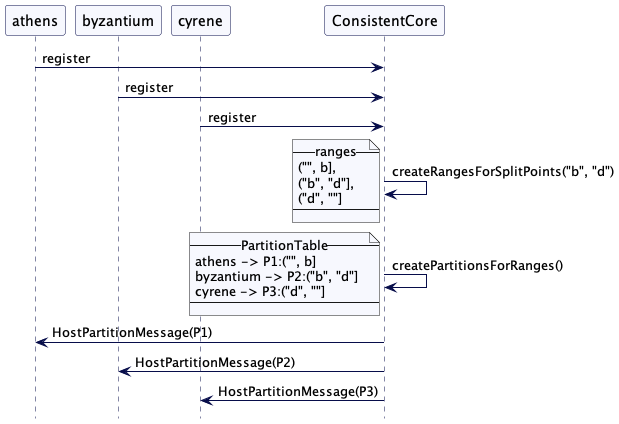
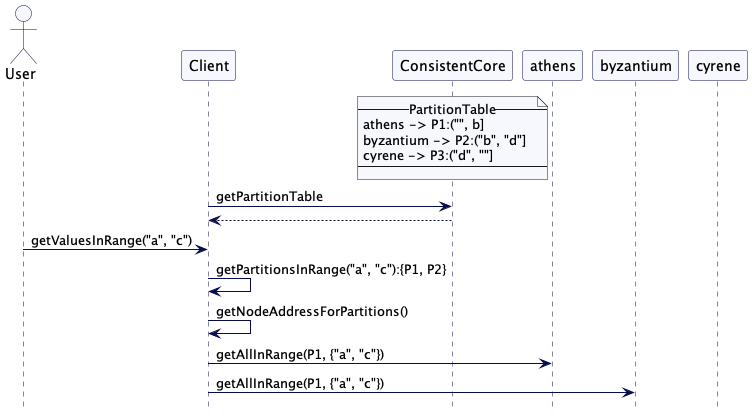
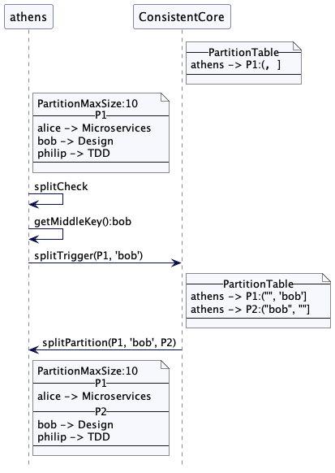

# 键范围分区（Key-Range Partitions）

在已排序的键范围内对数据进行分区，以有效地处理范围查询。

## 问题

为了在集群节点中横跨节点分割数据，每个数据项都需要被映射到一个节点上。如果用户想要查询键的范围，只指定开始和结束键，则需要查询所有的分区才能获取到。为单个请求查询每个分区这并非最佳选择。

假设我们有一个键值存储的例子，我们可以使用基于散列的映射存储作者姓名。(在[固定分区](Fixed-Partition.md)中使用过)。

| Keys   | Hash                                    | 分区(Hash%总分区数) | Node |
| ------ | --------------------------------------- | ------------------- | ---- |
| alice  | 133299819613694460644197938031451912208 | 0                   | 0    |
| bob    | 63479738429015246738359000453022047291  | 1                   | 1    |
| mary   | 37724856304035789372490171084843241126  | 5                   | 1    |
| philip | 83980963731216160506671196398339418866  | 2                   | 2    |

如果用户想通过姓名的范围获取一系列值，比方说从首字符 a 到 f。如果使用键的散列将键映射到分区，则无法知道应该从哪个分区获取数据。那么必须要获取所有的分区中的数据

## 解决方案

**按顺序为键范围创建逻辑分区**。然后可以将分区映射到集群节点。要查询一定范围的数据，客户端可以从给定范围中获得所有包含键的分区，并只查询那些特定的分区以获得所需的值。

### 预定义键范围

如果我们已经知道了整个键空间和键的分布，则可以预先指定分区的范围。

让我们回到刚开始简单的键值存储的例子。在这个例子中，我们存储了作者的姓名和书籍。如果我们知道了作者姓名分布，那么我们就可以定义以特定字母划分分区——在这个例子中，我们说，'b'和'd'。

整个key的范围的开始和结束都需要特别标记。我们可以使用空字符串来标记最低和最高的键。范围就像下面一样：

| 键范围    | 描述                            |
| --------- | ------------------------------- |
| ("", "b"] | 覆盖了首字母a到b的姓名（包括b） |
| ("b", d]  | 覆盖了首字母b到d的姓名（包括d） |
| ("d", ""] | 覆盖其剩下的                    |

范围将由开始键和结束键表示

```java
class Range {
  private String startKey;
  private String endKey;
}
```

集群协调者节点根据指定的分割点创建范围。这些分区将会分配给集群节点。

```java
class ClusterCoordinator {
  ...
  PartitionTable createPartitionTableFor(List<String> splits) {
      List<Range> ranges = createRangesFromSplitPoints(splits);
      return arrangePartitions(ranges, membership.getLiveMembers());
  }

  List<Range> createRangesFromSplitPoints(List<String> splits) {
      List<Range> ranges = new ArrayList<>();
      String startKey = Range.MIN_KEY;
      for (String split : splits) {
          String endKey = split;
          ranges.add(new Range(startKey, endKey));
          startKey = split;
      }
      ranges.add(new Range(startKey, Range.MAX_KEY));
      return ranges;
  }

  PartitionTable arrangePartitions(List<Range> ranges, List<Member> liveMembers) {
      PartitionTable partitionTable = new PartitionTable();
      for (int i = 0; i < ranges.size(); i++) {
          //simple round-robin assignment.
          Member member = liveMembers.get(i % liveMembers.size());
          int partitionId = newPartitionId();
          Range range = ranges.get(i);
          PartitionInfo partitionInfo = new PartitionInfo(partitionId, member.getAddress(), PartitionStatus.ASSIGNED, range);
          partitionTable.addPartition(partitionId, partitionInfo);
      }
      return partitionTable;
  }
}
```

一致性核心(consistent core)充当集群协调器，通过使用[复制日志](Replicated-Log.md)以容错的方式存储映射。实现类似于[模式固定分区](Fixed-Partitions.md#映射分区到集群节点)中解释的实现。

#### 客户端接口

如果客户端需要在键值存储中根据给定key存储/查询值，它需要以下几步

```java
class Client {
  ...
  public List<String> getValuesInRange(Range range) throws IOException {
      PartitionTable partitionTable = getPartitionTable();
      List<PartitionInfo> partitionsInRange = partitionTable.getPartitionsInRange(range);
      List<String> values = new ArrayList<>();
      for (PartitionInfo partitionInfo : partitionsInRange) {
          List<String> partitionValues = sendGetRangeMessage(partitionInfo.getPartitionId(), range, partitionInfo.getAddress());
          values.addAll(partitionValues);
      }
      return values;
  }

  private PartitionTable getPartitionTable() throws IOException {
      GetPartitionTableResponse response = sendGetPartitionTableRequest(coordinatorAddress);
      return response.getPartitionTable();
  }

  private List<String> sendGetRangeMessage(int partitionId, Range range, InetAddressAndPort address) throws IOException {
      GetAllInRangeRequest partitionGetMessage = new GetAllInRangeRequest(partitionId, range);
      GetAllInRangeResponse response = sendGetRangeRequest(address, partitionGetMessage);
      return response.getValues();
  }
}

class PartitionTable {
  ...
  public List<PartitionInfo> getPartitionsInRange(Range range) {
      List<PartitionInfo> allPartitions = getAllPartitions();
      List<PartitionInfo> partitionsInRange = allPartitions.stream().filter(p -> p.getRange().isOverlapping(range)).collect(Collectors.toList());
      return partitionsInRange;
  }
}

class Range {
  ...
  public boolean isOverlapping(Range range) {
      return this.contains(range.startKey) || range.contains(this.startKey) || contains(range.endKey);
  }

  public boolean contains(String key) {
      return key.compareTo(startKey) >= 0 &&
              (endKey.equals(Range.MAX_KEY) || endKey.compareTo(key) > 0);

  }
}

class Partition {
  ...
  public List<String> getAllInRange(Range range) {
      return kv.subMap(range.getStartKey(), range.getEndKey()).values().stream().toList();
  }
}
```

#### 存储值

为了存储值，客户端需要找到给定键正确的分区。一旦发现，这个请求就会发送这个分区的集群节点。

```java
class Client {
  ...
  public void put(String key, String value) throws IOException {
      PartitionInfo partition = findPartition(key);
      sendPutMessage(partition.getPartitionId(), partition.getAddress(), key, value);
  }

  private PartitionInfo findPartition(String key) {
      return partitionTable.getPartitionFor(key);
  }
}
```

### 案例场景

现在我们来分析另一个例子。考虑有三个数据服务器：athens，byzantium 和 cyrene。分区分割为 "b" 和 "d"。那么这三个范围被如下创建：

| 键范围    | 描述                              |
| --------- | --------------------------------- |
| ["","b")  | 覆盖了首字母a到b的姓名（不包括b） |
| ["b", c)  | 覆盖了首字母b到c的姓名（不包括c） |
| ["c", "") | 覆盖剩下的                        |

协调器会为这三个范围创建分区并映射它们到节点



如果客户端现在想要获取所有首字母"a"和"c"的名称的值，它会获取所有包含以"a"和"c"开头的键范围的分区。然后它只向这些分区发送请求以获取值。



​										(注意，上面两个图范围d是作者笔误，正确应该是c)

### 自动分割范围

通常很难知道什么是合适的分割点。在这些实例中，我们可以实现自动拆分。

在这里，协调器将只创建一个分区，其键范围包括所有键空间。

```java
class ClusterCoordinator {
  ...
  private CompletableFuture initializeRangePartitionAssignment(List<String> splits) {
      partitionAssignmentStatus = PartitionAssignmentStatus.IN_PROGRESS;
      PartitionTable partitionTable = splits.isEmpty() ?
              createPartitionTableWithOneRange():createPartitionTableFor(splits);
      return replicatedLog.propose(new PartitiontableCommand(partitionTable));
  }

  public PartitionTable createPartitionTableWithOneRange() {
      PartitionTable partitionTable = new PartitionTable();
      List<Member> liveMembers = membership.getLiveMembers();
      Member member = liveMembers.get(0);
      Range firstRange = new Range(Range.MIN_KEY, Range.MAX_KEY);
      int partitionId = newPartitionId();
      partitionTable.addPartition(partitionId, new PartitionInfo(partitionId, member.getAddress(), PartitionStatus.ASSIGNED, firstRange));
      return partitionTable;
  }
}
```

每个分区都能配置一个固定最大大小。然后行在每个集群节点之上运行一个后台作业，来跟踪分区的大小。当分区到达最后大小时，它会进而分成两个分区，每个都是原来一半的大小。

```java
class KVStore {
  ...
  public void scheduleSplitCheck() {
      scheduler.scheduleAtFixedRate(()->{
          splitCheck();
      }, 1000, 1000, TimeUnit.MILLISECONDS);
  }

  public void splitCheck() {
      for (Integer partitionId : allPartitions.keySet()) {
          splitCheck(allPartitions.get(partitionId));
      }
  }

  int MAX_PARTITION_SIZE = 1000;
  public void splitCheck(Partition partition) {
      String middleKey = partition.getMiddleKeyIfSizeCrossed(MAX_PARTITION_SIZE);
      if (!middleKey.isEmpty()) {
          logger.info("Partition " + partition.getId() + " reached size " + partition.size() + ". Triggering split");
          network.send(coordLeader, new SplitTriggerMessage(partition.getId(), middleKey, requestNumber++, listenAddress));
      }
  }
}
```

#### 计算范围大小和发现中间键

获取分区大小以及发现中间键这依赖于使用的存储引擎。一个简单的方式就是通过扫描整个分区来计算大小。[TiKV](https://tikv.org/)最开始就是用的这种方式。为了能够拆分数位板(tablet)，还需要找到位于中间点的键。为了避免两次扫描分区，一个简单的实现是在大小超过配置的最大值时获取中间键。

```java
class Partition {
  ...
  public String getMiddleKeyIfSizeCrossed(int partitionMaxSize) {
      int kvSize = 0;
      for (String key : kv.keySet()) {
          kvSize += key.length() + kv.get(key).length();
          if (kvSize >= partitionMaxSize / 2) {
              return key;
          }
      }
      return "";
  }
}
```

处理拆分触发消息的协调器更新原始分区的键范围元数据，并为拆分范围创建新的分区元数据。

```java
class ClusterCoordinator {
  ...
  private void handleSplitTriggerMessage(SplitTriggerMessage message) {
      logger.info("Handling SplitTriggerMessage " + message.getPartitionId() + " split key " + message.getSplitKey());
      splitPartition(message.getPartitionId(), message.getSplitKey());
  }

  public CompletableFuture splitPartition(int partitionId, String splitKey) {
      logger.info("Splitting partition " + partitionId + " at key " + splitKey);
      PartitionInfo parentPartition = partitionTable.getPartition(partitionId);
      Range originalRange = parentPartition.getRange();
      List<Range> splits = originalRange.split(splitKey);
      Range shrunkOriginalRange = splits.get(0);
      Range newRange = splits.get(1);
      return replicatedLog.propose(new SplitPartitionCommand(partitionId, splitKey, shrunkOriginalRange, newRange));
  }
}
```

在分区元数据成功保存之后，会发送消息给parentPartition托管的集群节点，来分割父分区的数据。

```java
class ClusterCoordinator {
  ...
  private void applySplitPartitionCommand(SplitPartitionCommand command) {
      PartitionInfo originalPartition = partitionTable.getPartition(command.getOriginalPartitionId());
      Range originalRange = originalPartition.getRange();
      if (!originalRange.coveredBy(command.getUpdatedRange().getStartKey(), command.getNewRange().getEndKey())) {
          logger.error("The original range start and end keys "+ originalRange + " do not match split ranges");
          return;
      }

      originalPartition.setRange(command.getUpdatedRange());
      PartitionInfo newPartitionInfo = new PartitionInfo(newPartitionId(), originalPartition.getAddress(), PartitionStatus.ASSIGNED, command.getNewRange());
      partitionTable.addPartition(newPartitionInfo.getPartitionId(), newPartitionInfo);

      //send requests to cluster nodes if this is the leader node.
      if (isLeader()) {
          var message = new SplitPartitionMessage(command.getOriginalPartitionId(), command.getSplitKey(), newPartitionInfo, requestNumber++, listenAddress);
          scheduler.execute(new RetryableTask(originalPartition.getAddress(), network, this, originalPartition.getPartitionId(), message));
      }
  }
}

class Range {
  ...
  public boolean coveredBy(String startKey, String endKey) {
      return getStartKey().equals(startKey)
              && getEndKey().equals(endKey);
  }
}
```

集群节点分割原始分区，并创建了新的分区。原始分区的数据就会拷贝到新的分区。随后它返回给协调器告诉其分割已经完成。

```java
class KVStore {
  ...
  private void handleSplitPartitionMessage(SplitPartitionMessage splitPartitionMessage) {
      splitPartition(splitPartitionMessage.getPartitionId(),
                                  splitPartitionMessage.getSplitKey(),
                                  splitPartitionMessage.getSplitPartitionId());
      network.send(coordLeader,
              new SplitPartitionResponseMessage(splitPartitionMessage.getPartitionId(),
                      splitPartitionMessage.getPartitionId(),
                      splitPartitionMessage.getSplitPartitionId(),
                      splitPartitionMessage.messageId, listenAddress));
  }

  private void splitPartition(int parentPartitionId, String splitKey, int newPartitionId) {
      Partition partition = allPartitions.get(parentPartitionId);
      Partition splitPartition = partition.splitAt(splitKey, newPartitionId);
      logger.info("Adding new partition " + splitPartition.getId() + " for range " + splitPartition.getRange());
      allPartitions.put(splitPartition.getId(), splitPartition);
  }
}

class Partition {
  ...
  public Partition splitAt(String splitKey, int newPartitionId) {
      List<Range> splits = this.range.split(splitKey);
      Range shrunkOriginalRange = splits.get(0);
      Range splitRange = splits.get(1);

      SortedMap<String, String> partition1Kv =
              (range.getStartKey().equals(Range.MIN_KEY))
                      ? kv.headMap(splitKey)
                      : kv.subMap(range.getStartKey(), splitKey);

      SortedMap<String, String> partition2Kv =
              (range.getEndKey().equals(Range.MAX_KEY))
                      ? kv.tailMap(splitKey)
                      : kv.subMap(splitKey, range.getEndKey());

      this.kv = partition1Kv;
      this.range = shrunkOriginalRange;

      return new Partition(newPartitionId, partition2Kv, splitRange);
  }
}

class Range {
  ...public List<Range> split(String splitKey) {
      return Arrays.asList(new Range(startKey, splitKey), new Range(splitKey, endKey));
  }
}
```

协调器一旦接收到消息，它就会将分区标记为在线

```java
class ClusterCoordinator {
  ...
  private void handleSplitPartitionResponse(SplitPartitionResponseMessage message) {
      replicatedLog.propose(new UpdatePartitionStatusCommand(message.getPartitionId(), PartitionStatus.ONLINE));
  }
}
```

在尝试修改现有分区时可能出现的一个问题是，客户端不能缓存，并且在它发送任何请求到集群节点之前，总是需要获取最新分区元数据。**数据存储在分区时使用[生成时钟](Generation-Clock.md)。每次分割分区时，都会更新此属性。任何含有老的编号的客户端请求都将被拒绝**。然后，客户端可以从协调器重新加载分区表并重试请求。这可以确保拥有旧元数据的客户端不会得到错误的结果。[YugabyteDB](https://www.yugabyte.com/)选择创建两个独立新分区，并按照他们在[自动表拆分设计](https://github.com/yugabyte/yugabyte-db/blob/master/architecture/design/docdb-automatic-tablet-splitting.md)中解释的那样标记原始分区。

##### 案例场景

考虑一个例子，其中集群节点 athens 持有覆盖整个键范围的分区 P1。分区最大大小配置为10字节。SplitCheck检测到大小涨到超过10时，然后就找到了中间键 bob。然后它会发送消息给集群协调器并为分割分区请求创建元数据。athens 可以收缩(shrink) P1 以及创建新的分区并从 P1 拷贝数据到新的分区。在分区成功创建之后，它会发送确认消息给协调器。协调器就会将这个新分区标记为在线。



##### 基于负载分割

对于自动拆分，我们只从一个范围开始。这意味所有客户端请求都转到单个服务器，即使集群中还有其它节点。所有的请求会继续向单个范围的单个服务器，直到该范围被分割并移动至其它服务器。这就是为什么有时还会使用请求总数、CPU和内存使用量等参数来触发分区分割的原因。现代数据库如[CockroachDB](https://www.cockroachlabs.com/docs/stable/)和[YugabyteDB](https://www.yugabyte.com/)都支持基于负载分割。更多相关细节可以看[cockroach负载分割](https://www.cockroachlabs.com/docs/stable/load-based-splitting.html)和[yugabyteDB](https://github.com/yugabyte/yugabyte-db/issues/1463)负载分割的文档。

## 案例

[hbase](https://hbase.apache.org/)，[CockroachDB](https://www.cockroachlabs.com/docs/stable/)，[YugabyteDB](https://www.yugabyte.com/)以及[TiKV](https://tikv.org/)都支持范围分区。