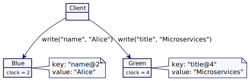
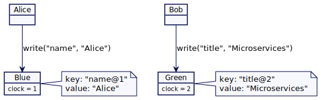

# 兰伯特时钟（Lamport Clock）

用逻辑时间戳作为版本值，来允许服务器之间的值排序。

## 问题

当跨多个服务器存储值时，需要一种方法来知道这些值的前后存储的顺序。由于[挂钟不是单调的(wall clocks are not monotonic)](https://martinfowler.com/articles/patterns-of-distributed-systems/time-bound-lease.html#wall-clock-not-monotonic)，以及来自两个不同服务器的时钟值是不应该进行比较，所以无法使用系统时间戳。

所谓系统时间戳就是表示这一天的时间，是由一个通常由晶体振荡器(crystal oscillator)建造的时钟机器来测量的。使用这种机制的问题就是时间漂移（即它会慢慢偏离一天的实际时间，因为它是根据晶体震荡器的快慢决定的）。为了解决这个问题，计算机通常有一个像 [NTP](https://en.wikipedia.org/wiki/Network_Time_Protocol) 这样的服务，它将计算机时钟与互联网上已知的时间源同步。因此，在给定服务器上连续两次读取系统时间可能会导致时间回拨（backward）。

由于服务器之间的时钟漂移没有上限，所以不可能比较两个不同服务器上的时间戳。

> NTP：网络时间协议(Network Time Protocol, NTP)是一种网络协议，用于在分组交换、可变延迟数据网络上的计算机系统之间进行时钟同步。

## 解决方案

Lamport Clock 用单个数字来表示时间戳，如下所述：

```java
class LamportClock…
	class LamportClock {
			int latestTime;
			public LamportClock(int timestamp) {
					latestTime = timestamp;
			}
	}
```

每个集群节点都维护一个 Lamport Clock 实例。

```java
class Server...
	MVCCStore mvccStore;
	LamportClock clock;
	
	public Server(MVCCStore mvccStore) {
			this.clock = new LamportClock(1);
			this.mvccStore = mvccStore;
	}
```

当服务器执行任何写操作时，它应该使用 `tick()` 方法推进 Lamport Clock。

```java
class LamportClock...
	public int tick(int requestTime) {
			latestTime = Integer.max(latestTime, requestTime);
			latestTime++;
			return latestTime;
	}
```

这样，服务器就可以确保在请求之后以及服务器执行的任何其他操作之后进行顺序写入，因为请求是由客户端发起的。服务器返回用于向客户端写入值的时间戳。这个发起请求的客户端然后就会用这个时间戳堆其他服务器发起进一步的写操作。这样，就维护了请求的顺序链。

## 因果关系，时间和发生之前

在系统中事件 A 发生在事件 B 之前，这可能会存在因果关系。因果关系意思就是说 A 可能有一些规则会影响 B。“A 发生在 B 前” 这个关系是通过给每个事件附加时间戳来建立的。如果 A 发生在 B 前，附加到 A 的时间戳就会比 B 上的时间戳要小。但是因为我们不能依赖于系统时间，所以我们需要一些方法来确保为附加到事件的时间戳来维护发生前后的关系。[Leslie Lamport](https://en.wikipedia.org/wiki/Leslie_Lamport) 在他的开创性论文[《时间，时钟和事件排序》](https://lamport.azurewebsites.net/pubs/time-clocks.pdf)中建议使用逻辑时间戳来追踪这种发生前后的关系。那么使用逻辑时间戳来追踪这种因果关系的技术我们就称之为 Lamport Clock。

需要注意的是，在数据库中，事件是关于存储数据的。因此 Lamport timestamp 被附加到被存储的值上。这也非常适合 [Versioned Value](Versioned-Value.md) 中讨论的版本化存储机制。

## 一个键值存储例子

思考多服务节点键值存储的简单例子。有两个服务器，Blue 和 Green。每个服务器负责存储键集合。这是跨一组服务器集合对数据进行分区的典型场景。值以 [Versioned Value](Versioned-Value.md) 的形式存储，Lamport 时间戳存储为版本号。



接收服务器比较并更新它自己的时间戳，并使用它写入一个版本化的键值。

```java
class Server… 
  public int write(String key, String value, int requestTimestamp) {
      //update own clock to reflect causality
      int writeAtTimestamp = clock.tick(requestTimestamp);
      mvccStore.put(new VersionedKey(key, writeAtTimestamp), value);
      return writeAtTimestamp;
  }
```

将用于写入值的时间戳返回给客户端。客户端通过更新自己的时间戳来跟踪最大时间戳。它会使用这个时间戳发出进一步的写入操作。

```java
class Client… 
  LamportClock clock = new LamportClock(1);
  public void write() {
      int server1WrittenAt = server1.write("name", "Alice", clock.getLatestTime());
      clock.updateTo(server1WrittenAt);

      int server2WrittenAt = server2.write("title", "Microservices", clock.getLatestTime());
      clock.updateTo(server2WrittenAt);

      assertTrue(server2WrittenAt > server1WrittenAt);
  }
```

请求序列如下图所示：


同样的技术也适用于客户端与 [Leader 和 Follower](Leader-And-Followers.md) 组的 Leader 通信，每个组负责特定的键。客户端将请求发送给组的 Leader，如上所述。Lamport Clock 实例由组的 Leader 维护，并以与前一节中讨论的完全相同的方式进行更新。


​																				不同的 leader follower 组存储不同的键值

## 部分排序（Partially Order）

Lamport Clock 存储的值只有[部分顺序](https://en.wikipedia.org/wiki/Partially_ordered_set)（非完全排序）。如果两个客户端将值存储在两个独立的服务器中，则不能使用时间戳对跨服务器的值进行排序。在下例中，Bob 在服务器Green 上于时间戳 2 处存储标题。但是不能确定 Bob 是在 Alice 在服务器 Blue 上存储名称之前还是之后存储了标题。



​																						局部排序

## 单服务器/领导者更新值

对于单服务器 leader-follower 服务器组，其中 leader 是负责存储值，其基本实现方式就是在 [Versioned Value](Versioned-Value.md) 中提到的一样来维护因果关系。


​																					单 leader-follower 组保存键值

在这个案例中，键值存储保存的是一个整数版本计数器（version counter）。每次从预写日志（WAL）应用键值写命令时，它都会增加这个版本计数器。然后用自增版本计数器构造新 key。只有 leader 负责递增版本计数器，并且 follower 使用相同的版本号。

```java
class ReplicatedKVStore… 
  int version = 0;
  MVCCStore mvccStore = new MVCCStore();

  @Override
  public CompletableFuture<Response> put(String key, String value) {
      return server.propose(new SetValueCommand(key, value));
  }

  private Response applySetValueCommand(SetValueCommand setValueCommand) {
      getLogger().info("Setting key value " + setValueCommand);
      version = version + 1;
      mvccStore.put(new VersionedKey(setValueCommand.getKey(), version), setValueCommand.getValue());
      Response response = Response.success(version);
      return response;
  }
```

## 例子

- 像 [mongodb](https://www.mongodb.com/) 和 [cockroachdb](https://www.cockroachlabs.com/docs/stable/) 这样的数据库使用 Lamport Clock 的变体来实现 [mvcc](https://en.wikipedia.org/wiki/Multiversion_concurrency_control) 存储。
- [生成时钟](Generation-Clock.md)就是 Lamport Clock 的一个例子

## 原文

https://martinfowler.com/articles/patterns-of-distributed-systems/lamport-clock.html