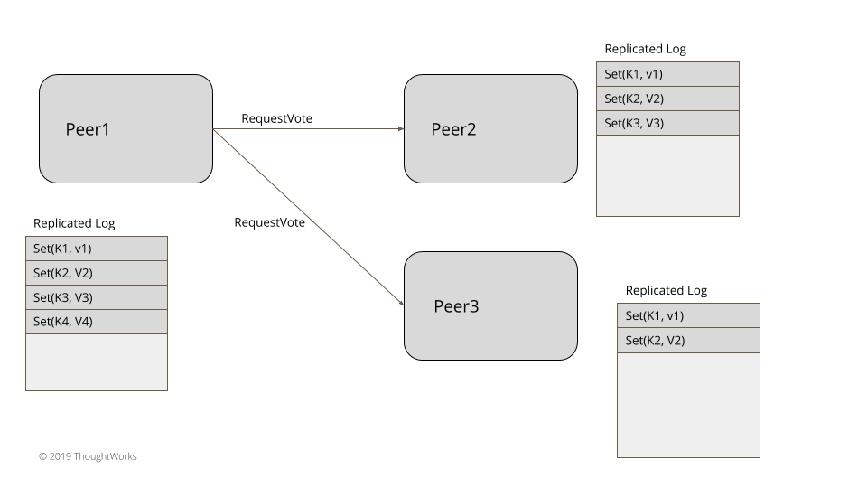
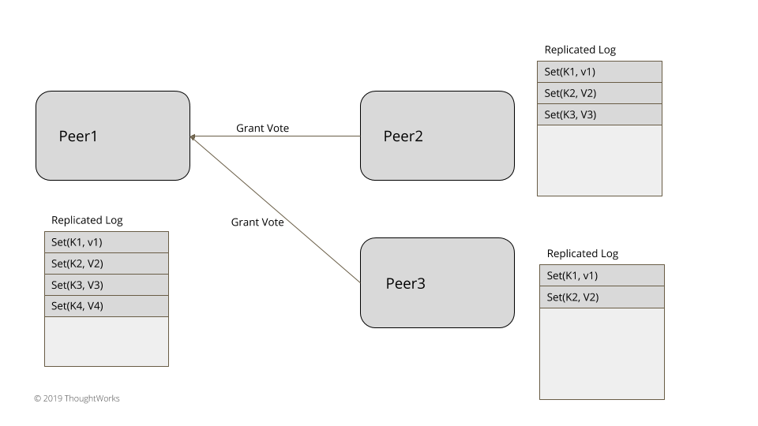
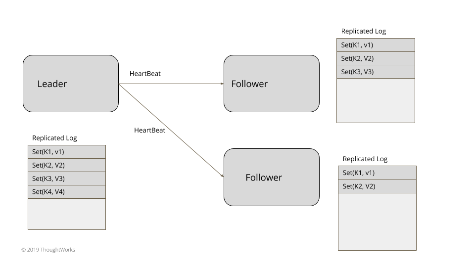
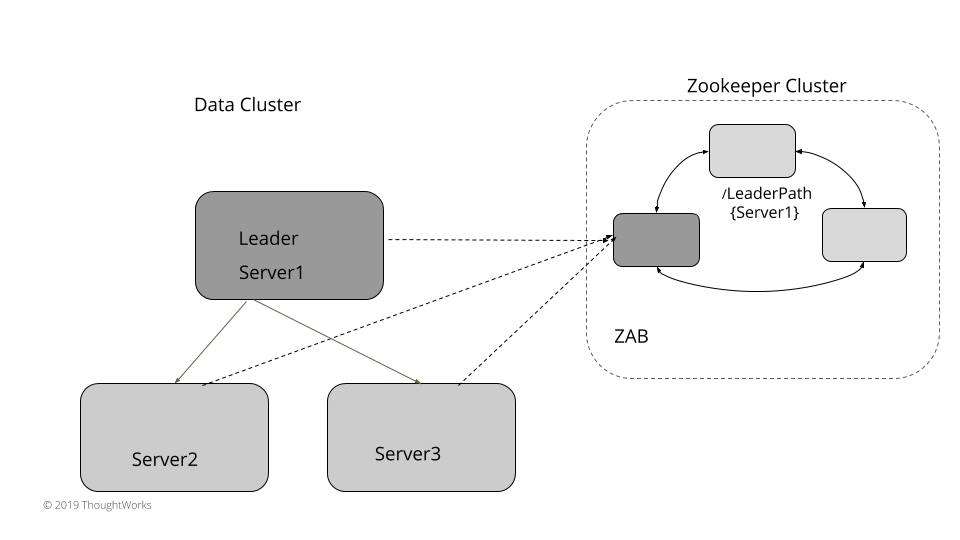

# 领导着与跟随者(Leader And Followers)

描述：用单个服务器在跨域一组服务器之间来协作备份。

## 问题

为了在管理数据的系统中实现容错，需要在多个服务器上复制数据。

有给到一些在客户端的一致性的保证这是很重要的。当数据在多个服务器更新时，让它何时对于客户端可见是必要的的一个决定。写和读 Quorum 并不充分，在一些失败的场景中会引起客户端对数据的不一致性。在仲裁中，每个独立的服务并不知道在其它服务器上的数据的状态，只有在数据被多个服务器读取时，数据的不一致性一定要解决。有些时候，这还不够。关于发送给客户端的数据强一致性时必须的。

## 解决方案

多数选择一个服务器作为 leader。leader 的职责就是代表整个集群做决定以及给其它服务器传递这个决定。

在开始阶段，每个服务器都会去寻找已经存在的 leader。如果没有 leader，就会触发 leader 选举。这些服务器只有在成功选举出一个 leader 服务器之后才接收请求。只有 leader 处理客户端的请求。如果一个请求发送给追随者服务器的，那么这些 followers 就会转发给 leader 服务器。

## Leader 选举



​											选举示意图



​											投票



​											leader 心跳检查

对于 3-5 个节点的小集群，像在系统中实现一致性，在数据集群内不依赖于任何外部系统，能够实现 leader 选举 。Leader 选举时发生在服务器启动阶段。每个服务器在启动时开始一个 leader 选举并尝试选举一个 leader。这个时候系统时不会接收任何客户端请求直到选出了 leader。在[生成时钟](https://martinfowler.com/articles/patterns-of-distributed-systems/generation.html)模式中解释过，每个 leader 选举都需要更新生成的数值。这些总是处于在 Leader，Follower 或是 Looking For Leader（或是 Candidate）这三个状态的一个。

```java
public enum ServerRole {
    LOOKING_FOR_LEADER,
    FOLLOWING,
    LEADING;
}
```

[心跳检查](https://martinfowler.com/articles/patterns-of-distributed-systems/heartbeat.html)机制是用在探测已经存在的 leader 是否发生故障，以至可以选举新的 leader。

新的 leader 选举开始于发送给每个服务器一个投票的请求消息。

class ReplicationModule…

```java
  private void startLeaderElection() {
      replicationState.setGeneration(replicationState.getGeneration() + 1);
      registerSelfVote();
      requestVoteFrom(followers);
  }
```

## 选举算法

当选举一个 leader 有两个因素要考虑到。

- 由于这些系统大多数都用来做数据备份，它那些能赢得选举的服务器加了一些额外的限制。只有在 'most up to date' 的服务器才会称为一个合法的 leader。举个例子，在典型的基于一致性系统中，'most up to date' 定义了两个东西：

  - 最新的[生成时钟](https://martinfowler.com/articles/patterns-of-distributed-systems/generation.html)
  - 最新的 [WAL](https://martinfowler.com/articles/patterns-of-distributed-systems/wal.html) 里的日志索引

- 如果所有的服务都是相同最新的，那么 leader 就会基于下面条件选举出来：

  - 一些指定条件的实现，像哪个服务器排名更好或者有更高的 id（如 [Zab](https://zookeeper.apache.org/doc/r3.4.13/zookeeperInternals.html#sc_atomicBroadcast)）
  - 要确保一次只有一个服务器请求一次投票，无论其它服务器是否开始选举。（如 [Raft](https://raft.github.io/)）

  一旦在给定的[生成时钟](https://martinfowler.com/articles/patterns-of-distributed-systems/generation.html)内的服务器被投票，那么将总是为该生成返回相同的投票。当一个成功的选举已经发生的时候，这确保了为同一代投票的请求的其他服务器不会被选上。就像下面处理请求投票：

  class ReplicationModule…

  ```java
    VoteResponse handleVoteRequest(VoteRequest voteRequest) {
        VoteTracker voteTracker = replicationState.getVoteTracker();
        Long requestGeneration = voteRequest.getGeneration();
        if (replicationState.getGeneration() > requestGeneration) {
            return rejectVote();
  
        } else if (replicationState.getGeneration() < requestGeneration) {
            becomeFollower(requestGeneration);
            voteTracker.registerVote(voteRequest.getServerId());
            return grantVote();
        }
  
        return handleVoteRequestForSameGeneration(voteRequest);
    }
  
    private VoteResponse handleVoteRequestForSameGeneration(VoteRequest voteRequest) {
        Long requestGeneration = voteRequest.getGeneration();
        VoteTracker voteTracker = replicationState.getVoteTracker();
  
        if (voteTracker.alreadyVoted()) {
            return voteTracker.grantedVoteForSameServer(voteRequest.getServerId()) ?
                    grantVote():rejectVote();
  
        }
  
        if (voteRequest.getLogIndex() >= (Long) wal.getLastLogEntryId()) {
            becomeFollower(requestGeneration);
            voteTracker.registerVote(voteRequest.getServerId());
            return grantVote();
        }
  
        return rejectVote();
    }
  
    private void becomeFollower(Long generation) {
        replicationState.setGeneration(generation);
        transitionTo(ServerRole.FOLLOWING);
    }
  
    private VoteResponse grantVote() {
        return VoteResponse.granted(serverId(),
                replicationState.getGeneration(),
                wal.getLastLogEntryId());
    }
  
    private VoteResponse rejectVote() {
        return VoteResponse.rejected(serverId(),
                replicationState.getGeneration(),
                wal.getLastLogEntryId());
    }
  ```

从大多数服务器中接受到投票的服务器会转换为 Leader 状态。这大多数是在 [Quorum](https://martinfowler.com/articles/patterns-of-distributed-systems/quorum.html) 中讨论决定的。一旦选举，这个 leader 会继续发送[心跳检查](https://martinfowler.com/articles/patterns-of-distributed-systems/heartbeat.html)给所有追随者。如果追随者在指定的时间间隔内没有收到心跳检查，那么就会触发新的 leader 选举。

## 使用外部[[可线性化]](https://jepsen.io/consistency/models/linearizable)的存储来 Leader 选举

对于小集群，运行一个 leader 选举在数据集群上能工作的很好。对于大数据集群，它至少有上千个节点，通过外部的存储如 Zookeeper 或 etcd 也容易工作。（这些内部使用了一致性和提供了线性保证）。这些典型的大集群有一个被标记为主节点或控制器节点，它能代表整个集群的所有决定。实现一个 leader 选举机制需要具备三个功能：

- 一个 compareAndSwap 原子操作指令来赋值
- 一个心跳实现：如果没有从 leader 接收到心跳，它将使 key 过期，来触发新的 leader 选举
- 一个通知机制，如果 key 过期了通知所有感兴趣的服务器。

对于 Leader 选举，每个服务器使用 compareAndSwap 指令在外部存储器创建一个 key ，并且谁第一个成功，谁就是被选举为 leader。取决于使用的外部存储，创建 key 的时间很短。在 key 生存之前 leader 选举会一致反复更新 key  [The elected leader repeatedly updates the key before the time to live value]。每个服务器都可以对这个 key 监听，如果 key 过期，服务器会得到通知，而现有的 leader 在激活时间设置内没有更新该 key  [Every server can set a watch on this key, and servers get notified if the key expires without getting updated from the existing leader within the time to live setting]。如 [etcd](https://etcd.io/) 允许一个 compareAndSwap 操作，只有当键不存在之前，允许通过设置 key 操作。在 [Zookeeper](https://zookeeper.apache.org/) 这个就没有显式的 compareAndSwap 类别的指令支持，但是它可以通过创建一个新的节点来实现，如果这个节点不存在就会预期一个异常。也没有明确的生存时间，但 zookeeper 有一个临时节点的概念。这个节点一直存在，直到服务器与 zookeeper 有一个活动的会话，其它节点被删除以及每个监听的节点没有被通知。例如，利用 zookeeper 实现下面的 leader 选举：

class ServerImpl…

```java
  public void startup() {
      zookeeperClient.subscribeLeaderChangeListener(this);
      elect();
  }

  public void elect() {
      var leaderId = serverId;
      try {
          zookeeperClient.tryCreatingLeaderPath(leaderId);
          this.currentLeader = serverId;
          onBecomingLeader();
      } catch (ZkNodeExistsException e) {
          //back off
          this.currentLeader = zookeeperClient.getLeaderId();
      }
  }
```

其它所有的服务器都会观察这个存在的 leader 的存活情况。当探测到这个 leader 宕机的时候，新的 leader 选举就会触发。失败探测器会使用与 leader 选举相同外部线性化的存储。此外部存储还具有实现组成员关系和故障检测机制的功能。例如，拓展上面基于 zookeeper 的实现，Zookeeper 能配置一个变更监听器，它在已经存在的 leader 节点发生改变时触发。

class ZookeeperClient…

```java
  public void subscribeLeaderChangeListener(IZkDataListener listener) {
      zkClient.subscribeDataChanges(LeaderPath, listener);
  }
```

集群中的每个服务器都订阅这个变更，只要 callback 被触发，一个新的 leader 选举就会触发，以上面所述相同的的方式触发。

class ServerImpl…

```java
  @Override
  public void handleDataDeleted(String dataPath) throws Exception {
      elect();
  }
```



​																													zookeeper 选举

像 Consul 或 etcd 这样的系统能使用相同的方式来实现 leader 选举。

## 为什么 Quorum 读/写不足以保证强一致性

它可能看起来像是由 Dynamo 风格的数据库(如 Cassandra)提供的 Quorum 读/写，足以在服务器出现故障时获得强大的一致性。但其实不是这样的。思考下面例子。我们现在有一个三个服务器的集群，变量 x 存在所有的服务器上，（复制因子是 3）。启动时值从 1 开始。

- 当 writer1 赋值 x = 2，复制因子是 3。这个写请求发送给所有的服务器。在 server1 写成功，但是在 server2 和 server3 失败了。（无论是在发送写请求之后的网络小故障还是只是在 writer1 写的时候发生了垃圾回收的暂停）。
- 客户端 c1 从 server1 和 server2 读取 x，它获得了最新的值 x = 2，因为 server1 写成功了。
- 客户端 c2 也读取了 x。但是 server1 临时宕机了，所以 c1 开始从 server2、server3 读取 x，其中的 x 都是旧值即 x = 1。所以 c2 在 c1 读取完最新的值之后读取了一个旧的值。

两次连续的读取值就会显示最新的值。一旦 server1 重新恢复，随后的一次读取就会获取最新的值。假设读修复或反熵（Anti-Entropy）过程正在运行，其余的服务器也会“最终”得到最新的值。但是集群存储不提供保证会确保一次指定值就在所有客户端可见，及时服务器失败，所有后续读取都将继续获取该值。

> 反熵：在一个最终一致性性的数据库中，随着时间流逝，应该被精确复制的节点都会慢慢互相偏差。这个偏差可以被认为是系统的“entropy”。反熵 就是让节点之间互相同步的过程。

## 例子

- 为了实现系统的一致性，用一个服务器来与复制进程的活动协作是非常重要的。如 [Paxos](https://lamport.azurewebsites.net/pubs/paxos-simple.pdf) 在论文中所指出的那样，这对系统的生存力很重要。
- 在 [Raft](https://raft.github.io/) 和 [Zab](https://zookeeper.apache.org/doc/r3.4.13/zookeeperInternals.html#sc_atomicBroadcast) 的一致性算法中，在启动或 leader 发生故障时，进行 leader 选举是明确的
- [Viewstamp 复制](http://pmg.csail.mit.edu/papers/vr-revisited.pdf)算法有一个 Primary 概念，类似于其它算法的里的 leader 
- [Kafka](https://kafka.apache.org/) 有一个[控制器](https://cwiki.apache.org/confluence/display/KAFKA/Kafka+Controller+Internals)，它负责代表集群下所有行为。它对来自 Zookeeper 的事件做出反应，对于 Kafka 中的每个分区，都有一个指定的 leader broker 和follower broker。


原文链接：https://martinfowler.com/articles/patterns-of-distributed-systems/leader-follower.html