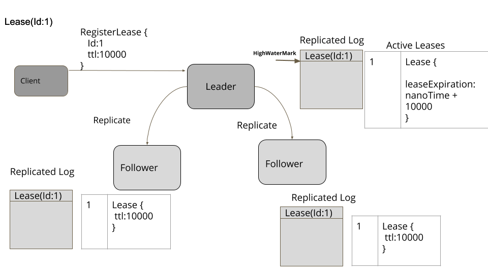
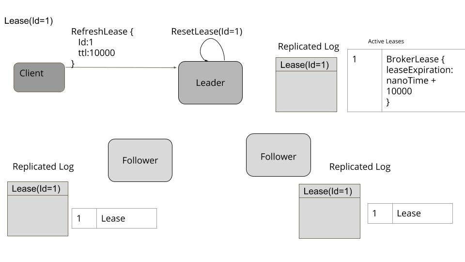
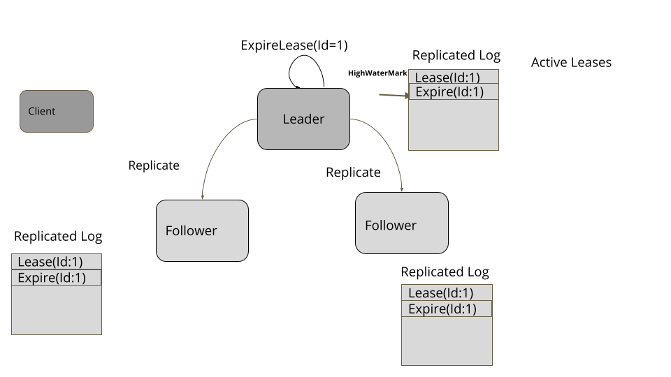
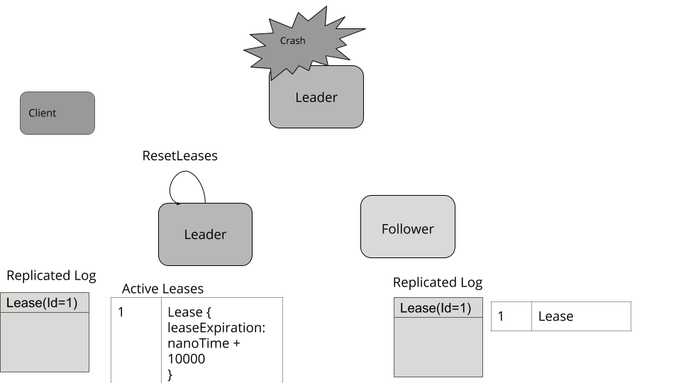
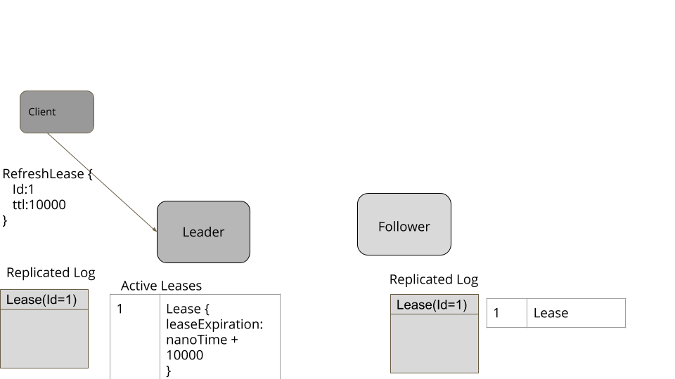

# 租约（Lease）

给集群节点使用时间边界租约来实现相互协作。

## 问题

集群节点针对某些资源需要排他性。但是节点会崩溃；它们能临时取消连接或者是基于经验的暂停进程。在这些错误场景下，它们需要对一个资源适时的取消连接（不能一直处于访问连接状态）。

## 解决方案

一个集群节点可以在一个有效的时间能请求租约，超过这个时间就失效。如果它想要继续访问的话，那就得在它有效期过期之前再次租约。使用一致性核心来实现租约机制来提供容错性和一致性。存在一个与租约相关的 "生存期" 的值。集群节点能在一致性核心中创建一个 key 来实现它。这个租约能通过 [Leader 和 Followers](Leader-And-Followers.md) 来实现备份来提供容错性。**拥有租期的节点负责定期刷新租期**。客户端会使用[心跳检查](HeartBeat.md)去刷新在一致性核心中的生存时间。在[一致性核心](Consisten-Core.md)中能给所有的集群节点创建租约，但是只有主节点能追踪租约的超期时间（timeout）。在一致性核心中的 follower 节点是无法追踪 timeout 的。这样做是因为我们需要 leader 使用它自己的单调时钟（monotonic clock）来决定租约何时到期，并且在之后要让 followers 了解到租约合适过期。这要确保在一致性核心的其它决定，这些节点也要对租约到期保持一致。

当一个一致性核心中的节点变成 leader 时，它就要开始跟踪租约了：

```java
class ReplicatedKVStore {
	...
	public void onBecomingLeader() {
      leaseTracker = new LeaderLeaseTracker(this, new SystemClock(), server);
      leaseTracker.start();
  	}
}

```

Leader 会开启一个调度任务来定期的检查这些租约的过期时间

```java
class LeaderLeaseTracker {
    private ScheduledThreadPoolExecutor executor = new ScheduledThreadPoolExecutor(1);
    private ScheduledFuture<?> scheduledTask;
    @Override
    public void start() {
      scheduledTask = executor.scheduleWithFixedDelay(this::checkAndExpireLeases,
              leaseCheckingInterval,
              leaseCheckingInterval,
              TimeUnit.MILLISECONDS);

    }

    @Override
    public void checkAndExpireLeases() {
      remove(expiredLeases());
    }

    private void remove(Stream<String> expiredLeases) {
      expiredLeases.forEach((leaseId)->{
          //remove it from this server so that it doesnt cause trigger again.
          expireLease(leaseId);
          //submit a request so that followers know about expired leases
          submitExpireLeaseRequest(leaseId);
      });
    }

    private Stream<String> expiredLeases() {
      long now = System.nanoTime();
      Map<String, Lease> leases = kvStore.getLeases();
      return  leases.keySet().stream()
              .filter(leaseId -> {
          Lease lease = leases.get(leaseId);
          return lease.getExpiresAt() < now;
      });
    }
}
```

Followers 则会开启一个无操作的租约跟踪：

```java
class ReplicatedKVStore {
    public void onCandidateOrFollower() {
      if (leaseTracker != null) {
          leaseTracker.stop();
      }
      leaseTracker = new FollowerLeaseTracker(this, leases);
    }
}
```

租约会像下面一样简单的体现：

```java
 public class Lease implements Logging {
    String name;
    long ttl;
    //Time at which this lease expires
    long expiresAt;

    //The keys from kv store attached with this lease
    List<String> attachedKeys = new ArrayList<>();

    public Lease(String name, long ttl, long now) {
        this.name = name;
        this.ttl = ttl;
        this.expiresAt = now + ttl;
    }

    public String getName() {
        return name;
    }

    public long getTtl() {
        return ttl;
    }

    public long getExpiresAt() {
        return expiresAt;
    }

    public void refresh(long now) {
        expiresAt = now + ttl;
        getLogger().info("Refreshing lease " + name + " Expiration time is " + expiresAt);
    }

    public void attachKey(String key) {
        attachedKeys.add(key);
    }

    public List<String> getAttachedKeys() {
        return attachedKeys;
    }
}
```

当一个节点想要创建一个租约，它要连接一致性核心的 leader 并发送一个创建租约的请求。租约注册请求会备份并且在[一致性核心](Consistent-Core.md)中会像其它请求一样处理。只有当高水位标记达到备份日志里请求条目的日志索引时才会完成。

```java
class ReplicatedKVStore {
	...
	private ConcurrentHashMap<String, Lease> leases = new ConcurrentHashMap<>();
	@Override
    public CompletableFuture<Response> registerLease(String name, long ttl) {
        if (leaseExists(name)) {
            return CompletableFuture
                    .completedFuture(
                            Response.error(Errors.DUPLICATE_LEASE_ERROR,
                                "Lease with name " + name + " already exists"));
        }
        return server.propose(new RegisterLeaseCommand(name, ttl));
    }

    private boolean leaseExists(String name) {
        return leases.containsKey(name);
    }
}
```

一个重要的事情就是要注意验证重复租约注册的那个地方。在提出请求之前检查它是不够的，因为可能有多个正在运行的请求。因此，在成功复制后，当注册了租期时，服务器还会检查是否有重复。

```java
class LeaderLeaseTracker {
	...
	private Map<String, Lease> leases;
	@Override
    public void addLease(String name, long ttl) throws DuplicateLeaseException {
      if (leases.get(name) != null) {
          throw new DuplicateLeaseException(name);
      }
      Lease lease = new Lease(name, ttl, clock.nanoTime());
      leases.put(name, lease);
    }
}
```



节点负责连接 leader 以及在它超期之前刷新时间。在[心跳检查](HeartBeat.md)里讨论了，它必须考虑网络往返时间，来决定 “生存时间” 的值，以及在租约过期之前刷新请求。节点能在 “生存时间” 周期内多次请求刷新请求，以确保在任何场景下都能刷新。但是节点也需要确保不要让太多的请求发过来。**在租约时间过了大约一半之后发送请求是合理的。**其结果就是在租期内最多出现 2 次刷新请求。客户端节点使用自己的单调时钟跟踪时间。

```java
class LeaderLeaseTracker {
	...
    public void refreshLease(String name) {
      Lease lease = leases.get(name);
      lease.refresh(clock.nanoTime());
    }
}
```

刷新请求只发送给一致性核心的 leader，因为只有 leader 负责决定租约合适到期。



当租约到期，它会从 leader 中移除。这个信息非常关键，会提交到一致性核心中。所以 leader 会发送一个请求来过期租约，这就像一致性核心中其它请求处理一样。一旦高水位线到达租约到期请求，它就会从所有的 followers 中移除。

```java
class LeaderLeaseTracker {
	...
    public void expireLease(String name) {
        getLogger().info("Expiring lease " + name);
        Lease removedLease = leases.remove(name);
        removeAttachedKeys(removedLease);
    }
}
```



> ### 挂钟不是单调的（monotonic）
>
> 计算机有两种不同的机制来表示时间。挂钟时间（wall clock time），代表一天的时间，是由时钟机械测量，通常是一个晶体振荡器。这种机制的问题是，根据晶体振荡的快慢，它可能会产生误差。为了解决这个问题，计算机通常有一个像[NTP](https://en.wikipedia.org/wiki/Network_Time_Protocol)设置这样的服务，它通过互联网上众所周知的时间源检查一天的时间，并修复当地时间。因此，在给定服务器中挂钟时间的两次连续读数可以使时间倒退。**这使得挂钟时间不适合测量某些事件之间经过的时间**。
>
> 计算机还有一种不同的时钟机制，称为“单调时钟”，它表示经过的时间（elapsed time）。**单调时钟的值不受 NTP 等服务的影响。保证连续两次调用单调时钟可以得到经过的时间。**因此，为了测量超时值，总是使用单调时钟。这在单个服务器上运行良好。 但是无法比较两个不同服务器上的单调时钟。所有编程语言都有一个 api 来读取挂钟和单调时钟。例如在 Java 中`System.currentMillis` 给出挂钟时间，而`System.nanoTime`给出单调时钟时间。

## 附加租约到 key 存储至 key/value 存储器

集群需要知道它们中间时哪个几点失败了。它可以通过让节点从一致的核心中获得一个租约来实现这一点，然后附加到自标识 key 存储至一致性核心中的存储器。如果这个节点正在运行，那么它应该定期更新创建租约。租约到期，相关的 key 就会被移除。当这个 key 被移除时，一个标识节点失败的事件就会发送到感兴趣的集群节点，如[状态监视](State-Watch.md)模式中所讨论的那样。

集群节点使用一致性核心，通过网络调用创建租约，如下所示：

```java
consistentCoreClient.registerLease("server1Lease", TimeUnit.SECONDS.toNanos(5));	
```

然后它会将这个租约附加到自标识键存储到一致性核心

```java
consistentCoreClient.setValue("/servers/1", "{address:192.168.199.10, port:8000}", "server1Lease");
```

当一致性核心接受到这个消息并保存到 k/v 存储器中，它也能根据 key 获取指定的租约：

```java
class ReplicatedKVStore {
	...
	private Response applySetValueCommand(Long walEntryId, SetValueCommand setValueCommand) {
      getLogger().info("Setting key value " + setValueCommand);
      if (setValueCommand.hasLease()) {
          Lease lease = leases.get(setValueCommand.getAttachedLease());
          if (lease == null) {
              //The lease to attach is not available with the Consistent Core
              return Response.error(Errors.NO_LEASE_ERROR,
                      "No lease exists with name "
                              + setValueCommand.getAttachedLease());
          }

          lease.attachKey(setValueCommand.getKey());

      }
      kv.put(setValueCommand.getKey(), new StoredValue(setValueCommand.getValue(), walEntryId));
}
```

一旦租约过期，一致性核心就会从 k/v 存储器中移除该键。

```java
class LeaderLeaseTracker {
	...
	public void expireLease(String name) {
        getLogger().info("Expiring lease " + name);
        Lease removedLease = leases.remove(name);
        removeAttachedKeys(removedLease);
  	}
  	private void removeAttachedKeys(Lease removedLease) {
        if (removedLease == null) {
            return;
        }
        List<String> attachedKeys = removedLease.getAttachedKeys();
        for (String attachedKey : attachedKeys) {
            getLogger().trace("Removing " + attachedKey + " with lease " + removedLease);
            kvStore.remove(attachedKey);
        }
    }
}
```

## 处理 Leader 失败

当已有的 leader 失败时，新的一致性核心的 leader 就会被选举。一旦成功选举，就要追踪租约的状态。

新的 leader 会刷新所有已知的租约。要注意，在原来的 leader 获取的即将过期的 “生存期” 会被延长。这个是没问题的，并且它给了客户端重新连接新 leader 和继续租约的机会。

```java
private void refreshLeases() {
    long now = clock.nanoTime();
    this.kvStore.getLeases().values().forEach(l -> {
        l.refresh(now);
    });
}
```





## 示例

Google 的 [chubby](https://research.google/pubs/pub27897/) 服务就是基于时间边界租约的机制相同的方法实现的

[zookeeper](https://zookeeper.apache.org/) 会话管理就是通过租约复制类似的机制实现的

Kafka 的 [Kip-631 ](https://cwiki.apache.org/confluence/display/KAFKA/KIP-631%3A+The+Quorum-based+Kafka+Controller)提议使用时间边界的租约来管理成员信息组以及 kafka 的 brokers 故障检查

[etcd](https://etcd.io/) 提供了一个时间边界租约工厂，用它来让客户端之间的协作以及组成员关系和故障检测

[dhcp](https://en.wikipedia.org/wiki/Dynamic_Host_Configuration_Protocol) 协议允许连接设备去租约 IP 地址。具有多个 DHCP 服务器的[故障转移协议（failover protocol）](https://tools.ietf.org/html/draft-ietf-dhc-failover-12)的工作原理与这里介绍的实现类似

## 原文地址

https://martinfowler.com/articles/patterns-of-distributed-systems/time-bound-lease.html