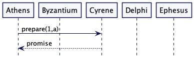
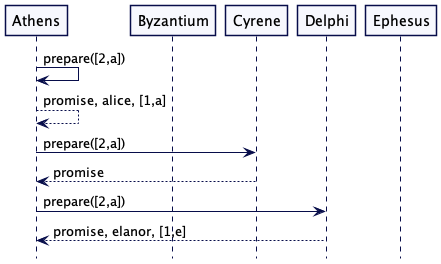

# Paxos

使用两个共识建立阶段，以达到安全共识，即使节点断开。

## 问题

Paxos 算法是由[莱斯利·兰波特(Leslie Lamport)](http://lamport.org/)开发的，发表在他 1998 年的论文 [The Part-Time 议会(Parliament)](http://lamport.azurewebsites.net/pubs/pubs.html#lamport-paxos) 中。Paxos 工作在三个阶段，以确保多个节点在部分网络或节点故障的情况下还能达成一致性。**前两个阶段的作用是围绕一个值建立共识，然后最后一个阶段将该共识传递给其余的副本**。

- 准备阶段(Prepare)：建立最新的[生成时钟](Generation-Clock.md)，并收集已经接受的值。
- 接受阶段(Accept)：为这一代的副本提议一个可接受的值。
- 提交阶段(Commit)：告诉所有副本已经决定选择其中一个值了。

在第一个阶段里（称为准备阶段），节点会提出一个值（称为提议者[proposer]）联系在集群中其它节点（称为接受者[acceptors]），并询问它们是否选择这个值（即投票）。**一旦这些接受者已经准备就绪，并达到预定的法定人数（一般是奇数），提议者就进入第二阶段**。在第二个阶段(称为接受阶段)，提议者发送这个建议的值，**如果节点的仲裁[1]接受该值，就会选择该值**。在最后一个阶段(称为提交阶段)，提议者可以将选择的值提交给集群中的所有节点。

## 协议流程

Paxos 是个复杂难以理解的协议。我们将先从例子出发来展示这个协议的流程，然后深入研究它如何工作的一些细节。我们希望通过这个解释能直观地了解协议是如何工作的，而不是作为一个基于实现的全面描述。

这个有一个简短的协议摘要。

| 提议者(Proposer)                                             | 接受者(Acceptor)                                             |
| ------------------------------------------------------------ | ------------------------------------------------------------ |
| 从[时钟生成器](Generation-Clock.md)中获取最新的数。发送一个已经准备好的请求，并携带这个生成的时钟数给所有接受者 |                                                              |
|                                                              | 如果这个准备请求的时钟数要比它本身的时钟数晚（大），它就会将值更新成更晚的值，并返回一个承诺响应(promise response)。如果它已经接受了一个提议，则会返回这个提议值。 |
| 当从接受者接收到法定数量(quorum)的这些 promise 时，它将查看这些响应中是否包含可接受的值。如果是，它将自己的提议值更改为那些携带更高的时钟数的返回的提议值。发送一个接收请求到所有接受者，这个请求携带这个时钟数和提议值。 |                                                              |
|                                                              | 如果接收请求的时钟数要比它已经承诺的变量更大，它就会将提议值存储作为它已接受的提议值，并响应给这个请求。 |
| 当它从法定数量的接受者接收到成功响应时，它会记录这个被选择的值并发送提交信息给所有节点。 |                                                              |

上面就是 pasox 最基本的规则，但是很难理解它们是如何结合起来形成有效的行为的。所以这里有一个例子来说明它是如何工作的。

考虑一个有5个节点的集群：Athens, Byzantium, Cyrene,  Delphi, 以及 Ephesus。一个客户端连接了 Athens 节点，发出请求并设置名称为 "alice"。Athens 节点现在就需要启动一个 Paxos 交互来查看是有所有的节点都同意这个变更。Athens 就被称为提议者(Proposer)，那就是说 Athens 将向其它节点提议，集群的名称变更为 "alice"。此时在集群中所有的节点都是接受者(acceptors)，意思就是它们有能力接受提议。

就在 Athens 提议 "alice" 的相同时刻，Ephesus 节点也获得请求将集群的名称变更为 "elanor"。这就让 Ephesus 也成为了提议者。

在准备阶段，提议者首先发送一些预备请求，这些请求都包含一个生成编号。由于 Paxos 的目的是避免单点故障，所以我们不会从单代时钟中得出这个结论。相反，每个节点维护它自己的生成时钟，它将生成编号与节点 ID 结合在一起。节点 ID 用来打破这些关系(ties)，所以 [2,a] > [1,e] > [1,a]。每个接受者记录了到目前为止看到的最新承诺

| Node     | Athens | Byzantium | Cyrene | Delphi | Ephesus |
| -------- | ------ | --------- | ------ | ------ | ------- |
| 承诺代   | 1,a    | 1,a       | 0      | 1,e    | 1,e     |
| 接受的值 | none   | none      | none   | none   | none    |

因为在此之前它们没有看到任何请求，所以它们都返回一个承诺给调用者。我们称返回值为 "promise"，因为它表示接受方承诺不考虑任何比所承诺的更早一代时钟的消息。

Athens 发送一个预备消息给 Cryene。当它收到一个返回的 promise 时，这就意味着它此时此刻收到了集群5个节点中的3个节点的 promise，这体现为投票法定人数([Quorum](Quorum.md))。Athens 现在从发送准备消息到发送接受消息。

Athens 可能无法从集群的大多数节点那里得到承诺。在这种情况下 Athens 通过增加生成时钟来重试准备请求。

| Node                | Athens | Byzantium | Cyrene | Delphi | Ephesus |
| ------------------- | ------ | --------- | ------ | ------ | ------- |
| promised generation | 1,a    | 1,a       | 1,a    | 1,e    | 1,e     |
| accepted value      | none   | none      | none   | none   | none    |

Athens 现在会开始发送消息，其中包含了生成和提议的值。Athens 和 Byzantium 接受了这个提议。

| Node                | Athens | Byzantium | Cyrene | Delphi | Ephesus |
| ------------------- | ------ | --------- | ------ | ------ | ------- |
| promised generation | 1,a    | 1,a       | 1,a    | 1,e    | 1,e     |
| accepted value      | alice  | alice     | none   | none   | none    |

Ephesus 现在发送一个预备消息给 Cyrene。Cyrene 已经发送一个 promise 响应给 Athens，但是 Ephesus 的请求中时钟数更大（代数更高），所以它会优先 Ephesus。即 Cyrene 发送 promise 给 Ephesus。

Cyrene 现在会得到来自 Athens 一个接受请求，但是由于该请求携带的时钟数比 Ephesus 请求的小，所以它会拒绝 Cyrene 的请求转而给 Ephesus 一个 promise 响应。

| Node                | Athens | Byzantium | Cyrene | Delphi | Ephesus |
| ------------------- | ------ | --------- | ------ | ------ | ------- |
| promised generation | 1,a    | 1,a       | 1,e    | 1,e    | 1,e     |
| accepted value      | alice  | alice     | none   | none   | none    |

Ephesus 现在已经获得了法定数量(quorum)的预备信息，所以能进一步发送接受(accept)请求了。它向自己和 Delphi 发送 accept，但在它要更多 accept 之前崩溃了。

| Node                | Athens | Byzantium | Cyrene | Delphi | Ephesus |
| ------------------- | ------ | --------- | ------ | ------ | ------- |
| promised generation | 1,a    | 1,a       | 1,e    | 1,e    | 1,e     |
| accepted value      | alice  | alice     | none   | elanor | elanor  |

与此同时，Athens 必须要去处理，拒绝（因为超时、心跳机制等）来自 Cyrene 的 accept 请求。这就表明了它没到法定人数而不会将 promise 给它，因此它的提议将失败(This indicates that its quorum is no longer promised to it and thus its proposal will fail. )。这种情况总是会发生在一个提议者失去了，导致无法称为大多数投票像上面说的那样。另一个提议者要达到了大多数投票，第一个提议者的 Quorum 数中至少有一个成员会叛变（for another proposer to achieve quorum at least one member of the first proposer's quorum will defect.）。

在这个简单的两阶段提交情况下，我们希望 Ephesus 继续并选择它的值，但是由于 Ephesus 崩溃了，导致这样的方案会遇到麻烦。如果在法定人数（quorum）上锁，它的崩溃又将导致整个提案过程僵住。Paxos 就意料到了这种情况发生，所以 Athens 将会进行其它尝试，这次会生成一个更高的时钟值（代数更高）。

它会再次发起预备信息(prepare message)，但这次携带更高的生成值。与第一轮一样，它会得到三个 promise 响应，但是有一个重要的不同。Athens 早之前已经接受了 "alice"，Delphi 已经接受了 "elanor"。这两个接受者都返回一个 promise，还有他们已经接受的值以及被接受这个提议值得生成的时钟数。

| Node                | Athens | Byzantium | Cyrene | Delphi | Ephesus |
| ------------------- | ------ | --------- | ------ | ------ | ------- |
| promised generation | 2,a    | 1,a       | 2,a    | 2,a    | 1,e     |
| accepted value      | alice  | alice     | none   | elanor | elanor  |

拥有法定数量的 Alice 现在必须进入 accept 阶段，但它必须要提出最高代的已接受的的值，即 “elanor”，它被代数为 [1,e] 的 Delphi 接受，它要比 Athens 的 [1,a] 的 "alice" 接受值要大。

Athens 开始发出接受请求，但现在有了“elanor”和它的当前生成值。Athens 向自己发送一个接受请求，该请求被接受。 这是一个关键的接受，因为现在有三个节点接受“elanor”，这是“elanor”的法定人数，因此我们可以将“elanor”视为选择的值。 

| Node                | Athens | Byzantium | Cyrene | Delphi | Ephesus |
| ------------------- | ------ | --------- | ------ | ------ | ------- |
| promised generation | 2,a    | 1,a       | 2,a    | 2,a    | 1,e     |
| accepted value      | elanor | alice     | none   | elanor | elanor  |

但是，虽然“elanor”现在是选择的值，但还没有人意识到它。在接受阶段，Athens 只知道自己有“elanor”值，这不是法定人数，而且 Ephesus 是离线的。Athens 需要做的就是再接受几个请求，这样它就能提交。但现在 Athens 崩溃了。

此刻 Athens 和 Ephesus 都崩溃了。但是集群仍然有一个运行的 quorum 节点，因此它们应该能够继续工作，实际上，通过遵循协议，它们可以发现“elanor”是所选择的值。

Cyrene 得到一个名称为“carol”的请求，因此它成为一个提案人。它已经看到了第[2,a]代，所以它从第[3,c]代开始了准备阶段。虽然它希望提出“carol”作为名称，但目前它只是发出准备请求。

Cyrene 向集群中剩余的节点发送准备消息。与 Athens 的早期准备阶段一样，Cyrene 得到了被接受的价值，所以“carol”从未做一个值被提议。和以前一样，Delphi 的 "elanor" 晚于 Byzantium 的 "alice"，所以 Cyrene 以"elanor"和[3,c]开始接受阶段。

| Node                | Athens | Byzantium | Cyrene | Delphi | Ephesus |
| ------------------- | ------ | --------- | ------ | ------ | ------- |
| promised generation | 2,a    | 3,c       | 3,c    | 3,c    | 1,e     |
| accepted value      | elanor | alice     | none   | elanor | elanor  |

虽然此节点可能会继续崩溃并唤醒节点，但现在很明显“elanor”会胜出。 只要有法定人数的节点，其中至少有一个将“elanor”作为其值，并且任何尝试准备的节点都必须连接一个接受“elanor”的节点，以获得其准备的法定人数 阶段。 所以我们将以 Cyrene 发送提交结束。 

在某一时刻 Athens 和 Ephesus 会回来，他们会发现法定人数已经选择了什么。

## 请求不需要拒绝

在上面的例子中，我们看到 acceptors 拒绝了一个年老代（生成值小）的请求。但是协议不需要像这样明确的拒绝。如所述，acceptor 可以忽略过期的请求。如果是这种情况，那么协议将仍然收敛于单一的共识值。这是协议的一个重要特性，因为这是一个分布式系统，连接随时可能丢失，所以不依赖于拒绝来确保协议的安全性是有益的。(这里的*安全*是指协议将**只选择一个值，并且一旦选择，它将不会被覆盖**。)

然而，发送拒绝仍然很有用，因为它可以提高性能。申请人越早发现自己老了，就能越早开始与更高一代的人进行新一轮的申请。

## 竞争的提议者可能选择失败

如果两个(或更多)提议者进入一个循环，这个协议可能会出错。

- alice 被 athens 和 byzantium 接受
- elanor 被所有节点准备，会阻止 alice 获得法定数量支持(quorum)
- elanor 被 delphi 和 ephesus 接受
- alice 所有节点准备就绪，会阻止 elanor 获得法定数量支持(quorum)
- alice 被 athens 和 byzantium 接受
- ... 如此反复，这种场景被称为活锁

[FLP 不可能性结果显示](https://groups.csail.mit.edu/tds/papers/Lynch/jacm85.pdf)，即使是单个故障节点也可以阻止集群选择一个值。

我们可以通过确保无论何时申请人需要选择新一代来减少这个活锁发生的机会

## 原文链接

https://martinfowler.com/articles/patterns-of-distributed-systems/paxos.html
