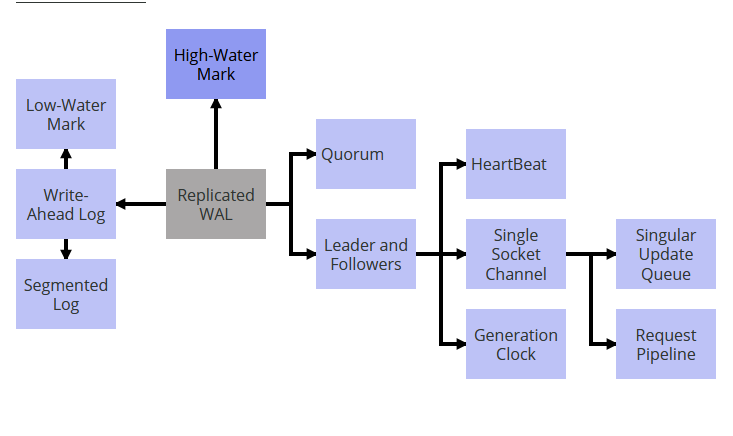

# 目录

- [一致性核心](Consisten-Core.md)
- [固定分区](Fixed-Partitions.md) //TODO
- [从读(Follower Reads)](Follower-Reads.md)
- [时钟生成器(Generation Clock)](Generation-Clock.md)
- [Gossip 传播(Gossip Dissemination)](Gossip-Dissemination.md)
- [心跳检查(HeartBeat)](HeartBeat.md)
- [高水位标记(High-Water Mask)](High-Water-Mark.md))
- [混合时钟(Hybrid Clock)](Hybrid-Clock.md)
- [幂等接收者(Idempotent Receiver)](Idempotent-Receiver.md)
- [键和值(Key And Value)](Key-Value.md) //TODO
- [Lamport 时钟](Lamport-Clock.md)
- [低水位标记(Low-Water Mark)](Low-Water-Mark.md)
- [领导者与追随者(Leader And Followers)](Leader-And-Followers.md)
- [租赁(Lease)](Lease.md)
- [Paxos](Paxos.md)
- [选举(Quorum)](Quorum.md)
- [复制日志(Replicated Log)](Replicated-Log.md) //TODO
- [批处理请求](Request-Batch.md) //TODO
- [分段日志(Segmented Log)](Segmented-Log.md)
- [请求管道(Request Pipeline)](Request-Pipeline.md)
- [Single Socket Channel](Single-Socket-Channel.md)
- [Single Update Queue](Single-Update-Queue.md)
- [状态监控(State Watch)](State-Watch.md)
- [版本向量(Version Vector)](Version-Vector.md)
- [版本值(Versioned Values)](Versioned-Value.md)
- [WAL(Write-Ahead Log)](Write-Ahead-Log.md)

# 分布式系统模式

分布式系统为编程提供了一个特殊的挑战。它们通常要求我们拥有多数据副本，哪些副本需要保持同步。然而，由于网络的延迟让我们不能依赖处理节点的可靠工作。尽管如此，任然有很多组织依赖于一系列核心分布式软件来处理数据存储、消息传递、系统管理和计算能力。这些系统都面临共同的问题，他们用类似的解决方案来解决。本文将这些解决方案归类为模式，并将其开发为模式，通过这些模式，我们可以建立对这些解决方案更好的理解。

# 这是什么

模式结构是非常自然的，它让我们聚焦与特定的问题，能够让问题变得非常清晰，为什么我们需要这种解决方案。然后，解决方案描述允许我们给出一个具体的代码结构，可以显示实际的解决方案，但也足够通用，可以覆盖各种变化。模式技术能让我们把各种不同的模式链接到一起来构造一个完整的系统。

下面是在主流开源分布式系统中观察到的第一组模式。我希望这些模式对所有的开发者都有帮助。

## 分布式系统 —— 一个实现者角度

时至今日，现在整个平台和框架的企业架构都很自然是分布式的。在一些典型的企业架构中使用的架构和平台用到的技术看起来就像下面这样：

| 平台/框架类别               | 例子                                    |
| --------------------------- | --------------------------------------- |
| 数据库                      | Cassandra, HBase, Riak                  |
| 消息代理（Message Brokers） | Kafka, Pulsar                           |
| 基础设施                    | Kubernetes, Mesos, Zookeeper, Consul 等 |
| 内存数据/计算网格           | Hazelcast, Pivotal Gemfire              |
| 有状态微服务                | Akka Actors, Axon                       |
| 文件系统                    | HDFS, Ceph                              |

这些都是 “分布式” 的。那是不是就是说这个系统就是分布式系统呢？

这还有两个方面：

- 它们运行在多个服务器。在集群中有很多服务器，3 个到上千个不等。
- 它们管理数据，所以本质上都是 “有状态” 的系统。

当多服务器涉及到数据存储的，这里还有很多方式会出问题。上面提到的所有，系统都要去解决这些问题。这些系统的实现方案解决问题都会有类似。理解这些解决方案的一般形式，有助于理解这些系统的广泛实现，还可以在需要构建新系统时提供很好的指导。

### 模式（Patterns）

[模式](https://martinfowler.com/articles/writingPatterns.html)是 Christopher Alexander 引入的一个概念，它被软件社区广泛接受，用于构建软件系统的设计构造。模式提供了一种查看问题所在地的结构化方法，并提供了多次查看和证明的解决方案。一个有趣的模式就是能够将那些模式以模式序列或者模式语言的形式链接到一起，这是给实现一个“整体”或完整的系统提供了一些指导。将分布式系统看作一系列模式是深入了解其实现的一种有用方法。

# 问题及其通用解决方案

当多服务器遇到数据存储时会发生很多问题。

## 进程崩溃

进程会在任何时间崩溃。无论是硬件问题还是软件问题导致的。这里列出一些能够导致进程崩溃的因素。

- 系统管理员可以关闭它来例行维护
- 在执行某些 IO 文件时会被杀死，因为磁盘可能满了。异常没有正常处理。
- 在云环境中，问题更棘手，因为一些不相关的事件能导致服务器宕机。

底线就是，如果是负责存储数据的流程，则必须设计成在服务器上的数据存储提供持久性保证。甚至如果进程奔溃，也要保证所有的数据能够通知到用户保存成功。依赖于访问模式，不同的存储引擎有不同的存储结构，由简单的哈希映射到复杂的图形存储（sophisticated graph storage）。因为将数据缓冲到磁盘是最耗费时间的操作之一，所以不能将对存储的每次插入或更新刷新到磁盘。所以大多数数据都有内存存储结构，它会定期的把数据刷新到磁盘。如果进程一旦崩溃，那这种行为就会有丢失所有数据的风险。

其中一个技术就是[预写记录日志](Write-Ahead-Log.md)来应付这种场景。服务器存储作为命令把每个状态变化追加到硬盘上。追加文件是一个相对非常快速的操作，所以它给性能带来的影响很小。按顺序追加的单个日志用于存储每个更新。在服务器开始启动，那么可以重播日志就能在内存再次构建状态。

这个方案是一个可持续的保证。数据不会在进程突然崩溃的时候丢失，并且重新启动获取状态。但是在服务器恢复之前，客户端不能获取或存储任何数据。因此，在服务器故障的情况下，我们缺乏可用性。

还有一个明显的解决方案就是在多服务器上存储数据。所以我们可以在多服务器上复制日志。

当涉及到多服务器时，就会存在很多的错误场景需要考虑到。

## 网络延时

在 TCP/IP 协议栈，在网络上传输消息时，没有延迟的上限。它根据网络上的负载而变化。比如 1Gb 的网速在大数据工作的情况下也会因为填满了网络缓冲，在消息到达服务器的时候发生延时。

特别是在数据中心，服务器被打包在机架中，通过机架交换机的顶部连接多个机架。可能有一个交换机树连接数据中心的一部分到其它部分。也可能在一些例子中，有一组服务器能够彼此通信，但是与其它组的服务器断开连接。这种场景就被成为网络分区。服务器在网络上通信的一个基本的问题就是，何时才能知道哪些服务器失败了。

这里有两个问题需要处理

- 如果其他服务器已经崩溃的话，一个服务器是不会无线等待的。
- 这里也不应该有两组服务器，每组都要考虑另一组已经失败了，从而继续为不同的客户机提供服务。这被称为大脑分裂（split brain）。

要解决的第一个问题就是，每个服务器发送一个心跳检查消息到其他服务器是一个常规循环操作。如果心跳检查一旦发现丢失，服务器发送的心跳检查就会被认为宕机了。心跳检查是一个非常小的足够确保它不会花费很多时间来探测服务器是否失败。就像我们下面将要看到的一样，最坏的情况下，服务器可能启动并运行，但是考虑到服务器可能失败，作为一组集群会继续前进。这是确保提供给客户端的服务是不会被中断的。

第二个问题就是 split brain 问题，我们必须要确保两组服务器是彼此断开的，不能够独立进行处理。为了确保这一点，只有在大多数服务器都能确认该操作时，服务器采取的每个操作才被认为是成功的。如果没有得到大多数服务器确认，那么就不会提供必须的服务，并且一些客户端可能不会接收到服务，但是在集群中的服务器总是会保持状态的一致性。这些确认大多数服务器的过程被称为[选举（Quorum）](Quorum.md)。那么是如何选举投票的呢？这是基于集群上能容忍失败的服务器数量决定的。所以如果我们有一个 5 节点的集群，我们需要其中三个的投票。一般情况下，如果我们能容忍 `f` 数量的失败，那么这个集群的结点数量就是 `2f + 1`。

选举机制能确保我们有足够的数据备份来拯救哪些失败的服务器。但是这样仅仅为客户提供强大的一致性保证是不够的。假设一个客户端在投票上发送一个写操作，但是这个写操作只在一个服务器上成功了。在这次的投票选举中其他服务器任然是旧值。当客户端从选举投票上读取值时，如果拥有最新值的服务器是可用的，那么它可能会获取最新值。但是如果在客户端开始读取值时候，这个有最新值的服务器是不可用，那么获取的就是旧值。为了避免这种情况，需要跟踪quorum 是否同意特定操作，并只向客户端发送保证在所有服务器上可用的值。[领导者和跟随者](Leader-And-Followers.md)就是用在这种场景的。其中一个服务器被选举为领导者，其他服务器的一切行为都跟随这个领导者服务器。领导者可以控制和协同跟随者的复制。领导者现在可以决定，哪个变化在客户端是可见的。[高水位线（High-Water Mark）](High-Water-Mark.md)是用来追踪写进日志的条目，这些条目已成功复制到 Quorum 的追随者。客户端可以看到高水位标记的所有条目。领导者也能在跟随者传播 high-water 标记。当领导者出问题的时候，那么就会在剩下的跟随者中选出一个作为新的领导者，那么就能始终保证客户端看到的数据是一致的。

## 进程停顿

这还不是全部，即使是有 **Quorum** 和 **Leader And Follower**，这里还是有一个问题需要去解决。领导者进程会在任何时候暂停。这有太多原因会导致这样，比如垃圾回收就会让程序进入长时间的暂停。一个 Leader 处于长时间的垃圾回收暂停，从其他 Follower 服务器断开连接，在暂停过后又会发送数据给 Follower。与此同时，Followers 是不会从 Leader 接收任何心跳检查的，他们可能会重新选举一位新的 Leader 并继续接收来自客户端的更新。如果这个请求被旧的 Leader 处理了，那么就会将此次更新覆盖。所以我们需要一种机制来探测这个请求时来自过期的 leader。[时钟生成器（Generation Clock）](Generation-Clock.md)就是用来标记并探测来自旧 leader 的请求的。它会生成一个自增长的数字。

## 非同步时钟和事件排序

从新的 leader 信息中检测出较旧的 leader 信息的问题就是维持消息顺序的问题。看起来我们可以使用系统时间戳一组消息排序，但是我们不能。主要原因时系统时钟在不同的服务器上有可能不一样，没法保证是同步的。电脑里的一个时钟是由石英晶体管理的，并根据晶体的振荡来测量时间。

这种机制很容易出错，因为晶体会振荡得更快或更慢，所以不同的服务器会有非常不同的时间。跨一组服务器的时钟由一个名为 NTP 的服务进行同步。该服务定期检查一组全球时间服务器，并相应地调整计算机时钟。

因为这种情况发生在网络上的通信中，而网络延迟可能如上面讨论的那样有所不同，时钟同步也可能存在因网络延时的问题。这会导致服务器上的时钟与其他的服务器发生时间漂移，然后发生 NTP 同步，甚至会回到过去的时间点。因为计算机的时钟问题，时钟是不会用在时间排序上的。取而代之的是一个很简单的称为Lamport 时间戳技术。[时钟生成器（Generation Clock）](Generation-Clock.md)就是其中一个例子。

# 拉取到一起 —— 一个分布式系统的例子

我们可以看到理解这些模式是怎样帮助我们构建一个完整的分布式系统的。我们用一致性的实现来作为例子。分布式一致性是分布式系统一种特殊的实现，它能提供强有力的一致性保证。在现在通用的比较流行的企业系统例子如 [Zookeeper](https://zookeeper.apache.org/)，[etcd](https://etcd.io/) 以及 [Consul](https://www.consul.io/)。他们实现的一致性算法像 [zab](https://zookeeper.apache.org/doc/r3.4.13/zookeeperInternals.html#sc_atomicBroadcast) 和 [Raft](https://raft.github.io/) 提供复制和强一致性。除此还有其他流行的一致性算法，[Paxos](https://en.wikipedia.org/wiki/Paxos_(computer_science)) 就用在了谷歌的 [Chubby](https://research.google/pubs/pub27897/) 的锁服务，视图复制和[虚拟同步(virtual-synchrony)](https://www.cs.cornell.edu/ken/History.pdf)。简单地说，**一致性是指一组服务器就存储数据、存储数据的顺序以及何时让客户对数据可见达成一致。**

## 实现一致性的模式序列

一致性实现使用[状态机复制](https://en.wikipedia.org/wiki/State_machine_replication)来实现容错。在状态机复制中的存储服务，像键值对都是复制在所有的服务器上，用户输入都是在每个服务上以相同的顺序执行。用于实现这一点的关键实现技术是在所有服务器上复制[编写记录日志](Write-Ahead-Log.md)，从而拥有一个“Replicated Wal”。

我们可以将这些模式放在一起来实现 “Replicated Wal”，如下所示。

为了保证持久性，可以使用[预写记录日志](Write-Ahead-Log.md)。Write Ahead Log 能利用 [Segmented Log](Segmented-Log.md) 分成多个片段。这能有助于日志清晰，具体哪个是被 [Low-Water Mark](Low-Water-Mark.md) 处理的。通过在多个服务器上复制 write ahead log 来提供容错功能。服务器之间的复制通过使用 Leader 和 Followers 进行管理。[Quorum](Quorum.md)用来更新 [High-Walter Mark](High-Water-Mark.md) 来决定哪个值对客户端是可见的。所有被处理的请求都是严格按照顺序的，这是通过使用 [Singular Update Queue](Single-Update-Queue.md) 实现的。当从 leader 到 follower 通过 [Single Socket Channel](Single-Socket-Channel.md) 发送请求时维护这个顺序。为了优化在单个 socket 通道中的吞吐和延时，使用了 [Request Pipeline](Request-Pipeline.md)。Followers 可以从 Leader 通过[心跳检查](HeartBeat.md)知道 leader 的是否可用。如果 leader 因为网络分区从集群中临时断开连接，这个时候就会用[时钟生成器（Generation Clock）](Generation-Clock.md)探测。

通过这种方式，理解问题及其常见的解决方案，有助于理解完整系统的构建模块

# 最后

关于分布式系统是个非常大的话题，上面提到的只是其中一小部分。包括不仅限于

- 组成员关系和故障探测
- 分区
- 备份与一致性
- 存储
- 处理

# 原文系列

- https://martinfowler.com/articles/patterns-of-distributed-systems/