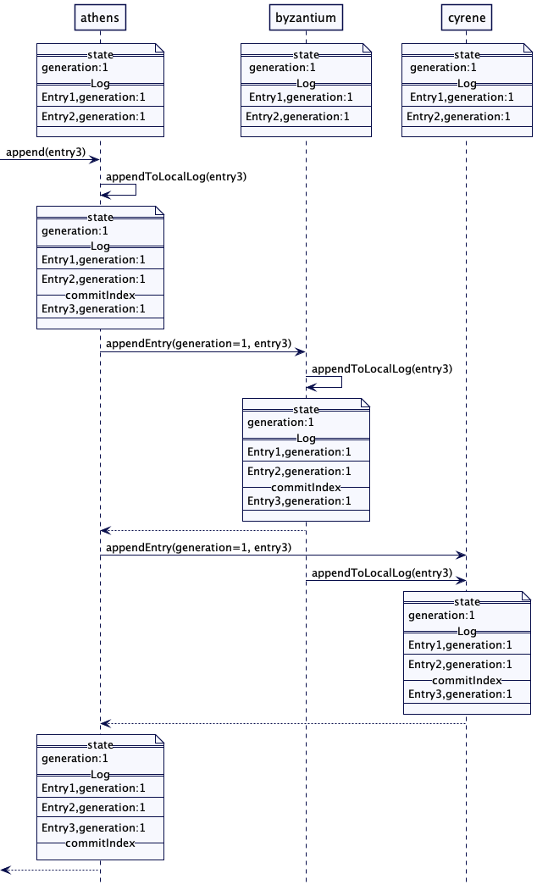
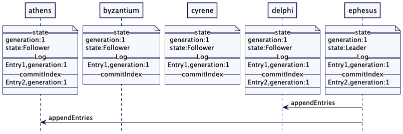
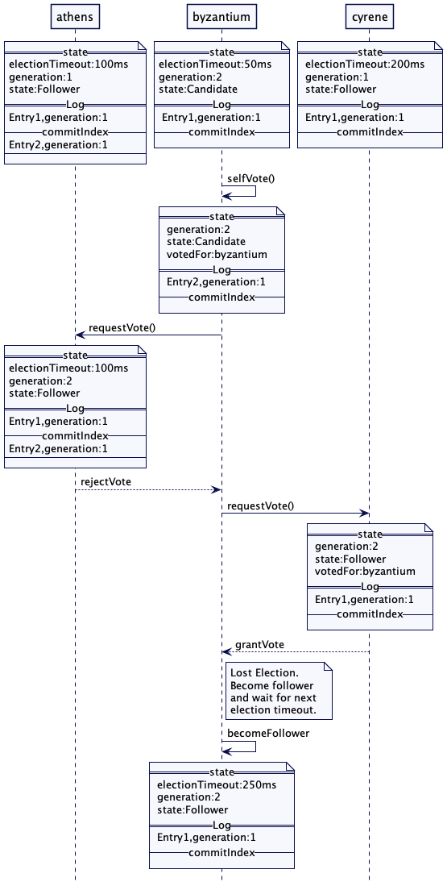
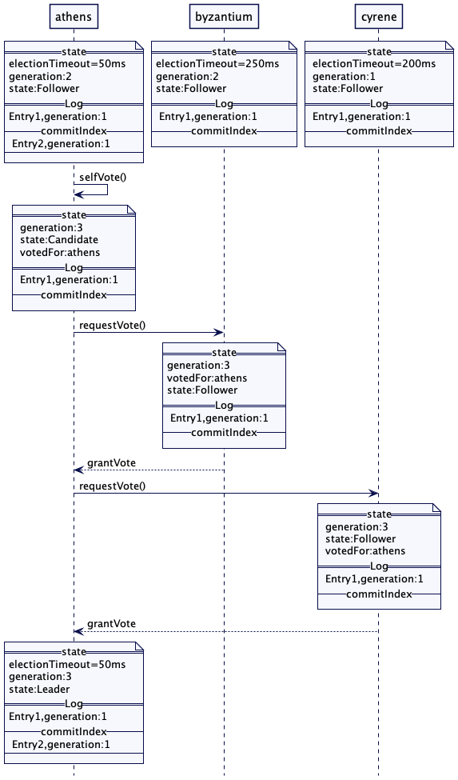
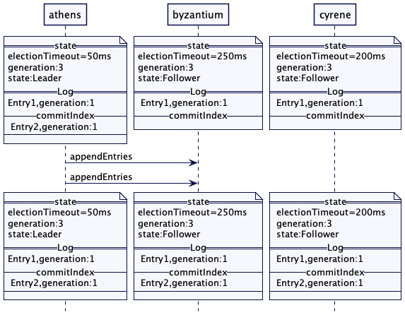
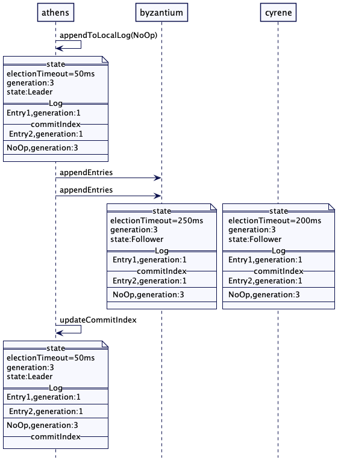
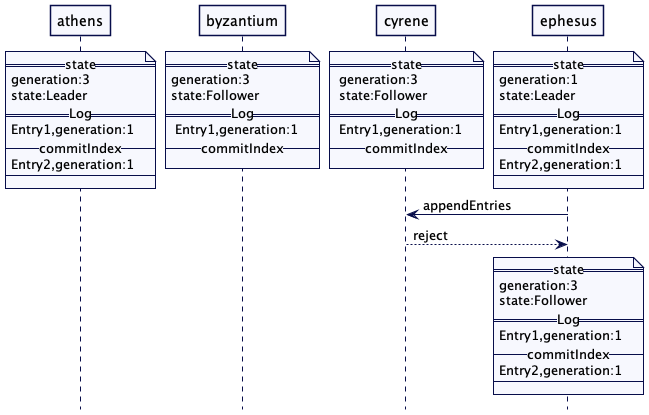

# 复制日志

通过使用复制到所有集群节点的预写日志来保持多个节点的状态同步

## 问题

当多个节点需要共享状态时，这个状态就需要同步。所有集群节点的状态需要达成一致，即使某些节点断开或崩溃。这就需要给每个状态的更改请求要达成共识。

但是仅在单个请求中达成共识还不够。每个副本需要在相同的顺序中执行请求，否则不同的副本最后可能会得到不同的状态，即使它们对单个请求达成了共识。

## 解决方案

集群节点维护一个[预写日志](Write-Ahead-Log.md)。每个日志条目存储着共识所需要的状态以及用户请求。在这些日志条目之上一起达成一致（build consensus），所以集群所有的节点都必须明确相同的预写日志。然后请求按照日志顺序执行。因为所有集群节点都同意每个日志条目，所以它们以相同的顺序执行相同的请求。这确保了所有集群节点共享相同的状态。

使用 [Quorum](Quorum.md) 的容错共识构建机制需要两个阶段。

- 一是建立一个[生成时钟](Generation-Clock.md)以及了解在之前的 [Quorum](Quorum.md) 中复制的日志条目的阶段。
- 二是在集群所有节点上复制请求的阶段

为每个状态更改请求执行这两个阶段效率不高。所以集群节点在启动时选择一个 leader。在 leader 选举阶段建立[生成时钟](Generation-Clock.md)编号并检索前一个 [Quorum](Quorum.md) 的所有日志条目。（前一个领导者可能已经复制了大多数集群节点的条目。）一旦有一个稳定的 leader，只有 leader 协调复制。客户端与 leader 沟通。leader 将每个请求添加到日志中，并确保将其复制到所有 follower 上。一旦日志条目成功复制到大多数 follower，就会达成共识。这样，当有一个稳定的 leader 时，每个状态更改操作只需要一个阶段执行来达成共识。

## Multi-Paxos 和 Raft

[Multi-Paxos](https://www.youtube.com/watch?v=JEpsBg0AO6o&t=1920s) 和 [Raft](https://raft.github.io/) 是目前实现复制日志最受欢迎的算法。Multi-Paxos 只在学术论文中有粗略的描述。[Spanner](https://cloud.google.com/spanner) 和 [Cosmos DB](https://docs.microsoft.com/en-us/azure/cosmos-db/introduction) 等云数据库使用 Multi-Paxos，但实现细节没有很好的文档记录。Raft 在所有的实现细节上都有非常清晰的文档，并且是大多数开源系统首选的，尽管 Paxos 以及它的变体在学术论姐中讨论的多。

下面几节描述了 Raft 如何实现复制日志的。

## 复制客户端请求



​																									图1：复制

对于每个日志条目，leader 会将它附加到本地预写日志中，然后将其发送给所有的 follower。

```java
leader(class ReplicatedLog...)
	private Long appendAndReplicate(byte[] data) {
			Long lastLogEntryIndex = appendToLocalLog(data);
			replicateOnFollowers(lastLogEntryIndex);
			return lastLogEntryIndex;
	}
	
	private void replicateOnFollowers(Long entryAtIndex) {
			for(final FollowerHanlder follower: followers) {
					replicateOn(follower, entryAtIndex); // 发送复制请求给follower
			}
	}
```

follower 接受复制请求并追加到日志条目到本地日志中。成功追加日志之后，它们会响应 leader 并返回他们最新日志条目索引。响应还包括服务器当前的[生成时钟](Generation-Clock.md)编号。

follower 也会检查这个条目是否已经存在，或者是否存在正在复制条目之外的条目。它会忽略已经存在的条目。但是如果有来自不同的生成始时钟编号，它们就会删除冲突的条目。

```java
follower(class ReplicatedLog...)
	void maybeTruncate(ReplicationRequest replicationRequest) {
			replicationRequest.getEntries().stream()
							.filter(entry -> wal.getLastLogIndex() >= entry.getEntryIndex() &&
											entry.getGeneraion() != wal.readAt(entry.getEntryIndex()).getGeneration())
							.forEach(entry -> wal.truncate(entry.getEntryIndex()));
	}
	
follower(class ReplicatedLog...)
	private ReplicationResponse appendEntries(ReplicationRequest replicationRequest) {
			List<WALEntry> entries = replicationRequest.getEntries();
			entries.stream()
							.filter(e -> !wal.exists(e))
							.forEach(e -> wal.writeEntry(e));
			return new ReplicationResponse(SUCCEEDED, serverId(), replicationState.getGeneration(), wal.getLastLogIndex());
	}
```

当复制请求中的时钟编号比已知的服务器最新编号的要小时，follower 拒绝复制请求。并通知 leader 降为 follower。

```java
follwer(class ReplicatedLog...)
	Long currentGeneration = replicationRequest.getGeneration();
	if (currentGeneration > request.getGeneration()) {
			return new ReplicationResponse(FAILED, serverId(), currentGeneration, wal.getLastLogIndex());
	}
```

当 Leader 收到响应时，会跟踪在每个服务器上复制的日志索引。Leader 会使用这些日志索引成功的追踪复制到 Quorum 的日志条目，并将索引作为 commitIndex 进行跟踪。 commitIndex 是日志中的[高水位线](High-Water-Mark.md)。

```java
leader(class ReplicatedLog...)
	logger.info("Updating matchIndex for " + response.getServerId() + " to " + response.getReplicatedLogIndex());
	updateMatchingLogIndex(response.getServerId(), response.getReplicatedLogIndex());
	var logIndexAtQuorum = computeHighwaterMark(logIndexesAtAllServers(), config.numberOfServers());
	var currentHighWaterMark = replicationState.getHighWaterMark();
	if (logIndexAtQuorum > currentHighWaterMark && logIndexAtQuorum != 0) {
      applyLogEntries(currentHighWaterMark, logIndexAtQuorum);
      replicationState.setHighWaterMark(logIndexAtQuorum);
  }
  
 leader (class ReplicatedLog...)
  Long computeHighwaterMark(List<Long> serverLogIndexes, int noOfServers) {
      serverLogIndexes.sort(Long::compareTo);
      return serverLogIndexes.get(noOfServers / 2);
  }

leader (class ReplicatedLog...)
  private void updateMatchingLogIndex(int serverId, long replicatedLogIndex) {
      FollowerHandler follower = getFollowerHandler(serverId);
      follower.updateLastReplicationIndex(replicatedLogIndex);
  }

leader (class ReplicatedLog...)
  public void updateLastReplicationIndex(long lastReplicatedLogIndex) {
      this.matchIndex = lastReplicatedLogIndex;
  }
```

### 全复制

重要的是即使它们断开连接或崩溃并恢复，都要确保所有集群节点从 leader 接收到所有日志条目。Raft有一种机制来确保所有集群节点从 leader 接收到所有的日志条目。

对于 Raft 中的每一个复制请求，leader 也会发送日志索引和日志条目的生成，这些日志条目会在新条目被复制之前立即被发送。如果上一个日志索引和术语与其本地日志不匹配，关注者将拒绝该请求。这表明leader需要对一些较旧的条目同步follower日志。如果之前的日志索引和任期（term）与其本地日志不匹配，则 follower 拒绝该请求。 这表明 leader 需要为一些较旧的条目同步 follower 日志。 

```java
follower (class ReplicatedLog...)
  if (!wal.isEmpty() && request.getPrevLogIndex() >= wal.getLogStartIndex() &&
           generationAt(request.getPrevLogIndex()) != request.getPrevLogGeneration()) {
      return new ReplicationResponse(FAILED, serverId(), replicationState.getGeneration(), wal.getLastLogIndex());
  }

follower (class ReplicatedLog...)
  private Long generationAt(long prevLogIndex) {
      WALEntry walEntry = wal.readAt(prevLogIndex);
      return walEntry.getGeneration();
  }
```

因此 leader 递减 matchIndex，并尝试在较低的索引处发送日志条目。这一过程将持续到 follower 接受复制请求为止。

```java
leader (class ReplicatedLog...) 
	//由于条目冲突拒绝，递减matchIndex
	FollowerHandler peer = getFollowerHandler(response.getServerId());
  logger.info("decrementing nextIndex for peer " + peer.getId() + " from " + peer.getNextIndex());
  peer.decrementNextIndex();
  replicateOn(peer, peer.getNextIndex());
```

对于上一个日志索引和时钟编号检查允许 leader 检测两件事。

- 如果 follower 节点日志中有丢失的条目。例如，如果 follower 日志只有一个条目，leader 开始复制第三个条目，请求将被拒绝，直到 leader 复制第二个条目
- 如果日志中的上一条目来自不同的时钟编号，则高于或低于 leader 日志中的对应条目。**leader 将尝试从较低的索引复制条目，直到请求被接受。**follower 则会删除与该编号不匹配的条目。

这样，leader 通过使用上一个索引来检测丢失的条目或冲突的条目，尝试将自己的日志持续推送给所有 follower。这确保所有集群节点最终从 leader 接收所有日志条目，即使它们断开连接一段时间。

Raft 没有单独的提交消息，但将 commitIndex 作为正常复制请求的一部分发送。空的复制请求也作为心跳发送。因此，commitIndex 作为心跳请求的一部分发送给 followers。

### 日志条目按日志顺序执行

一旦 leader 更新了它的 commitIndex，它就会按照从 commitIndex 的最后一个值到 commitIndex 的最新值的顺序执行日志条目。客户端请求完成，一旦执行日志条目，响应就返回给客户端。

```java
class ReplicatedLog…
  private void applyLogEntries(Long previousCommitIndex, Long commitIndex) {
      for (long index = previousCommitIndex + 1; index <= commitIndex; index++) {
          WALEntry walEntry = wal.readAt(index);
          var responses = stateMachine.applyEntries(Arrays.asList(walEntry));
          completeActiveProposals(index, responses);
      }
  }
```

leader 也发送 commitIndex 伴随心跳请求发送给 follower。follower 会更新 commitIndex，并以相同的方式应用日志条目。

```java
class ReplicatedLog…
  private void updateHighWaterMark(ReplicationRequest request) {
      if (request.getHighWaterMark() > replicationState.getHighWaterMark()) {
          var previousHighWaterMark = replicationState.getHighWaterMark();
          replicationState.setHighWaterMark(request.getHighWaterMark());
          applyLogEntries(previousHighWaterMark, request.getHighWaterMark());
      }
  }
```

## Leader 选举

Leader 选举是检测到前一个仲裁中提交的日志项的阶段。每个集群节点以三种状态运行:候选者（candidate）、领导者（leader）或追随者（follower）。集群节点首先从 follower 状态启动，期望从已有的 leader 获取[心跳](HeartBeat.md)。如果 follower 在预定的时间内没有收到 leader 的任意消息，它（follower）就会转变成 candidate 状态并开始 leader 选举。leader 选举算法建立了新的[生成时钟](Generation-Clock.md)编号。Raft 将[生成时钟](Generation-Clock.md)称为术语。

**leader 选举机制也确保了被选出的 leader 拥有与大多数（quorum）规定的相同数量的最新日志条目**。这是 [Raft](https://raft.github.io/) 做的一个优化，它避免了前一个 Quorum 的日志条目被转移到新的 leader。

新 leader 选举是通过向每个对等服务器发送请求投票的消息开始的。

```java
class ReplicatedLog...
	private void startLeaderElection() {
			replicationState.setGeneration(replicationState.getGeneration() + 1);
			registerSelfVote();
			requestVoteFrom(followers);
	}
```

一旦服务器在给定的时钟编号中被投票，同样的投票总是返回给那个编号（幂等性）。这确保在已经发生成功选举的情况下，请求对同一个时钟编号进行投票的其他服务器不会被选举。投票请求的处理过程如下:

```java
class ReplicatedLog… 
	VoteResponse handleVoteRequest(VoteRequest voteRequest) {
			// 为更高的时钟编号的请求成为 follower
			// 但是我们目前还不知道谁是 leader
			if (voteRequest.getGeneration() > replicationState.getGeneration()) {
					becomeFollower(LEADER_NOT_KNOWN, voteRequest.getGeneration());
			}
			
			VoteTracker voteTracker = replicationState.getGeneration();
			if (voteRequest.getGeneration() == replicationState.getGeneration() && !replicationState.hasLeader()) {
					if(isUptoDate(voteRequest) && !voteTracker.alreadyVote()) {
							voteTracker.registerVote(voteRequest.getServerId());
							return grantVote();
					}
					if (voteTracker.alreadyVote()) {
							return voteTracker.votedFor == voteRequest.getServerId() ?
											grantVote() : rejectVote();
					}
			}
			return rejectVote();
	}
	
	private boolean isUptoDate(VoteRequest voteRequest) {
			boolean result = voteRequest.getLastLogEntryGeneration > wal.getLastLogEntryGeneration()
							|| (voteRequest.getLastLogEntryGeneration() == wal.getLastLogEntryGeneration() &&
							voteRequest.getLastLogEntryIndex() >= wal.getLastLogIndex());			
			return result;
	}
```

从大多数服务器接收选票的服务器将转换到 leader 状态。大多数投票过程在 [Quorum](Quorum.md) 中有讨论。一旦选举成功，leader 就会持续发送[心跳请求](HeartBeat.md)给所有 follower。如果 follower 在规定的时间内没有收到心跳请求，那么就会出发新一轮的 leader 选举。

### 前一个日志条目

正如上一节所讨论的，共识算法的第一阶段检测现有值，这些值在之前的算法运行中已经复制。另一个关键方面是，这些值是作为最新一代 leader 的值提出的。第二阶段决定只有在为当前代提议的值时才提交该值。Raft 从不更新日志中现有条目的时钟编号。因此，如果leader 的日志记录中有老一代的条目，而这些条目在一些 follower 中缺失，那么它就不能仅仅基于大多数的 quorum 将这些条目标记为已提交。这是因为一些其他的服务器可能现在不可用，在更高的一代会有一个相同索引的条目。如果 leader 停止运行而没有复制当前代的条目，那么这些条目就会被新的 leader 覆盖。因此，**在 Raft 中，新的 leader 必须在其任期内提交至少一个条目。然后，它可以安全地提交之前的所有条目。**实际 Raft 的大多数实现尝试在 leader 被认为准备好服务客户端请求之前，在 leader 选举之后，立即提交一个no-op 条目。详情请参阅 [raft-phd](https://web.stanford.edu/~ouster/cgi-bin/papers/OngaroPhD.pdf) 3.6.1节。

### 一个 Leader 选举的例子

现有 5 个服务器 athens, byzantium, cyrene, delphi 以及 ephesus。ephesus 是 leader，时钟编号为 1。它复制了自己、delphi 和 athens 的条目。



​																		图2：失去心跳触发选举

此时，ephesus 和 delphi 与集群的其他部分断开连接。

byzantium 在最新的一次选举超时了，所以它会自增长时钟编号 2 触发选举。cryene 的编号比 2 小，所以它有 byzantium 相同的条目。所以它同意了选举。但 athens 在它的日志中有一个额外的条目。所以它拒绝投票。

因为 byzantium 无法获得大多数的投票（即 3 票），它失去这次选举并转移回 follower 状态。



​																		图3：因不是最新日志，失去选举

athens 超时触发下次选举。它自增长时钟编号 3 并发送投票请求给 byzantium 和 cryene，他们两都同意投票。一旦 athens 获取大多数投票，就会成为 leader 并发送心跳给 byzantium 以及 cryene。byzantium、cryene 一旦接受到了编号更大的 leader 的心跳请求，就会将此编号更新自己的编号。这确认了 athens 的 leader 角色。athens 随后将自己的日志复制给 byzantium 和 cryene。



​																图4：具有最新日志的节点赢得选举

athens 此时从编号 1 的 Entry2 复制给 byzantium 和 cryene。但是由于这个条目是从上一代来的，所以即使在多数 quorum 上成功复制 Entry2，它也不会更新 commitIndex。



athens 追加一个空的条目（no-op entry）到本地日志。之后它成功的复制了在第 3 代是新的条目，并更新了 commitIndex。



如果 ephesus 恢复网络连接，并向 cryene 发送请求。由于 cryene 现在的时钟编号是 3，它拒绝了请求。ephesus 得到被拒绝的响应获取新的周期并变回 follower。



​															图7：leader 回退

## 技术问题

以下是复制日志机制的一些重要技术考虑事项。

- 任何共识构建机制的第一阶段都需要了解可能在前一个 [Quorum](Quorum.md) 上复制的日志条目。leader 需要知道所有这样的日志条目，并确保它们被复制到每个集群节点上。

  **Raft 确保具有最新日志的集群节点被选为 leader**，因此日志条目不需要从其他集群节点传递到新的 leader。

  可能有些条目是冲突的。在这种情况下，follower 日志中冲突的条目将被覆盖。

- 集群中的一些节点可能会滞后，因为它们可能会崩溃并重新启动，或者与 leader 断开连接。leader 需要跟踪每个集群节点，并确保它发送了所有丢失的条目。

  Raft 为每个集群节点维护一个状态，以了解日志条目成功复制到每个节点的日志索引。**对每个集群节点的复制请求将与该日志索引中的所有条目一起发送**，以确保每个集群节点获得所有日志条目。

- 客户端如何与复制的日志交互以查找 leader 的实现在[一致性核心](Consistent-Core.md)中进行了讨论。在客户端重试的情况下，集群检测重复请求是由[幂等接收器](idempotent-receiver.md)处理的。

- 日志压缩一般采用[低水位线](Low-Water-Mark.md)。定期复制的日志备份的存储的快照，比如在应用了几千个条目之后。然后该日志被丢弃到发生快照所在的索引。缓慢的 follower 或新添加的服务器需要发送完整的日志，因此会发送快照，而不是单个日志条目。

- 这里的一个关键假设是，所有请求都需要严格排序。这不是必须的。例如，键值存储可能不需要跨请求对不同的键进行排序。在这种情况下，可以为每个键运行不同的共识实例。然后，它还消除了所有请求都需要一个 leader 的需要。

  [EPaxos](https://www.cs.cmu.edu/~dga/papers/epaxos-sosp2013.pdf)是一种算法，它不依赖于单个leader来排序请求。

  在 [MongoDB](https://www.mongodb.com/) 这样的分区数据库中，每个分区维护一个复制的日志。因此，请求是按每个分区排序的，而不是跨分区排序的。

## Push vs Pull

在这里解释的 Raft 复制机制中，leader 将所有日志条目推送给 follower。也可以让 follower 拉取日志条目。[Kafka](https://kafka.apache.org/) 中的 [Raft 实现](https://cwiki.apache.org/confluence/display/KAFKA/KIP-595%3A+A+Raft+Protocol+for+the+Metadata+Quorum)遵循基于 pull 的复制。

## 日志里有什么？

复制的日志机制用于各种各样的应用程序，从键值存储到[区块链](https://en.wikipedia.org/wiki/Blockchain)。

对于 KV 存储，日志记录的内容是设置 key-value。对于[租赁](Lease.md)，条目是关于建立命名的租赁。对于区块链，这些日志条目是区块链中需要以相同顺序提供给所有对等体的块。对于 [MongoDB](https://www.mongodb.com/) 这样的数据库，条目是需要一致复制的数据。

## 例子

[Raft](https://raft.github.io/)、[Multi-Paxos](https://www.youtube.com/watch?v=JEpsBg0AO6o&t=1920s)、[Zab](https://zookeeper.apache.org/doc/r3.4.13/zookeeperInternals.html#sc_atomicBroadcast) 和 [viewstamped](http://pmg.csail.mit.edu/papers/vr-revisited.pdf) 复制协议使用的机制就是复制日志机制。这种技术称为[状态机复制](https://en.wikipedia.org/wiki/State_machine_replication)，其中副本以相同的顺序执行相同的命令。[一致性核心](Consistent-Core.md)通常使用状态机复制来构建。

像[超级账本 fabric](https://github.com/hyperledger/fabric) 这样的区块链实现有一个基于复制日志机制的排序组件。之前版本的超级账本 fabric 使用 [Kafka](https://kafka.apache.org/) 来对区块链中的块进行排序。最近的版本使用 [Raft](https://raft.github.io/) 实现同样的目的。

## 原文系列

https://martinfowler.com/articles/patterns-of-distributed-systems/replicated-log.html