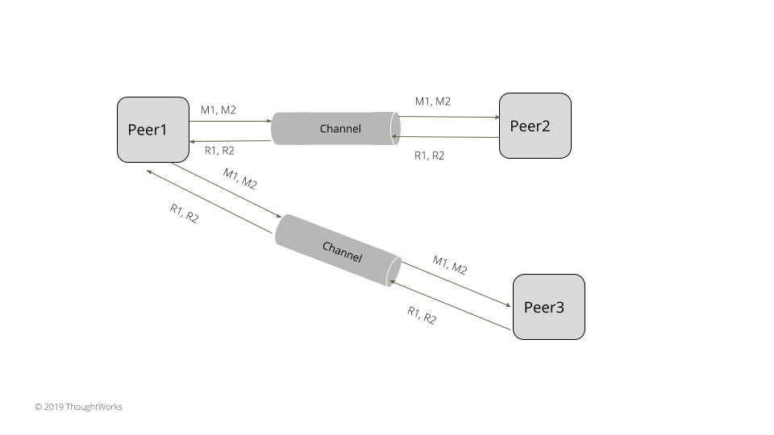

# 请求管道

描述：在连接上发送多个请求而不用等待请一个请求的响应从而优化延迟。

## 问题

在集群中用一个 [Socket Channel](https://martinfowler.com/articles/patterns-of-distributed-systems/single-socket-channel.html) 通信，如果这个请求需要等待上一个请求的响应会导致性能问题。为了很好的解决延时和高吞吐量，请求队列在服务器上应该填充慢，来确保服务器资源得到充分的利用。例如，在服务器中使用[单个更新队列](https://martinfowler.com/articles/patterns-of-distributed-systems/singular-update-queue.html)，在它正在处理一个请求时，它会一直接收请求直到这个队列被填满。如果一次只发送一个请求，那么大多数服务器都会不必要的浪费。

## 解决方案

节点发送请求到其它节点，不需要等待上一个请求的响应返回。这是通过创建两个线程来实现的，一个在网络通道上发送请求，另一个在网络通道上响应请求。



发送消息的节点在 socket 信道上发送请求，必须要等待响应。

class SingleSocketChannel…

```java
  public void sendOneWay(RequestOrResponse request) throws IOException {
      var dataStream = new DataOutputStream(socketOutputStream);
      byte[] messageBytes = serialize(request);
      dataStream.writeInt(messageBytes.length);
      dataStream.write(messageBytes);
  }
```

另一个独立的线程就开始读取响应

class ResponseThread…

```java
  class ResponseThread extends Thread implements Logging {
      private volatile boolean isRunning = false;
      private SingleSocketChannel socketChannel;

      public ResponseThread(SingleSocketChannel socketChannel) {
          this.socketChannel = socketChannel;
      }

      @Override
      public void run() {
          try {
              isRunning = true;
              logger.info("Starting responder thread = " + isRunning);
              while (isRunning) {
                  doWork();
              }

          } catch (IOException e) {
              getLogger().error(e); //thread exits if stopped or there is IO error
          }
      }

      public void doWork() throws IOException {
          RequestOrResponse response = socketChannel.read();
          logger.info("Read Response = " + response);
          processResponse(response);
      }
```

这个返回处理程序能立马响应在[单更新队列](https://martinfowler.com/articles/patterns-of-distributed-systems/singular-update-queue.html)上的返回或提交。

在使用请求管道时这里有两个问题需要去处理。

如果请求是连续发送的且没有等待其响应，那么这个节点接收到这个请求会直到超出限制。为此，这里需要顶一个上限阈值来表明一次只能接收多少个请求。所有节点都能设置这个请求数量最大值给其它节点。一旦发送的请求超过了设置的这个阈值就不会再接收这个请求，并且会阻塞。一个最简单的策略就是设置最大未响应的请求数保持一个阻塞队列。这个队列在初始化的设置这个请求的数量。一旦一个接收的请求被响应，它就会从队列中移除到“移除队列”中来继续接收后面的请求。下面的代码展示了。每个 socket 连接能接受的最大的请求消息数。

class RequestLimitingPipelinedConnection…

```java
  private final Map<InetAddressAndPort, ArrayBlockingQueue<RequestOrResponse>> inflightRequests = new ConcurrentHashMap<>();
  private int maxInflightRequests = 5;
  public void send(InetAddressAndPort to, RequestOrResponse request) throws InterruptedException {
      ArrayBlockingQueue<RequestOrResponse> requestsForAddress = inflightRequests.get(to);
      if (requestsForAddress == null) {
          requestsForAddress = new ArrayBlockingQueue<>(maxInflightRequests);
          inflightRequests.put(to, requestsForAddress);
      }
      requestsForAddress.put(request);
```

接收的请求被响应了就会被删除

class RequestLimitingPipelinedConnection…

```java
  private void consume(SocketRequestOrResponse response) {
      Integer correlationId = response.getRequest().getCorrelationId();
      Queue<RequestOrResponse> requestsForAddress = inflightRequests.get(response.getAddress());
      RequestOrResponse first = requestsForAddress.peek();
      if (correlationId != first.getCorrelationId()) {
          throw new RuntimeException("First response should be for the first request");
      }
      requestsForAddress.remove(first);
      responseConsumer.accept(response.getRequest());
  }
```

保证处理故障和维护有序的实现就变得棘手。假设这里有两个未处理的请求。第一个请求失败并且重试，服务器可能会在第一个请求到达服务器之前处理第二个请求。服务器就必要有一些机制来保证被拒绝请求的顺序。否则在故障和重试的情况下消息会有重排序的危险。例如，[Raft](https://raft.github.io/) 总是发送每个日志条目上的上一个日志索引。如果这个索引无法匹配，服务器就拒绝这个请求。Kafka 能够设置 `max.in.flight.requests.per.connection` 超过一个，使用[幂等生成器](https://issues.apache.org/jira/browse/KAFKA-5494)实现，该实现为发送给代理（broker）的每个消息批分配唯一标识符。broker 然后就会检查这些过来的请求的序号，如果这个是无序的序号就会拒绝这个请求。

## 例子

所有的一致性算法如 [Zab](https://zookeeper.apache.org/doc/r3.4.13/zookeeperInternals.html#sc_atomicBroadcast) 和 [Raft](https://raft.github.io/) 支持请求管道。[Kafka](https://kafka.apache.org/protocol) 鼓励客户使用请求管道来提高吞吐量。