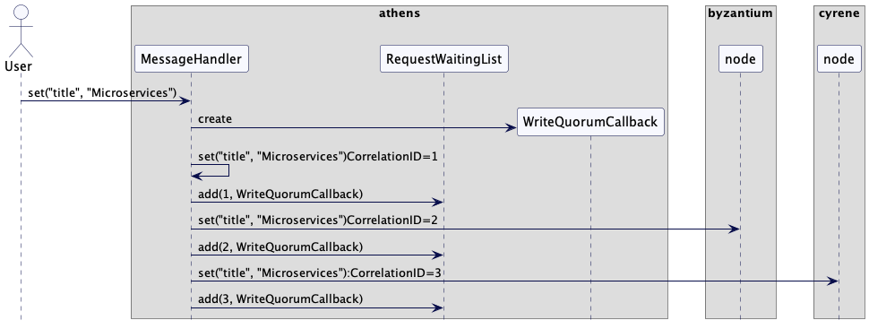
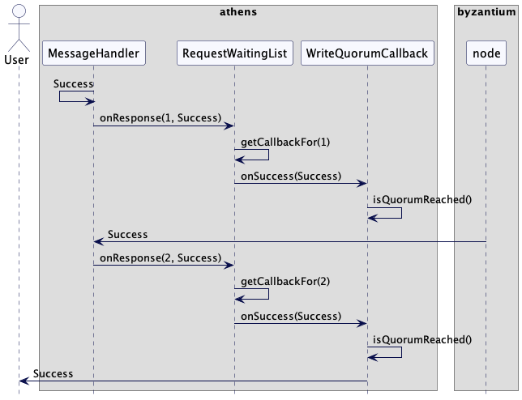

# 请求等待列表

根据其它节集群点的响应情况，跟踪满足响应标准后需要响应的客户请求。

## 问题

在处理客户端请求时，集群节点需要与其他集群节点进行通信以复制数据。在响应客户端之前，需要所有其他集群节点或[Quorum](Quorum.md)的响应。

与其他集群节点的通信是异步进行的。异步通信允许使用[请求管道](Request-Pipeline.md)和[请求批处理](Request-Batch.md)等模式。

因此，集群节点异步接收并处理来自多个其他集群节点的响应。然后，它需要将它们关联起来，以检查是否达到了特定客户请求的[Quorum](Quorum.md)。

## 解决方案

集群节点维护一个键值对等待列表，它映射一个 key 和回调函数。key 的选择取决于调用回调的特定条件。例如，如果需要在接收到来自其他集群节点的消息时调用它，那么它可以是消息的相关标识符。在[复制日志](Replicated-Log.md)那个案例中，key就是[高水位线](High-Water-Mark.md)。回调函数处理响应并决定是否可以满足客户端请求。

考虑一个k-v存储，数据在多个服务器上有备份。[Quorum](Quorum.md)可以用来决定何时复制可以被认为是成功的，以启动对客户端的响应。然后，集群节点跟踪发送到其他集群节点的请求，并为每个请求注册一个回调。每个请求都被标记了一个相关标识符，用来映射请求的响应。然后，当收到其他集群节点的响应时，等待列表被通知调用对应的回调。

还是以三个节点的集群为例，athens, byzantium 以及 cyrene。客户端连接到 athens，将 "title" 存储为 "Microservices"。athens 在 byzantium 和 cyrene 上复制它。所以它向自己发送请求以存储键值，并向 byzantium 和 cyrene 同时发送请求。为了跟踪响应，athens 创建了一个 `WriteQuorumResponseCallback`，并将其添加到每个发送的请求的等待列表中。



对于收到的每个响应，都会调用 `WriteQuorumResponseCallback` 来处理响应。它会检查是否已收到所需的响应数量（即 Quorum）。一旦接收到来自 byzantium 的响应，就满足了 quorum 并将正在挂起的客户端请求完成。Cyrene 稍微晚了一点响应，但是可以将响应发送给客户端，而无需等待。



就像下面代码一样：注意，每个集群节点都会维护自己的等待列表。等待列表追踪 key 和相关的回调，以及存储当时注册回调时的时间戳。时间戳是用来检查回调是否过期，如果在期望的时间内一直没有收到响应的话。

```java
public class RequestWaitingList<Key, Response> {
    private Map<Key, CallbackDetails> pendingRequests = new ConcurrentHashMap<>();
    public void add(Key key, RequestCallback<Response> callback) {
        pendingRequests.put(key, new CallbackDetails(callback, clock.nanoTime()));
    }

class CallbackDetails {
    RequestCallback requestCallback;
    long createTime;

    public CallbackDetails(RequestCallback requestCallback, long createTime) {
        this.requestCallback = requestCallback;
        this.createTime = createTime;
    }

    public RequestCallback getRequestCallback() {
        return requestCallback;
    }

    public long elapsedTime(long now) {
        return now - createTime;
    }
}

public interface RequestCallback<T> {
    void onResponse(T r);
    void onError(Throwable e);
}
```

一旦从其他集群节点接收到响应，就会要求它处理响应或错误。

```java
class RequestWaitingList {
  ...
  public void handleResponse(Key key, Response response) {
      if (!pendingRequests.containsKey(key)) {
          return;
      }
      CallbackDetails callbackDetails = pendingRequests.remove(key);
      callbackDetails.getRequestCallback().onResponse(response);

  }
  
  public void handleError(int requestId, Throwable e) {
      CallbackDetails callbackDetails = pendingRequests.remove(requestId);
      callbackDetails.getRequestCallback().onError(e);
  }
}
```

等待列表可以用来处理仲裁响应，实现如下所示:

```java
static class WriteQuorumCallback implements RequestCallback<RequestOrResponse> {
    private final int quorum;
    private volatile int expectedNumberOfResponses;
    private volatile int receivedResponses;
    private volatile int receivedErrors;
    private volatile boolean done;

    private final RequestOrResponse request;
    private final ClientConnection clientConnection;

    public WriteQuorumCallback(int totalExpectedResponses, RequestOrResponse clientRequest, ClientConnection clientConnection) {
        this.expectedNumberOfResponses = totalExpectedResponses;
        this.quorum = expectedNumberOfResponses / 2 + 1;
        this.request = clientRequest;
        this.clientConnection = clientConnection;
    }

    @Override
    public void onResponse(RequestOrResponse response) {
        receivedResponses++;
        if (receivedResponses == quorum && !done) {
            respondToClient("Success");
            done = true;
        }
    }

    @Override
    public void onError(Throwable t) {
        receivedErrors++;
        if (receivedErrors == quorum && !done) {
            respondToClient("Error");
            done = true;
        }
    }


    private void respondToClient(String response) {
        clientConnection.write(new RequestOrResponse(RequestId.SetValueResponse.getId(), response.getBytes(), request.getCorrelationId()));
    }
}
```

每当一个集群节点向其他节点发送请求时，它都会向等待列表映射添加一个回调，该映射具有所发送请求的[相关标识符](https://www.enterpriseintegrationpatterns.com/CorrelationIdentifier.html)。

```java
class ClusterNode {
  ...
  private void handleSetValueClientRequestRequiringQuorum(List<InetAddressAndPort> replicas, RequestOrResponse request, ClientConnection clientConnection) {
      int totalExpectedResponses = replicas.size();
      RequestCallback requestCallback = new WriteQuorumCallback(totalExpectedResponses, request, clientConnection);
      for (InetAddressAndPort replica : replicas) {
          int correlationId = nextRequestId();
          requestWaitingList.add(correlationId, requestCallback);
          try {
              SocketClient client = new SocketClient(replica);
              client.sendOneway(new RequestOrResponse(RequestId.SetValueRequest.getId(), request.getMessageBodyJson(), correlationId, listenAddress));
          } catch (IOException e) {
              requestWaitingList.handleError(correlationId, e);
          }
      }
  }
}
```

一旦接收到响应，等待列表就会根据映射规则触发回调处理

```java
class ClusterNode {
  ...
  private void handleSetValueResponse(RequestOrResponse response) {
      requestWaitingList.handleResponse(response.getCorrelationId(), response);
  }
}
```

等待列表然后会调用相关的`WriteQuorumCallback`。`WriteQuorumCallback`实例会验证如果接收到了Quorum的响应，就会调用回调来响应客户端。

### 过期的长等待请求

有时候，其它的集群节点的响应会延迟。等待列表实例一般都会有超时检验机制：

```java
class RequestWaitingList {
  ...
  private SystemClock clock;
  private ScheduledExecutorService executor = Executors.newSingleThreadScheduledExecutor();
  private long expirationIntervalMillis = 2000;
  public RequestWaitingList(SystemClock clock) {
      this.clock = clock;
      executor.scheduleWithFixedDelay(this::expire, expirationIntervalMillis, expirationIntervalMillis, MILLISECONDS);
  }

  private void expire() {
      long now = clock.nanoTime();
      List<Key> expiredRequestKeys = getExpiredRequestKeys(now);
      expiredRequestKeys.stream().forEach(expiredRequestKey -> {
          CallbackDetails request = pendingRequests.remove(expiredRequestKey);
          request.requestCallback.onError(new TimeoutException("Request expired"));
      });
  }

  private List<Key> getExpiredRequestKeys(long now) {
      return pendingRequests.entrySet().stream().filter(entry -> entry.getValue().elapsedTime(now) > expirationIntervalMillis).map(e -> e.getKey()).collect(Collectors.toList());
  }
}
```

## 案例

[cassandra](http://cassandra.apache.org/)使用异步消息传递进行节点间通信。它使用[Quorum](Quorum.md)并以相同的方式异步处理响应消息。

[Kafka](https://kafka.apache.org/)使用一个叫做[Kafka-purgatory](https://www.confluent.io/blog/apache-kafka-purgatory-hierarchical-timing-wheels/)的数据结构来跟踪挂起的请求。

[etcd](https://etcd.io/)维护一个等待列表，以[类似的方式](https://github.com/etcd-io/etcd/blob/main/pkg/wait/wait.go)响应客户端请求。

