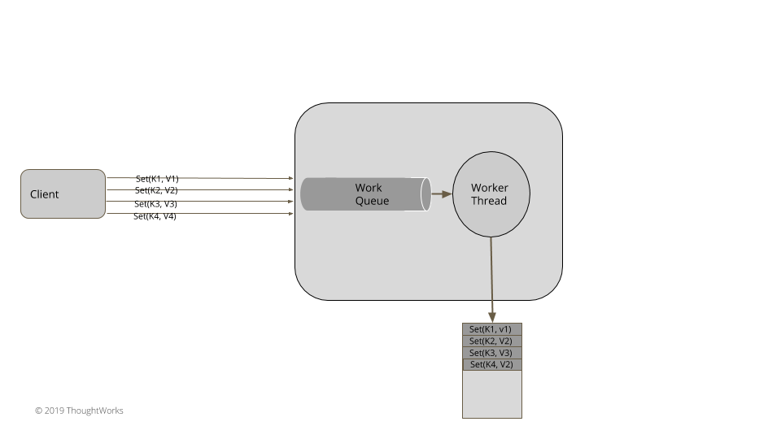
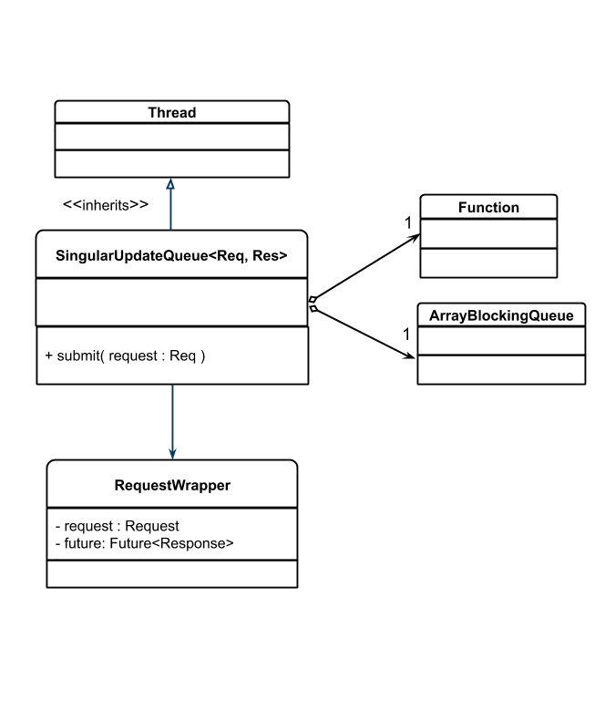
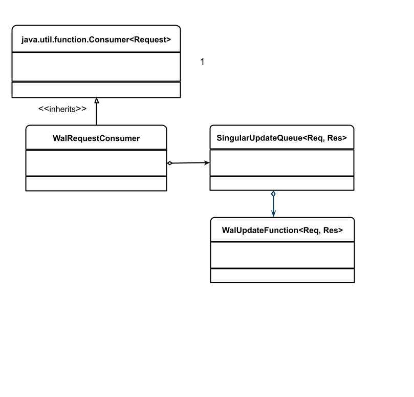

# 单更新队列(Single Update Queue)

使用一个单线程来处理异步请求，在不阻塞调用者的情况下维护顺序

## 问题

当一个状态被多个客户端并发更新时，我们需要在同一时刻安全的只进行一次更新。思考以下 [WAL](https://martinfowler.com/articles/patterns-of-distributed-systems/wal.html) 模式的例子。甚至是在大量客户端并发写日志的时候，我们需要同一时刻处理一个条目。通常我们使用锁来解决这类问题。但是如果一个任务正在执行一个很耗时的消费，如像写文件，那么就会阻塞其它所有的调用线程，直到这个任务完成，这期间会影响整个系统的运行，吞吐量以及延时。要保证同时刻只执行一次，这对于计算资源来说是非常重要的。

## 解决方案

实现一个队列和在该队列上工作的线程。多个客户端并发提交修改状态的请求至队列。但是只有单个线程处理这个状态更改。这个很像 golang 的协程和 channels 的实现。



​																										图1：在工作队列上的单线程



​																											图2：java 中的单更新队列

SingularUpdateQueue 在队列中给每个工作项有一个队列和一个函数。它拓展了 `java.lang.Thread`，来确保它有一个自己的执行线程。

```java
public class SingularUpdateQueue<Req, Res> extends Thread implements Logging {
    private ArrayBlockingQueue<RequestWrapper<Req, Res>> workQueue
            = new ArrayBlockingQueue<RequestWrapper<Req, Res>>(100);
    private Function<Req, Res> handler;
    private volatile boolean isRunning = false;
```

客户端在自己的线程上提交请求到队列。队列用简单的包装器给每个请求包装为了与其它 future 结合，返回一个 future 到客户端，这样就会让客户端在请求最终完成后响应。

```java
// class SingularUpdateQueue…   
public CompletableFuture<Res> submit(Req request) {
      try {
          var requestWrapper = new RequestWrapper<Req, Res>(request);
          workQueue.put(requestWrapper);
          return requestWrapper.getFuture();
      }
      catch (InterruptedException e) {
          throw new RuntimeException(e);
      }
  }
class RequestWrapper<Req, Res> {
    private final CompletableFuture<Res> future;
    private final Req request;

    public RequestWrapper(Req request) {
        this.request = request;
        this.future = new CompletableFuture<Res>();
    }
    public CompletableFuture<Res> getFuture() { return future; }
    public Req getRequest()                   { return request; }
```

队列中的元素被 `SingleUpdateQueue` 转有的单个线程处理。队列允许多个生产者添加执行任务到队列中。这个队列的实现应该是线程安全的，也不应该在竞争中增加太多开销。执行线程选出队列中的请求并一次只处理一个。`CompletableFuture` 是通过响应执行任务来完成的。

```java
// class SingularUpdateQueue… 
  @Override
  public void run() {
       isRunning = true;
       while(isRunning) {
           Optional<RequestWrapper<Req, Res>> item = take();
           item.ifPresent(requestWrapper -> {
               try {
                   Res response = handler.apply(requestWrapper.getRequest());
                   requestWrapper.complete(response);

               } catch (Exception e) {
                   requestWrapper.completeExceptionally(e);
               }
           });
      }
  }
// class RequestWrapper… 
  public void complete(Res response) {
      future.complete(response);
  }

  public void completeExceptionally(Exception e) {
      getFuture().completeExceptionally(e);
  }
```

需要注意的是，我们可以在从队列读取项时设置一个超时时间，而不是无线等待下去。它允许我们如果需要可以将 `isRunning` 设置为 `false` 安全退出线程，以及如果当队列为空时，也不会永远阻塞运行线程。这个允许我们有能力干净的终止运行的线程。

```java
class SingularUpdateQueue… 
  private Optional<RequestWrapper<Req, Res>> take() {
      try {
          return Optional.ofNullable(workQueue.poll(300, TimeUnit.MILLISECONDS));

      } catch (InterruptedException e) {
          return Optional.empty();
      }
  }

  public void shutdown() {
      this.isRunning = false;
  }
```

举个例子，一个服务器正在处理从多个客户端以及更新写日志的请求，那么就可以使用 `SingleUpdateQueue` 做下面事。



​																				图3：SingleUpdateQueue 处理更新写日志

`SingularUpdateQueue` 的客户端处理从队列过来的消息时，通过指定参数类型和运行的函数来设置。这个例子，我们使用了写日志的请求消费者。这里有一个消费者的实例，它将控制访问日志数据结构。这个消费者会将每个请求发送到日志中以及返回一个响应。只有在消息发送到日志中之后才能发送响应消息。我们使用一个 `SingleUpdateQueue` 来确保它们的行为的有序性。

```java
public class WalRequestConsumer implements Consumer<Message<RequestOrResponse>> {

    private final SingularUpdateQueue<Message<RequestOrResponse>, Message<RequestOrResponse>> walWriterQueue;
    private final WriteAheadLog wal;

    public WalRequestConsumer(Config config) {
        this.wal = WriteAheadLog.openWAL(config);
        walWriterQueue = new SingularUpdateQueue<>((message) -> {
            wal.writeEntry(serialize(message));
            return responseMessage(message);
        });
        startHandling();
    }

    private void startHandling() { this.walWriterQueue.start(); }
```

消费者接受一个参数的方法，在队列上发送它们（消息）以及在每个消息处理之后发送一个响应。这个方法运行在调用者线程上，允许多个调用者在想相同时间调用。

```java
@Override
public void accept(Message message) {
    CompletableFuture<Message<RequestOrResponse>> future = walWriterQueue.submit(message);
    future.whenComplete((responseMessage, error) -> {
        sendResponse(responseMessage);
    });
}
```

## 队列选择

队列的数据结构选择也是至关重要的。在 JVM 中有很多数据结构可供选择：

- ArrayBlockQueue（用在 Kafka 中的请求队列）

  就像名称描述的那样，这是一个基于数组的阻塞队列。它用来在在生成队列时候固定边界。一旦队列填满，生成站就会堵塞。这提供了阻塞背压以及当我们处于慢消费快生产来说很有用。

- ConcurrentLinkedQueue 以及 ForkJoinPool （用在 Akka Actors 的 mailbox 实现）

  ConcurrentLinkedQueue 能用在当我们消费者不需要等待生产者的情况，但是这里面有一些协调器只有在任务排队到 ConcurrentLinkedQueue 之后才调用消费者。

- LinkedBlockingDeque （用于 Zookeeper 以及 Kafka 的响应队列）

  这个大部分都是用在无边界队列的场景，不会堵塞生产者。我们需要对此小心选择，如果没有背压技术的实现，那么队列很快就会被填满，就会损失沾满整个内存。

- RingBuffer（LMAX 分裂器）

  LMAX RingBuffer 对此讨论过了，有些时候任务处理延时是敏感的。所以，使用 ArrayBlockingQueue 在处理阶段之间复制任务增加的延迟是不可接受的。[RingBuffer](https://lmax-exchange.github.io/disruptor/files/Disruptor-1.0.pdf) 能用在这个情况，将任务在阶段之间传递。

## 使用 chennels 和轻量级线程

支持轻量级的具有 channel 概念的线程的语言或库来说这是非常合适的（比如 golang，kotlin）。所有的请求都被传递到一个通道中等待处理。这里就会有一个协程来处理所有要更新状态的消息。然后之后就会将响应回写到一个单独的通道中，然后一个单独的协程就会处理并将它送回到客户端。就像下面代码一样，一个请求更新键的请求传递到单个共享的请求通道中。

```go
func (s *server) putKv(w http.ResponseWriter, r *http.Request)  {
  kv, err := s.readRequest(r, w)
  if err != nil {
    log.Panic(err)
    return
  }

  request := &requestResponse{
    request:         kv,
    responseChannel: make(chan string),
  }

  s.requestChannel <- request
  response := s.waitForResponse(request)
  w.Write([]byte(response))
}
```

这个请求被单协程处理并且更新了所有状态

```go
func (s* server) Start() error {
  go s.serveHttp()

  go s.singularUpdateQueue()

  return nil
}

func (s *server) singularUpdateQueue() {
  for {
    select {
    case e := <-s.requestChannel:
      s.updateState(e)
      e.responseChannel <- buildResponse(e);
    }
  }
}
```

## 背压

当工作队列用来与线程之间通信的时候，背压(Backpressure) 是一个非常重要的概念。在消费者慢以及生产者快的情况下，队列很快会被填满。如果不做一些防范措施(precautions)，那么很容易就会因为队列中堆积了太多任务而超出内存。通常，这个队列要设置一个边界，这样当队列填满的时候停止发送。例如 `java.util.concurrent.ArrayBlockingQueue` 有两个方法添加元素。如果队列满了，put 方法会阻塞生产者。如果队列满了，使用 add 方法会抛出 `java.util.concurrent.ArrayBlockingQueue` 异常，但是不会阻塞生产者。要知道哪种情况用哪种方法是非常重要的。在 `ArrayBlockingQueue` 中，put 方法应该使用在阻塞队列以及通过阻塞会提供一个背压。像响应式流(reactive-streams) 这样的框架可以帮助实现从消费者到生产者的更复杂的背压机制。

## 其它考量

- 任务链（Task Chaining）

  大多数处理都是需要以多个任务链一起的形式。其结果就是一个 SingularUpdateQueue 需要传递给其它阶段执行。例如在上面 `SingularUpdateQueue` 展示的那样，在记录 write ahead log 之后，响应体需要通过 socket 连接发送。这是通过在独立的线程上 SingularUpdateQueue 返回的 future 来执行完成的。它也能提交这个任务到其它 SingularUpdateQueue。

- 外部服务调用（External Service Calls）

  有时候，作为 SingularUpdateQueue 任务执行的一部分，需要进行外部服务调用，并且 SingularUpdateQueue 的状态由服务调用的响应来更新。这在无网络阻塞调用或只阻塞处理所有的任务的单线程下非常重要。这个调用是异步的。必须注意，在异步服务调用的 future 回调中不要访问 SingularUpdateQueue 状态，因为这可能在单独的线程中发生，这违背了单线程对SingularUpdateQueue中所有状态更改的目的。类似于其它事件或请求，应该将其调用的结果添加到工作队列中。

## 例子

所有的一致性实现像 Zookeeper（ZAB）或 etcd（RAFT）就需要将请求以严格的顺序处理，一次处理一个。它们使用了相同的代码结构。

- Zookeeper 使用[请求处理管道](https://github.com/apache/zookeeper/blob/master/zookeeper-server/src/main/java/org/apache/zookeeper/server/SyncRequestProcessor.java)，通过单线程请求处理器实现。
- Apache Kafka 中的[控制器](https://cwiki.apache.org/confluence/display/KAFKA/Kafka+Controller+Redesign)，它是基于从 zookeeper 的多个竞争事件来更新状态的，它在一个线程中处理这些事件，所有事件处理程序在一个队列中提交事件。
- [Cassandra](https://github.com/apache/cassandra/blob/trunk/src/java/org/apache/cassandra/concurrent/Stage.java)，它使用了 [SEDA](https://dl.acm.org/doi/10.1145/502034.502057) 架构，用单个线程来更新 Gossip 的状态。
- [Etcd](https://github.com/etcd-io/etcd/blob/master/etcdserver/raft.go) 和其它 go-lang 的实现，都有一个单独的协程工作的请求通道，以更新其状态。
- [LMAX-Diruptors 架构](https://lmax-exchange.github.io/disruptor/files/Disruptor-1.0.pdf)遵循[单一写职责](https://mechanical-sympathy.blogspot.com/2011/09/single-writer-principle.html)来避免当更新本地状态的时候的互斥。

原文：https://martinfowler.com/articles/patterns-of-distributed-systems/singular-update-queue.html

