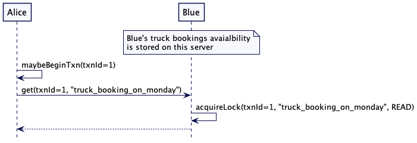
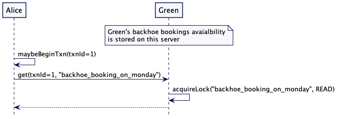
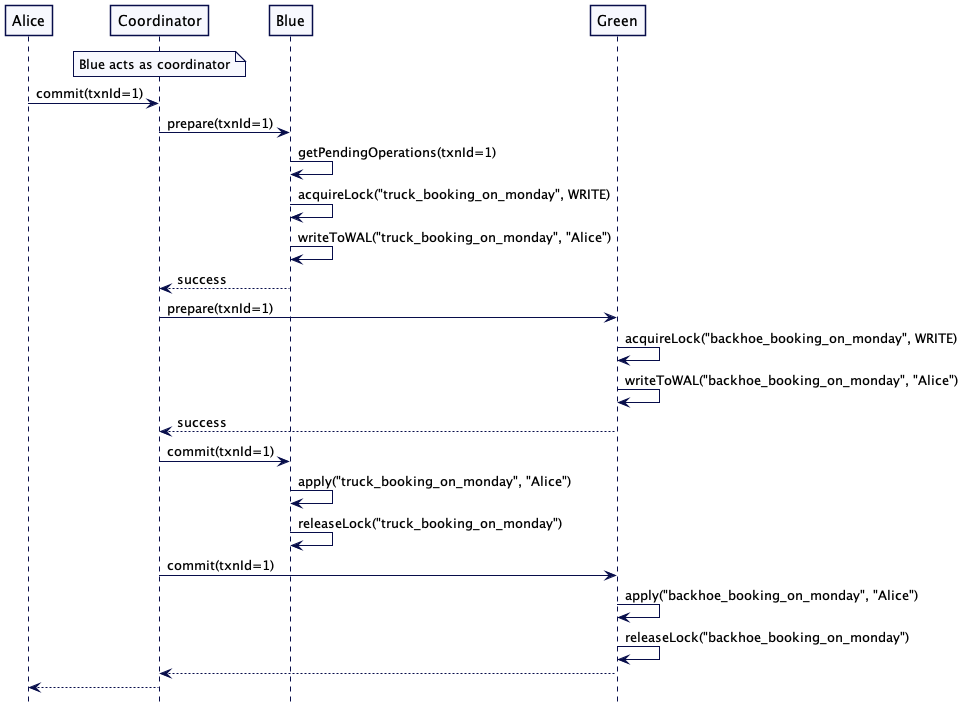
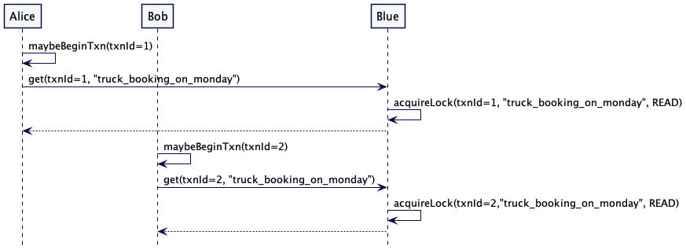
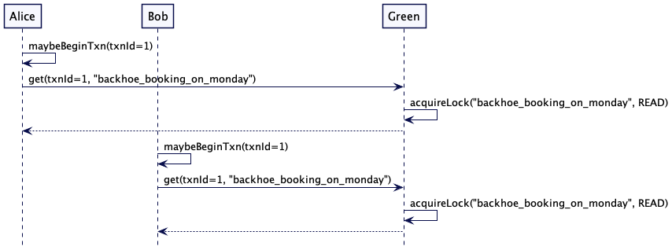
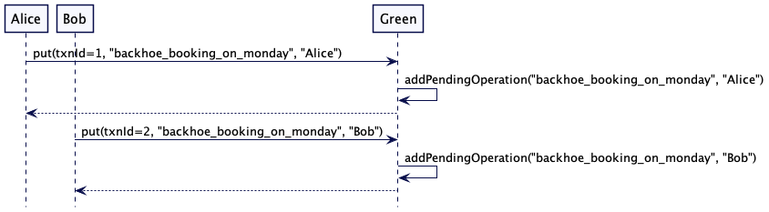
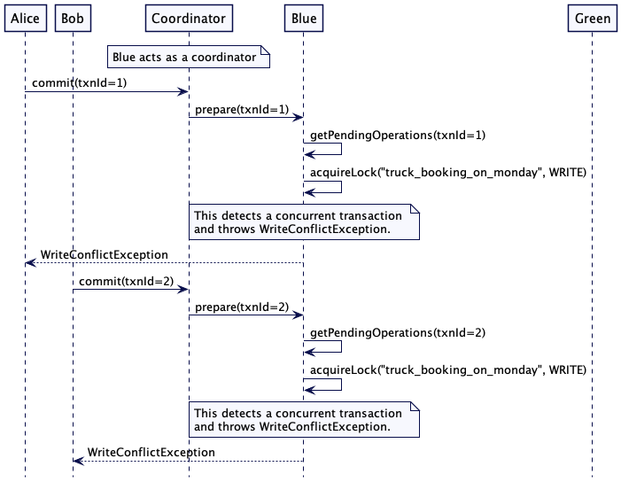
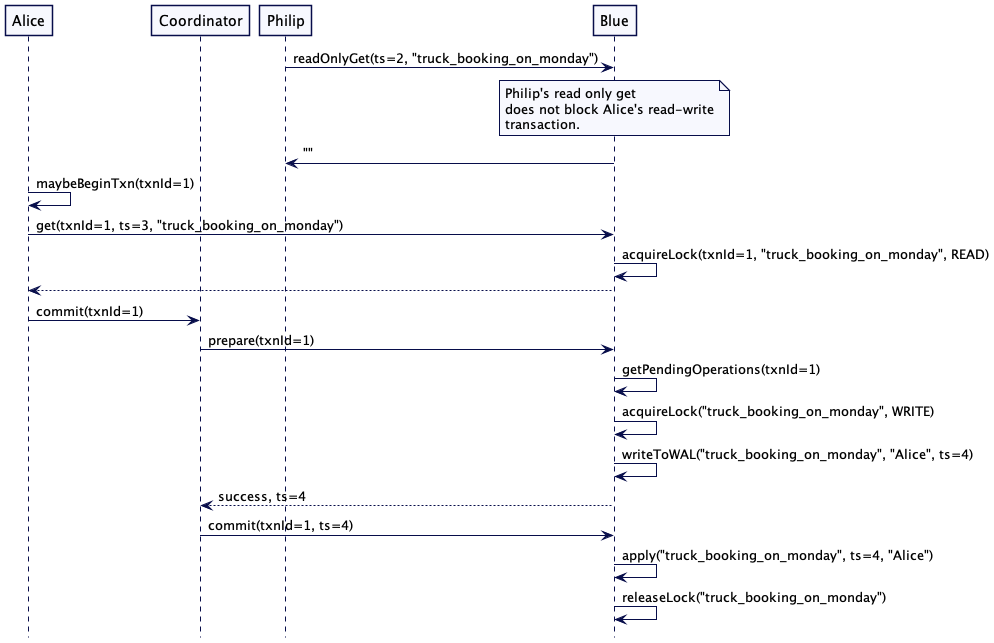

# 两阶段提交（Two Phase Commit）

在一个原子操作中更新多个节点的资源

## 问题

当数据要以原子的方式存储在多个集群节点上时，集群节点在知道其他集群节点的决定之前不能让客户端访问这些数据。每个节点都需要知道其他节点存储的数据是成功还是失败了。

## 解决方案

两阶段提交的本质，是它在两个阶段执行更新：

- 第一阶段为**准备阶段**，询问每个节点是否准备（promise）好执行更新值
- 第二阶段为**提交阶段**，即提交更新值

作为准备阶段的一部分，参与事务的每个节点都需要获得所需的任何东西，以确保它能够在第二阶段完成提交，例如所需的任何锁。一旦每个节点能够确保它可以在第二阶段提交，它就会让**协调器**知道，从而有效地向协调器承诺它可以并且将在第二阶段提交。如果其中有任何节点无法作出承诺，那么协调器就会告知其它节点回退并释放它们占有的任何锁，以及放弃这次事务操作。只有当所有参与者都同意继续进行，第二阶段才会开始，在这一点上，他们都将成功更新。

假设一个简单分布式 kv 存储实现场景，两阶段提交协议的工作原理如下。

事务客户端创建一个称为事务标识符的唯一 id。客户端还跟踪事务启动时间等其他细节。是用来防止死锁的，后面的锁机制将对此进行详细描述。客户端跟踪的唯一 id 以及额外的细节（如开始时间戳）用于跨集群节点引用事务。客户端维护了一个如下的事务引用，它与客户端的每个请求一起传递到集群的其它节点。

```java
class TransactionRef...
	private UUID txnId;
	private long startTimestamp;
	public TransactionRef(long startTimestamp) {
			this.txnId = UUID.randomUUID();
      this.startTimestamp = startTimestamp;
	}
	
class TransactionClient...
	TransactionRef transactionRef;
	public TransactionClient(ReplicaMapper replicaMapper, SystemClock systemClock) {
			this.clock = systemClock;
			this.transactionRef = new TransactionRef(clock.now());
			this.replicaMapper = replicaMapper;
	}
```

其中集群的一个节点扮演协调者的角色，来追踪客户端的事务状态。在 KV 存储器中，它通常是保存其中一个键的数据的集群节点（协调者）。它通常作为集群节点，用于给客户端使用的第一个 key 的数据。

在存值之前，客户端与协调器通信，通知它（协调器）事务开始。因为协调器是存储值的集群节点之一，所以当客户端使用特定的 key 发起 get 或 put 操作时，它会被动态地获取。

```java
class TransactionClient...
	private TransactionalKVStore coordinator;
	private void maybeBeginTransaction(String key) {
			if (coordinator == null) {
					coordinator = replicaMapper.serverFor(key);
					coordinator.begin(transactionRef);
			}
	}
```

事务协调器跟踪事务的状态。它在[预写日志(Write-Ahead Log)](WAL.md)中记录每一个更改，以确保在崩溃的情况下提供详细信息。

```java
class TransactionCoordinator… 
	Map<TransactionRef, TransactionMetadata> transactions = new ConcurrentHashMap<>();
	WriteAheadLog transactionLog;
	
	public void begin(TransactionRef transactionRef) {
			TransactionMetadata txnMetadata = new TransactionMetadata(transactionRef, systemClock, transactionTimeoutMs);
			transactionLog.writeEntry(txnMetadata.serialize());
			transactions.put(transactionRef, txnMetadata);
	}
	
	class TransactionMetadata...
		private TransactionRef txn;
		private List<String> participatingKeys = new ArrayList<>();
		private TransactionStatus transactionStatus;
```

客户端将每个 key 作为事务一部分发送给协调器。通过这种方式，协调器跟踪事务部分所有的 key。 协调器在事务元数据中记录作为事务一部分的键 key。然后，可以使用这些 key 来了解在事务一部分的所有集群节点。因为每个 KV 通常都是用 [Replicated Log](Replicated-Log.md) 进行复制的，leader 服务器为这些在事务的生命周期中会发生变化的特定的 key 处理请求，所以会跟踪键，而不是实际的服务器地址。然后，客户端向持有 key 数据的服务器发送 put 或 get 请求。服务器是根据分区策略选择的。需要注意的是，客户端直接与服务器通信，而不是通过协调器。这避免了在网络上两次发送数据，从客户端到协调器，然后从协调器到各自的服务器。

作为事务一部分，还可以使用这些键来了解所有相关集群节点。因为每个 kv 通常都是用 [Replicated Log](Replicated-Log.md) 来复制的，所以处理特定 key 请求的 leader 服务器可能会在事务的生命周期中发生变化，所以会跟踪键，而不是实际的服务器地址。

```java
class TransactionClient… 
	public CompletableFuture<String> get(String key) {
			meybeBeginTransaction(key);
			coordinator.addKeyToTransaction(transactionRef, key);
			TransactionalKVStore kvStore = replicaMapper.serverFor(key);
			return kvStore.get(transactionRef, key);
	}
	
	public void put(String key, String value) {
			maybeBeginTransaction(key);
			coordinator.addKeyToTransaction(transactionRef, key);
			replicaMapper.serverFor(key).put(transactionRef, key, value);
	}
	
	class TransactionCoordinator...
		public synchronized void addKeyToTransaction(TransactionRef transactionRef, String key) {
				TransactionMetadata metadata = transactions.get(transactionRef);
				if (!metadata.getParticipatingKeys().contains(key)) {
						metadata.addKey(key);
						transactionRef.writeEntry(metadata.serialize());
				}
		}
```

处理该请求的集群节点会检测到该请求是携带事务 ID 的事务的一部分。它管理事务的状态，存储请求中的键和值。键值不是直接提供给KVStore，而是单独存储。

```java
class TransactionalKVStore… 
	public void put(TransactionRef transactionRef, String key, String value) {
			TransactionState state = getOrCreateTransactionState(transactionRef);
			state.addPendingUpdates(key, value);
	}
```

### 锁和事物隔离

这些请求还需要在 key 上上锁。尤其是 get 请求有一个读锁，而 put 请求有一个写锁。读取值时获取读锁。

```java
class TransactionalKVStore...
	public CompletableFuture<String> get(TransactionRef txn, String key) {
			CompletableFuture<TrasactionRef> lockFuture
							= lockManager.acquire(txn, key, LockModel.READ);
			return lockFuture.thenApply(transactionRef -> {
					getOrCreateTransactionState(transactionRef);
					return kv.get(key);
			})
	}
	
	synchronized TransactionState getOrCreateTransactionState(TransactionRef txnRef) {
			TransactionState state = this.ongoingTransactions.get(txnRef);
			if (state == null) {
					state = new TransactionState();
					this.ongoingTransactions.put(txnRef, state);
			}
			return state;
	}
```

只有当事务提交且值在 KVStore 中可见时，才可以使用写锁。在此之前，集群节点只能将修改的值作为挂起操作（pending）跟踪。

延迟锁定降低了事务冲突的机会。

```
class TransactionalKVStore… 
	public void put(TransactionRef transactionRef, String key, String value) {
			TransactionState state = getOrCreateTransactionState(transactionRef);
			state.addPendingUpdates(key, value);
	}
```

**需要注意的是，这些锁是 long-alive 的，并且在请求完成时不会被释放。只有在事务提交完成之后才会释放。**这种在事务期间持有锁并只有在事务提交或回滚时才释放锁的技术称为[两阶段锁定](https://en.wikipedia.org/wiki/Two-phase_locking)。两阶段锁定对于提供可序列化（serializable） 的隔离级别至关重要。可序列化意味着事务的效果是可见的，就像它们一次只执行一个一样（串行化）。

#### 死锁预防

使用锁不当会导致死锁，两个事务相互等待对方释放锁。如果在检测到冲突时不允许事务等待和中止，则可以避免死锁。有不同的策略用来决定哪些事务被中止，哪些事务被允许继续执行。

LockManager 实现了如下等待策略：

```java
class LockManager...
	WaitPolicy waitPolicy;
```

`WaitPolicy` 的值决定了在请求冲突时要做什么。

```java
public enum WaitPolicy {
		WoundWait,
		WaitDie,
		Error
}
```

锁是一个对象，它跟踪当前拥**有该锁的事务**和**等待该锁的事务**。

```java
class Lock...
	Queue<LockRequest> waitQueue = new LinkedList<>();
	List<TransactionRef> owners = new ArrayList<>();
	LockMode lockMode;
```

当一个事务请求占有锁时，如果这里不存在冲突的事务拥有该锁，则 LockManager 立即同意占有该锁。

```java
class LockManager...
	public synchronized CompletableFuture<TransactionRef> acquire(TransactionRef txn, String key, LockMode lockMode) {
			return acquire(txn, key, lockMode, new CompletableFuture<>());
	}
	
	CompletableFuture<TransactionRef> acquire(TransactionRef txnRef, String key, LockMode askedLockMode, CompletableFuture<TransactionRef> lockFuture) {
			Lock lock = getOrCreateLock(key);
			logger.debug("acquiring lock for = " + txnRef + " on key = " + key + " with lock mode = " + askedLockMode);
			if (lock.isCompletible(txnRef, askedLockMode)) {
					lock.addOwner(txnRef, askedLockMode);
					lockFuture.complete(txnRef);
					logger.debug("acquired lock for = " + txnRef);
					return lockFuture;
			}
	}
	
	class Lock...
		public boolean isCompletible(TransactionRef txnRef, LockMode lockMode) {
				if (hasOwner()) {
						return (inReadMode() && lockMode == LockMode.READ)
										|| isUpgrade(txnRef, lockMode);
				}
				return true;
		}
```

如果它们冲突了，LockManager 就会根据等待策略（WaitPolicy）作出相应的逻辑。

##### 冲突错误（error on conflict）

如果等待策略出错了，它将抛出一个错误，调用事务将回滚并在随机的超时时间后重试。

```java
class LockManager… 
	private CompletableFuture<TransactionRef> handleConflict(Lock lock,
                                                           TransactionRef txnRef,
                                                           String key,
                                                           LockMode askedLockMode,
                                                           CompletableFuture<TransactionRef> lockFuture) {
  		switch (waitPolicy) {
  				case Error: {
  						lockFuture.completeExceptionally(new WriteConflictException(txnRef, key, lock.owners));
  						return lockFuture;
  				}
  				case WoundWait: {
  						return lock.woundWait(txnRef, key, askedLockMode, lockFuture, this);
  				}
  				case WaitDie: {
              return lock.waitDie(txnRef, key, askedLockMode, lockFuture, this);
          }
  		}   
      throw new IllegalArgumentException("Unknown waitPolicy " + waitPolicy);
	}
```

在并发的情况下，当有很多用户事务试图获取锁时，如果所有的用户事务都需要重新启动，势必会严重限制系统吞吐量。 数据存储试图确保有最少的事务重启。

一种常见的技术是为事务分配唯一的 ID 并对其排序。例如，[Spanner 分配唯一的 id](https://dahliamalkhi.github.io/files/SpannerExplained-SIGACT2013b.pdf)给事务，以这样一种方式来排序。该技术与在 [Paxos](Paxos.md) 中讨论的跨集群节点排序请求的技术非常相似。一旦可以对事务进行排序，就可以使用两种技术来避免死锁，并且仍然允许事务在不重启的情况下继续进行。

事务引用的创建方式可以与其他事务引用进行比较和排序。最简单的方法是为每个事务分配一个时间戳，并基于时间戳进行比较。

```java
class TransactionRef… 
	boolean after(TransactionRef otherTransactionRef) {
			return this.startTimestamp > otherTransactionRef.startTimestamp;
	}
```

但是在分布式系统中，[时钟不是单调的](https://martinfowler.com/articles/patterns-of-distributed-systems/time-bound-lease.html#wall-clock-not-monotonic)，所以使用了一种不同的方法，比如为事务分配唯一的 id，这样它们就可以被排序。除了已排序的 id 外，还会跟踪每个 id 的大小，以便能够对事务进行排序。[Spanner](https://cloud.google.com/spanner) 通过在系统中追踪每个事务的大小来给这些事务排序。

为了能够对所有事务进行排序，为每个集群节点分配一个唯一的 ID。客户端在事务开始时获取协调器，并从协调器获取事务 ID。作为协调器的集群节点负责生成事务 ID，如下所示。

```java
class TransactionCoordinator… 
	private int requestId;
	public MonotonicId begin() {
			return new MonotonicId(requestId++, config.getServerId());
	}
	
class MonotonicId...
	public class MonotonicId implements Comparable<MonotonicId> {
			public int requestId;
			int serverId;
			
			public MonotonicId(int requestId, int serverId) {
          this.serverId = serverId;
          this.requestId = requestId;
      }
      
      public static MonotonicId empty() {
          return new MonotonicId(-1, -1);
      }
      
      public boolean isAfter(MonotonicId other) {
          if (this.requestId == other.requestId) {
              return this.serverId > other.serverId;
          }
          return this.requestId > other.requestId;
      } 
	}
	
	class TransactionClient… 
		private void beginTransaction(String key) {
				if (coordinator == null) {
					coordinator = replicaMapper.serverFor(key);
          MonotonicId transactionId = coordinator.begin();
          transactionRef = new TransactionRef(transactionId, clock.nanoTime());
				}
		}
```

客户端通过记录事务的年龄（事务开始以来所经过的时间称为年龄）跟踪事务。

```java
class TransactionRef…
  public void incrementAge(SystemClock clock) {
      age = clock.nanoTime() - startTimestamp;
  }
```

每次向服务器发送 get 或 put 请求时，客户端都会增加时间。然后事务就会按照它们的年龄进行排序。当存在相同的事务年龄时，就通过比较事务 id。

```java
class TransactionRef…
  public boolean isAfter(TransactionRef other) {
       return age == other.age?
                  this.id.isAfter(other.id)
                  :this.age > other.age;
  }
```

##### 有害等待（wound-wait）

在[有害等待(wound-wait)](http://www.mathcs.emory.edu/~cheung/Courses/554/Syllabus/8-recv+serial/deadlock-woundwait.html)方法中，如果存在冲突，则将请求锁的事务引用与当前拥有锁的所有事务进行比较。如果当前锁的所有者都要比请求锁的事务更年轻，那么这些事务都要被中止。但是，如果请求该锁的事务比拥有该锁的事务年轻，那么它将等待该锁。

```java
class Lock...
	public CompletableFuture<TransactionRef> woundwait(TransactionRef txnRef,
																										 String key,
																										 LockMode askedLockMode,
																										 CompletableFuture<TransactionRef> lockFuture,
																										 LockManager lockManager) {
			if (allOwningTransactionsStartedAfter(txnRef) && !anyOwnerIsPrepared(lockManager)) {	//注意，如果已经处于准备阶段，则不会终止
					abortAllOwners(lockManager, key, txnRef);
					return lockManager.acquire(txnRef, key, askedLockMode, lockFuture);
			}
			
			LockRequest lockRequest = new LockRequest(txnRef, key, askedLockMode, lockFuture);
			lockManager.logger.debug("Adding to wait queue = " + lockRequest);
			addToWaitQueue(lockRequest);
			return lockFuture;
	}
	
class Lock...
	private boolean allOwningTransactionsStartedAfter(TransactionRef txn) {
			return owners.stream().filter(o -> !o.equals(txn)).allMatch(owner -> owner.after(txn));
	}
```

其中一个关键需要注意，如果这个锁拥有者的事务已经处于两阶段提交的准备阶段，那么它就不会被中止。

##### 等待死亡（wait-die）

[wait-die方法](http://www.mathcs.emory.edu/~cheung/Courses/554/Syllabus/8-recv+serial/deadlock-waitdie.html)的工作原理与[wound-wait](http://www.mathcs.emory.edu/~cheung/Courses/554/Syllabus/8-recv+serial/deadlock-woundwait.html)相反。如果锁所有者都比请求锁的事务年轻，那么事务就会等待锁。如果请求锁的事务小于拥有该事务的事务，则该事务将被中止。

```java
class Lock...
	public CompletableFuture<TransactionRef> waitDie(TransactionRef txnRef,
																									 String key,
																									 LockMode askedLockMode,
																									 CompletableFuture<TransactionRef> lockFuture,
																									 LockManager lockManager) {
			if (allOwningTransactionsStartedAfter(txnRef)) {
					addToWaitQueue(new LockRequest(txnRef, key, askedLockMode, lockFuture));
					return lockFuture;
			}
      
      lockManager.abort(txnRef, key);
      lockFuture.completeExceptionally(new WriteConflictException(txnRef, key, owners));
      return lockFuture;
	}
```

与 wait-die 相比 Wound-wait 机制通常很少会重新启动。所以像[Spanner](https://cloud.google.com/spanner)这样的数据存储器就会使用[wound-wait](http://www.mathcs.emory.edu/~cheung/Courses/554/Syllabus/8-recv+serial/deadlock-woundwait.html)的方法。

当持有锁的事务释放锁时，正处于等待的事务就会被授予锁。

```java
class LockManager...
	private void release(TransactionRef txn, String key) {
			Optional<Lock> lock = getLock(key);
			lock.isPresent(l -> {
					l.release(txn, this);
			});
	}
	
class Lock...
	public void release(TransactionRef txn, LockManager lockManager) {
			removeOwner(txn);
			if (hasWaiters()) {
					LockRequest lockRequest = getFirst(lockManager.waitPolicy);
					lockManager.acquire(lockRequest.txn, lockRequest.key, lockRequest.lockMode, lockRequest.future);
			}
	}
```

### 提交以及回退

如果客户端非常顺利没有经过任何冲突成功读写所有键值，它就会通过向协调者发送一个提交请求来启动请求提交。

```java
class TransactionClient...
	public CompletableFuture<Boolean> commit() {
			return coordinator.commit(transactionRef);
	}
```

事务协调者记录了准备提交的事务状态。协调者在第二阶段实现了提交处理程序。

- 它首先向每个参与者发送准备请求。
- 一旦得到所有参与者的响应信息，协调者就会将事务从准备标记为完成。然后发送提交请求给所有的参与者。

```java
class TransactionCoordinator...
	public CompletableFuture<Boolean> commit(TransactionRef transactionRef) {
			TransactionMetadata metadata = transactions.get(transactionRef);
			metadata.markPreparingToCommit(transactionLog);
			List<CompletableFuture<Boolean>> allPrepared = sendPrepareRequestToParticipants(transactionRef);
			CompletableFutrue<List<Boolean>> futureList = sequence(allPrepared);
			return futureList.thenApply(result -> {
					if (!result.stream().allMatch(r -> r)) {
							logger.info("Rolling back = " + transactionRef);
							rollback(transactionRef);
							return false;
					}
					metadata.markPrepared(transactionLog);
					sendCommitMessageToParticipants(transactionRef);
					metadata.markCommitComplete(transactionLog);
					return true;
			});
	}
	
	public List<CompletableFuture<Boolean>> sendPrepareRequestToParticipants(TransactionRef transactionRef) {
			TransactionMetadata transactionMetadata = transactions.get(transactionRef);
			var transactionParticipants = getParticipants(transactionMetadata.getParticipatingKeys());
			return transactionParticipants.keySet()
							.stream()
							.map(server -> server.handlePrepare(transactionRef))
							.collect(Collectors.toList());
	}
	
	private void sendCommitMessageToParticipants(TransactionRef transactionRef) {
			TransactionMetadata transactionMetadata = transactions.get(transactionRef);
			var participantsForKeys = getParticipants(transactionMetadata.getParticipatingKeys());
			return transactionParticipants.keySet()
							.stream()
							.forEach(kvStore -> {
									List<String> keys = participantsForKeys.get(kvStore);
									kvStore.handleCommit(transactionRef, keys);
							});
	}
	
	private Map<TransactionalKVStore, List<String>> getParticipants(List<String> participatingKeys) {
			return participatingKeys.stream()
							.map(k -> Pair.of(serverFor(k), k))
							.collect(Collectors.groupingBy(Pair::getKey, Collectors.mapping(Pair::getValue, Collectors.toList())));
	}
```

集群接收准备请求会做两件事：

- 尝试获取所有键的写锁。
- 一旦成功获取，它将会把所有的变更写到[预写日志](WAL.md)中。

如果成功做完上面两件事，就能保证事务不会冲突，甚至是当集群节点崩溃的情况下也能恢复所有必要的状态最终完成事务。

```java
class TransactionalKVStore… 
	public synchronized CompletableFuture<Boolean> handlePrepare(TransactionRef txn) {
			try {
					TransactionState state = getTransactionState(txn);
					if (state.isPrepared()) {
              return CompletableFuture.completedFuture(true); //already prepared.
          }
          if (state.isAborted()) {
              return CompletableFuture.completedFuture(false); //aborted by another transaction.
          }
          
          Optional<Map<String, String>> pendingUpdates = state.getPendingUpdates();
          CompletableFuture<Boolean> prepareFuture = prepareUpdates(txn, pendingUpdates);
          return prepareFuture.thenApply(ignored -> {
              Map<String, Lock> locksHeldByTxn = lockManager.getAllLocksFor(txn);
              state.markPrepared();
              writeToWAL(new TransactionMarker(txn, locksHeldByTxn, TransactionStatus.PREPARED));
              return true;
          });
			} catch (TransactionException| WriteConflictException e) {
					logger.error(e);
			}
			return CompletableFuture.completedFuture(false);
	}
	
	private CompletableFuture<Boolean> prepareUpdates(TransactionRef txn, Optional<Map<String, String>> pendingUpdates) {
			if (pendingUpdates.isPresent()) {
					Map<String, String> pendingKVs = pendingUpdates.get();
					CompletableFuture<List<TransactionRef>> lockFuture = acquireLocks(txn, pendingKVs.keySet());
          return lockFuture.thenApply(ignored -> {
              writeToWAL(txn, pendingKVs);
              return true;
          });
			}
			return CompletableFuture.completedFuture(true);
	}
	
	TransactionState getTransactionState(TransactionRef txnRef) {
      return ongoingTransactions.get(txnRef);
  }
  
  private void writeToWAL(TransactionRef txn, Map<String, String> pendingUpdates) {
     for (String key : pendingUpdates.keySet()) {
          String value = pendingUpdates.get(key);
          wal.writeEntry(new SetValueCommand(txn, key, value).serialize());
      }
  }
  
  private CompletableFuture<List<TransactionRef>> acquireLocks(TransactionRef txn, Set<String> keys) {
      List<CompletableFuture<TransactionRef>> lockFutures = new ArrayList<>();
      for (String key : keys) {
          CompletableFuture<TransactionRef> lockFuture = lockManager.acquire(txn, key, LockMode.READWRITE);
          lockFutures.add(lockFuture);
      }
      return sequence(lockFutures);
  }
```

当集群节点从协调者接收到提交请求时，可以安全的让 key-value 变更可见。当提交变更时集群节点会做一下三件事：

- 标记事务为已提交。如果集群节点此时发生故障，它知道事务的结果，可以重复以下步骤。
- 将所有的更改保存到 k-v 存储器中
- 释放全部持有的锁。

```java
class TransactionalKVStore… 
	public synchronized void handleCommit(TransactionRef transactionRef, List<String> keys) {
			if (!ongoingTransactions.containsKey(transactionRef)) {
          return; //this is a no-op. Already committed.
      }
      if (!lockManager.hasLocksFor(transactionRef, keys)) {
          throw new IllegalStateException("Transaction " + transactionRef + " should hold all the required locks for keys " + keys);
      }
      writeToWAL(new TransactionMarker(transactionRef, TransactionStatus.COMMITTED, keys));
      
      applyPendingUpdates(transactionRef);
      
      releaseLocks(transactionRef, keys);
	}
	
	private void removeTransactionState(TransactionRef txnRef) {
			ongoingTransactions.remove(txnRef);
	}
	
	private void applyPendingUpdates(TransactionRef txnRef) {
			TransactionState state = getTransactionState(txnRef);
			Optional<Map<String, String>> pendingUpdates = state.getPendingUpdates();
			apply(txnRef, pendingUpdates);
	}
	
	private void apply(TransactionRef txnRef, Optional<Map<String, String>> pendingUpdates) {
			if (pendingUpdates.isPresent()) {
          Map<String, String> pendingKv = pendingUpdates.get();
          apply(pendingKv);
      }
      removeTransactionState(txnRef);
	}
	
	private void apply(Map<String, String> pendingKv) {
      for (String key : pendingKv.keySet()) {
          String value = pendingKv.get(key);
          kv.put(key, value);
      }
  }
  private void releaseLocks(TransactionRef txn, List<String> keys) {
          lockManager.release(txn, keys);
  }
  
  private Long writeToWAL(TransactionMarker transactionMarker) {
     return wal.writeEntry(transactionMarker.serialize());
  }
```

回滚操作是用类似的操作实现的。如果存在任何的失败，客户端就会通知协调器回滚事务。

```java
class TransactionClient…
  public void rollback() {
      coordinator.rollback(transactionRef);
  }
```

事务协调器将事务的状态记录为准备回滚。然后，它将回滚请求转发到所有存储给定事务值的服务器。一旦所有请求都成功，协调器将「事务回滚」标记为「完成」。如果协调器在事务被标记为“准备回滚”后崩溃，它可以继续向所有参与的集群节点发送回滚消息。

```java
class TransactionCoordinator… 
	public void rollback(TransactionRef transactionRef) {
      transactions.get(transactionRef).markPrepareToRollback(this.transactionLog);

      sendRollbackMessageToParticipants(transactionRef);

      transactions.get(transactionRef).markRollbackComplete(this.transactionLog);
  }
  
  private void sendRollbackMessageToParticipants(TransactionRef transactionRef) {
      TransactionMetadata transactionMetadata = transactions.get(transactionRef);
      var participants = getParticipants(transactionMetadata.getParticipatingKeys());
      for (TransactionalKVStore kvStore : participants.keySet()) {
          List<String> keys = participants.get(kvStore);
          kvStore.handleRollback(transactionMetadata.getTxn(), keys);
      }
  }
```

集群节点接收到会滚请求会做两件事：

- 记录回滚事务状态到预写日志中。
- 丢弃事务状态。
- 释放所有锁。

```java
class TransactionalKVStore… 
	public synchronized void handleRollback(TransactionRef transactionRef, List<String> keys) {
      if (!ongoingTransactions.containsKey(transactionRef)) {
          return; //no-op. Already rolled back.
      }
      writeToWAL(new TransactionMarker(transactionRef, TransactionStatus.ROLLED_BACK, keys));
      this.ongoingTransactions.remove(transactionRef);
      this.lockManager.release(transactionRef, keys);
  }
```

#### 幂等操作

在网络故障的情况下，协调器可以重试调用来「准备」、「提交」或「中止」。所以这些运算必须是幂等的。

### 场景举例

#### 原子写操作

有以下场景，Paula Blue 有一个卡车，Steven Green 有一个挖掘机。卡车和挖掘机的可用性和预订状态存储在分布式键-值存储器中。根据 key 映射到服务器的方式，Blue 的卡车和 Green 的挖掘机订单存储在单独的集群节点上。Alice 正试图预订一辆卡车和挖掘机来完成她计划在周一开始的施工工作。卡车和挖掘机都要是可用的。

下单场景过程如下流程所示。

Alice 检查 Blue 的卡车和 Green 的挖掘机是否可用。通过读取键'truck_booking_monday'以及'backhoe_booking_monday'





如果读取的值是空的，则预订是免费的。她保留了卡车和挖掘机。这两个值都是通过原子操作设置的，这一点很重要。如果有任何失败，则没有设置任何值。

提交发生在两个阶段。Alice 联系的第一个服务器充当协调器并执行这两个阶段。



> 协调器在协议中是一个独立的参与者，并以序列图中这种方式显示。然而，通常其中一个服务器(Blue或Green)充当协调器，因此在交互中扮演两个角色。

#### 事物冲突

现在考虑另一个场景，有另一个人 Bob，他也在尝试在相同的时间点周一预定卡车和挖掘机。

预定场景如下所示：

- Alice 和 Bob 同时读取相同的 key —— 'truck_booking_monday' 和 'backhoe_booking_monday'
- 两人都看到值为空，这意味着预订是免费的。
- 两人都尝试预定卡车和挖掘机。

我们的期望是，只有 Alice 或 Bob 能够预订，因为事务是冲突的。在出现错误的情况下，需要重新尝试整个流程，希望能够继续进行预订。但在任何情况下，预订都不能只完成一部分。要么两个预订都应该完成，要么两个预订都不完成。

为了检查可用性，Alice 和 Bob 都启动一个事务，并分别联系 Blue 和 Green 服务器来检查可用性。Blue 持有 key 'truck_booking_on_monday' 的读锁，Green 持有 key 'backhoe_booking_on_monday' 的读锁。因为读锁是共享的，所以 Alice 和 Bob 都可以读取这些值。





Alice 和 Bob 都看到了在周一卡车和挖掘机是可用的。所以它们通过向服务器发送 put 请求来保留卡车和挖掘机。两个服务器都将 put 请求保存在临时存储中。




当 Alice 和 Bob 决定提交事务时 —— 假设 Blue 充当协调器 —— 它触发两阶段提交协议，并将准备请求发送给自己和 Green。

Alice 的请求它尝试为 key'truck_booking_on_monday' 获取写锁，但是它无法获取，因为此时还存在其他事务获取了读锁，这里存在冲突了。所以 Alice 事务在准备阶段失败了。相同的事情也同样发生在 Bob 的请求中。



事务可以循环重试：

```java
class TransactionExecutor...
	public boolean executeWithRetry(Function<TransactionClient, Boolean> txnMethod, ReplicaMapper replicaMapper, SystemClock systemClock) {
			for (int attempt = 1; attempt <= maxRetries; attempt++) {
					TransactionClient client = new TransactionClient(replicaMapper, systemClock);
					try {
							boolean checkPassed = txnMethod.apply(client);
							Boolean successfullyCommitted = client.commit().get();
							return checkPassed && successfullyCommitted;
					} catch (Exception e) {
							logger.error("Write conflict detected while executing." + client.transactionRef + " Retrying attempt " + attempt);
							client.rollback();
							randomWait();	// 随机等待
					}
			}
			
			return false;
	}
```

Alice 和 Bob 的预定逻辑如下：

```java
class TransactionalKVStoreTest… 
	@Test
	public void retryWhenConflict() {
			List<TransactionalKVStore> allServers = createTestServers(WaitPolicy.WoundWait);
			TransactionExecutor aliceTxn = bookTransactionally(allServers, "Alice", new TestClock(1));
			TransactionExecutor bobTxn = bookTransactionally(allServers, "Bob", new TestClock(2));
			
			TestUtils.waitUntilTrue(() -> (aliceTxn.isSuccess() && !bobTxn.isSuccess()) || (!aliceTxn.isSuccess() && bobTxn.isSuccess()), "waiting for one txn to complete", Duration.ofSeconds(50));
	}
	
	private TransactionExecutor bookTransactionally(List<TransactionalKVStore> allServers, String user, SystemClock systemClock) {
			List<String> bookingKeys = Arrays.asList("truck_booking_on_monday", "backhoe_booking_on_monday");
      TransactionExecutor t1 = new TransactionExecutor(allServers);
      t1.executeAsyncWithRetry(txnClient -> {
          if (txnClient.isAvailable(bookingKeys)) {
              txnClient.reserve(bookingKeys, user);
              return true;
          }
          return false;
      }, systemClock);
      return t1;
	}
```

在这种情况下，其中一个事务将最终成功，而另一个将退出。

虽然它很容易实现，但使用 WaitPolicy.Error 时，会有多个事务重启，从而降低了总吞吐量。如上一节所述，如果使用了 Wound-Wait 策略，将会有更少的事务重启。在上面的例子中，在发生冲突的情况下，只有一个事务可能会重新启动，而不是两个事务都重新启动。

### 使用[版本化的值（Versioned Value）](Versioned-Value.md)

所有读和写操作都有冲突是非常有约束的，特别是当事务可以是只读的时候。如果只读事务可以在不持有任何锁的情况下工作，并且仍然保证事务中读到的值不会随着并发读写事务而改变，那么这是最理想的。

数据存储器（Data-stores）通常存储值的多个版本，如[版本值](Versioned-Value.md)中所述。版本使用的是是通过参照[Lamport 时钟](Lamport-Clock.md)的时间戳。大多数数据库如[MongoDb](https://www.mongodb.com/)或[CockroachDB](https://www.cockroachlabs.com/docs/stable/)使用的是[混合时钟](Hybrid-Clock.md)。要将它与两阶段提交协议一起使用，诀窍在于，参与事务的每个服务器都发送可以写入值的时间戳，作为对 prepare 请求的响应。协调器选择这些时间戳中的最大值作为提交的时间戳，并将其与值一起发送。然后，参与的服务器将该值保存在提交时间戳。这允许在不持有锁的情况下执行只读请求，因为它保证了在特定时间戳写入的值永远不会改变。

思考下面的例子。Philip 正在运行一份在阅读时间戳2之前的所有预订的报告。如果它是一个持有锁的长时间运行的操作，那么正在尝试预订卡车的 Alice 将被阻塞，直到 Philip 的工作完成。使用[版本值](Versioned-Value.md), Philip 的 get 请求(它是只读操作的一部分)可以在时间戳2上继续，而 Alice 的预定请求在时间戳4上继续。



注意，读请求是读写事务的一部分，仍然需要持有锁。

Lamport 时钟代码示例如下：

```java
class MvccTransactionalKVStore… 
	public String readOnlyGet(String key, long readTimestamp) {
      adjustServerTimestamp(readTimestamp);
      return kv.get(new VersionedKey(key, readTimestamp));
  }
  
  public CompletableFuture<String> get(TransactionRef txn, String key, long readTimestamp) {
  		adjustServerTimestamp(readTimestamp);
      CompletableFuture<TransactionRef> lockFuture = lockManager.acquire(txn, key, LockMode.READ);
      return lockFuture.thenApply(transactionRef -> {
          getOrCreateTransactionState(transactionRef);
          return kv.get(key);
      });
  }
  
  private void adjustServerTimestamp(long readTimestamp) {
      this.timestamp = readTimestamp > this.timestamp ? readTimestamp : timestamp;
  }
  
  public void put(TransactionRef txnId, String key, String value) {
      timestamp = timestamp + 1;
      TransactionState transactionState = getOrCreateTransactionState(txnId);
      transactionState.addPendingUpdates(key, value);
  }
  
class MvccTransactionalKVStore… 
	private long prepare(TransactionRef txn, Optional<Map<String, String>> pendingUpdates) throws WriteConflictException, IOException {
      if (pendingUpdates.isPresent()) {
          Map<String, String> pendingKVs = pendingUpdates.get();

          acquireLocks(txn, pendingKVs);

          timestamp = timestamp + 1; //increment the timestamp for write operation.

          writeToWAL(txn, pendingKVs, timestamp);
       }
      return timestamp;
  }
  
 class MvccTransactionCoordinator… 
 	public long commit(TransactionRef txn) {
          long commitTimestamp = prepare(txn);

          TransactionMetadata transactionMetadata = transactions.get(txn);
          transactionMetadata.markPreparedToCommit(commitTimestamp, this.transactionLog);

          sendCommitMessageToAllTheServers(txn, commitTimestamp, transactionMetadata.getParticipatingKeys());

          transactionMetadata.markCommitComplete(transactionLog);

          return commitTimestamp;
  }
  
  public long prepare(TransactionRef txn) throws WriteConflictException {
      TransactionMetadata transactionMetadata = transactions.get(txn);
      Map<MvccTransactionalKVStore, List<String>> keysToServers = getParticipants(transactionMetadata.getParticipatingKeys());
      List<Long> prepareTimestamps = new ArrayList<>();
      for (MvccTransactionalKVStore store : keysToServers.keySet()) {
          List<String> keys = keysToServers.get(store);
          long prepareTimestamp = store.prepare(txn, keys);
          prepareTimestamps.add(prepareTimestamp);
      }
      return prepareTimestamps.stream().max(Long::compare).orElse(txn.getStartTimestamp());
  }
```

然后所有参与的集群节点将在提交时间戳存储键值。

```java
class MvccTransactionalKVStore… 
	public void commit(TransactionRef txn, List<String> keys, long commitTimestamp) {
      if (!lockManager.hasLocksFor(txn, keys)) {
          throw new IllegalStateException("Transaction should hold all the required locks");
      }

      adjustServerTimestamp(commitTimestamp);

      applyPendingOperations(txn, commitTimestamp);

      lockManager.release(txn, keys);

      logTransactionMarker(new TransactionMarker(txn, TransactionStatus.COMMITTED, commitTimestamp, keys, Collections.EMPTY_MAP));
  }
  
  private void applyPendingOperations(TransactionRef txnId, long commitTimestamp) {
      Optional<TransactionState> transactionState = getTransactionState(txnId);
      if (transactionState.isPresent()) {
          TransactionState t = transactionState.get();
          Optional<Map<String, String>> pendingUpdates = t.getPendingUpdates();
          apply(txnId, pendingUpdates, commitTimestamp);
      }
  }
  
  private void apply(TransactionRef txnId, Optional<Map<String, String>> pendingUpdates, long commitTimestamp) {
      if (pendingUpdates.isPresent()) {
          Map<String, String> pendingKv = pendingUpdates.get();
          apply(pendingKv, commitTimestamp);
      }
      ongoingTransactions.remove(txnId);
  }
  
  private void apply(Map<String, String> pendingKv, long commitTimestamp) {
      for (String key : pendingKv.keySet()) {
          String value = pendingKv.get(key);
          kv.put(new VersionedKey(key, commitTimestamp), value);
      }
  }
```

#### 技术讨论

这里还有一个小问题需要解决。**一旦一个特定的响应在一个给定的时间戳被返回，任何写操作都不应该发生在比读请求中接收到的时间戳更低的时间戳上**。这是通过不同的技术实现的。[Google Percolator](https://research.google/pubs/pub36726/)和受 Percolator 启发的[TiKV](https://tikv.org/)等数据存储使用了一个名为 Timestamp oracle 的独立服务器，该服务器保证提供单调的时间戳。[MongoDB](https://www.mongodb.com/)或[CockroachDB](https://www.cockroachlabs.com/docs/stable/)等数据库使用[混合时钟](Hybrid-Clock.md)来保证这一点，因为每个请求都会调整每个服务器上的混合时钟，使其成为最新的。时间戳也会随着每次写请求而单调地增加。最后，在提交阶段，所有参与的服务器中选取最大的时间戳，确保写操作始终遵循上一个读请求。

需要注意的是，如果客户端读取的时间戳低于服务器正在写入的时间戳，这种场景不是问题。但是，如果服务器正要按指定的时间戳写入数据时，客户端正在按时间戳读取数据，那么就有问题了。如果服务器检测到客户端正在一个时间戳读取操作，而这个时间戳（仅指准备好的时间戳），服务器正在进行写入操作，则服务器就会拒绝写入。如果在一个正在进行中的事务时间戳进行读取操作，[CockroachDB](https://www.cockroachlabs.com/docs/stable/)会抛出异常。[Spanner](https://cloud.google.com/spanner)有一个读取阶段，即客户端获取特定分区上最后一次成功写入的时间。如果客户端在一个更高时间戳上读取，那么这个读请求就会一直等到这个时间戳发生写入操作。

### 使用[复制日志](Replicated-Log.md)

为了提高容错性，集群节点使用了[复制日志](Replicated-Log.md)。协作者使用复制日志来存储事务日志条目。

还是考虑上面 Alice 和 Bob 的例子，Blue 服务器将有一组服务器，Green 服务器也是。所有的预定数据将会横跨复制到这些服务器集合。作为两阶段提交的一部分，每个请求都会发送给服务器组的 leader。复制是使用[复制日志](Replicated-Log.md)实现的。

客户端与每组的 leader 交互。只有在当客户端决定提交事务的时候才需要复制，所以它是作为准备阶段的一部分发生的。

协作者（coodinator）也将每个状态变更复制到复制日志中。

在分布式数据存储中，每个集群节点处理多个分区。每个分区维护一个[复制日志](Replicated-Log.md)。当 [Raft](https://raft.github.io/) 被用做复制的一部分时，它有时也会被称为 [multi-raft](https://www.cockroachlabs.com/blog/scaling-raft/)。

客户端与参与事务中的每个分区的 leader 通信。

> Multi-Raft 与 [Multi-Paxos](https://www.youtube.com/watch?v=JEpsBg0AO6o&t=1920s) 是两个非常不同的东西。Multi-Paxos 指的是单个[复制日志](Replicated-Log.md)。多个 Paxos 实例，每个日志条目都有一个 Paxos 实例。Multi-Raft 指的是多个[复制日志](Replicated-Log.md)。

### 失败处理

两阶段提交协议严重依赖协调节点（coordinator node）来传达事务的结果。在知道事务结果之前，各个集群节点不能允许任何其他事务写入那些参与挂起事务的 keys。在知道事务结果之前，集群节点会一直阻塞。这就会协调节点提出了一些关键的要求。

即即使在进程发生崩溃，协调者需要记住事务的状态。

协调者使用[预写日志](Write-Ahead-Log.md)来记录事务中状态的每个更新。通过这种方式，当协调器崩溃并恢复时，它可以继续处理未完成的事务。

```java
class TransactionCoordinator...
	public void loadTransactionsFromWAL() throws IOException {
			List<WALEntry> walEntries = this.transactionLog.readAll();
			for (WALEntry walEntry : walEntries) {
					TransactionMetadata txnMetadata = (TransactionMetadata) Command.deserialize(new ByteArrayInputStream(walEntry.getData()));
					transactions.put(txnMetadata.getTxn(), txnMetadata);
			}
			startTransactionTimeoutScheduler();
			completePreparedTransactions();
	}
	private void completePreparedTransactions() throws IOException {
			List<Map.Entry<TransactionRef, TransactionMetadata>> preparedTransactions 
							= transactions.entrySet().stream().filter(entry -> entry.getValue().isPrepared()).collect(Collectors.toList());
      for (Map.Entry<TransactionRef, TransactionMetadata> preparedTransaction : preparedTransactions) {
      		TransactionMetadata txnMetadata = preparedTransaction.getValue();
          sendCommitMessageToParticipants(txnMetadata.getTxn());
      }
	}
```

客户端可能在向协调者发送提交消息之前失败。

**事务协调器跟踪每个事务状态的更新。如果在配置的超时时间内没有接收到状态更新，则会触发事务回滚。**

```java
class TransactionCoordinator… 
	private ScheduledThreadPoolExecutor scheduler = new ScheduledThreadPoolExecutor(1);
  private ScheduledFuture<?> taskFuture;
  private long transactionTimeoutMs = Long.MAX_VALUE; //for now.
  
  public void startTransactionTimeoutScheduler() {
      taskFuture = scheduler.scheduleAtFixedRate(() -> timeoutTransactions(),
              transactionTimeoutMs,
              transactionTimeoutMs,
              TimeUnit.MILLISECONDS);
  }
  
  private void timeoutTransactions() {
      for (TransactionRef txnRef : transactions.keySet()) {
          TransactionMetadata transactionMetadata = transactions.get(txnRef);
          long now = systemClock.nanoTime();
          if (transactionMetadata.hasTimedOut(now)) {
              sendRollbackMessageToParticipants(transactionMetadata.getTxn());
              transactionMetadata.markRollbackComplete(transactionLog);
          }
      }
  }
```

### 跨异构系统的事务

这里概述的解决方案演示了同构系统中的两阶段提交实现。同构(Homogenous)意味着所有集群节点都是同一系统的一部分，并且存储相同类型的数据。例如像 MongoDb 这样的分布式数据存储，或者像 Kafka 这样的分布式消息代理。

在过去，两阶段提交主要是在异构系统(heterogeneous systems)的上下文中讨论的。两阶段提交最常见的用法是使用[[XA]](https://pubs.opengroup.org/onlinepubs/009680699/toc.pdf)事务。在 J2EE 服务器中，跨消息代理和数据库使用两阶段提交是非常常见的。最常见的使用模式是需要在如 ActiveMQ 或 JMS 等消息代理上生成消息，并且需要在数据库中插入/更新记录。

如上所述，协调器的容错在两阶段提交实现中起着关键作用。**在 XA 事务的情况下，协调器主要是进行数据库和消息代理调用的应用程序进程。**在大多数现代场景中，应用程序都是运行在容器化环境中的无状态微服务。它并不是一个真正合适的地方来放置协调者的责任。协调器需要维护状态，并从失败中快速恢复，以提交或回滚，这在这种情况下很难实现（译者注：因为要记录每个状态的变更记录，并且还要读取预写日志来恢复记录，这不是一个无状态服务该干的事）。

这就是 XA 事务看起来如此吸引人的原因，但它们在[实践中经常会遇到问题]()并被避免。在微服务世界中，像[[事务发件箱]](https://microservices.io/patterns/data/transactional-outbox.html)这样的模式比 XA 事务更受欢迎。

另一方面，大多数分布式存储系统实现了跨组分区的两阶段提交，并且在实践中工作得很好。

## 例子

像[CockroachDB](https://www.cockroachlabs.com/docs/stable/)、[MongoDB](https://www.mongodb.com/)等分布式数据库实现了两阶段提交，以原子方式跨分区存储值。

[Kafka](https://kafka.apache.org/)允许通过类似于两阶段提交的实现，在多个分区之间自动生成消息。

## 原文链接

https://martinfowler.com/articles/patterns-of-distributed-systems/two-phase-commit.html