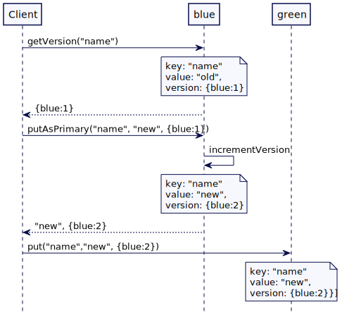

# 版本向量（Version Vector）

维护一个计数器集合，每集群节点一个，为了检测并发更新的。

## 问题

如果多服务器允许更新相同的 key，那么在跨多个副本之间的并发更新值的操作检测是非常重要的。

## 解决方案

每个键都是通过[版本向量](https://en.wikipedia.org/wiki/Version_vector)关联的，它负责维护每个集群节点一个数字。

本质上，版本向量是一组计数器，每个节点一个。三个节点（蓝、绿、黑）的版本向量看起来应该是 [blue: 43, green: 54, black: 12]。每当一个节点进行内部更新时，它就会更新自己的计数器，所以 green 节点中的更新会将向量更改为 [blue:43，green:55，black:12]。无论两个节点何时通信，它们都会同步它们的矢量戳(vector stamps)，从而让它们能检测同一个时刻的任何更新。

一个特定的版本向量实现如下所示：

```java
class VersionVector… 
  private final TreeMap<String, Long> versions;

  public VersionVector() {
      this(new TreeMap<>());
  }

  public VersionVector(TreeMap<String, Long> versions) {
      this.versions = versions;
  }

  public VersionVector increment(String nodeId) {
      TreeMap<String, Long> versions = new TreeMap<>();
      versions.putAll(this.versions);
      Long version = versions.get(nodeId);
      if(version == null) {
          version = 1L;
      } else {
          version = version + 1L;
      }
      versions.put(nodeId, version);
      return new VersionVector(versions);
  }
```

存储在服务器上的每个值都与一个版本向量相关联。

```java
class VersionedValue…
  public class VersionedValue {
      String value;
      VersionVector versionVector;
  
      public VersionedValue(String value, VersionVector versionVector) {
          this.value = value;
          this.versionVector = versionVector;
      }
  
      @Override
      public boolean equals(Object o) {
          if (this == o) return true;
          if (o == null || getClass() != o.getClass()) return false;
          VersionedValue that = (VersionedValue) o;
          return Objects.equal(value, that.value) && Objects.equal(versionVector, that.versionVector);
      }
  
      @Override
      public int hashCode() {
          return Objects.hashCode(value, versionVector);
      }
```

## 比较版本向量

通过比较每个节点的版本号来比较版本向量。如果两个版本向量都具有相同集群节点的版本号，并且每个版本号都高于另一个向量中的版本号，则认为这个版本向量高于另一个，反之亦然。如果两个向量的版本号都不高，或者它们的版本号适用于不同的集群节点，则认为它们是并发的。

下面是一个例子

|    {blue:2, green:1}     |  >   |     {blue:1, green:1}     |
| :----------------------: | :--: | :-----------------------: |
|    {blue:2, green:1}     | 并发 |     {blue1:, green:2}     |
| {blue:1, green:1, red:1} |  >   |     {blue:1, green:1}     |
| {blue1: green:1, red:1}  | 并发 | {blue:1, green:1, pink:1} |

实现比较的代码如下所示：

```java
public enum Ordering {
    Before,
    After,
    Concurrent
}

class VersionVector… 
  // 这段代码是 Voldermort 的 VectorClock 比较实现
  // https://github.com/voldemort/voldemort/blob/master/src/java/voldemort/versioning/VectorClockUtils.java
  public static Ordering compare(VersionVector v1, VersionVector v2) {
      if(v1 == null || v2 == null)
          throw new IllegalArgumentException("Can't compare null vector clocks!");
      // We do two checks: v1 <= v2 and v2 <= v1 if both are true then
      // 检查两项：v1 <= v2 和 v2 <= v1，两个都为真
      boolean v1Bigger = false;
      boolean v2Bigger = false;

      SortedSet<String> v1Nodes = v1.getVersions().navigableKeySet();
      SortedSet<String> v2Nodes = v2.getVersions().navigableKeySet();
      // 取 v1，v2 节点交集
      SortedSet<String> commonNodes = getCommonNodes(v1Nodes, v2Nodes);

      // 如果 v1 的节点要比共同的节点多
      // 即 v1 有 v2 没有的时钟
      if(v1Nodes.size() > commonNodes.size()) {
          v1Bigger = true;
      }
      // 如果 v2 的节点要比共同的节点多
      // 即 v2 有 v1 没有的时钟
      if(v2Nodes.size() > commonNodes.size()) {
          v2Bigger = true;
      }
      // 比较相同的部分
      for(String nodeId: commonNodes) {
          // no need to compare more
          if(v1Bigger && v2Bigger) {
              break;
          }
          long v1Version = v1.getVersions().get(nodeId);
          long v2Version = v2.getVersions().get(nodeId);
          if(v1Version > v2Version) {
              v1Bigger = true;
          } else if(v1Version < v2Version) {
              v2Bigger = true;
          }
      }

      /*
       * 这是它们相等的情况. 有意识的返回 BEFORE, 
       * 这样我们将返回一个 ObsoleteVersionException，用于使用相同的时钟进行在线写操作。
       */
      if(!v1Bigger && !v2Bigger)
          return Ordering.Before;
          /* 这种情况下，v1 是 v2 的后继时钟（successor clock） */
      else if(v1Bigger && !v2Bigger)
          return Ordering.After;
          /* 这种情况下，v2 是 v1 的后继时钟（successor clock） */
      else if(!v1Bigger && v2Bigger)
          return Ordering.Before;
          /* 这是两个时钟并行的情况 */
      else
          return Ordering.Concurrent;
  }

  private static SortedSet<String> getCommonNodes(SortedSet<String> v1Nodes, SortedSet<String> v2Nodes) {
      // 获取 v1 v2 都有的时钟 clocks(nodesIds) 集合
      SortedSet<String> commonNodes = Sets.newTreeSet(v1Nodes);
      commonNodes.retainAll(v2Nodes);
      return commonNodes;
  }


  public boolean descents(VersionVector other) {
      return other.compareTo(this) == Ordering.Before;
  }
```

## 在键值存储中使用版本向量

版本向量可以在键值存储中使用，如下所示。需要一个版本控制值（versioned value）列表，因为可以有多个并发值。

```java
class VersionVectorKVStore… 
  public class VersionVectorKVStore {
      Map<String, List<VersionedValue>> kv = new HashMap<>();
```

当客户端希望存储一个值时，它首先读取给定键的最新已知版本。然后，它根据键选择的集群节点来存储值。在存储该值时，客户端将返回已知的版本。请求流如下图所示。有两个服务器分别命名为 blue 和 green。key 为 “name”，blue 是主服务器。



在无 leader 复制方案中，客户端或协调器节点选择该节点并基于该键写入数据。版本向量基于 key 映射到的主集群节点进行更新。将具有相同版本向量的值复制到其他集群节点上进行复制。如果映射到 key 的群集节点不可用，则选择下一个节点。版本向量只对保存该值的第一个集群节点递增。所有其他节点保存数据副本。在数据库中自增版本向量的实现代码就像 [voldemor](https://www.project-voldemort.com/voldemort/) 那样：

```java
class ClusterClient… 
  public void put(String key, String value, VersionVector existingVersion) {
      List<Integer> allReplicas = findReplicas(key);
      int nodeIndex = 0;
      List<Exception> failures = new ArrayList<>();
      VersionedValue valueWrittenToPrimary = null;
      for (; nodeIndex < allReplicas.size(); nodeIndex++) {
          try {
              ClusterNode node = clusterNodes.get(nodeIndex);
              //这个节点是键值的主要持有者，它负责自增版本号。
              valueWrittenToPrimary = node.putAsPrimary(key, value, existingVersion);
              break;
          } catch (Exception e) {
              //如果在向该节点写入值时出现异常，请尝试其他副本。
              failures.add(e);
          }
      }

      if (valueWrittenToPrimary == null) {
          throw new NotEnoughNodesAvailable("No node succeeded in writing the value.", failures);
      }

      //成功写入第一个节点，复制到其他节点。
      nodeIndex++;
      for (; nodeIndex < allReplicas.size(); nodeIndex++) {
          ClusterNode node = clusterNodes.get(nodeIndex);
          node.put(key, valueWrittenToPrimary);
      }
  }
```

主节点的主要行为之一就是自增版本号。

```java
public VersionedValue putAsPrimary(String key, String value, VersionVector existingVersion) {
    VersionVector newVersion = existingVersion.increment(nodeId);
    VersionedValue versionedValue = new VersionedValue(value, newVersion);
    put(key, versionedValue);
    return versionedValue;
}

public void put(String key, VersionedValue value) {
    versionVectorKvStore.put(key, value);
}
```

从上面的代码中可以看出，不同的客户端可以在不同的节点上更新相同的 key，例如当客户端无法到达特定的节点时。这就产生了一种情况，不同的节点有不同的值，这些值根据它们的版本向量被认为是“并发的”。

如下图所示，client1 和 client2 都试图写入名为 “name” 的 key。如果 client1 不能写入 green 服务器，green 服务器将丢失 client1 写入的值。当 client2 尝试写，但无法连接到 blue 的服务器，它将写在 green 的服务器上。key=“name” 的版本向量将反映服务器(blue 和 green)具有并发写功能。


​																								不同副本之间并发更新

因此，当版本被认为是并发的时候，基于版本向量的存储为任何 key 保留多个版本。

```java
class VersionVectorKVStore… 
  public void put(String key, VersionedValue newValue) {
      List<VersionedValue> existingValues = kv.get(key);
      if (existingValues == null) {
          existingValues = new ArrayList<>();
      }

      rejectIfOldWrite(key, newValue, existingValues);
      List<VersionedValue> newValues = merge(newValue, existingValues);
      kv.put(key, newValues);
  }

  //如果 newValue 要比已存在的版本值旧则拒绝
  private void rejectIfOldWrite(String key, VersionedValue newValue, List<VersionedValue> existingValues) {
      for (VersionedValue existingValue : existingValues) {
          if (existingValue.descendsVersion(newValue)) {
              throw new ObsoleteVersionException("Obsolete version for key '" + key
                      + "': " + newValue.versionVector);
          }
      }
  }
  
  //将 newValue 与现有值合并。删除版本低于 newValue 的值。
  //如果已存在的值既不在 newValue 之前也不在 newValue 之后(并发)。它会被保留下来
  private List<VersionedValue> merge(VersionedValue newValue, List<VersionedValue> existingValues) {
      List<VersionedValue> retainedValues = removeOlderVersions(newValue, existingValues);
      retainedValues.add(newValue);
      return retainedValues;
  }

  private List<VersionedValue> removeOlderVersions(VersionedValue newValue, List<VersionedValue> existingValues) {
      List<VersionedValue> retainedValues = existingValues
              .stream()
              .filter(v -> !newValue.descendsVersion(v)) //保留不直接由newValue控制(dominated)的版本
              .collect(Collectors.toList());
      return retainedValues;
  }	
```

如果在从多个节点读取数据时检测到并发值，则抛出一个错误，允许客户端执行可能的冲突解决。

### 解决冲突

如果从不同的副本返回多个版本，则能通过**向量时钟比较**可以检测到最新的值。

```java
class ClusterClient… 
  public List<VersionedValue> get(String key) {
      List<Integer> allReplicas = findReplicas(key);

      List<VersionedValue> allValues = new ArrayList<>();
      for (Integer index : allReplicas) {
          ClusterNode clusterNode = clusterNodes.get(index);
          List<VersionedValue> nodeVersions = clusterNode.get(key);

          allValues.addAll(nodeVersions);
      }

      return latestValuesAcrossReplicas(allValues);
  }

  private List<VersionedValue> latestValuesAcrossReplicas(List<VersionedValue> allValues) {
      List<VersionedValue> uniqueValues = removeDuplicates(allValues);
      return retainOnlyLatestValues(uniqueValues);
  }

  private List<VersionedValue> retainOnlyLatestValues(List<VersionedValue> versionedValues) {
      for (int i = 0; i < versionedValues.size(); i++) {
          VersionedValue v1 = versionedValues.get(i);
          versionedValues.removeAll(getPredecessors(v1, versionedValues));
      }
      return versionedValues;
  }

  private List<VersionedValue> getPredecessors(VersionedValue v1, List<VersionedValue> versionedValues) {
      List<VersionedValue> predecessors = new ArrayList<>();
      for (VersionedValue v2 : versionedValues) {
          if (!v1.sameVersion(v2) && v1.descendsVersion(v2)) {
              predecessors.add(v2);
          }
      }
      return predecessors;
  }

  private List<VersionedValue> removeDuplicates(List<VersionedValue> allValues) {
      return allValues.stream().distinct().collect(Collectors.toList());
  }
```

当有并发更新时，仅仅基于版本向量进行冲突解决是不够的。因此，**允许客户端提供特定于应用程序的冲突解决程序**是很重要的。客户端可以在读取值时提供冲突解决程序。

```java
public interface ConflictResolver {
    VersionedValue resolve(List<VersionedValue> values);
}

class ClusterClient…
  public VersionedValue getResolvedValue(String key, ConflictResolver resolver) {
      List<VersionedValue> versionedValues = get(key);
      return resolver.resolve(versionedValues);
  }
```

例如，[riak](https://riak.com/posts/technical/vector-clocks-revisited/index.html?p=9545.html) 允许应用程序提供这里解释的[冲突解决程序](https://docs.riak.com/riak/kv/latest/developing/usage/conflict-resolution/java/index.html)。

### 最新写入获胜（Last Write Wins；LWW）解决冲突

虽然版本向量能检测出跨不同服务器组的并发写操作，但它们本身并不为客户端提供任何帮助，来确定在发生冲突时应该选择哪个值。解决问题的责任在客户身上。对于键值存储有时客户端更喜欢根据时间戳解决冲突。尽管存在跨服务器时间戳的已知问题，但这种方法的简便性使其成为客户机的首选，即使存在由于跨服务器时间戳问题而丢失某些更新的风险（关于时间戳解决冲突的问题详见[兰伯特时钟(Lamport Clock)](Lamport-Clock.md)）。它们完全依赖于 NTP 等服务的良好配置和跨集群工作。像 [riak](https://riak.com/posts/technical/vector-clocks-revisited/index.html?p=9545.html) 和 [voldemort](https://www.project-voldemort.com/voldemort/) 这样的数据库允许用户选择“最后写入获胜”的冲突解决策略。

为了支持 LWW 冲突解决，在写入每个值时存储一个时间戳。

```java
class TimestampedVersionedValue…
  class TimestampedVersionedValue {
      String value;
      VersionVector versionVector;
      long timestamp;
  
      public TimestampedVersionedValue(String value, VersionVector versionVector, long timestamp) {
          this.value = value;
          this.versionVector = versionVector;
          this.timestamp = timestamp;
      }
```

在读取值时，客户端可以使用时间戳来获取最新的值。在这种情况下，版本向量完全被忽略。

```java
class ClusterClient…
  public Optional<TimestampedVersionedValue> getWithLWW(List<TimestampedVersionedValue> values) {
      return values.stream().max(Comparator.comparingLong(v -> v.timestamp));
  }
```

### 读修复

虽然允许任何集群节点接受写请求可以提高可用性，但重要的是最终所有副本都具有相同的数据。常见的修复副本的方法是在客户端读取数据时发生。

当冲突解决后，还可以检测哪些节点有较早的版本。具有较旧版本的节点可以作为从客户端读取请求处理的一部分发送最新版本。这叫做读修复。

考虑下图所示的场景。两个节点，blue 和 green，有 key=“name” 的值。green 节点具有最新版本的版本向量 [blue:1，green:1]。当从两个副本(blue 和 green) 中读取值时，将比较哪个节点缺少最新版本，并向集群节点发送带有最新版本的请求。


​																											读修复

### 允许在相同集群节点并发更新

可能有两个客户端并发地写入同一个节点。在上面显示的默认实现中，第二次写入将被拒绝。在这种情况下，每个集群节点使用一个版本号的基本实现是不够的。

考虑下面的场景。当两个客户端试图更新同一个 key 时，第二个客户端将会得到一个异常，因为它在其发送请求中传递的版本已经过时了。


像 [riak](https://riak.com/posts/technical/vector-clocks-revisited/index.html?p=9545.html) 这样的数据库为客户端提供了灵活性，允许这些类型的并发写操作，并且不希望得到错误响应。

#### 使用客户端 IDs 代替服务端 IDs

如果每个集群客户端都有唯一的 ID，那么可以使用客户端 ID。版本号存储在每个客户端 ID 上。每当客户端写入一个值时，它首先读取现有版本，增加与客户端 ID 相关联的版本号数字，然后将其写入服务器。

```java
class ClusterClient…
  private VersionedValue putWithClientId(String clientId, int nodeIndex, String key, String value, VersionVector version) {
      ClusterNode node = clusterNodes.get(nodeIndex);
      VersionVector newVersion = version.increment(clientId);
      VersionedValue versionedValue = new VersionedValue(value, newVersion);
      node.put(key, versionedValue);
      return versionedValue;
  }
```

因为每个客户端增加自己的计数器，并发写操作在服务器上创建同级别（sibling）值，但是并发写永远不会失败。

上图提到的场景给了第二个客户端错误，工作原理如下：


​																	两个客户端并发更新相同的 key

#### 点分版本向量（Dotted version vector）

基于客户端 ID 的版本向量的一个主要问题是，版本向量的大小直接依赖于客户端的数量。这将导致集群节点在一段时间内为一个给定的 key 积累过多的并发值。这个问题被称为[同级爆炸(sibling explosion)](https://docs.riak.com/riak/kv/2.2.3/learn/concepts/causal-context/index.html#sibling-explosion)。为了解决这个问题，并且仍然允许基于集群节点的版本向量，[riak](https://riak.com/posts/technical/vector-clocks-revisited/index.html?p=9545.html) 使用了一个版本向量的变体，称为[点分版本向量](https://riak.com/posts/technical/vector-clocks-revisited-part-2-dotted-version-vectors/index.html)。

## 例子

- [voldemort](https://www.project-voldemort.com/voldemort/) 使用在这里描述的版本向量的方式。它允许基于时间戳的 LWW 解决冲突。
- [riak](https://riak.com/posts/technical/vector-clocks-revisited/index.html?p=9545.html) 开始使用基于客户端 ID 的版本向量，但后来转移到基于集群节点的版本向量，最终转向点分版本向量。Riak 还支持基于系统时间戳的 LWW 冲突解决。
- [cassandra](http://cassandra.apache.org/) 不使用版本向量，它只支持基于系统时间戳 LWW 冲突解决。

> **Cassandra 和 lww**
>
> [cassandra](http://cassandra.apache.org/)，虽然在架构上与 [riak](https://riak.com/posts/technical/vector-clocks-revisited/index.html?p=9545.html) 或 [voldemort](https://www.project-voldemort.com/voldemort/) 相同，但没有使用版本向量，并且只支持最后写赢冲突解决策略。Casasndra 是一个列族数据库，而不是一个简单的键值存储，它存储每个列的时间戳，而不是作为一个整体的值。虽然这为用户减轻了解决冲突的负担，但用户需要确保 [ntp](https://en.wikipedia.org/wiki/Network_Time_Protocol) 服务在 cassandra 节点上正确配置和工作。在最坏的情况下，由于时钟漂移，一些最新的值可能会被旧的值覆盖。

## 原文

https://martinfowler.com/articles/patterns-of-distributed-systems/version-vector.html

