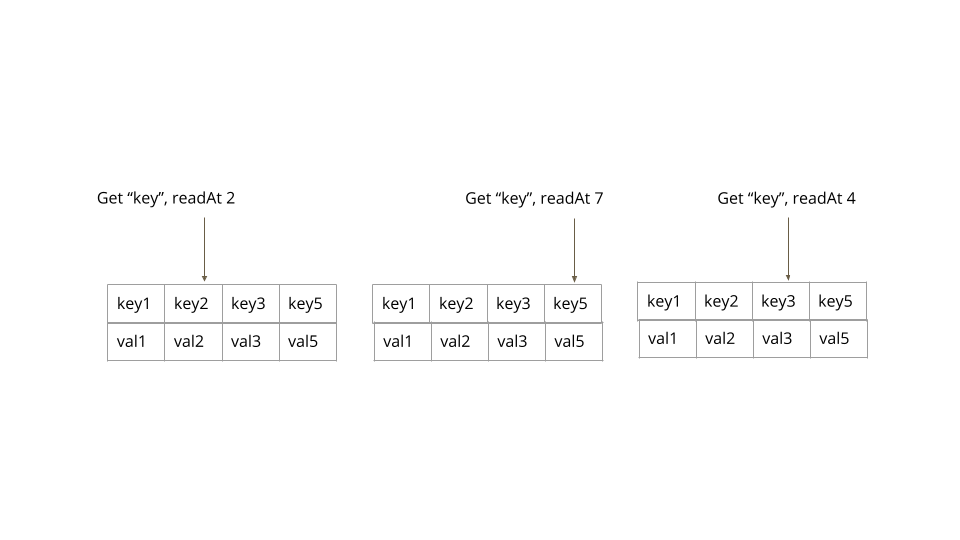
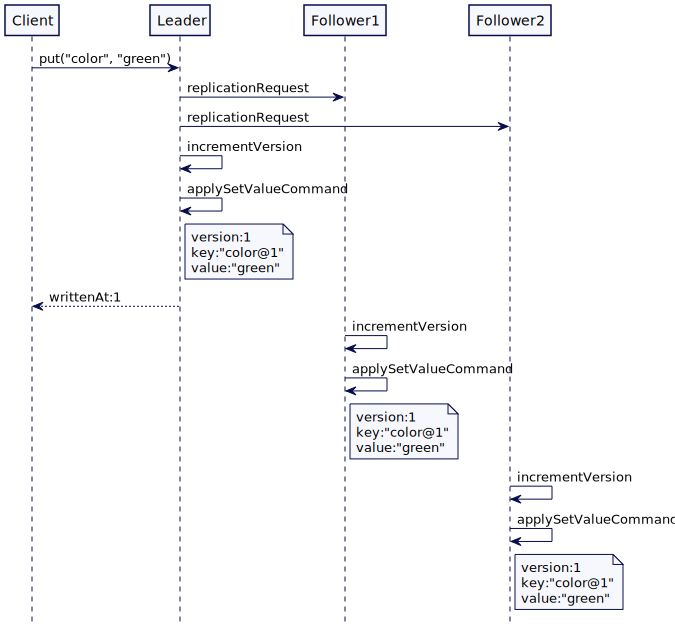
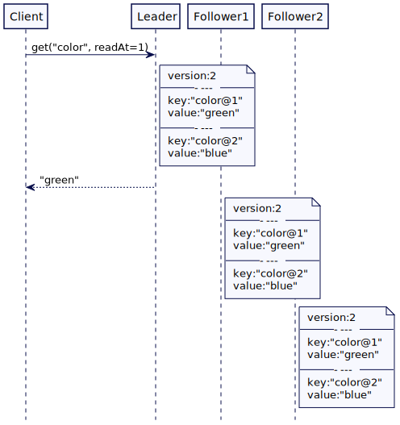
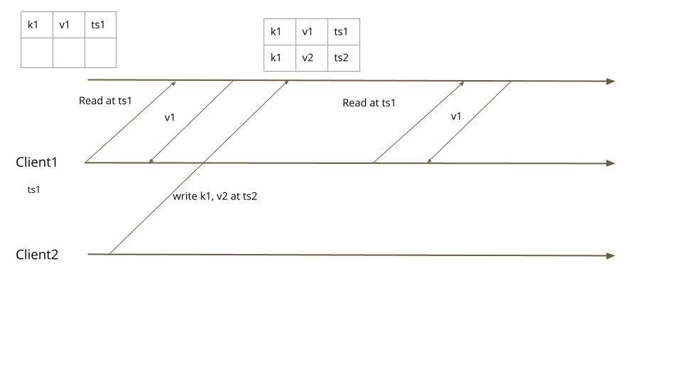

# 版本值(Versioned Value)

用一个新的版本号来记录每次值的更新，允许读取历史值。

## 问题

在分布式系统中，节点需要能够知道键的哪个值是最新的。有时他们需要知道过去的值，以便能够正确地对值的变化作出反应。

## 解决方案

为每个值都存储一个版本值。这个版本编号在每次更新的时候自增。**它允许每次更新都转换为新的写操作，而不会阻塞读操作**。客户端能通过指定的版本号读取历史值。

思考一个复制键值存储的简单示例。集群 leader 处理对键值存储的所有写操作。它把所有写操作都存进 [WAL](Write-Ahead-Log.md) 中。在[主从](Leader-And-Followers.md)下 WAL 是有多个的。Leader 将来自[高水位标记](High-Water-Mark.md)的 WAL 日志的条目应用到键值存储中。这种标准复制方法被称为[状态机复制(state-machine-replication)](https://en.wikipedia.org/wiki/State_machine_replication)。大多数由共识算法(如 Raft )支持的数据系统都是这样实现的。在这种情况下，键值存储保持一个整数版本计数器。每次从预写日志应用键值写命令时，它都会增加版本计数器。然后用自增后的版本计数器构造新键。这样就不会更新现有的值，但是每个写请求都会将新值添加到后备存储（backing store）中。

```java
class ReplicatedKVStore...
  int version = 0;
  MVCCStore mvccStore = new MVCCStore();
  
  @ovveride
  public CompletableFuture<Response> put(String key, String value) {
      return server.propose(new SetValueCommand(key, value));
  }
  
  private Response applySetValueCommand(SetValueCommand setValueCommand) {
  	  getLogger().info("Setting key value " + setValueCommand);
  	  version = version + 1;
      mvccStore.put(new VersionedKey(setValueCommand.getKey(), version), setValueCommand.getValue());
      Response response = Response.success(version);
      return response;
  }
```

## 版本键的排序

因为快速导航到最佳匹配版本是一个重要的实现关注事项，所以版本控制的键的排列方式是，通过使用版本号作为键的后缀，形成自然的顺序。这维护的顺序能很好的与底层数据结构匹配。例如，如果一个键有两个版本，key1 和 key2，那么 key1 将被排序在 key2 之前。

为了存储版本化的键值，需要使用一个数据结构，例如调表，它允许快速导航到最近的匹配版本。在 Java 中，mvcc 存储可以构建如下：

```java
class MVVCStore...
  public class MVCCStore {
      NavigableMap<VersionedKey, String> kv = new ConcurrentSkipListMap<>();
      
      public void put(VersionedKey key, String value) {
          kv.put(key, value);
      }
  }
```

通过导航哈希表来执行，VersionedKey 是通过下面这样实现的。它实现了一个比较器来让 keys 排序

```java
class VersionedKey...
  public class VersionedKey implements Comparable<VersionedKey> {
  	  private String key;
      private int version;
      
      public VersionedKey(String key, int version) {
          this.key = key;
          this.version = version;
      }
      
      public String getKey() {
          return key;
      }
  
      public int getVersion() {
          return version;
      }
  
      @Override
      public int compareTo(VersionedKey other) {
          int keyCompare = this.key.compareTo(other.key);
          if (keyCompare != 0) {
              return keyCompare;
          }
          return Integer.compare(this.version, other.version);
      }
  }
```

这个实现允许使用可导航的 map API 获取特定版本的值。

```java
class MVCCStore… 
  public Optional<String> get(final String key, final int readAt) {
      Map.Entry<VersionedKey, String> entry = kv.floorEntry(new VersionedKey(key, readAt));
      return (entry == null)? Optional.empty(): Optional.of(entry.getValue());
  }
```

思考一个示例，其中一个键有四个版本，分别存储在版本号1、2、3 和 5 中。根据客户端读取值时使用的版本，返回最匹配的键版本。



将存储特定键值的版本返回给客户端。然后客户端拿这个版本来读取值。总体工作如下。



​																				put 请求处理



​																								读取特定版本对应的值

## 多个版本读

有时客户端需要从给定的版本号获取所有版本。例如，在[状态监控](State-Watch.md)中，客户端需要从特定版本获取所有事件。

集群节点可以存储额外的索引结构来存储键的所有版本。

```java
class IndexedMVCCStore… 
  public class IndexedMVCCStore {
      NavigableMap<String, List<Integer>> keyVersionIndex = new TreeMap<>();
      NavigableMap<VersionedKey, String> kv = new TreeMap<>();
  
      ReadWriteLock rwLock = new ReentrantReadWriteLock();
      int version = 0;
      
      public int put(String key, String value) {
          rwLock.writeLock().lock();
          try {
              version = version + 1;
              kv.put(new VersionedKey(key, version), value);
  
              updateVersionIndex(key, version);
  
              return version;
          } finally {
              rwLock.writeLock().unlock();
          }
      }
      
      private void updateVersionIndex(String key, int newVersion) {
          List<Integer> versions = getVersions(key);
          versions.add(newVersion);
          keyVersionIndex.put(key, versions);
      }
      
      private List<Integer> getVersions(String key) {
          List<Integer> versions = keyVersionIndex.get(key);
          if (versions == null) {
              versions = new ArrayList<>();
              keyVersionIndex.put(key, versions);
          }
          return versions;
      }
  }
```

然后，可以提供一个客户端 API 来读取特定版本或版本范围的值。

```java
class IndexedMVCCStore… 
  public List<String> getRange(String key, final int fromRevision, int toRevision) {
  	  rwLock.readLock().lock();
      try {
          List<Integer> versions = keyVersionIndex.get(key);
          Integer maxRevisionForKey = versions.stream().max(Integer::compareTo).get();
          Integer revisionToRead = maxRevisionForKey > toRevision ? toRevision : maxRevisionForKey;
          SortedMap<VersionedKey, String> versionMap = kv.subMap(new VersionedKey(key, revisionToRead), new VersionedKey(key, toRevision));
          getLogger().info("Available version keys " + versionMap + ". Reading@" + fromRevision + ":" + toRevision);
          return new ArrayList<>(versionMap.values());
          
      } finally {
          rwLock.readLock().unlock();
      }
  }
```

从索引更新和读取数据时，必须注意使用适当的锁定。

还有令一种替代的实现，可以用键保存所有版本化值的列表，就像在 [Gossip distribution](Gossip-Dissemination.md) 中使用的那样，以避免不必要的状态交换。

## MVCC 和事务隔离

数据库使用 Versioned Value 实现 [MVCC](https://github.com/MarsonShine/Books/blob/master/DDIA/transaction.md#%E5%A4%9A%E7%89%88%E6%9C%AC%E5%B9%B6%E5%8F%91%E6%8E%A7%E5%88%B6mvcc) 和[事务隔离](https://en.wikipedia.org/wiki/Isolation_(database_systems))。

并发控制是关于当有多个并发请求访问相同数据时如何使用锁定。当锁用于同步访问时，所有其他请求都会被阻塞，直到持有锁的请求完成并释放锁为止。使用Versioned Value，每个写请求都会添加一条新记录（都有自己在那个时刻的数据版本）。这允许使用非阻塞数据结构来存储值。

事务隔离级别(如[快照隔离](https://github.com/MarsonShine/Books/blob/master/DDIA/transaction.md#%E5%BF%AB%E7%85%A7%E7%BA%A7%E5%88%AB%E9%9A%94%E7%A6%BB))也可以自然实现。当客户端以特定版本开始读取时，即使存在多个读请求之间提交不同值的并发写事务，它保证每次从数据库读取时都获得相同的值。



​																											快照读

## 使用像 RocksDb 存储引擎

使用 [rocksdb](https://rocksdb.org/docs/getting-started.html) 或类似的嵌入式存储引擎作为数据存储的存储后端是非常常见的。例如，[etcd](https://etcd.io/) 使用 [boltdb](https://github.com/etcd-io/bbolt#using-keyvalue-pairs)， [cockroachdb](https://www.cockroachlabs.com/docs/stable/) 更早使用 [rocksdb](https://rocksdb.org/docs/getting-started.html)，现在使用的是 [rocksdb](https://rocksdb.org/docs/getting-started.html)的 go-lang 版本的克隆产品 [pebble](https://github.com/cockroachdb/pebble)。

这些存储引擎提供了适合存储 versioned 值的实现。与上一节描述的相同它们内部使用跳表的方式，并依赖于键的顺序。也可以提供自定义比较器为键排序。

```java
class VersionedKeyComparator… 
  public class VersionedKeyComparator extends Comparator {
  	  public VersionedKeyComparator() {
          super(new ComparatorOptions());
      }
  
      @Override
      public String name() {
          return "VersionedKeyComparator";
      }
  
      @Override
      public int compare(Slice s1, Slice s2) {
          VersionedKey key1 = VersionedKey.deserialize(ByteBuffer.wrap(s1.data()));
          VersionedKey key2 = VersionedKey.deserialize(ByteBuffer.wrap(s2.data()));
          return key1.compareTo(key2);
      }
  }
```

使用 [rocksdb](https://rocksdb.org/docs/getting-started.html) 可以实现如下操作：

```java
class RocksDBMvccStore… 
  private final RocksDB db;
  
  public RocksDBMvccStore(File cacheDir) throws RocksDBException {
      Options options = new Options();
      options.setKeepLogFileNum(30);
      options.setCreateIfMissing(true);
      options.setLogFileTimeToRoll(TimeUnit.DAYS.toSeconds(1));
      options.setComparator(new VersionedKeyComparator());
      db = RocksDB.open(options, cacheDir.getPath());
  }

  public void put(String key, int version, String value) throws RocksDBException {
      VersionedKey versionKey = new VersionedKey(key, version);
      db.put(versionKey.serialize(), value.getBytes());
  }

  public String get(String key, int readAtVersion) {
      RocksIterator rocksIterator = db.newIterator();
      rocksIterator.seekForPrev(new VersionedKey(key, readAtVersion).serialize());
      byte[] valueBytes = rocksIterator.value();
      return new String(valueBytes);
  }
```

## 例子

[etcd3](https://coreos.com/blog/etcd3-a-new-etcd.html) 背后使用 MVCC 与一个单一的整数表示一个版本。

[mongodb](https://www.mongodb.com/)和 [cockroachdb](https://www.cockroachlabs.com/docs/stable/) 背后使用 MVCC 混合逻辑时钟。