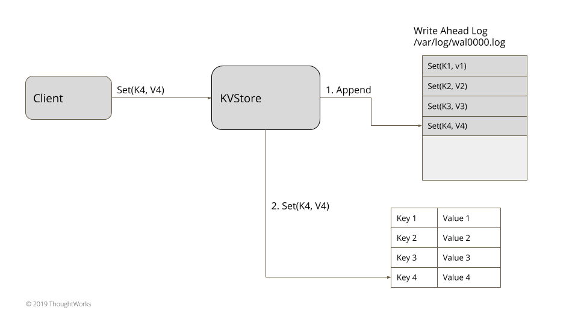

# Write-Ahead Log（提前写入日志）

描述：提供持久化的保证，通过将每个状态更改作为命令追加式持久化到日志中，而不需要将存储数据结构刷新到磁盘。

## 问题

即使是服务器机器存储数据失败的情况下也需要持久化的强力保证。一旦服务器同意执行一个操作，那它就应该这么做，甚至是在它失败以及重启丢失了所有内存状态。

## 解决方案



​																	图1：Write-Ahead Log

存储每个状态作为命令以文件的形式存储在硬盘中。为按顺序追加的每个服务器进程维护一个日志。单个日志它是有序追加的，它简化了在重启和随后的在线操作的日志处理（当日志以新命令追加时）。每个日志条目都给定一个唯一标识符。这个唯一的日志标识有助于在一些其它日志像[分段日志](https://martinfowler.com/articles/patterns-of-distributed-systems/log-segmentation.html)操作或使用[低水位线标记](https://martinfowler.com/articles/patterns-of-distributed-systems/low-watermark.html)的日志清除。日志更新能通过使用[单更新队列](https://martinfowler.com/articles/patterns-of-distributed-systems/singular-update-queue.html)实现。

指定的日志条目数据结构如下面代码

```java
public WALEntry...
  private final Long entryId;
  private final byte[] data;
  private final EntryType entryType;
  private long timeStamp;
```

这个文件能在每次重启时读取以及通过重播所有的日志条目来状态恢复。

思考下面一个简单的内存式 K/V 存储例子：

```java
class KVStore… 
  private Map<String, String> kv = new HashMap<>();

  public String get(String key) {
      return kv.get(key);
  }

  public void put(String key, String value) {
      appendLog(key, value);
      kv.put(key, value);
  }

  private Long appendLog(String key, String value) {
      return wal.writeEntry(new SetValueCommand(key, value).serialize());
  }
```

put 操作是以[命令](http://www.amazon.com/exec/obidos/tg/detail/-/0201633612)的形式体现的，在更新内存中的 hashmap 之前，它被序列化以及存储到日志。

```java
class SetValueCommand… 
  final String key;
  final String value;

  public SetValueCommand(String key, String value) {
      this.key = key;
      this.value = value;
  }

  @Override
  public byte[] serialize() {
      try {
          var baos = new ByteArrayOutputStream();
          var dataInputStream = new DataOutputStream(baos);
          dataInputStream.writeInt(Command.SetValueType);
          dataInputStream.writeUTF(key);
          dataInputStream.writeUTF(value);
          return baos.toByteArray();

      } catch (IOException e) {
          throw new RuntimeException(e);
      }
  }

  public static SetValueCommand deserialize(InputStream is) {
      try {
          DataInputStream dataInputStream = new DataInputStream(is);
          return new SetValueCommand(dataInputStream.readUTF(), dataInputStream.readUTF());
      } catch (IOException e) {
          throw new RuntimeException(e);
      }
  }
```

这确保了一旦 put 方法成功返回，甚至是进程占有的 KVStore 崩溃了，它的状态也能通过在启动时读取日志文件恢复。

```java
class KVStore… 
  public KVStore(Config config) {
      this.config = config;
      this.wal = WriteAheadLog.openWAL(config);
      this.applyLog();
  }

  public void applyLog() {
      List<WALEntry> walEntries = wal.readAll();
      applyEntries(walEntries);
  }

  private void applyEntries(List<WALEntry> walEntries) {
      for (WALEntry walEntry : walEntries) {
          Command command = deserialize(walEntry);
          if (command instanceof SetValueCommand) {
              SetValueCommand setValueCommand = (SetValueCommand)command;
              kv.put(setValueCommand.key, setValueCommand.value);
          }
      }
  }

  public void initialiseFromSnapshot(SnapShot snapShot) {
      kv.putAll(snapShot.deserializeState());
  }
```

## 一致性实现

在实现日志时，有一些重要的考虑事项。确保日志条目写道日志文件，最终是持久化到物理媒介（磁盘）上。在所有编程语言里提供的文件处理库都提供了一个机制，来强制操作系统将文件更改 'flush' 到物理媒介。当使用 flush 机制时，这里有一些因素要注意。

刷新每个日志写入到磁盘给了一个强有力的持久化保证（这是将日志放置首位的主要目的），但是这个服务限制了性能，并且会很快成为性能瓶颈点。如果刷新过程时缓慢的或者是异步完成的，它能提高性能但是这里就会存在丢失日志条目的风险，如果条目被刷新之前服务器崩溃的话。大多数实现技术方式是像批量（Batching）的操作来限制刷新操作的影响。

其它的要考虑的地方就是确保在读取日志时，能检测到损坏的日志。为了处理这种，日志条目通常会与 CRC 记录一起写入，然后它能在读取文件时验证。

单个日志文件会成为很难管理以及很快会消耗掉所有内存。为此，像[分段日志](https://martinfowler.com/articles/patterns-of-distributed-systems/log-segmentation.html)和[低水位线标记](https://martinfowler.com/articles/patterns-of-distributed-systems/low-watermark.html)技术就由此运用。

write ahead log 是只追加（append）日志。正因为这种行为，在客户端通信失败和重试情况下，日志可以包含重复条目。当应用日志条目时，它需要确保要忽略重复。如果最终的状态类似 HashMap，它更新了相同的 key 的行为是幂等的，则不需要特别的机制。如果不是幂等的，那么这里就还需要一些机制来实现标记每个请求是否是重复的（如唯一请求标识符）。

## 例子

- 所有一致性算法的日志实现如 [Zookeeper](https://github.com/apache/zookeeper/blob/master/zookeeper-server/src/main/java/org/apache/zookeeper/server/persistence/FileTxnLog.java) 和 [RAFT](https://github.com/etcd-io/etcd/blob/master/wal/wal.go) 写日志都是类似的。
- 在 Kafka 中的存储实现就是遵循类似于数据库中的日志提交。
- 所有的数据库，包括 nosql 数据如 Cassandra 使用的 [write ahead log 技术](https://github.com/facebookarchive/cassandra/blob/master/src/org/apache/cassandra/db/CommitLog.java)保证了持久化

## 拓展

WAL 是由 Commit Logging 演变而来，Commit Logging 有一个巨大的缺陷：所有对数据的真是修改都必须发生在事务提交、日志写入了 Commit Record 之后，即使事务提交之前磁盘 I/O 足够空闲、即使某个事务修改的数据量非常庞大，占用大量的内存缓冲。无论怎样，都不能允许在事务提交之前就开始修改磁盘上的数据，所以这一点对数据库性能的提升非常不利，所以才有了 WAL，**它允许在事务提交之前，提前写入变动数据**。

WAL 何时写入变动数据？

按照事务提交时点为界，分为了 FORCE 和 STEAL 两类：

- FORCE：当事务提交后，**要求变动数据必须同时完成写入则称为 FORCE，如果不强制变动数据必须同时完成写入则称为 NO-FORCE**。现实中绝大多数数据库采用的都是 NO-FORCE 策略，只要有了日志，变动数据随时可以持久化，从优化磁盘 I/O 性能考虑，没有必要强制数据写入立即进行。
- STEAL：在事务提交前，允许变动数据提前写入则称为 STEAL，不允许则称为 NO-STEAL。从优化磁盘 I/O 性能考虑，允许数据提前写入，有利于利用空闲 I/O 资源，也有利于节省数据库缓存区的内存。

Commit Logging 允许 NO-FORCE，但不允许 STEAL。因为如果事务提交前就有部分变动数据已经写入磁盘，那么当这个事务发生失败要回滚，这些已经提前写入的变动数据就都成了错误。

WAL 允许 STEAL 是采用了另一种方式，**它新增了一种称为 “Undo Log” 状态的日志。当变动写入磁盘时，必须先记录 Undo Log，写明修改哪个位置的数据，从什么值更改为什么值，以便在事务回滚或者崩溃恢复时，根据 Undo Log 对提前写入的数据变动进行擦除。**

WAL 在加入 Undo Log 再崩溃恢复时，会有三个阶段：

- 分析阶段：该阶段从最后一次检查点（Checkpoint，**可理解为在这个点之前所有应该持久化的变动都已安全落盘**）开始扫描日志，找出所有没有 End Record 的事务，**组成待恢复的事务集合**（一般包括 Transaction Table 和 Dirty Page Table）。
- 重做阶段：该阶段依据分析阶段中，产生的待恢复的事务集合来重演历史（Repeat History），找出所有包含 Commit Record 的日志，将它们写入磁盘，写入完成后增加一条 End Record，然后移除出**待恢复事务集合**。
- 回滚阶段：该阶段处理经过分析、重做阶段后剩余的恢复事务集合，此时剩下的都是需要回滚的事务（被称为 Loser），根据 Undo  Log 中的信息回滚这些事务。


原文：https://martinfowler.com/articles/patterns-of-distributed-systems/wal.html

参考资料：《极客时间公开课：周志明的软件架构可》，https://time.geekbang.org/column/article/319481