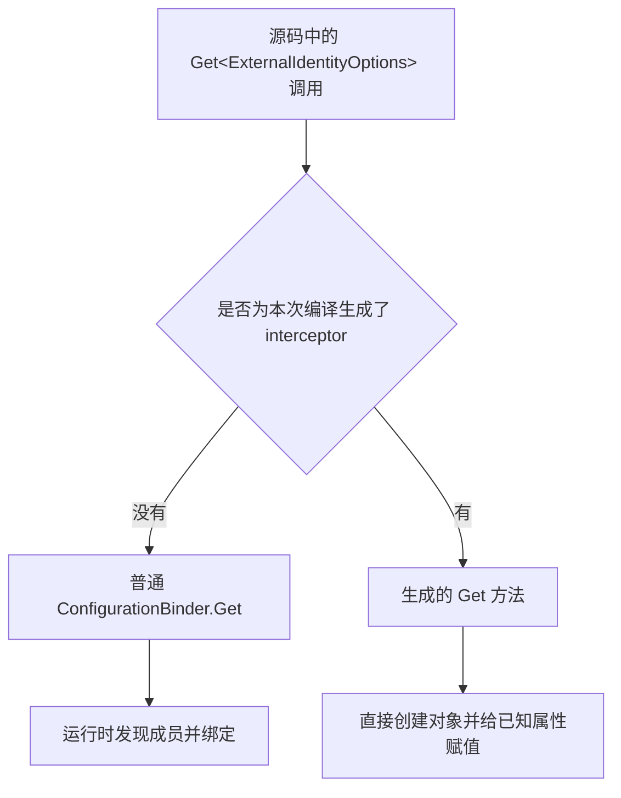

# 只加一个编译开关，为什么 Get 和 Bind 就能不用反射？

这个提交只在两个项目中加了下面的设置，原来的 `Get<T>()` 和 `Bind()` 调用没有改：

```xml
<EnableConfigurationBindingGenerator>true</EnableConfigurationBindingGenerator>
```

容易困惑的地方是：调用明明没变，怎么会执行另一套代码？这里需要补上两件事：**Source Generator 可以在编译时加入新的 C# 代码；C# interceptor 可以让某个调用位置改为调用生成的方法。** 配置绑定生成器同时用到了它们。

## Get<T> 写了具体类型，也不等于它内部没有反射

先看本仓库 [ExternalIdentity.cs](../../../src/MS.Microservice.AspNetCore/ExternalIdentity.cs) 中的调用：

```csharp
var identity = configuration.GetSection("Authentication")
    .Get<ExternalIdentityOptions>() ?? new();
```

它要把 `Authentication:Authority`、`Authentication:Audience` 等配置值填进 `ExternalIdentityOptions` 对象。

`Get<ExternalIdentityOptions>()` 告诉方法“这次要返回什么类型”，但并没有规定方法内部如何找到这个类型的属性。普通配置绑定器需要处理调用方传来的各种类型，因此会在运行时查看类型信息，寻找可以绑定的成员，再创建对象、转换配置值、给属性赋值。

下面只演示反射赋值的原理，并非框架源码；为方便阅读，假设属性都是字符串：

```csharp
foreach (var property in typeof(T).GetProperties())
{
    var value = section[property.Name];
    if (value is not null)
        property.SetValue(instance, value);
}
```

这里的 `T` 即使是一个确定的类型，`GetProperties()` 和 `SetValue()` 依然是反射操作。泛型本身不会把这段通用代码自动改写为 `instance.Authority = ...`。

## 编译器看到的代码，比 Git 里的代码多

平时可以把构建过程理解为：读取 `.cs` 文件，编译成 DLL。使用 Source Generator 后，中间多了一步：生成器检查当前项目的代码，再把生成的 C# 文件交给编译器，一起编译进 DLL。

本项目已经具备 .NET 的配置绑定生成器及相应构建支持，所以加上这个开关就能启用它。这个 XML 是构建设置，应用运行时不会读取它来决定是否使用反射。

配置生成器看到 `Get<ExternalIdentityOptions>()` 后，能在编译时查询该类型的属性声明。随后生成专门处理它的代码。现有 `BindingExtensions.g.cs` 中就包含这样的赋值：

```csharp
if (TryGetConfigurationValue(configuration, key: "Authority", out string? value2))
{
    instance.Authority = value2;
}
```

前面还会直接 `new ExternalIdentityOptions()`。编译器能检查构造函数和属性访问，运行时便不需要再按属性名查找 `PropertyInfo` 才能给 Authority 赋值。

不过，到这里还少了一步：**生成了新方法，并不意味着原来的调用已经使用它。**

## interceptor 把原来的调用接到新方法上

普通 Source Generator 负责添加源码，不能任意修改你已经写好的方法体。配置绑定生成器借助 C# 的 interceptor 功能，告诉编译器：“源码中这个位置的调用，请改为调用我生成的方法。”

“这个位置”指的是具体的文件及调用位置。因此，它能够只替换 `ExternalIdentity.cs` 中那一次 `Get` 调用，无需修改框架 Binder 的整个实现。这个替换发生在编译阶段，运行时不会每次先经过一个拦截代理再决定调用谁。[微软配置生成器说明](https://learn.microsoft.com/zh-cn/dotnet/core/extensions/configuration-generator)介绍了这两个机制如何配合。



如果把编译器做的调用替换写成便于理解的伪代码，大致是：

```csharp
// 你写的调用，未拦截时对应普通扩展方法。
ConfigurationBinder.Get<ExternalIdentityOptions>(section);

// 拦截生效后，该位置改为调用生成的实现。
GeneratedBinding.Get<ExternalIdentityOptions>(section);
```

`GeneratedBinding` 是示意名称，不需要把业务代码手动改成这样。实际生成文件中的类叫 `BindingExtensions`，方法上有 `InterceptsLocation` 标记，用来关联原来的调用位置。

因此，Git 中的 `.cs` 文件可以一行不变，最终 DLL 中这次调用的目标却发生了变化。开关启用了已有的生成器；生成器提供新实现和位置标记；编译器据此选择新调用目标。

## 从本仓库的生成文件中确认这件事

按 [生成文件查看步骤](Static/Configuration/GeneratedBinding.md)构建并输出文件，然后在 `BindingExtensions.g.cs` 中依次找三处：

1. 找 `InterceptsLocation`。AspNetCore 的生成文件会标记 `ExternalIdentity.cs` 的身份配置读取，以及 `ServiceHost.cs` 中代理地址和 CORS 来源数组的读取。位置注释能帮助你对应回源码。
2. 找生成的 `Get<T>` 及 `GetCore`。其中针对 `ExternalIdentityOptions` 的分支直接创建对象，再调用对应的 `BindCore`。
3. 找该类型的 `BindCore`。可以看到 Authority、Audience 等属性的直接赋值，而不是遍历这些属性的反射信息。

Observability 的生成文件还包含 `OptionsBuilder<TOptions>.Bind` 的拦截。它保留 Options 的配置注册和变更通知，把实际填充属性的工作交给生成的方法。

生成代码中可能仍然出现 `typeof(T)`、`Type`、`object` 或类型转换。例如，本仓库生成的 `GetCore` 用 `type == typeof(ExternalIdentityOptions)` 选择已生成的分支。这与“运行时扫描属性并反射赋值”是不同的操作，不能仅凭出现 `Type` 就认定它仍在反射绑定，也不能因此宣称整段代码完全没有类型信息或分配。

`EmitCompilerGeneratedFiles=true` 只是把生成源码写到磁盘，方便阅读；没有设置它时，生成源码也可以直接参与编译。不要因为普通目录中看不到 `.g.cs` 文件，就认定生成器没有工作，也不要把输出文件手工加进 Compile 再编译一次。

## 为什么这个提交只需开关，前面的 AI 提交却要挪代码

这两个项目里的调用已经写明了生成器需要的类型：

```csharp
section.Get<ExternalIdentityOptions>();
section.Get<string[]>();
section.Get<TelemetryResourceOptions>();
services.AddOptions<TelemetryResourceOptions>().Bind(section);
```

所以生成器可以直接分析它们。前面的 AI 代码把 `Bind` 写在通用辅助方法内部，在那个位置只能看到 `TOptions`，还需要把调用挪回知道具体类型的地方。详细例子见 [AI 配置说明](AiConfiguration.md)。

这个开关也不会替你处理任意反射代码。例如，自写的 `GetProperty("Provider").GetValue(model)` 不属于配置生成器识别的绑定 API，需要单独修改。生成器也只参与当前项目的编译，无法回头重写已经编译好的第三方 DLL。

## 配置值仍然在运行时读取

生成器提前知道的是模型有哪些属性、如何转换并赋值，不是部署时配置里填写了什么值。修改配置不等于必须重新编译应用；是否能在运行中读到变化，仍由配置源的重载能力和你使用的读取方式决定。

这里 `Get<T>()` 创建的是读取当时的对象；Observability 注册的 `IOptionsMonitor` 则仍能响应配置重载。已经创建的 OpenTelemetry resource 是否重建，是另一件事，这次修改没有承诺它会随之更新。

[身份及 HTTP 配置测试](../../../test/MS.Microservice.AspNetCore.Tests/ConfigurationBindingTests.cs)检查数组顺序、稀疏索引、缺失配置、非法代理地址和身份声明名；[遥测配置测试](../../../test/MS.Microservice.Observability.Tests/TelemetryResourceConfigurationTests.cs)检查默认值、布尔值解析、错误和 Options 重载。原有认证管道测试也继续保留。

这项改动主要解决 **AOT compatibility**：让这些绑定调用减少对运行时成员发现和相关元数据的依赖。NativeAOT 并非完全不能反射；需要动态发现哪些成员、这些成员是否被保留，才是这里关心的问题。配置主要在启动、Options 创建或重载时绑定，现有证据不能说明这个开关显著提高业务请求吞吐量，也不能证明认证中间件、遥测 SDK 或整个宿主已通过 NativeAOT 发布验证。

## Core 的单个布尔值为什么另作处理

Core 的功能开关只读一个布尔值，采用 `GetSection(key).Value` 加 `bool.Parse`。缺失值为 false；大小写和前后空白按框架规则解析；空串、`yes`、`1` 仍包装为带配置路径的 `InvalidOperationException`。

当时 Core 已有的 `Microsoft.System` 命名空间会遮蔽绑定生成器输出中的 `System` using，因此这个单值读取选择直接解析。这个处理与前面两个项目启用配置生成器是不同的修改。旧调用文件在 [Legacy/Configuration](Legacy/Configuration)，独立示例在 [FeatureToggle.cs](Static/Configuration/FeatureToggle.cs)。
